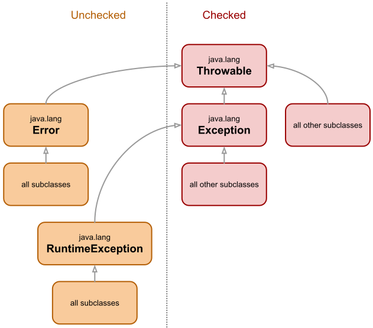

# Understanding Exceptions

Exceptions communicate **unexpected events** that may happen during runtime. The goal of Exceptions is to write happy-flow code as there would not happen any unexpected errors. Thus, the code is not polluted with **error checking and its propagation**.
For a better understanding let's have a look back in history by having a look at the following examples.

## History of Error Checking and Propagation

### Checking an Error Function

The first example shows error handling by respecting error codes. Method `getGreetingPrefix` may fail randomly. If so, an error code is set to `(1)`. Its caller method `greet` checks for this error code and returns `null` instead of the expected return value `prefix + given name`.

```java
// this function fails randomly
public String getGreetingPrefix() {
    if (random() == 5) {
        setLastError(1);
        return null;
    }
    else {
        return "Hello ";
    }
}

public String greet(String name) {
    String prefix = getGreetingPrefix();

    if (getLastError() != 0)  {
        return null;
    }

    return prefix + name;
}
```

The conclusion of this pattern is that the intended return type (in this example `String`) is kept. Nevertheless, the downside is that the code is tremendously polluted with unspecific error checking and propagation. As unexpected errors may occur in every method, each method call would need to be post-checked with `getLastError()` in order to sustain a non-corrupted program state and flow.  

As the return type is only `String`, a pitfall of this pattern is that the user is not forced to check if a method has set an error code. This weakens error checking discipline leading to potential corrupted error state and flow. To overcome this, see the second example.

### Checking Prepared Return Value

The second example shows error checking and propagation by introducing a type which communicates either a successful result or an error. In this example a modern generic wrapper called `ErrorAware` is used for that.

```java
// this function fails randomly
public ErrorAware<String> getGreetingPrefix() {
    if (random() == 5) {
        return ErrorAware.error(1, "I failed randomly");
    }
    else {
        return "Hello ";
    }
}

public ErrorAware<String> greet(String name) {
    ErrorAware<String> prefix = getGreetingPrefix();

    if (prefix.isErrorneous())  {
        return ErrorAware.error(1, "failed", prefix);
    }

    return ErrorAware.success(prefix.get() + name);
}
```
In contrast to the first pattern using getLastError() this pattern increasens error checking discipline at the cost of return type polution. In other means the pattern has more or less the same grade of polluting boilerplate code.

### Conclusion of the 2 patterns

In both patterns huge amount of error checking boilerplate code is required which weakens the understanding of the domain specifics of a method. Also in both cases error checking can be skipped even if the second pattern tries to push this a bit more. 

Exceptions were invented to overcome all of the downsides of those patterns:

```java
// this function fails randomly
public String getGreetingPrefix() {
    if (random() == 5) {
        throw new IllegalStateException("I failed randomly");
    }
    else {
        return "Hello ";
    }
}

public String greet(String name) {
    return getGreetingPrefix() + name;
}
```

```java

public void foo() {

    

}


```

## Mechanism of Exceptions

Exceptions can be understood as an unexpected event that breaks all normal control flows without corrupting the call stack of a program. Exceptions are normal Java classes and their instances can be created like such. Throwing an exception instance with the `throw` keyword triggers the event mechanism.

The only control flow that is aware of exceptions is `try/catch/finally`. The `try` block frames a part of the code where exception awareness is needed. There are two different reasons to be aware of an exception:

1. While Java manages the validity of the callstack during exception bubbling, it does nothing to keep other states of the program valid because it can't really know. Think of your own stacks (push/pop), locks (lock/unlock), resource closing/releasing and similar cases. The `finally` block can be used to achieve this as it is executed in the normal control flow as well during exception bubbling. During normal control flow the `finally` block is executed just like a normal block followed by its subsequent code. During exception bubbling the `finally` block is executed as well but then the bubbling continues as the normal control flow keeps being discontinued. The `finally` block has nothing to do with exception handling but with state validity.

2. The other case is to actually handle exceptions. This can be done in `catch` blocks. Catching an exception stops its bubbling and the normal control flow continues at the catch location. 

The following example shows the two cases:

```java

Lock lock = getLock();

// do the lock outside of the try
lock.lock();

try {
    // the code that could actually lead to an exception event
    validateData();
    processData();
}
catch (Exception e) {
    // stopping the general break of control flows done by exceptions
    // having the exception instance for 
    // examination, error handling.

    log.error("Error while processing data", e);
}
finally {
    // keep lock states clean in both normal and error situations
    lock.unlock();
}
```


## The Cost of Exceptions

In Java an exception holds informations about the callstack of its construction moment. To acquire this information has its costs. These costs should be reserved to exceptional states of the program where it has its legitimation. 

Wrapping exception means to acquire this callstack information again while it is in most of the cases a subset of the information found in the wrapped exception. This is on reason why exception wrapping is problematic.


bubbles up the callstack bypassing Doing so, it breaks the running control flows in a controllable way. 

- Explain the control flow advantages of exceptions
- Explain the costs of exceptions
- Don't use exceptions to communicate expected values and states
- Don't use exceptions to gather callstack information as in Java 9 there is separate API for this


## Checked vs. Unchecked

The Java type-hierarchy for exceptions beginning with [`Throwable`](javadoc:java.lang.Throwable) splits into **_checked_** and **_unchecked_** types.

Ideally, unchecked exceptions should be the only type of exceptions known to Java, but unfortunately they aren't. Unchecked exceptions are free to be declared, catched and thrown. Unchecked exceptions split into [`Error`](#error) and [`RuntimeException`](#runtimeexception).

Checked exceptions should rather be conceived as a [design error](#whats-wrong-with-checked-exceptions) in the Java language. A method that throws an uncatched checked exception needs to declare it with the `throws` keyword. A method that calls another method either needs to catch all its declared checked exceptions or needs to declare them at its level. 

Additionally, to the general design error of checked exceptions, there is no clear polymorphism for them. That makes the handling of them even more problematic. Specifically, there is no common ancestor for either checked or unchecked exceptions. The following class hierarchy diagram should  demonstrate the scattered modelling:



## What's wrong with Checked Exceptions

Checked exceptions are a paradoxical thing, because you funnily could also call them expections (mind the spelling), because they are enforced to be expected. Now what? Is it to be expected or is it exceptional? If a certain state is expected you would rather design a proper return value construct instead of using expensive exceptions.

- Exceptions.unchecked
- UncheckedIOException
- Closures/Lambdas don't work well with checked exceptions
- 

## Custom Exceptions

Custom exceptions are in the most cases 
- reasons for custom exceptions (selectivity and contextualization)
- bad design if used
- know the predefined exceptions from Java and PlatformExceptions of ours and use them in the right places
- if used at all don't design checked exceptions

## Standard Exceptions

|Exception|Description|HTTP pendent|
|---|---|---|
|`java.lang.IllegalArgumentException`|Arguments or inputs are invalid|400|
|`java.lang.IllegalStateException`|The state within a component is invalid and stops further processing`|500|
|`java.lang.NullPointerException`|A required value is null|500|
|`java.lang.RuntimeException`|Generic exception without specific meaning|500|
|`java.lang.UnsupportedOperationException`|An optional operation/method is not implemented`|501|
|`java.util.NoSuchElementException`|Some keyed value could not be found|404|
|`java.util.IllegalFormatException`|The format of an input is invalid|500|

## Catching Exceptions

Where to catch and not to catch exceptions is as much as an important question as how and where to throw it. There are essentially two intents to be differentiated which are very different in nature and not really specifically addressed by Java's approach to exceptions. 

One intent to catch exceptions is to enrich exceptions on their transit while they bubble up the callstack. This means to catch, [contextualize](#contextualizing-exceptions) and rethrow them.

The other intent to catch exceptions is to actually [consume and handle](#handling-exceptions) them.

### Contextualizing Exceptions

Contextualization is the very part that Java does not properly address. in In order to contextualize exceptions they are often wrapped by other exceptions with further information in the message and type. This is actually problematic in the following ways:

Wrapping masks the exception type of the original exception. That may influence the handling of certain exception type. The following example shows the pitfall in a relevant case:

```java
public class MyServlet extends HttpServlet {

    protected void doGet(HttpServletRequest req, HttpServletResponse resp)
            throws ServletException, IOException {
        try {
            String response = dispatch(req);
            resp.getWriter().print(response);
        }
        catch (AuthorizationException e) {
            // catching this exception will allow to give a
            // meaningful http error code
            resp.sendError(401, "Unauthorized");
        }
    }

    private String dispatch(HttpServletRequest req) {
        String action = req.getParameter("action");

        try {
            switch (action) {
            case "restart": return restart(req);
            case "foobar": return foobar(req);

            default: 
                throw new IllegalArgumentException("Unkown action: " + action);
            }
        }
        catch (Exception e) {
            // Catching any exception in order to contextualize it.
            throw new RuntimeException("Error while executing action: " + action, e);
            // NOTE! :-( 
            // Unwillingly and unfortunately this wrapper will 
            // mask the AuthorizationException thrown at #restart,
            // therefore skipping the specific catch block in #doGet
            // and finally result in an unexpressive 500 http error code.
        }
    }

    private String restart(HttpServletRequest req) {
        if (!req.isUserInRole("admin")) 
            // if the user does not have the required role 
            // the function will not proceed but throw a meaningful exception
            throw new AuthorizationException("Insufficient priviledges for restart action")

        // do some fancy restart here ...

        return "Done";
    }

    private String foobar(HttpServletRequest req) {
        return "Done";
    }
}
```

Wrapping pushes the most important part of the exception structure - the root cause - to the end of the exception structure.

Creating wrappers leads to further costly callstack determinations by Java. Despite the costs this won't add new callstack information because the callstack will be a subset of the wrapped one.

- how to correctly contextualize with Exceptions framework 
- when to contextualize

### Handling Exceptions

- where to handle exceptions (endpoints, retries, logs (avoid double logging), transposes)


### Accumulation and suppressing Exception


### Exceptions rendering

### Exception best practices

- 

# Backlog

The following code snippet shows how to select these types with Java code:

```java
// using instanceof operator
if (ex instanceof RuntimeException || ex instanceof Error) {
    // handle unchecked exception
} else {
    // handle checked exception
}

// using try/catch clause
try {
    // do it
}
catch (RuntimeException | Error e) {
    // handle unchecked exception
}
catch (Throwable e) {
    // handle checked exception
}
```
