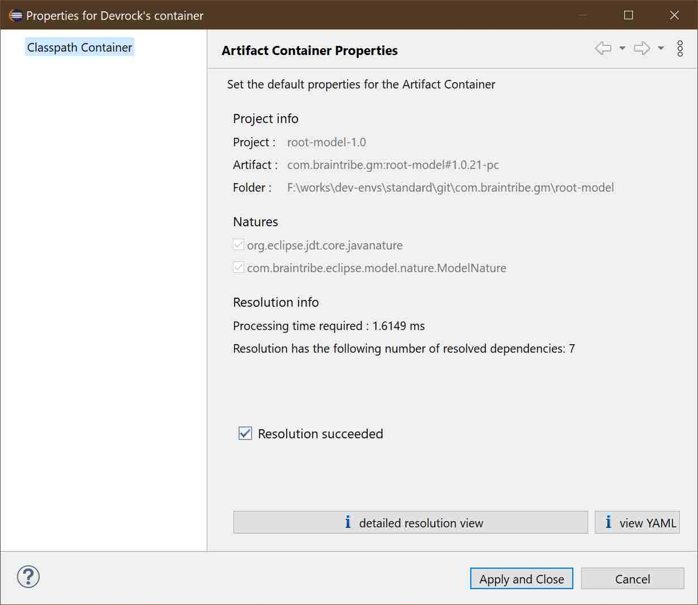

# analysis

The [resolution viewer](./resolution.viewer.md) can be accessed using the [container](./container.data.md) itself or by two other means described here.

## running a resolution on an external artifact/dependency
You can always run a resolution on any artifact that is reachable using either the standard configuration that the Eclipse tooling currently uses or the one you specify for the analysis.

### access the current project's resolution
You can access the current project's resolution, i.e the resolution that was generated while populating the container. See above on how to do it. 

You can choose between the 'YAML view' which shows the resolution in YAML format, and allows you to save the data to a file, or you can select 'detailed resolution view', which will open the viewer.

>Note that the YAML view is very slow as an AnalysisArtifactResolution contains a lot of data, so it's best to use the resolution viewer for this.

### access the resolution of a project within the workspace
You can select any project in the package explorer, and then use one of the following ways to access its resolution:

- use the short-cut ALT+I to pull up the resolution viewer for the project
- select the 'looking glass' icon in the toolbar
- use the context-menu, and access devrock's analysis sub-menu, then select 'container resolution'.

### run a resolution on an artifact or a dependency 
You can always run a resolution of an artifact that is not in your workspace using this command, but of course, artifact needs be reachable using your current [configuration](asset://com.braintribe.devrock.eclipse:devrock-documentation/devrock.md) or the one you specify (see below).

Common of the two different ways to run the resolution of an external artifact is that you can specifiy two things :

- you can specify the 'magick'-scope, i.e. whether to run a classpath resolution for 'compile'-, 'run'- or 'test'-time.
- you can specify an external repository configuration, so that it is used rather than the configuration AC runs with.

#### selecting a dependency 
You can directly specify a dependency as a terminal for the resolution. Semantically it means that you are using a virtual, unnamed artifact as a starting point for the resolution. 

There is no check whether the dependency you entered is valid or does exist. You'll see what mc-core makes out of it once the viewer comes up.

You can add as many dependencies as you like, simply by adding them to the list below.

Simply make sure that you dependency is valid, and then press ok, and the [resolution viewer](./resolution.viewer.md) will pop-up.

#### selecting an artifact
If you want to start with an artifact, enter the dependency in the edit-box. It suffices to specify the groupId and the artifactId, and by using the 'normalize' button, a standard range will be added. 

If already entered a version, the version will be used as the lower boundary of the resulting range.

By pressing the 'search artifact' button, all matching artifacts are shown in the list box. Then select the artifact you want, and press OK, and the [resolution viewer](./resolution.viewer.md) will pop-up.

>Please note that currently, if you reference an artifact that exists in the workspace via a ranged dependency, you'll will only see the artifact that is actually loaded in the workspace. This is due how the workspace is handled: it is turned into a 'dominant' repository - see the part about configuration for details.

### load a stored resolution

Some tools may dump a resolution to disk (for instance, the [YAML viewer](./container.data.md) has such a feature), and you can simply load such a stored resolution and have it displayed in the [resolution viewer](./resolution.viewer.md).

Currently, two formats are available: 

	YAML : written by our generic YamlMarshaller (#1.0.39 up - elder versions had a bug)
	XML: written by our generic StaxMarshaller. 

