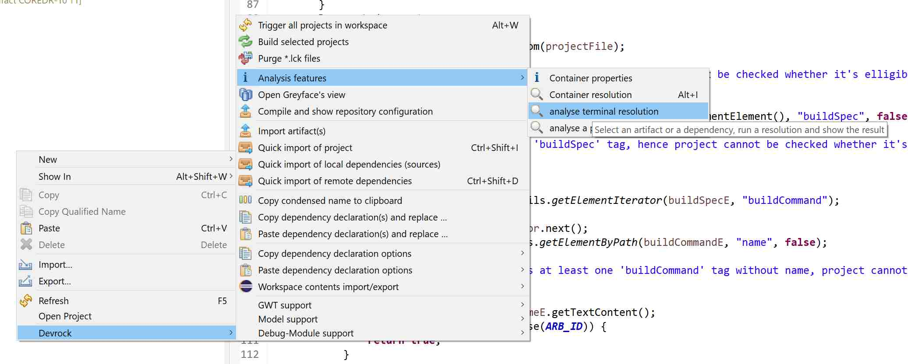
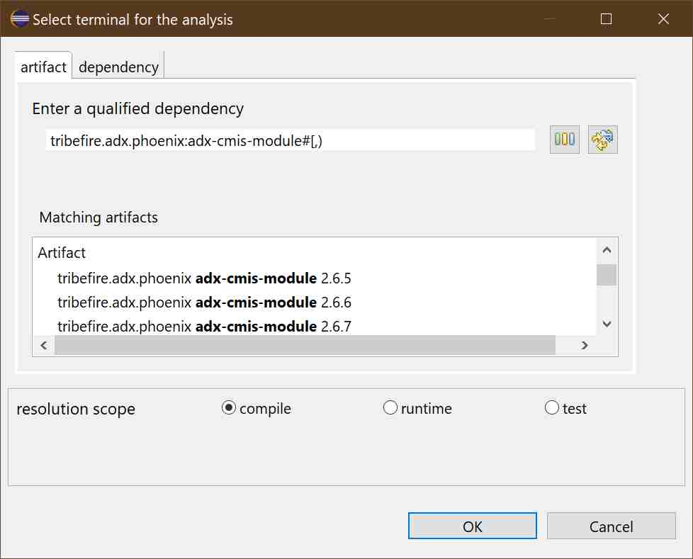
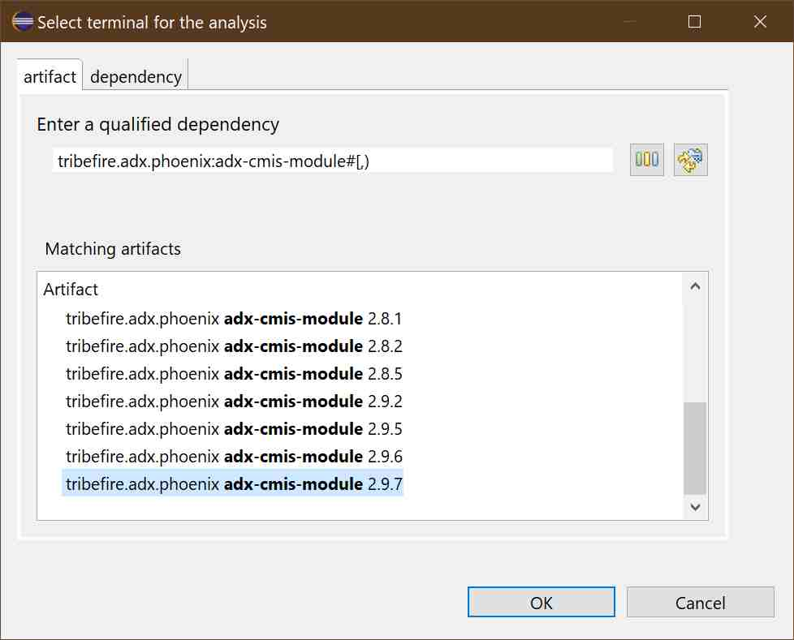
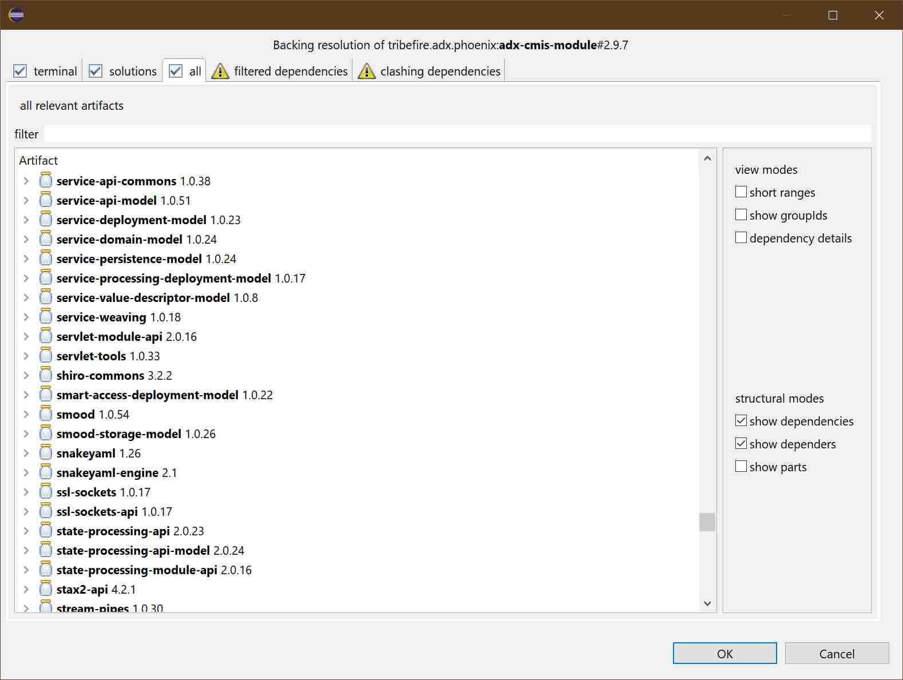
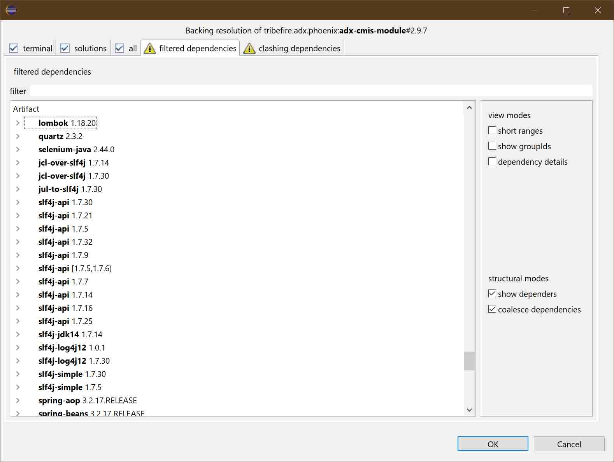
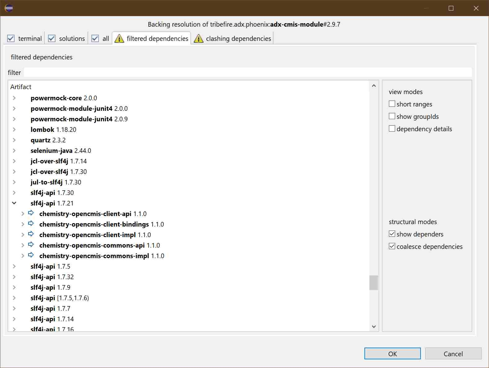
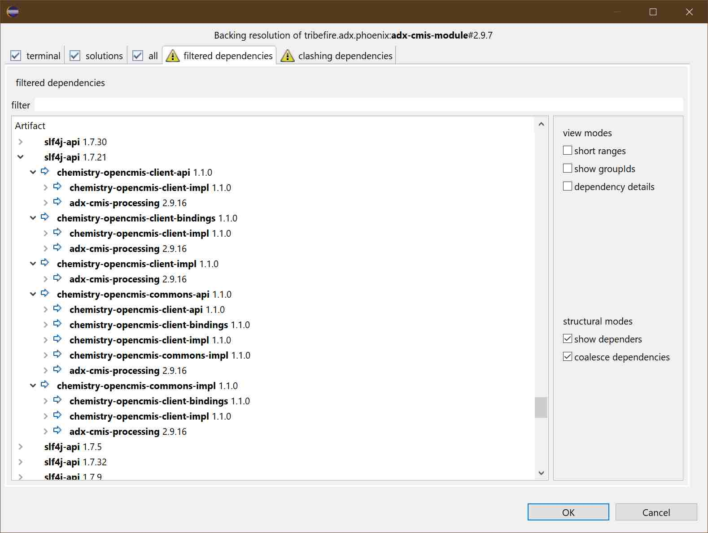
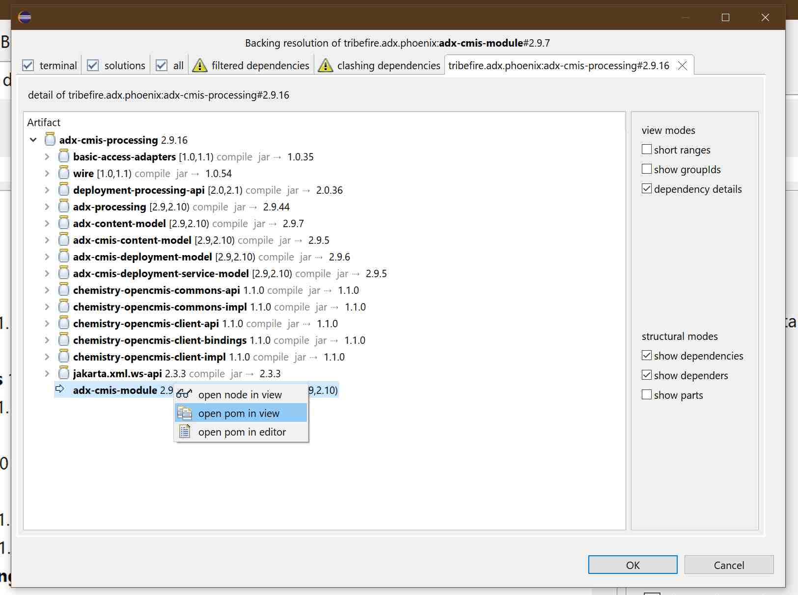
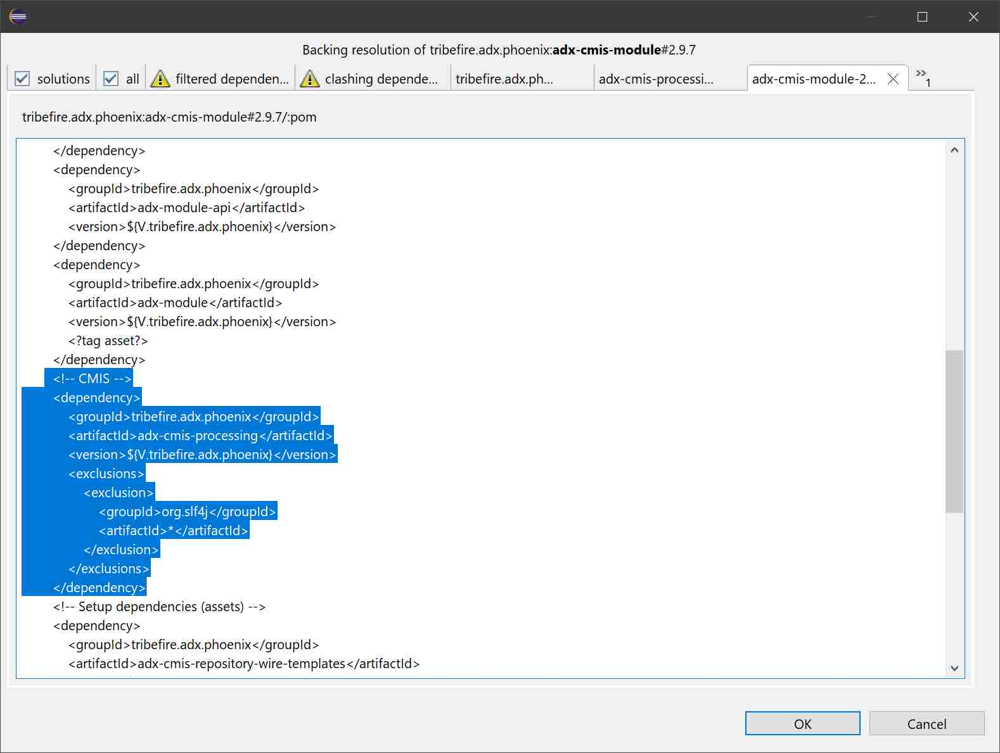

# an exemplary analysis use-case

This text aims to show you how you can use the analysis-features of AC. It is based on a case I was confronted with, and shows what is currently available with the analysis-tooling (and also what is still missing).

> As this episode happened a while ago, the screenshots are quite a bit outdated. Still, everything that is mentioned in regards to the tooling is still accessible - and improved.

## the case of the missing org.slf4j
That is what I was told:

>  ein Module (tribefire.adx.phoenix<:adx-cmis-module) hat ne transitive Dependency auf org.apache.chemistry.opencmis:chemistry-opencmis-client-bindings#1.1.0
Dessen Parent - chemistry-opencmis - deklariert ne Dependency auf org.slf4j:Slf4j-api .
Die dependency ist ganz einfach, kein spezieller scope oder sonst was.
Allerdings sehe ich in AC bei den deps von dem Module die slf4j-api gar nicht.

To recap in english: 

The terminal <b>'tribefire.adx.phoenix:adx-cmis-module'</b> depends on <b>'org.apache.chemistry.opencmis:chemistry-opencmis-client-bindings#1.1.0'</b> which is referencing a parent <b>'org.apache.chemistry.opencmis:chemistry-opencmis'</b> which in turn injects into all its referencing 'children' a dependency to <b>'org.slf4j:Slf4j-api'</b>. But there is no dependency to slf4j-api amongst the dependencies of the module. 

The first step was to run a 'terminal analysis' using AC.

I had to add the 'adx-dev' repository to my standard repository-configuration. Otherwise, the resolution would've imcomplete.

> Not that this is no longer required. You *CAN* specifiy any valid repository configuration to run the resolution with.

## running the analysis
The first step is to get the data. 

If I was given the yaml representation of the resolution data of 'tribefire.adx.phoenix:adx-cmis-module' that step would not have been necessary, as the analysis-tooling can work on a previously persisted analyis. Such files are automatically produced if a resolution fails in the build-system (devrock-ant-tasks and other implementations), check the folder *processing-data-insight* in your dev-env.

But as there was no persisted analysis, it had to be recreated. 

Call up the respective command in context menu 

'analysis features' -> 'analyze terminal resolution'

currently, it looks like this:

The next step is to use the [analysis feature](./analysis.md), and to look for the terminal.

So we need to find a version of <b>'tribefire.adx.phoenix:adx-cmis-module'</b> in any of the currently configured repositories, so we do specify an 'open' range.

We weren't told what version it is, so we assume it's the newest one.

## confirming org.slf4j is missing
So now that we have the resolution, we first confirm whether the missing artifact is definitively not amongst the solutions, so we look at the list of all relevant artifacts.

Ok, it's definitively not there. 

## checking the filtered dependencies
So if it's not there, it must have been filtered out somehow.

We need to see whether it really has been filtered out: 

Ouch, a lot of org.slj4j, so let's see which one is referenced by the chemistry stuff.

Ok, 'org.slf4j:slf4j-api#1.7.21 it is. 

## figuring out why the org.slf4j was dropped
Now, all the 'chemistry-open-cmis' thingies are dependency of 'adx-cmis-processing' which is in turn a direct dependency of the module. 

So let's look at the pom of the module. For that we can use the context menu of the [resolution viewer](./resolution.viewer.md)

And so we can have a look at the pom of 'adx-cmis-module'

And there we go: The module excludes any artifact of the group 'org.slf4j' in the branch starting with 'adx-cmis-processing' and as it's only referenced within this branch, it gets omitted from the classpath.

## conclusion
There are several fixes possible of course.. for instance, 'adx-cmis-module' could introduce the dependency on its own, or the exlusion could be removed from 'adx-cmis-module' and added to each pertinent dependency in 'adx-cmis-processing'.. 

