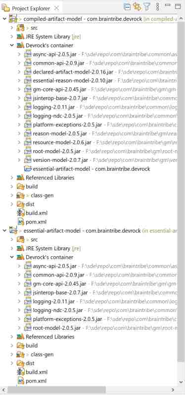
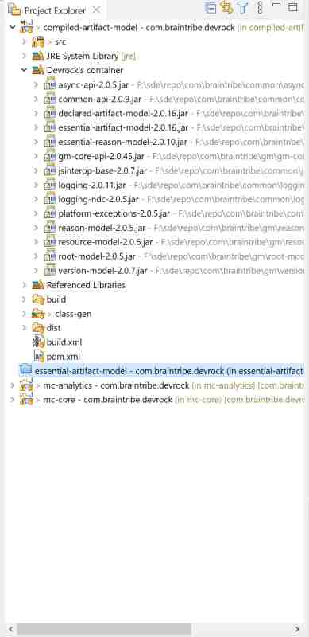
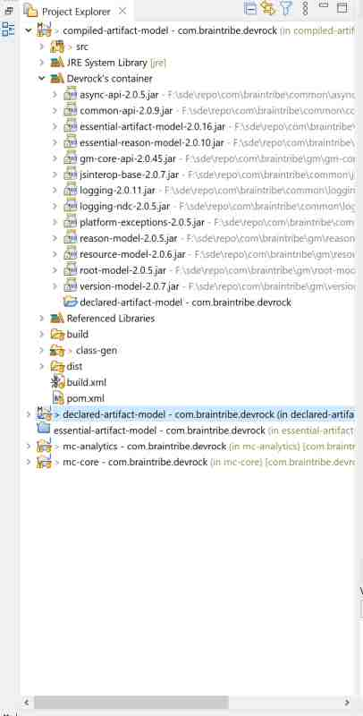

# Artifact Container

The artifact container has been relegated to a much smaller plugin as it was before. Most of its miscellaneous features have been moved the [Devrock Plugin](asset://com.braintribe.devrock.eclipse:devrock-documentation/devrock.md).

The purpose of the plugin is to introduce a dynamic classpath container to Eclipse. It is dynamic in such a way that it not only automatically reacts to relevant changes in the workspace and its projects, but also to replace references to other artifacts (jars that is) with matching projects in your workspace. 

This example shows the project 'com.braintribe.devrock:compiled-artifact-model'. Amongst others, it has a dependency to 'com.braintribe.devrock:essential-artifact-model'. 

In the first picture, the project of the dependency is accessible, hence the container shows it as a project dependency.



If the project is not accessible anymore - removed from the workspace or closed - the container will automatically revert the pertinent dependency to a standard jar-reference.



Of course, this also works in the reverse direction: As soon as project is added to the workspace, the changes to the workspaces are detected and possible project-dependencies introduced.





The container is populated using malaclypse as exposed by the [Devrock Plugin](asset://com.braintribe.devrock.eclipse:devrock-documentation/devrock.md). If the classpath resolution (traversing the dependency tree and collecting files relevant to the classpath - mainly jar of course, but it also looks for sources and javadoc) has any issues, it will still use whatever malaclypse was able to give it, but will flag the container as faulty - and the associated decorator will mark the project as problematic in the workspace. 


## features
The container itself doesn't have any features other than being a smart container for classpath entries.

## commands 
In some cases, the container won't directly see changes in the classpath of a project. While it reacts to changes in the underlying pom file of a project and also to changes in workspace (eg importing/deleting/closing/opening projects), it cannot see changes that are happening in your local repository. 

Note that you can switch off the automatic reaction of the containers, see [configuration](asset://com.braintribe.devrock.eclipse:devrock-documentation/devrock.md).

That means that there are cases where you have to update the containers manually. For that purpose,there are several commands available

### ALT + W 

The quickest way is the use the key combination ALT+W. It will automatically synchronize (i.e. repopulate) the containers with the current state of all dependencies.

### Synchronize the workspace 
This command is - depending on the pertinent switches in the [configuration](asset://com.braintribe.devrock.eclipse:devrock-documentation/devrock.md) - analogous to the ALT+W command. In the standard setting it will also synchronize all containers of the workspace, yet can be configured to only synchronize the full workspace if no projects are selected, and if some are selected, only these are synchronized. 

### Synchronize selected projects 
This command only synchronizes the projects that are currently selected in the workspace. 

### Manage the 'install'-repository
Shows the content of your local repository where the locally built artifacts are put - if configured. [The specialized viewer](./install.viewer.md) allows you to view and manage its content.

### Show container data 
Shows the same information as the [properties of the container](./container.data.md). 

### Analyze resolution
Lets you run [a resolution with either an artifact or a dependency as terminal](./analysis.md). The resolution's result can the be analyzed using the tooling.

### Analyze stored resolution
Lets you view [load a resolution in either XML or YAML format](./analysis.md). The resolution's result can the be analyzed using the tooling.


## Linking dependencies to projects
The container - as stated above - can react to changes in the workspace if instructed to do so. 


The basic algorithm works like follows:

 - the contents on the the current workspace is analyzed, i.e. the pom.xml files of the projects in the workspace are accessed and the aritfacts making up the projects are identified. 

 - these artifacts are incorporated into the malaclypse core as a repository (see [repository configuration](asset://com.braintribe.devrock.eclipse:devrock-documentation/devrock.md)).

 - after malaclypse has run the classpath resolution of a project, the result is analyzed. Each resolved dependency is flagged with its origin, eg the repository from where it was taken. If the container detects the origin to be the repository representing the workspace, the classpath entry will be a reference to this project. If its origin is not this special repository, a standard jar reference is added (with sources and javadoc attached if available).

 - There is a special case concerning the debug-modules. In that case some things are special : 
    
   - As a debug-module doesn't use ranges, but actually concrete dependencies, the dependencies in its pom.xml are (in most cases) not reflected by the projects in your workspace. For instance, Jinni uses only artifacts that exist in your local repository or in the remote repositories active in the current configuration. Your sources ALWAYS contain the most recent version (bias disregarded here), so there is (again in most cases) no match between the dependency in the pom and the available projects. 

In most cases, the versions will differ because the publishing scheme makes sure that the version of your source is always higher than the version installed (put into your local repository) or deployed (put into one of the remote repositories).

```
    1.1.5 : 1.1.6-pc        
```

- If the workspace repository has delivered matching dependencies, they are taken.

- If the workspace repository cannot deliver direct matches, the version of a dependency in a debug-module is 'auto ranged'. That means that a concrete version is turned into a range, where the lower bounds is the version requested and the upper bounds in the next minor revision. 

```
	1.1.5 -> [1.1.5, 1.2)
	2.0.1 -> [2.0.1, 2.1)
```

- If now there are projects in the workspace that match this range, they are taken. 


## Dynamic reaction

Once the container has been populated by analyzing its dependencies, it doesn't remain static. It reacts to changes in your workspace. 

- If a project is imported or openend, all containers are repopulated to reflect that a new project may now be the source behind a pre-existing dependency. 

- If a project is deleted or closed, all containers are also repopulated to reflect that, because a referenced project which stood for a dependency is now no longer available.


>Differing from the old plugin, there is no split between 'synchronizing' (i.e. calculating the classpath) and 'refreshing' (i.e. populating the container with either jar or project references). New malaclypse is fast enough to do this in one go.


## Support for Tomcat projects

The plugin also features special support for Tomcat projects, so that they can be debugged with the currently existing projects in your workspace. 

In order to be recognized as such a project, the plugin checks whether the project as one of the following natures:

- net.sf.eclipse.tomcat.tomcatnature : the nature as used by the Tomcat plugin
- com.sysdeo.eclipse.tomcat.tomcatnature : the nature as used by the Sysdeo plugin (replaced by the Tomcat plugin)

If one of these natures are detected, an additional step is added to the container processing:

Every time a container is calculated, the plugin identifies the nature of the project that owns the container. If it is a Tomcat project, the following actions are taken:

- the 'runtime' classpath is calculated 
- in the project's directory, a file *.#webclasspath_ac* is created (and if already exists, backed-up). 
- the dependencies of the project are iterated over and the following steps taken per dependency:
    - if the dependency doesn't exist in the workspace, a reference to the JAR is written.
    - if the dependency can be matched to an artifact if the workspace, then
        - the output-location is written instead of the reference to the dependency as JAR. 
        - additionally any 'exported' folders of the project are also added as folders to the file.

Please note that this feature can only be leveraged if Tomcat has the specialized classloader installed, see 

```
com.braintribe.devrock.eclipse.devloader:dev-loader
```