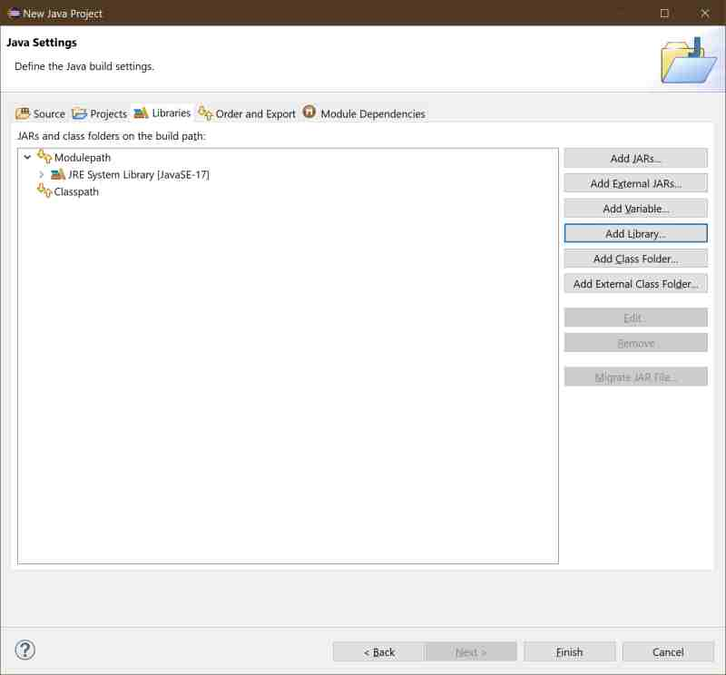
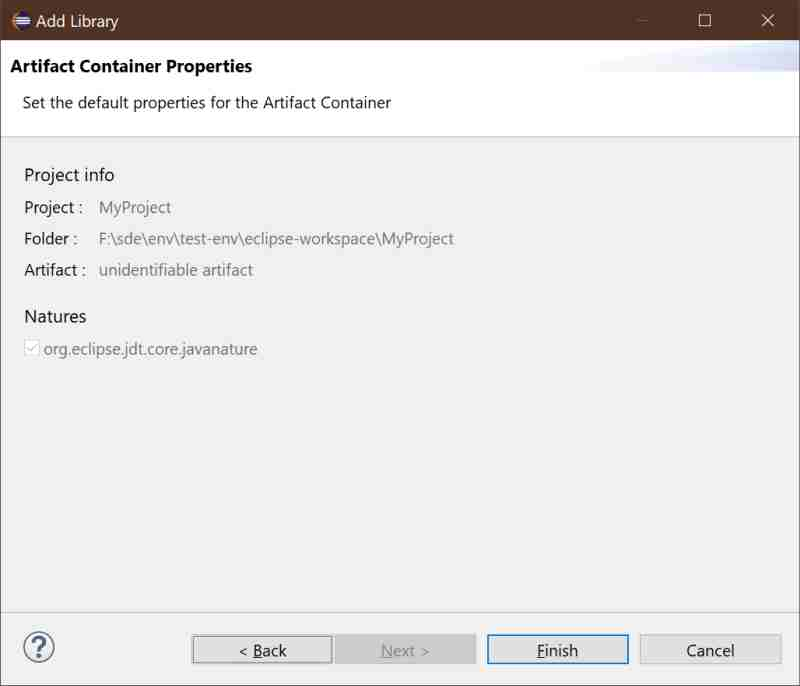
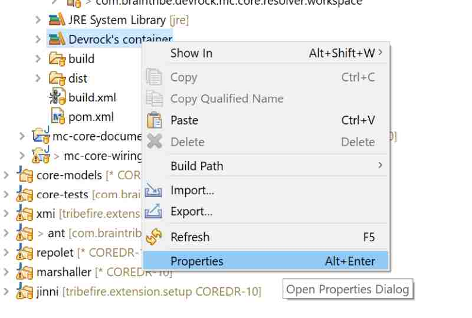
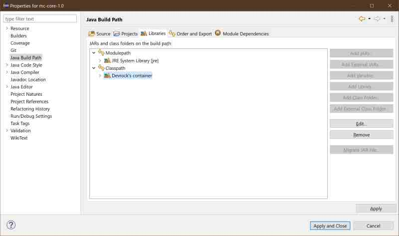
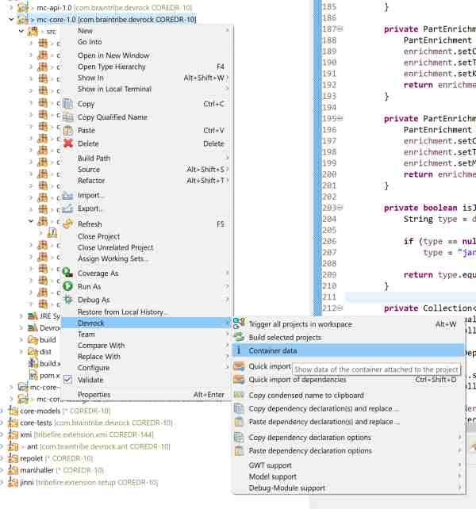
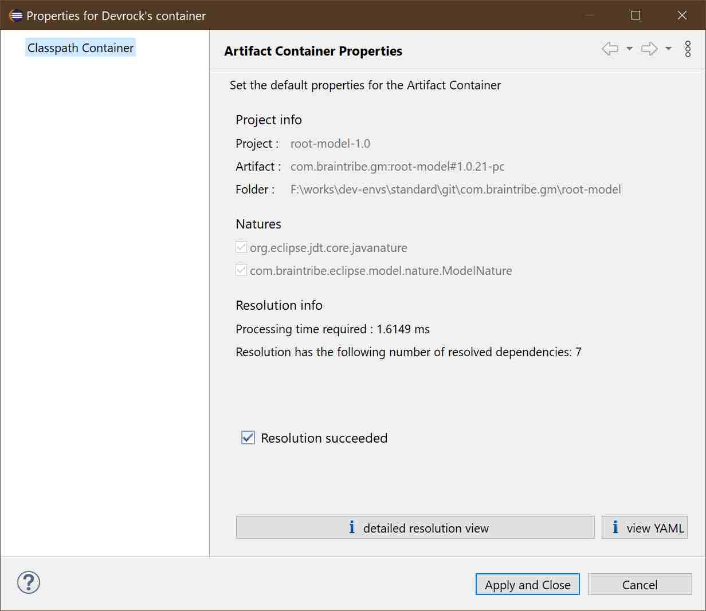

# artifact container data

## attaching a container to a JAVA project
The templates that Jinni can use to create projects come - if it fits the purpose of the project - with a container attached.

However, it is of course possible to attach a container to a project manually, if - and that is important - the project has a pom.xml file. 

In the *new JAVA project*-wizard, simply got the libraries tab in the second step, and select *Add library*

The wizard to attach a library will pop-up:

The wizard will show you some properties - basically a container could have options, the artifact container doesn't - but you can simply press *Finish* as there's nothing to edit.

Finally, container will be attached to the project.

> If your pom is empty - i.e. the project has no artifacts whatsoever, Eclipse will not show it even if it is properly attached. It will show up as soon as the container contains anything that contributes to the classpath.

## container properties
A container reflects on its state, so you can gather additional information of how it was populated, how long it took and what issues were encountered while calculating the classpath.

>Please note that it will always try to generate results, so even if something went wrong, you'll get the container filled with what it was able to resolve.

## accessing the container data 
You can always access the container to get to its internal data, and - if any - reasons for the failure of the classpath resolution.

As Eclipse - for its own reasons whatsoever - decided not to show containers that contain no data, there need to be two ways to access the container:

- if a container is visible in the package explorer, select it and via the context menu call up its properties.

- alternatively, you can open the project's property, then it's build properties, and there select the container and its properties. In that view, also containers that are not visible in the package explorer can be view.

- finally, you can use the 'container data' command in the Devrock context menu to access the container's data.

## Container properties

The data showns is split into several groups:

### project info
Shown is the project's name as it appears in Eclipse, the artifact that backs it up, and the path to the folder where the files reside.

### natures
Here all 'natures' of the project are shown. Natures is the way Eclipse connects projects with a specialized 'nature builder'. The example shows a model, hence the project shows both the 'java nature', which associates it with Eclipse's java builder and the 'model nature' which associates it with our model builder (creating the type declarations within the model's structure).

### resolution info
This part of the dialog can look different as it's shown here. 

If the resolution that backs the container went well, all you see here is how long it took to resolve it and how many artifacts contribute to the classpath which is reflected in the container's content.

If however the resolution failed, you'll see a 'reason viewer' (as in the [detailed resolution view](./resolution.viewer.md)).

### detailed resolution view 
This button will call up the [resolution viewer](./resolution.viewer.md).

### YAML view
This button will open up a window which contains the resolution formatted as a YAML. While this is definitively complete when it comes to the contained information, it's not as conventient as the [resolution viewer](./resolution.viewer.md). Still, if somehow the viewer fails, you can always use the YAML view. The documentation of its features can be found [here](./resolution.viewer.md).

