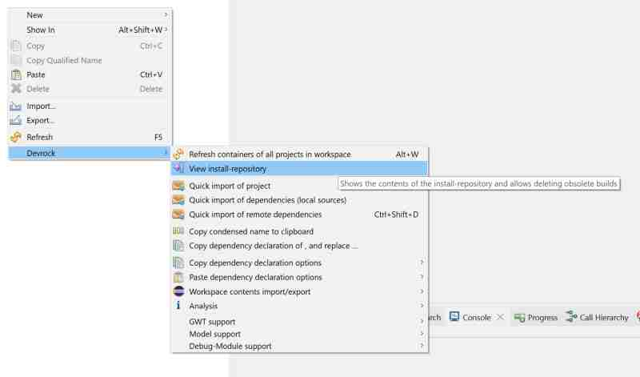
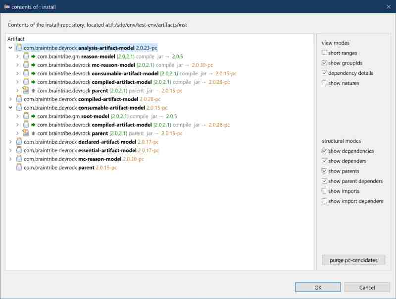
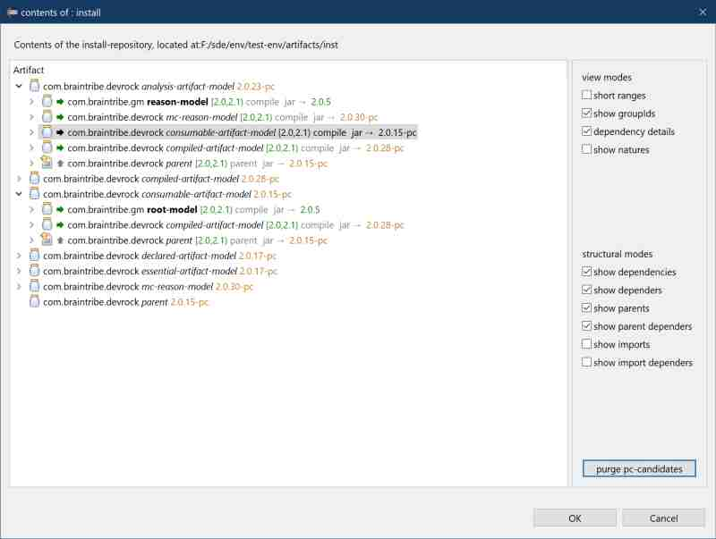
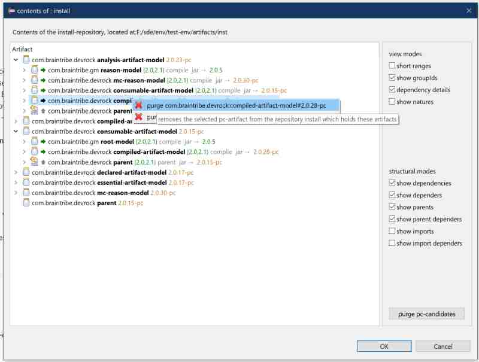
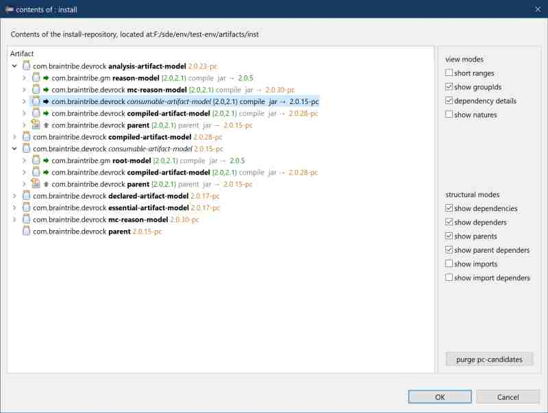

# install repository viewer

If your current setup is based on a dev-env that supports the notion of a split local-repository into its two aspects (acting as a cache for remote repositories and as repository for locally built artifacts), then you need to manage the 'install'-repository. 

As this 'install'-repository is hooked into the configuration with a 'dominance filter' attached (i.e. any look-up result of this repository takes precendence over others with the exception of the workspace), it should be cleared whenever the locally built artifact has been published and an new artifact with a higher version appears.

The viewer itself can be called via the context menu.

The viewer will *not* open if no 'install'-repository has been configured, but show a message in Eclipse 'error log'.

If the repository is empty, the viewer will open, yet remain empty. 

If there's anything in the 'install'-repository, it will populate the viewer.

While the viewer doesn't support all possible features (compared to the [resolution viewer](resolution.viewer.md)), it shares most of the possible display and structural options.

There are two ways to delete artifacts from the 'install'-repository:
 
The button *purge pc-candidates* on the right will automatically remove all artifacts. 

A context menu can be opened, and there the selected artifacts (the one the menu was called on, but also all selected others) can be purged.

A successful purge is reflected immediately in the viewer.

## windows issue
There is one issue on some operating systems (at least on Windows it is): If one of these artifacts are used by Eclipse (as jar-dependency to projects), the jar part of the artifact *cannot* be deleted, it is marked as being used.
In that case, only the files that can be removed are removed (most notably the pom) and the metadata of the artifact is either trimmed (in case several versions of the same artiact exist in the repository) or deleted alltogether (single artifact). The name of the directory is stored and will be deleted when it is safe to do so - at Eclipse's next start. 

> This mechanism takes into account that an artifact can be installed prior to the restart and will check for it. In that case, the directory will *not* deleted .
