# Resolution viewer

The resolution viewer is intended to support the analysis of an [AnalysisArtifactResolution](javadoc:com.braintribe.model.artifact.analysis.AnalysisArtifactResolution) as all mc-core's resolvers return.
In the context of the artifact container plugin, it's restricted to the classpath resolver, the CPR.

There's a short text that shows how to use the viewer for a [concrete analysis](./analysis.with.resolution.viewer.md), as kind of an example slash tutorial on how to use it. 

>In the current setup, if you access the backing resolution of a project in the workspace, the resolution will be built using a 'compile' magic scope.

## resolution viewing
There are several ways to view an [AnalysisArtifactResolution](javadoc:com.braintribe.model.artifact.analysis.AnalysisArtifactResolution). As (definitively) stated somewhere already, all resolvers exposed by mc-core return such a construct, no matter what kind of transitive resolver you call (TDR, CPR, even PAR).

## the viewer 
The resolution viewer is aiming to give you as much information about the resolution as possible, aiding you to investigate and (hopefully) understand the reason (sic) for failed resolutions.

It reflects the resolution's main structure (see the mc-core documentation for details). Suffice here to list the most relevant sections

>The viewer will show these different section each in a separate tab, and they will only appear if there is content in the sections, so if the resolution had no issues, only the tab for the terminals, for the solutions and for all involved artifacts will show.

### common view settings
All tabs (besides the YAML tab) can display artifacts (and dependencies) differently. 

- short range notation : if activated, it will show the range as 'javascript style' notation, so a standard range of [1.0,1.1) will show up as 1.0~

- show groupids : if activated, the group ids are shown. If activated, and differing between the dependency and the respective artifact, it will show both, otherwise, only the different data of dependency and artifacts is shown.

- show dependency details : if activated, it will show dependency information where applicable. In case of all views other than the 'filtered dependencies' and 'unresolved dependencies' it simply means that an artifact in the tree will show what dependency lead to it. In the latter views, it means that you'll see information about the scope, the classifier & type and whether the dependency was declared optional.

- show dependencies : if activated, the structure of the displayed tree is altered so that the dependencies are shown as children of a node.

- show dependers : if activated, , the structure of the displayed tree is altered so that the dependers aka requesters of the artifacts are shown.

- show parts : if activated (and supported by the view's data), the structure of the displayed tree is altered so that the enriched parts of an artifact are shown. For each part, its origin (the repository where it came from) is shown, no matter whether a download was required or it already resided in the cache.

> not all views support this feature.

- coalesce dependencies : if activated, it will combine all dependencies of the same groupId, artifactId and version-range so that they are only show once, and all the children of the original instances are attached to the single item.

> not all views support this feature.

Depending on your choice (see preferences) 

### common view features

- filter expression: you can specify a filter expression here, in the same format as in the [Quick Import](asset://com.braintribe.devrock.eclipse:devrock-documentation/devrock.md) feature. The filter will act on the top level entities of the view only.

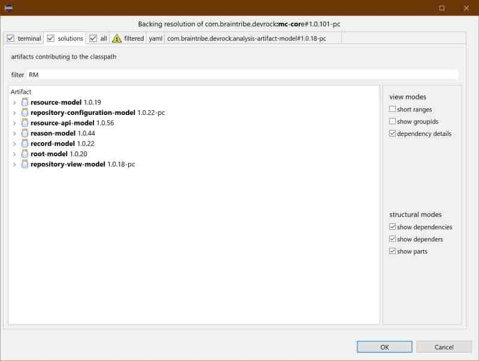

> not all views support this feature.

- double-click : if you double-click on an item, a new view is created and added to the tabs. You can open as many additional views as you like, and closed them anytime. 

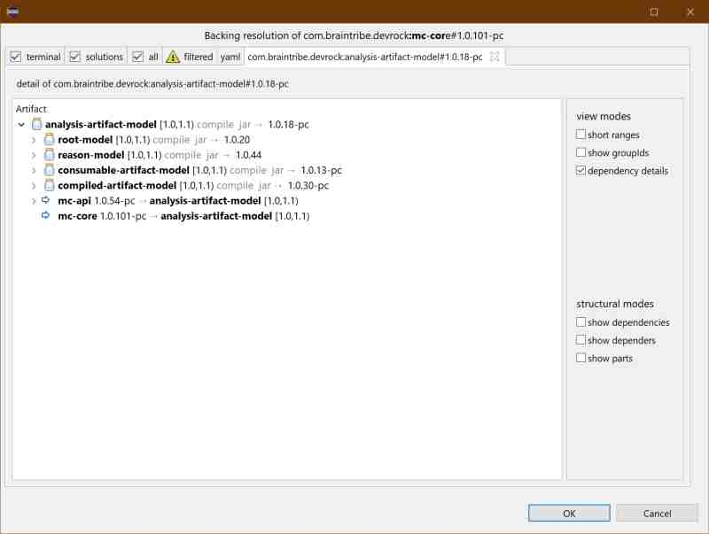

>not all views support this feature. As a rule of thumb: Artifacts/Dependency nodes and 'Depender nodes' can open a detail tab. Part nodes and clash nodes cannot. 

### failure 
failure : a number of [Reason](javadoc:com.braintribe.gm.model.reason.Reason)s why the resolution failed. 

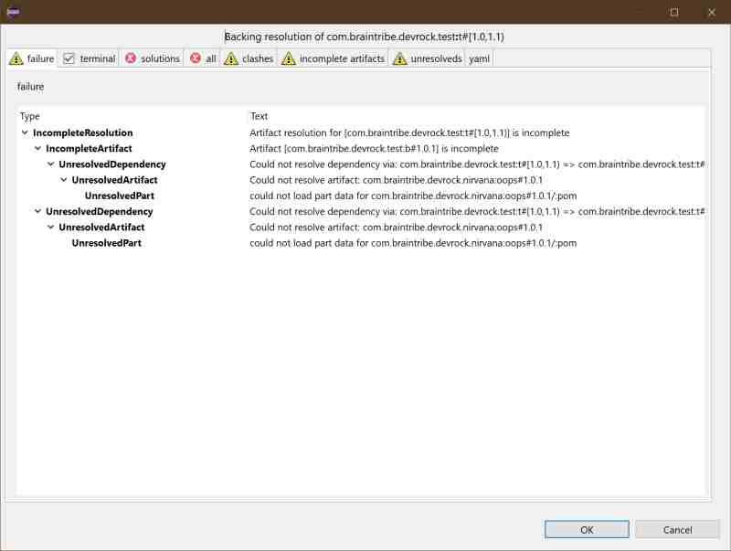

>This view is only shown if the resolution has failed.
<obsolete picture : no more duplicates>

### terminal
shows the tree starting with the [CompiledTerminal](javadoc:com.braintribe.model.artifact.compiled.CompiledTerminal)s, i.e. the entry points of the resolution. May be a single one (as in the case of an Eclipse project) or several (if created using a 'virtual artifact', i.e. multiple dependencies).

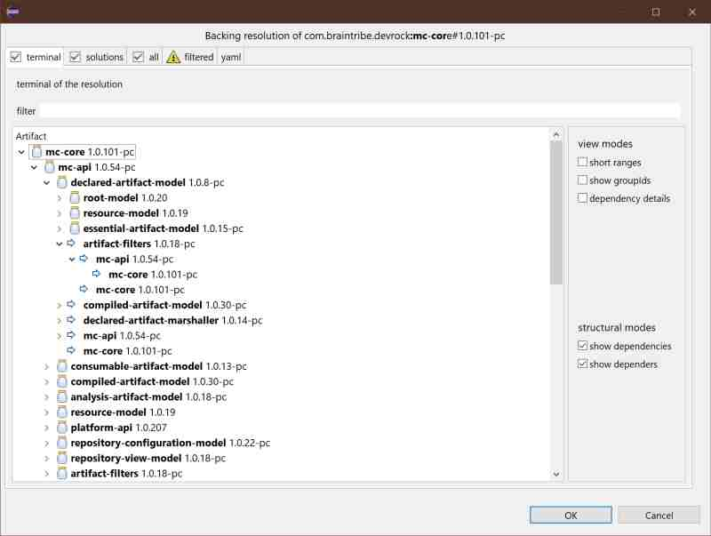

>The terminal window doesn't support all features of the viewers (compared with the all and solution views). This is due the way the data is presented in the terminal section of the resolution.

### solutions
a list of the [AnalysisArtifact](javadoc:com.braintribe.model.artifact.analysis.AnalysisArtifact) involved in the resolution that are contributing to the classpath, i.e. sport a jar. 

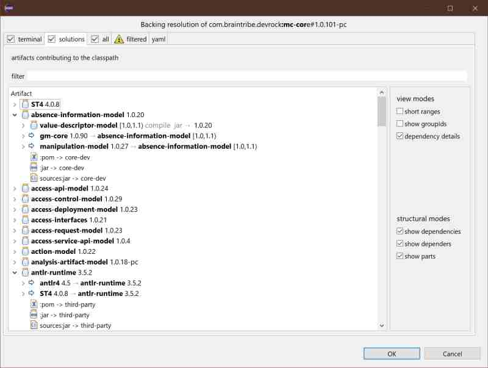

Some of the dependencies are however re-routed to matching projects in the workspace. In most cases, a project's version will fall into the range our artifacts use declaring the dependency, and so the match is perfect. In the case of 'debug-module-projects', this is not the case. Such a project declares dependencies with a concrete version, that means it never declares a valid range, but an actual version. A dependency was the best match when the debug-module-project was generated by Jinni and may be very much outdated soon after. Therefore, the matching algorithm will use some magick to match such a dependency, and might substitute a dependency with a project. If that happens, a project dependency shows that information as in the picture below.

### all
list of all [AnalysisArtifact](javadoc:com.braintribe.model.artifact.analysis.AnalysisArtifact) involved in the resolution, including parents, import-scoped and aggregator artifacts.

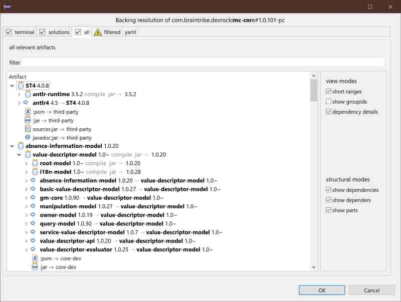

>Note that this is not part of the resolution itself, but added by the viewer itself.

### projects
As one of the features of the 'artifact container' is to automatically link dependencies to projects available in the workspace, there's a special tab for these linked project. 

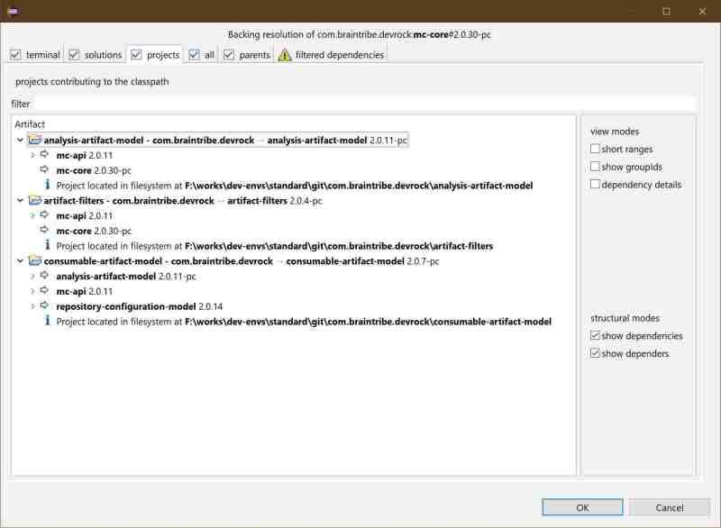

### parents

Parent relations can also be viewed. All pertinent tabs show parent relations, but there's also a specialized tab that shows all involved parents. 

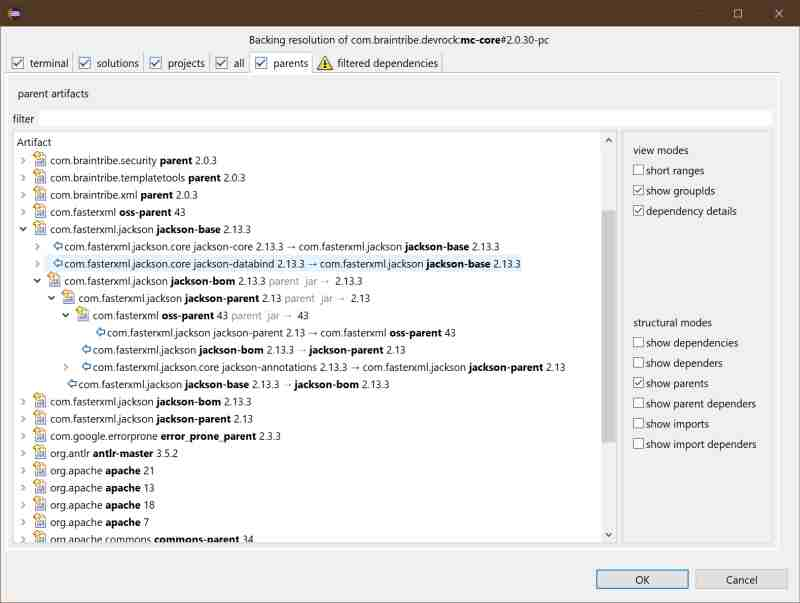

>Note that is still WIP as some more information will be made available.

### filtered dependencies
[AnalysisDependency](javadoc:com.braintribe.model.artifact.analysis.AnalysisDependency) that were filtered-out during resolving, due to their scopes, optional tags or exclusions. 

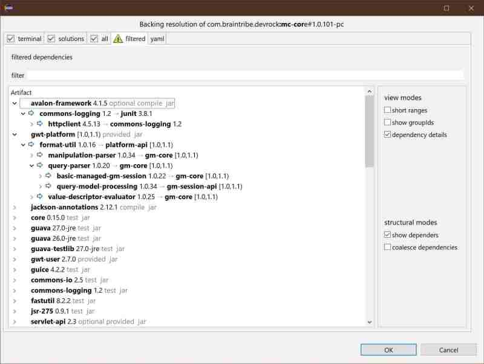

### clashes
clashes : a list of [DependencyClash](javadoc:com.braintribe.model.artifact.analysis.DependencyClash)s that have been resolved during the resolution. 

### incomplete artifacts
incomplete artifacts : a list of [AnalysisArtifact](javadoc:com.braintribe.model.artifact.analysis.AnalysisArtifact) that were incomplete, either through their own failure to deliver the required data to identify themselves, or with missing parents (or import-scoped references)
, or with unresolved dependencies.

### unresolved artifacts
unresolved dependencies : a list of all [AnalysisDependency](javadoc:com.braintribe.model.artifact.analysis.AnalysisDependency) that could not be found during the resolution.

### YAML

The YAML view simply shows the resolution as marshalled by the Yaml-marshaller.

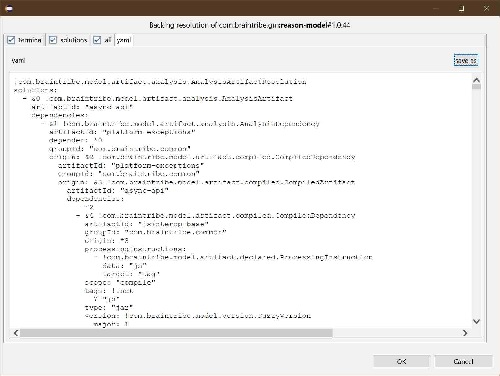

You can save the content of the tab to a file, for instance to pass it to somebody else to analyze it. 

The view also supports text search, so when hitting CTRL+F, a search window opens:

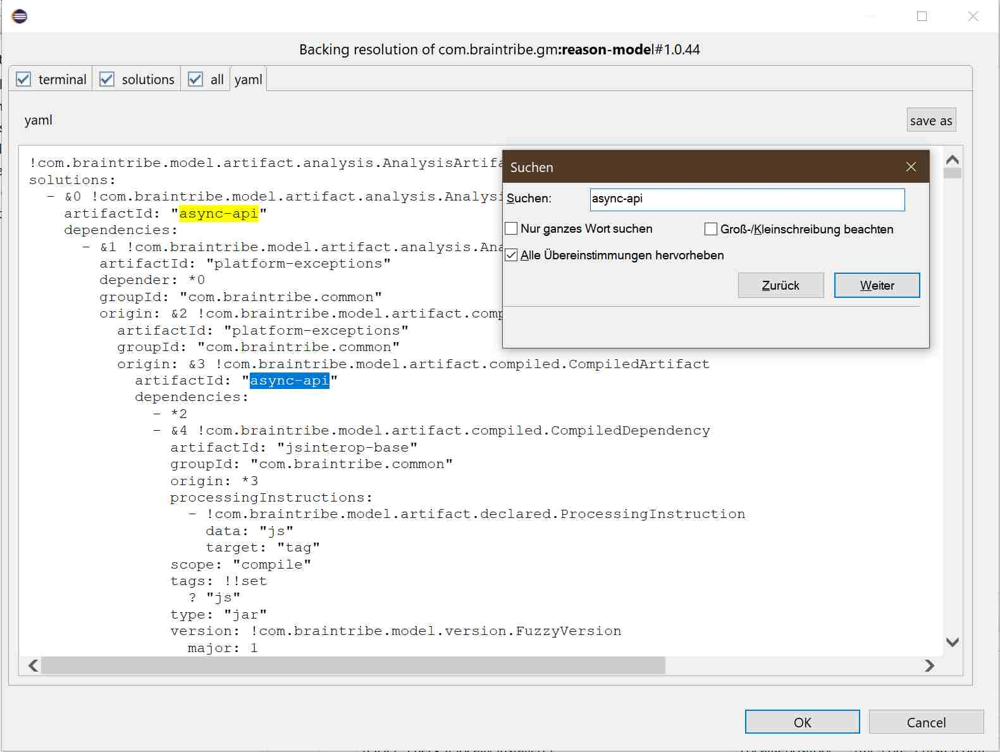
