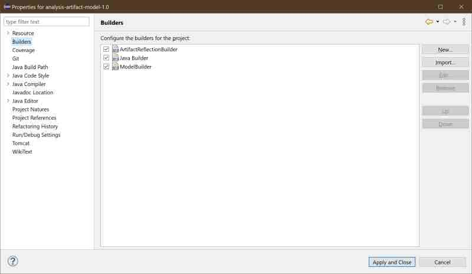
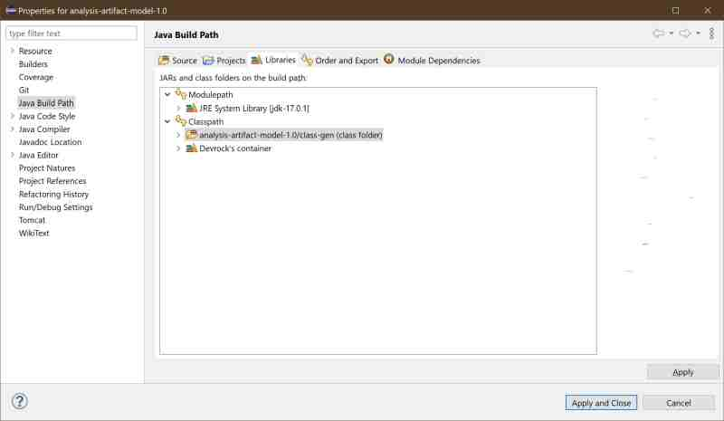
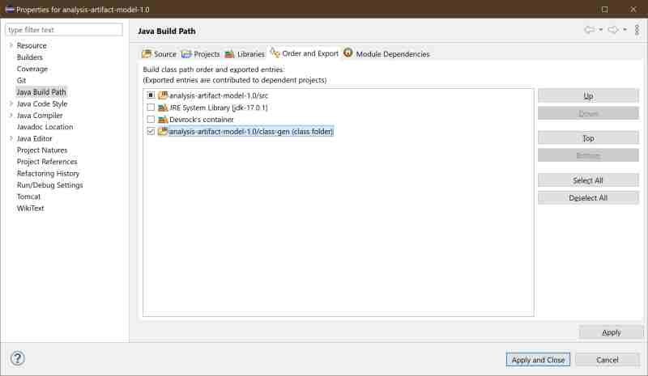

# artifact reflection builder

The artifact-reflection-builder (or ARB in short) is an Eclipse port of the feature that builds a class that can reflect on the owning artifact's identification. The class is directly created via 'asm', i.e. there is no source for the class itself, it's created directly as a binary class. 

The builder's output will be in a special directory 'class-gen' which is a sibling of the 'src' directory. 

There is also an implementation of the feature in the realm of 'ant', so all our build processes do call the ARB. 

## attaching the builder
In Eclipse, that whole thing about the ARB gets more complicated as in 'ant'. This is due that JDT needs to be aware of the class even if it didn't build it.

In order to achieve this, the builder must be called prior to JDT, and the builder's output must be exposed to JDT (and other projects).


### automatically 
The build is attached to the project of an artifact via Jinni's 'create by template' feature. So in most cases, you don't have to worry about it.

### manually 
However, if you need or want to manually attach it to a project, follow these steps as the pertinent wizard can only insert a builder, but cannot place it at the required place (it cannot manipulate the order of call), so you need to do it using an editor.

#### adding the ARB to the .project

- Open the .project file in a text editor. Eclipse may not show it, but you can adapt the filter in the package explorer to show 'dotted resources'.
- Insert the builder before the reference to the JDT builder. 

The example below shows the .project file of an model-artifact, hence the 'model-builder' as last builder. 

```xml
<projectDescription>
	<name>analysis-artifact-model - com.braintribe.devrock</name>
	<comment/>
	<projects/>
	<buildSpec>
		<buildCommand>
			<name>com.braintribe.devrock.arb.builder.ArtifactReflectionBuilder</name>
			<arguments/>
		</buildCommand>
		<buildCommand>
			<name>org.eclipse.jdt.core.javabuilder</name>
			<arguments/>
		</buildCommand>
		<buildCommand>
			<name>com.braintribe.eclipse.model.nature.ModelBuilder</name>
			<arguments/>
		</buildCommand>
	</buildSpec>
	<natures>
		<nature>org.eclipse.jdt.core.javanature</nature>
		<nature>com.braintribe.eclipse.model.nature.ModelNature</nature>
	</natures>
</projectDescription>
```

Eventually, after your manipulation of the .project file, the builders tab should look like this : 

Again note that the ARB is inserted *before* the JDT builder (the java builder).



#### adding the folder to the build path
Next step is to add the generated 'class-gen' folder to the build path to make sure others can see it.

You can either do it manually or using the respective wizard for it.

##### using the wizard
The wizard is well suited for this step (actually, I cannot fathom why the builders-wizard can't change the sequence - correction: newer Eclipse seem to allow that), so you can simply open it.

Select the project in the package-explorer and then follow 

properties->'Java build path'->'libraries'

Add the folder 'class-gen'



Then switch to the 'export' tab, so properties->'Java build path'->'export'

Now export the 'class-gen' folder 



And you're done.

#### manually  
Of course, you can also do it manually. 

In that case, use an editor to open the .classpath file, and add the appropriate classpath entry pointing to the 'class-gen' folder. 

```xml
<?xml version="1.0" encoding="UTF-8"?>
<classpath>
	<classpathentry kind="src" path="src"/>
	<classpathentry kind="con" path="org.eclipse.jdt.launching.JRE_CONTAINER">
		<attributes>
			<attribute name="module" value="true"/>
		</attributes>
	</classpathentry>
	<classpathentry kind="con" path="Braintribe.ArtifactClasspathContainer"/>
	<classpathentry exported="true" kind="lib" path="class-gen"/>
	<classpathentry kind="output" path="bin"/>
</classpath>
```

## calling the builder
There are two ways to activate the builder. 

### full build
If you issue a 'full build' request which happens when either JDT hasn't compiled the project at all or if you issue a 'clean project(s)' request, the builder will run and produce its output.

### pom modification
If you modify the pom.xml file of the project, the builder will also run.

