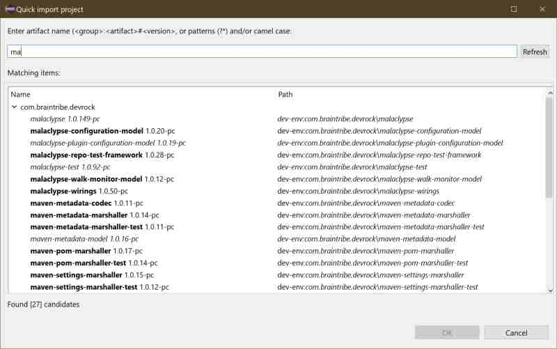
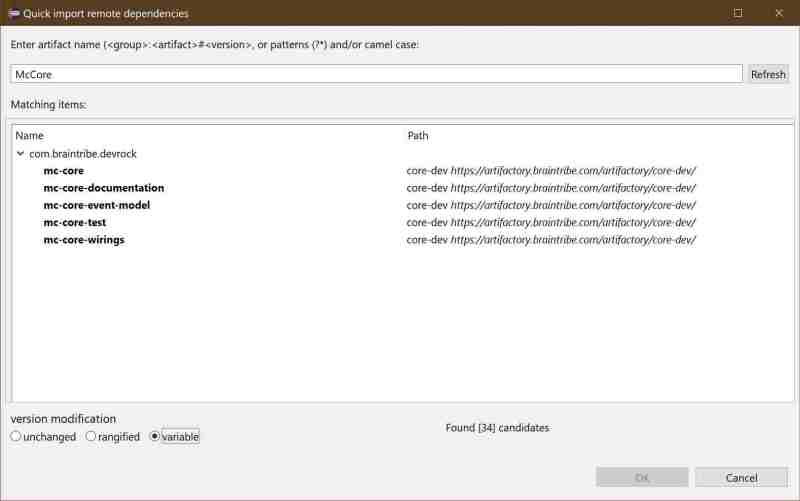
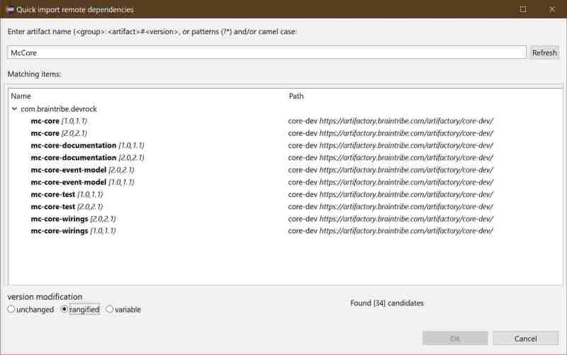
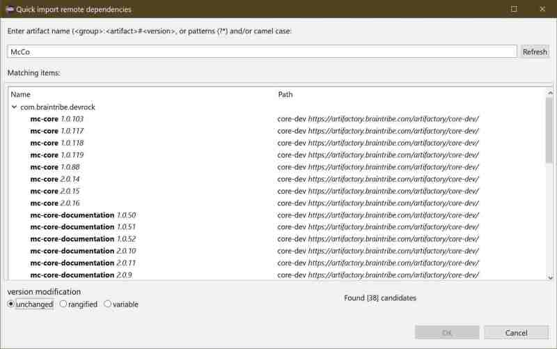

# QI
The Quick Import feature is used to import projects from your sources (or to select dependencies from amongst the sources).

Basically, it has two modes: 

- importing projects into the workspace

  The selection of projects you can import is of course depending on your [sources configuration](./devrock.md#source-repository).
	
- attaching dependencies to selected projects in the workspace

  The selection of what artifacts you can attach as dependencies is of course depending on your [repository configuration](./devrock.md#repository-configuration), but also on the [sources configuration](./devrock.md#source-repository) as it combines all of them. 


## importing projects
The dialog shows all available (existing, with correct pom and a .project) artifacts from the currently configured sources. 


 
You can either use multiple selections with your mouse, using the CTRL + SHIFT keys to add or remove artifacts from your selection.

You can also use the cursor (arrow) keys UP and DOWN, directly from the edit-box where you enter the query. The use of these keys will navigate through the query result, and always select the artifact at the current location. Keep in mind that using this method, you can only select one artifact at the time. But if you are using your mouse, you can select multiple items.

In this mode, what you select is - after you pressed OK or Return - imported into your workspace. If the 'working set'-savvy mode is activated (see configuration) it will import the selection into the currently selected working-set (if any).

Please note that what is displayed (and/or how it is displayed) depends on your [sources configuration](./devrock.md#source-repository) choices, the [view/filter configuration](./devrock.md#qi-behavior) *AND* the state of the current workspace. 


## attaching dependencies 
The dialog again shows all available artifacts it can find using the current [source configuration](./devrock.md#source-repository) and [repository configuration](./devrock.md#repository-configuration). 

- all artifacts in the currently configured source directories
- all artifacts in the currently configured local repository
- all artifacts in the currently configured remote repositories

The target artifact, i.e. the artifact where the dependencies are to be attached to, needs to be selected in the package-explorer. The dialog will still work even if no project is selected, but in that case you'll need to use CRTL+V to insert the generated dependency snippets into the pom.xml file (there will always be a copy of all selected dependencies as snippets in the clipboard)


>Please note that the scanning of all these locations takes a while. The plugin will start a scan at start-up, hence it will show the data of the configuration active at that time.
If you change the configuration (or also if some remote repositories went offline) you'll need to run the scan again.


What you initially see in the dialog depends on what your settings are concerning the [version manipulation mode](./devrock.md#version-manipulation-modes), but you can always change it here in the dialog.


### variable mode
If you use the 'variable mode', you'll only see the groupId and artiactId of a possible dependency. You'll only see the origin of the first found groupId/artifactId combination. 



If you select such an entry, it will be inserted into the target artifact (or copyied in the clipboard) with a variable derived from the groupId. 

```xml
	<dependency>
		<groupId>com.braintribe.devrock</groupId>
		<artifactId>mc-core</artifactId>
		<version>${com.braintribe.devrock}</version>
	</dependency>
```

### range mode 
If you use the 'range mode', the artifacts' versions are considered, and turned into standard 'minor' ranges. Any version falling into such a range is no longer shown, and you'll only see the origin of the first found groupId/artifactId/range combination. 



The range is built from the major and minor of the artifact considered, and leads up to the next minor. 

```
	1.0.15 -> [1.0,1.1)
	1.1.0	-> [1.1,1.2)
	X.Y -> [X.Y,X.Y+1)
```

So if you select such an entry, its range will be used as a version:

```xml
	<dependency>
		<groupId>com.braintribe.devrock</groupId>
		<artifactId>mc-core</artifactId>
		<version>[1.0,1.1)</version>
	</dependency>
```


### unchanged mode (version mode)

Finally, if you use the 'unchanged mode', you see every single artifact.



And, of course, if you select such an entry, the version will appear exactly as defined by the selected artifact:

```xml
	<dependency>
		<groupId>com.braintribe.devrock</groupId>
		<artifactId>mc-core</artifactId>
		<version>1.0.123</version>
	</dependency>
```

In this mode, what you select is imported as a dependency into the pom of the currently selected project. Again, you can select multiple items.


### search criteria

You can enter a search expression which is then turned into a query that is run across the artifacts in your configured source directories. Matches are shown in the dialog and you can select the artifacts you want to either import or declare a dependency to.

There are two ways to specify a search criteria :

You cannot select one or the other modes, they are automatically detected from what you enter as search expression:

- camel-case search : activated if the first character of the expression is an upper-case character or the expression contains '*' 
- standard search : (or 'contains search') is activated if the first character is lower-case and no '*' is found in the expression.


#### camel-case

camel-case expansion is built on our convention of how our artifacts are named. Basically, all our artifacts' names are in lower-case, and the names are a concatenation of meaningful (sic) parts, so you'll see things like 'absence-information-model'.

```
    'AIM' translates to 'a.*-i.*-m.*'
    'A' translates to 'a.*'
    'Absence' translates to 'absence.*"
    'RMo' translates to 'r.*-mo.*'
```


#### standard-search 

The expression entered will be processed as follows:

```
    'a' translates to '.*a.*'
    'absence' translates to '.*absence*."
```
