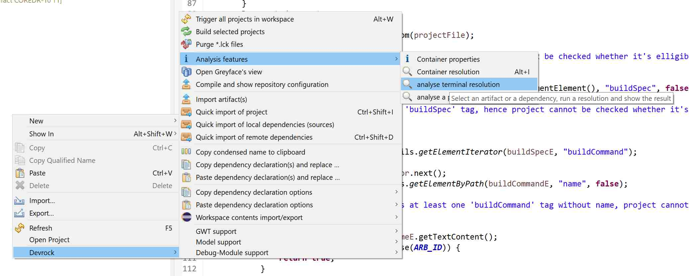
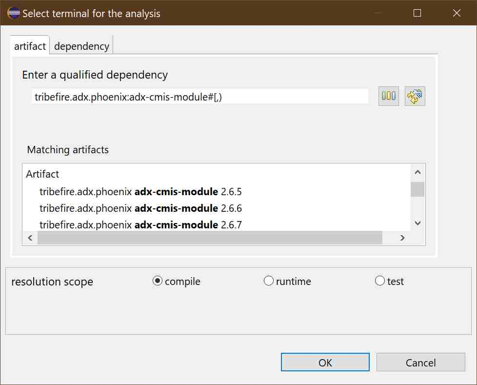
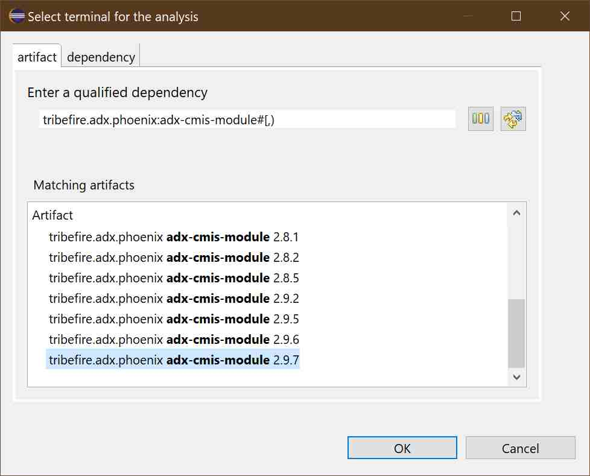
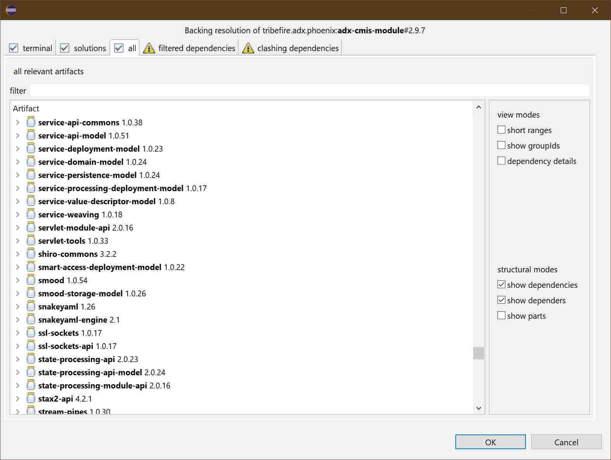
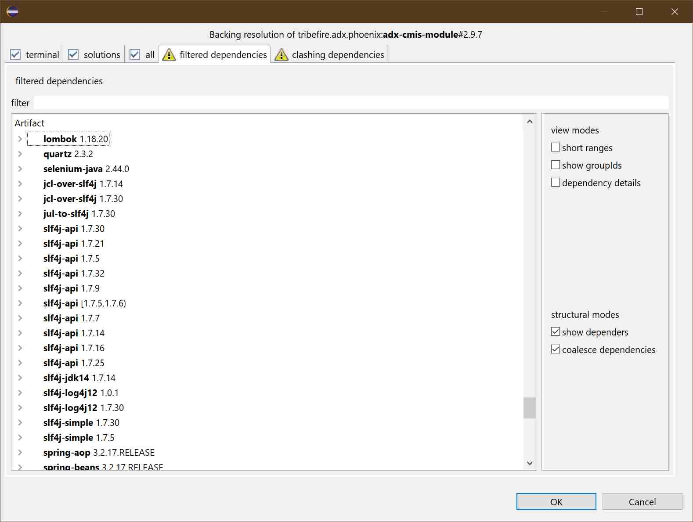
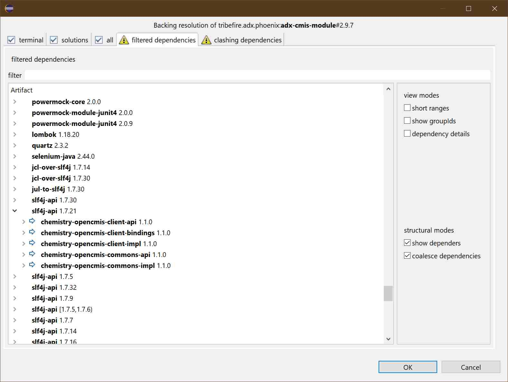
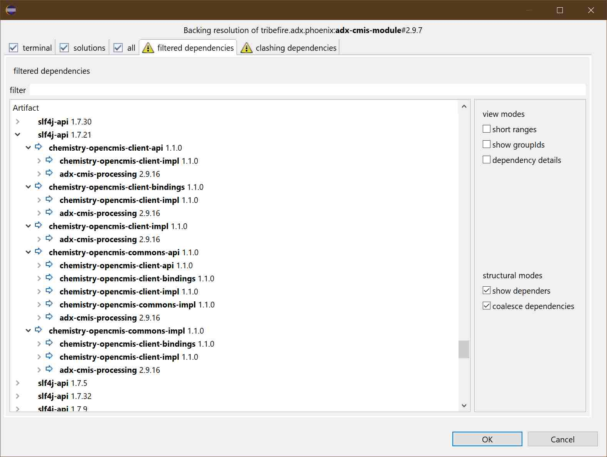
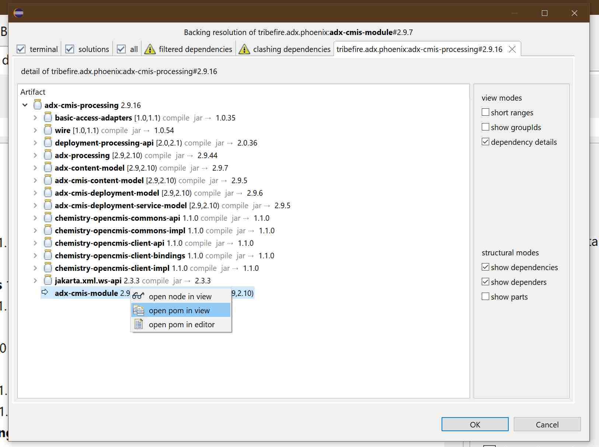
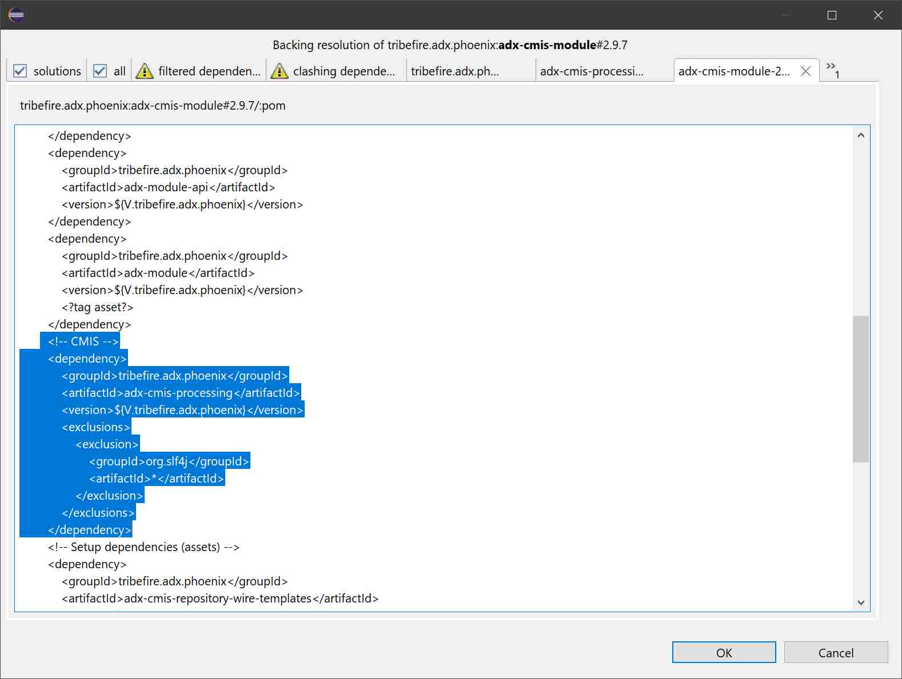

# an exemplary analysis use-case

This text aims to show you how you can use the analysis-features of AC. It is based on a 'real life' case I was confronted with, and shows what is currently available with the analysis-tooling.

> As this episode happened a while ago, the screenshots are quite a bit outdated. Still, everything that is mentioned in regards to the tooling is still accessible - and improved.

## the case of the missing org.slf4j
That is what I was told:

>  ein Module (**'tribefire.adx.phoenix<:adx-cmis-module'**) hat ne transitive Dependency auf **'org.apache.chemistry.opencmis:chemistry-opencmis-client-bindings#1.1.0'**
Dessen Parent - **'chemistry-opencmis'** - deklariert ne Dependency auf **'org.slf4j:Slf4j-api'** .
Die dependency ist ganz einfach, kein spezieller scope oder sonst was.
Allerdings sehe ich in AC bei den deps von dem Module die **'slf4j-api'** gar nicht.

To recap in english: 

>The terminal **'tribefire.adx.phoenix:adx-cmis-module'** depends on **'org.apache.chemistry.opencmis:chemistry-opencmis-client-bindings#1.1.0'** which is referencing a parent **'org.apache.chemistry.opencmis:chemistry-opencmis'** which in turn injects into all its referencing 'children' a dependency to **'org.slf4j:Slf4j-api**'. But there is no dependency to **slf4j-api** amongst the dependencies of the module shown in AC. 

The first step was to run a 'terminal analysis' using AC.

As this extension is not managed by my team, I had to add the **'adx-dev'** repository to my **standard** repository-configuration to be able to access all the data the resolution requires. 

> Not that this is no longer required. You *CAN* specifiy any valid repository-configuration to run the resolution with. The analysis feature supports an external repository-configuration - of course, you'll need to sort out the credentials. For the purpose of analysis, a **'read-only'** access is sufficient. 

## running the analysis
The first step is to get the data. 

>If I was given the yaml representation of the resolution data of **'tribefire.adx.phoenix:adx-cmis-module'** that step *would **not** have been necessary*, as the analysis-tooling can work on a previously persisted analyis. *Such files are automatically produced if a resolution fails in the build-system (devrock-ant-tasks and other implementations), check the folder *processing-data-insight* in your dev-env*.

But as there was no persisted analysis, it had to be recreated. 

So I called up the respective command in context menu 

> 'analysis features' -> 'analyze terminal resolution'

currently, it looks like this:

The next step was to use the [analysis feature](../analysis/analysis.md), and to look for the terminal.

So I needed to find a version of **tribefire.adx.phoenix:adx-cmis-module** in any of the currently configured repositories, so we do specify an 'open' range.

As I wasn't told what version it was, so I assumed it was the newest one.

## confirming org.slf4j is missing
So now that I had the resolution, I needed first to confirm whether the missing artifact was definitively not amongst the solutions, so I looked at the list of all relevant artifacts.

Ok, it was definitively not there. 

## checking the filtered dependencies
So if it wasn't there, it must have been **filtered** out somehow.

I needed to see whether it really had been filtered out: 

Ouch, a lot of **org.slj4j**, so I need to see which one is referenced by the **'chemistry-open-cmis'**.

Ok, **'org.slf4j:slf4j-api#1.7.21'** it was. 

There are diverse **'chemistry-open-cmis'** artifacts involved, let's see how they related to the **'adx-*'** artifacts. 

## figuring out why the org.slf4j was dropped
Now, all the **'chemistry-open-cmis'** thingies are dependency of **'adx-cmis-processing'** and only the latter is in turn a direct dependency of the terminal **'tribefire.adx.phoenix:adx-cmis-module'**.

So let's look at the pom of the module. For that we can use the context menu of the [analysis viewer](../analysis/analysis-viewer.md)

And so we can have a look at the pom of **'tribefire.adx.phoenix:adx-cmis-module'**.

And there we go: **'adx-cmis-module'** has a dependency to **'adx-cmis-processing'** and in the declaration of this dependency, and any dependency in the group **'org.slf4j'** within this branch is filtered out using an *exclusion* statement.

As **'adx-cmis-processing'** is the only branch leading to the **'chemistry-open-cmis'** *and* **'chemistry-open-cmis'** is the only depender on **'org.slf4j:slf4j-api#1.7.21'**, the *exclusion* is active and the dependency is dropped.

## conclusion
There are several fixes possible of course.. For instance, **'adx-cmis-module'** could introduce the dependency to **'org.slf4j:slf4j-api#1.7.21'** on its own (as it seems to be used), or the exlusion could be removed from **'adx-cmis-module'** and added to each pertinent dependency in **'adx-cmis-processing'**.. 

