# Resolution viewer

The different ways to analyse an artifact's classpath are described in detail [here](./analysis.md), this part here focuses on the viewer itself.

The resolution viewer is intended to support the analysis of an [AnalysisArtifactResolution](javadoc:com.braintribe.model.artifact.analysis.AnalysisArtifactResolution) as all mc-core's resolvers return.

In the context of the artifact container plugin, it's restricted to the classpath resolver, the CPR.

There's a short text that shows how to use the viewer for a [concrete analysis](../analysis-example/analysis-example.md), as kind of an example slash tutorial on how to use it. 

>In the current setup, if you access the backing resolution of a project in the workspace, the resolution will be built using a 'compile' magic scope.

## resolution viewing

## the viewer 
The resolution viewer is aiming to give you as much information about the resolution as possible, aiding you to investigate and (hopefully) understand the reason (sic) for failed resolutions.

It reflects the resolution's main structure (see the mc-core documentation for details). Suffice here to list the most relevant sections

>The viewer will show these different section each in a separate tab, and they will only appear if there is content in the sections, so if the resolution had no issues, only the tab for the terminals, for the solutions and for all involved artifacts will show.

### common view settings

All tabs (besides the YAML tab) can display artifacts (and dependencies) differently. 

#### display choices
Displaying choices just influence how the currently shown data is displayed. 

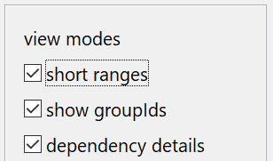

##### short range notation :

affects how versions are shown in the dialog. 

deactivated, it will show 'maven style' versions. 

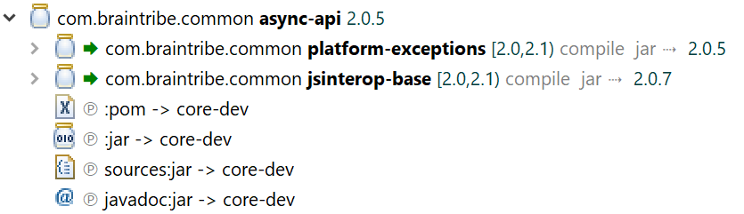

activated, it will show the version in a notations as used in java-script.

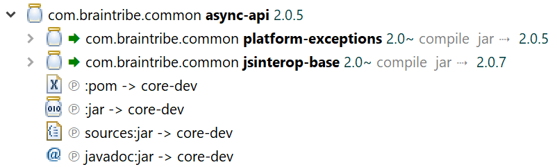

##### show groupids

if not activated, only the artifactIds are shown.

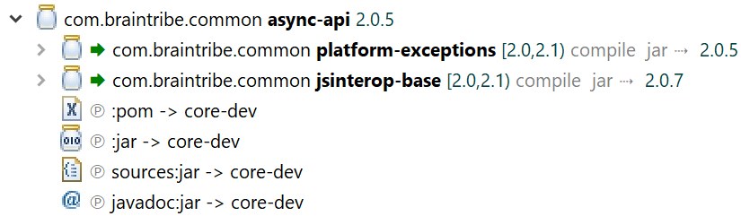

 if activated, the group ids are shown.

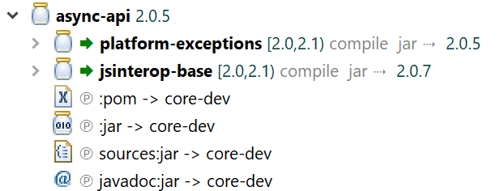

##### show dependency details 

if not activated, only the dependency's identification is shown.

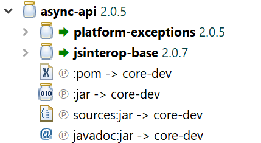

 if activated, it will show dependency information where applicable.

 

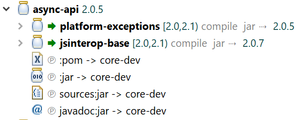

Of course, no matter what your choices are concerning the groupId and dependency details, the tooltip will always show this information.

 

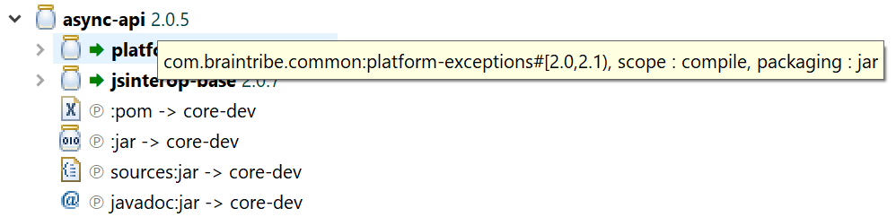

 

#### viewing choices 
Viewing choices influence the data that your are shown. Differing to the display-choices which act on the currently displayed data, viewing-choices alter **the content** of the viewer. Hence, the tree will be reset when changing the viewing-choices. 

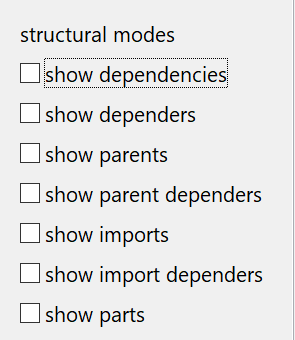

##### dependency / depender 

A dependency is - as explained [here](../dependencies/dependencies.md) - another artifact that is referenced by the terminal (or any other artifact that is). Following this direction, any node is a **dependency**. Reversing the direction, from bottom to top, the artifacts are **dependers**.

if dependencies are activated, they will show up in the tree.

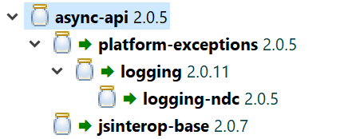

if dependers are activated, they will also show up in the tree.

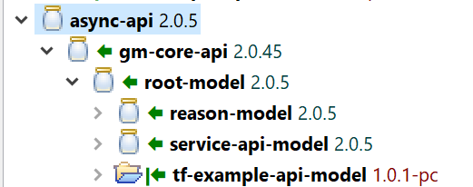

> The depender with the vertical bar is the terminal itself, i.e. the depender-chain stops there. 

You can specify the colour of this axis (dependency and dependers are oriented relations within this axis) in the [configuration](../configuration/configuration.md).

##### parent-dependency / parent-depender 

A parent is a special artifact that be itself doesn contribute to the classpath of an artifact, but is used to declare some common properties that can be shared by any artifact that is depending on the parent. 

if parents are activated, the will show up in the tree, attached to the artifact that references it.

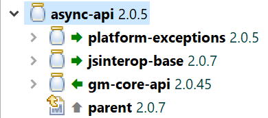

if parent-dependers are activated, the dependers of the parent (i.e. those artifact that reference the parent) will show up in the tree.

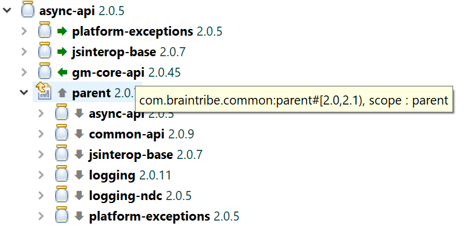

You can specify the colour of this axis (parent-reference and -referers are oriented relations within this axis) in the [configuration](../configuration/configuration.md).

##### show parts

     if activated (and supported by the view's data), the structure of the displayed tree is altered so that the enriched parts of an artifact are shown.
     

 

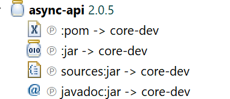
         
For each part, its origin (the repository where it came from) is shown, no matter whether a download was required or it already resided in the cache.

> not all views support this feature.

- coalesce dependencies : if activated, it will combine all dependencies of the same groupId, artifactId and version-range so that they are only show once, and all the children of the original instances are attached to the single item.

> not all views support this feature.

Depending on your choice (see preferences) 

### common view features

- filter expression: you can specify a filter expression here, in the same format as in the [Quick Import](../dependencies/dependencies.md) feature. The filter will act on the top level entities of the view only.

> not all views support this feature.

- double-click : if you double-click on an item, a new view is created and added to the tabs. You can open as many additional views as you like, and closed them anytime. 

> not all views support this feature. As a rule of thumb: Artifacts/Dependency nodes and 'Depender nodes' can open a detail tab. Part nodes and clash nodes cannot. 

## Standard tabs
The resolution-viewer shows multiple tabs, each centered on a specific aspect of the classpath. Some of the tabs are always shown, some of them only appear if certain issues have been detected during the classpath resolution.

### terminal
shows the tree starting with the entry points of the resolution. May be a single one (as in the case of an Eclipse project) or several (if created using a 'virtual artifact', i.e. multiple dependencies).

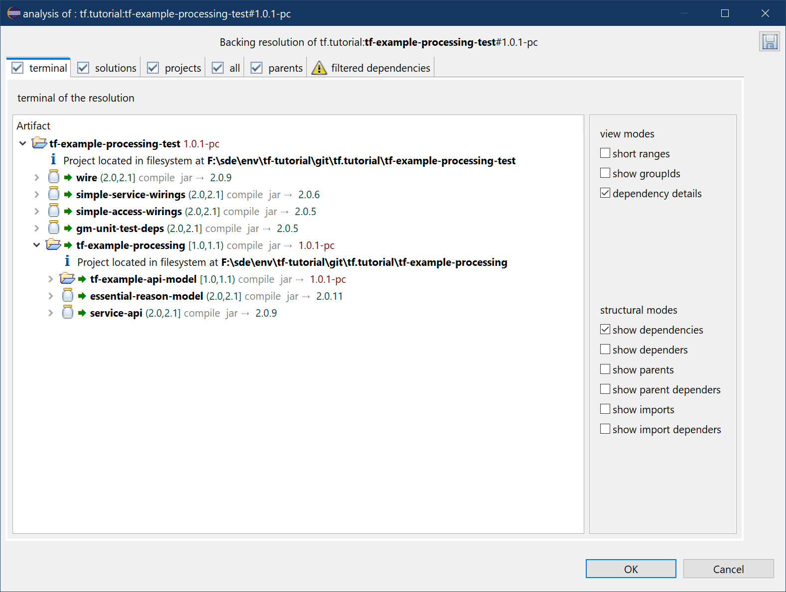

>The terminal window doesn't support all features of the viewers (compared with the all and solution views). This is due the way the data is presented in the terminal section of the resolution.

### solutions
a list of the artifact that are involved in the resolution in such a way that are contributing to the classpath, i.e. sport a jar. 

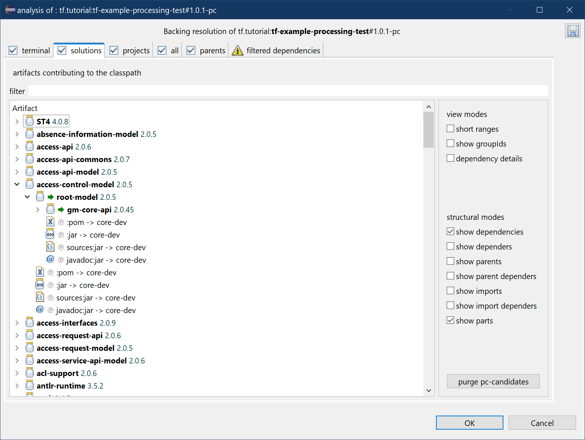

Some of the dependencies are however re-routed to matching projects in the workspace. In most cases, a project's version will fall into the range our artifacts use declaring the dependency, and so the match is perfect. In the case of 'debug-module-projects', this is not the case. Such a project declares dependencies with a concrete version, that means it never declares a valid range, but an actual version. A dependency was the best match when the debug-module-project was generated by Jinni and may be very much outdated soon after. Therefore, the matching algorithm will use some magick to match such a dependency, and might substitute a dependency with a project. If that happens, a project dependency shows that information as in the picture below.

### all
list of all [AnalysisArtifact](javadoc:com.braintribe.model.artifact.analysis.AnalysisArtifact) involved in the resolution, including parents, import-scoped and aggregator artifacts.

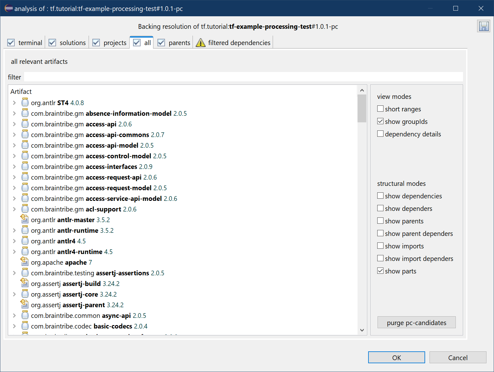

>Note that this is not part of the resolution itself, but added by the viewer itself.

### projects
As one of the features of the 'artifact container' is to automatically link dependencies to projects available in the workspace, there's a special tab for these linked project. 

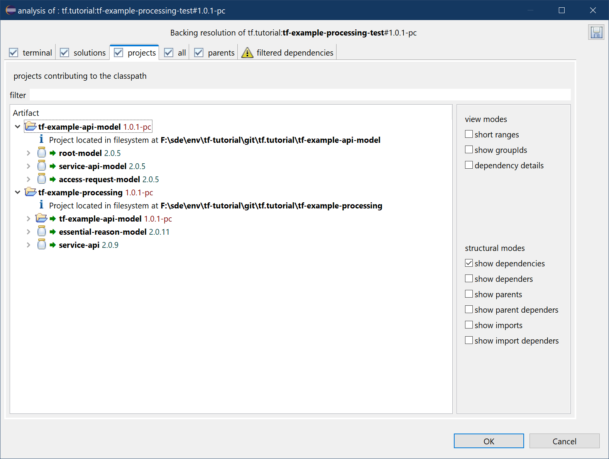

### parents

Parent relations can also be viewed. All pertinent tabs show parent relations, but there's also a specialized tab that shows all involved parents. 

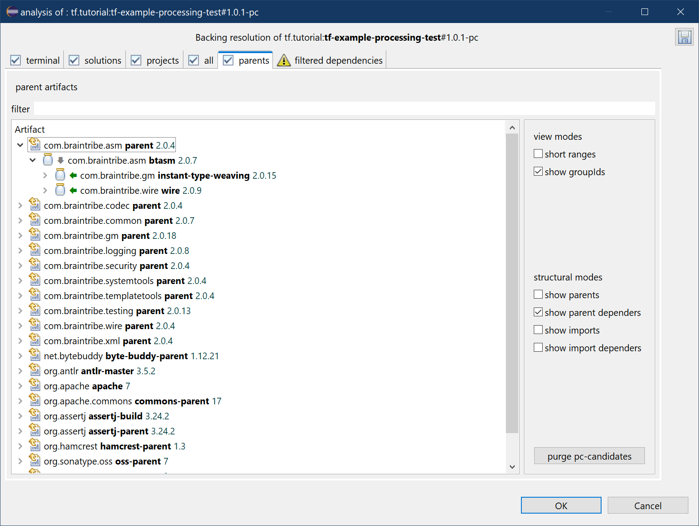

>Note that is still WIP as some more information will be made available.

### filtered dependencies

Some dependencies are ignored during the resolution, due to their scopes, optional tags or exclusions. 

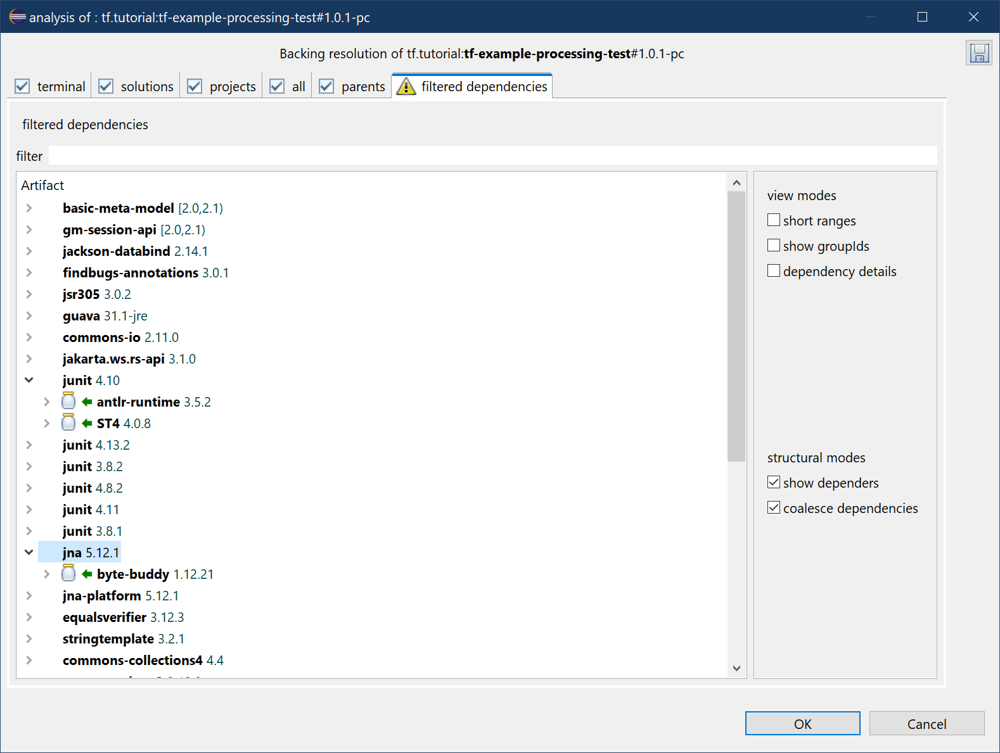

### clashes
In some cases, the versions of requested artifacts diverge, i.e. two artifacts declare to require the same artifact albeit in different versions. 

The internal clash mitigation algorithm will favour artifacts with the higher version as this promises a better chance of a viable classpath than using the artifact with a lower version. 

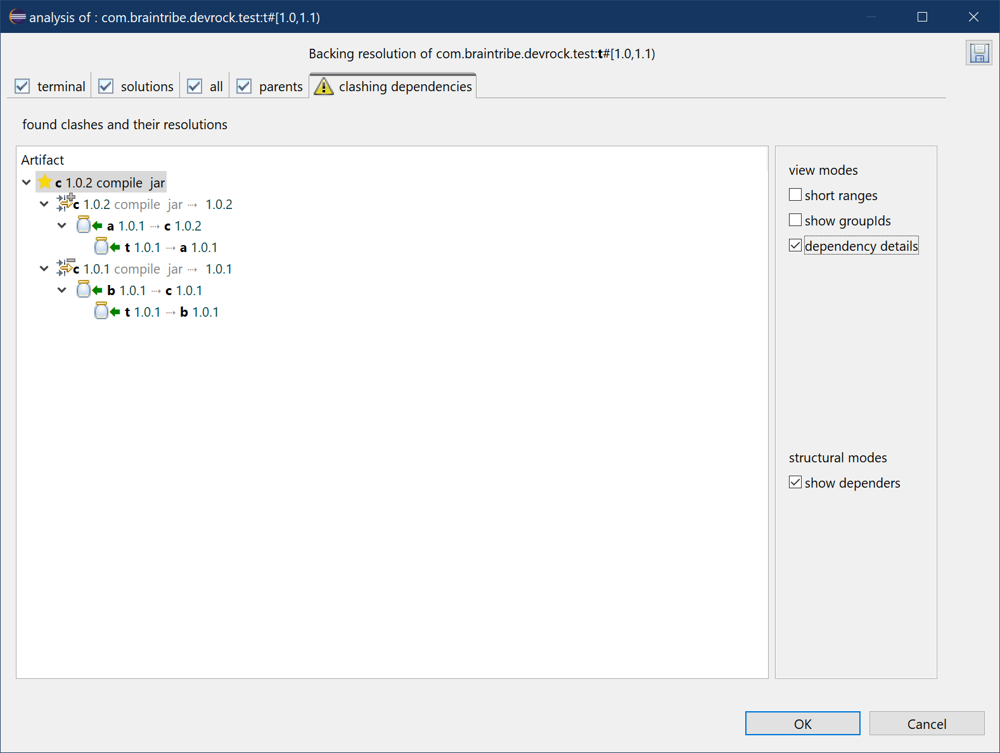

The clash is represented by its winner - the dependency that was actually taken during clash-mitigation. Underneath, all conflicting dependencies are shown, and - if dependers are to be shown - the branch of the dependency-tree that lead to the conflicts are shown.

## Error handling

As there always might be issues with resolving a classpath, the viewer is supporting error analysis in all aspects 

> The following examples are based on a situation that has especially constructed to generate this pictures. 

### failure
If the resolution has failed - even it it produced data - a special tabs appears : the failure tab.

It collates the information about the failures into one display.

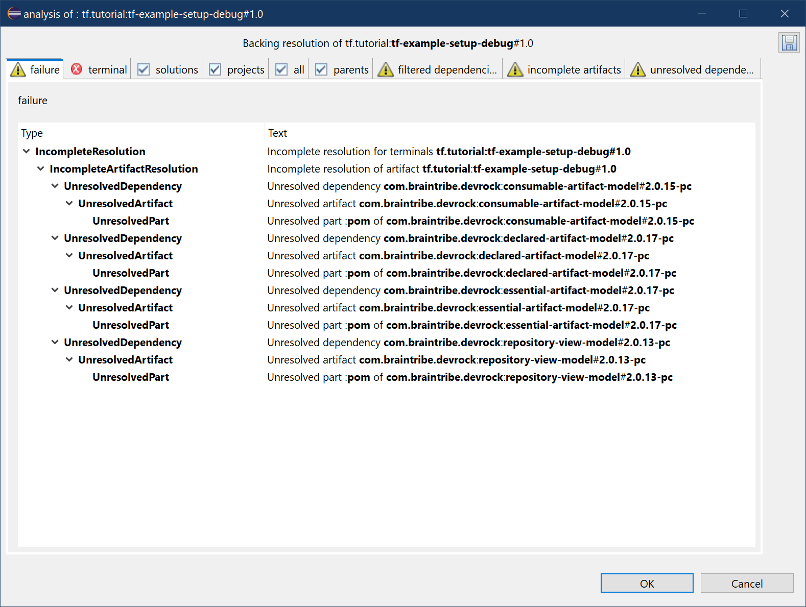

### failed terminal

Any artifact that had an issue with its dependencies has the respective information attached. In this example, its only the terminal that declares dependencies, hence only the terminal has issues.

Still, what you see here would also appear on any other artifact that has issues.

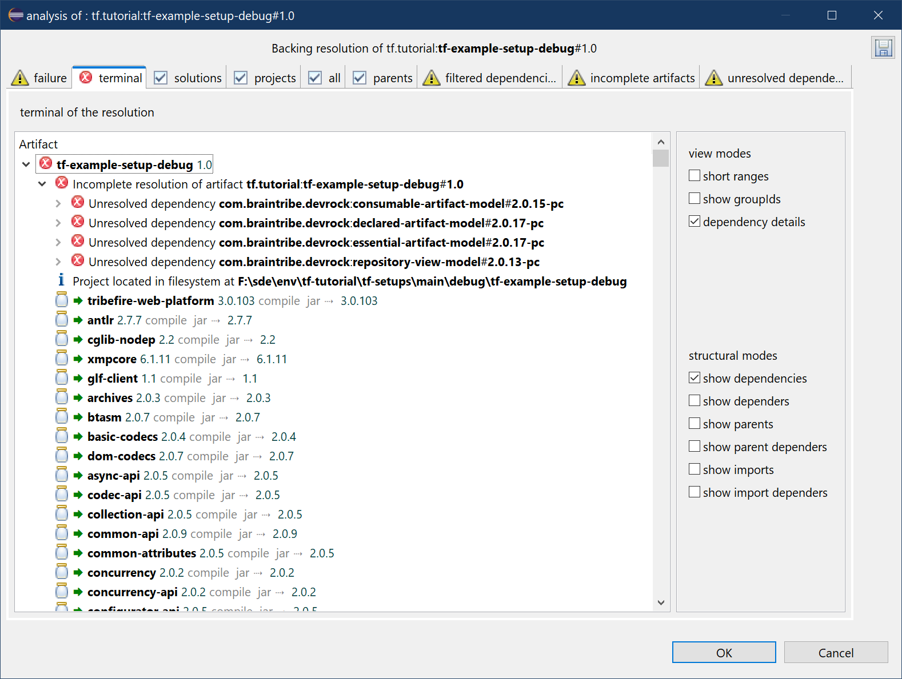

### incomplete artifacts
The tab 'incomplete artifacts' shows a list of artifacts that were deemed incomplete, either through their own failure to deliver the required data to identify themselves, or with missing parents (or import-scoped references), or with unresolved dependencies.

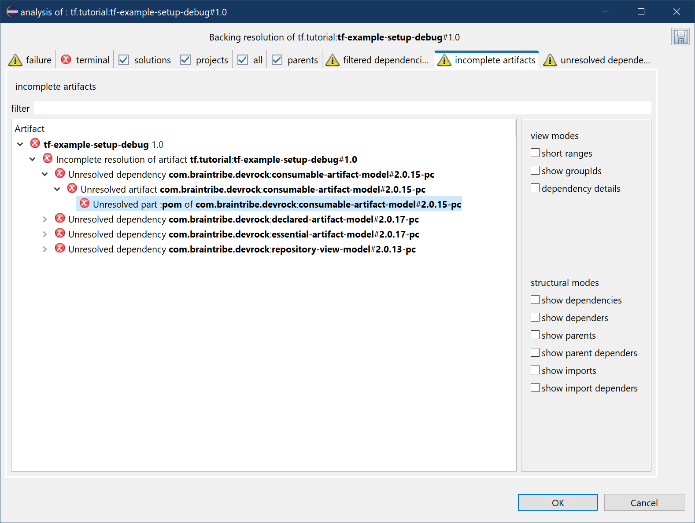

### unresolved artifacts
unresolved dependencies : a list of all [AnalysisDependency](javadoc:com.braintribe.model.artifact.analysis.AnalysisDependency) that could not be found during the resolution.

> Again, here it's only the terminal that had issues - any other additional incomplete artifact would appear here.

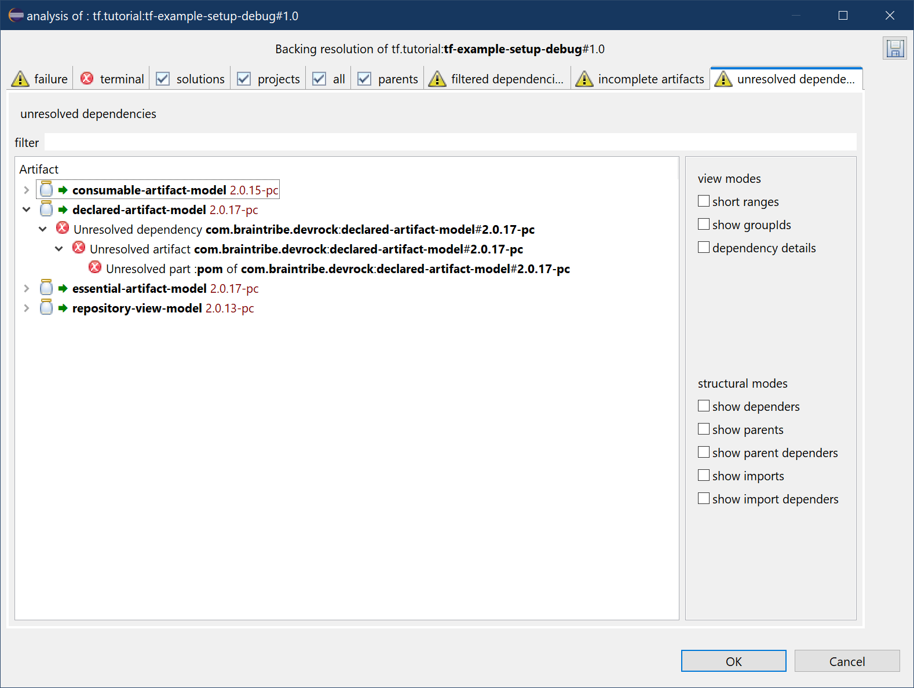
