# Artifact classpath analysis 

There are several ways to analyse the classpath of an artifact. The documentation about the [dependencies](../dependencies/dependencies.md) shows what dependencies are and how they accumulate into the classpath.

Suffice to say here : every artifact has dependencies (there may be some that don't or if they have, they don't count towards their classpath - parents for instance). The starting point of a classpath analysis is called a 'terminal' and can either be an artifact itself or a dependency.

> Note that this documentation doesn't explain how 'maven compatible dependency structures' work, especially the intricacies of declaring dependencies in the pom.

The [analysis-viewer](./analysis-viewer.md) will not only show you if there were any issues while updating it, but will give you a full featured view of what dependencies exist in the container, how they are linked to each other and of what they do consist.

So the first step for the analysis is of course to select the artifact to analyse.

## local project in Eclipse

A project in Eclipse's workspace also represents an artifact of course. The container for instance shows you the accumulated dependencies that make up the **compile** classpath. If you run an artifact in Eclipse - given it can be run in the first place - the container will provide a **runtime** classpath.

>If you select the project to with its classpath, the viewer will automatically show the **compile** classpath. If you need to see the others, **runtime** and **test**, then you need to use the approach of using a **remote artifact** (either from your install-repository, your cache or from the accessible remote repositories), see below.

To see an analysis of a project, select the project in the package explorer and then click on .

You can also use the package explorer's context-menu to access it:

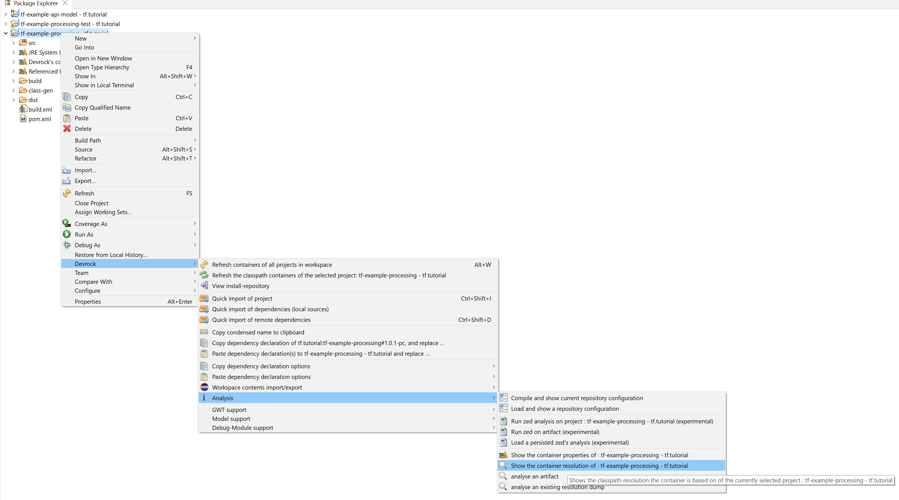.

Clicking on the entry will automatically pull up the [resolution-viewer](./analysis-viewer.md).

## remote artifact 
If you don't have access to the source code of the artifact and hence have no access to the project itself, you can look at a remote artifact.

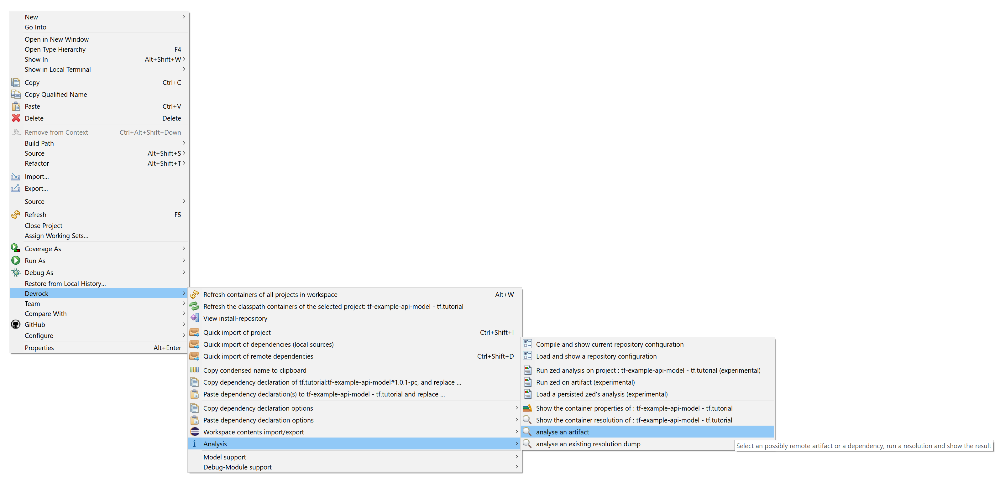.

There are two distinct ways to run an external analysis. 

- using an artifact as starting point

    Here you simply select an existing artifact as starting point.

- using a set of dependencies as starting points

    You specifiy an unlimited number of dependencies. These dependencies make up an 'unnamed, virtual artifact'.

In both cases, you start with the selection, so you need to call up the respective dialog. The dialog shows two tabs, one for both possible starting points. 

### artifact
As there can only be one 'artifact' as a terminal for an analysis, you first need to select the artifact. 

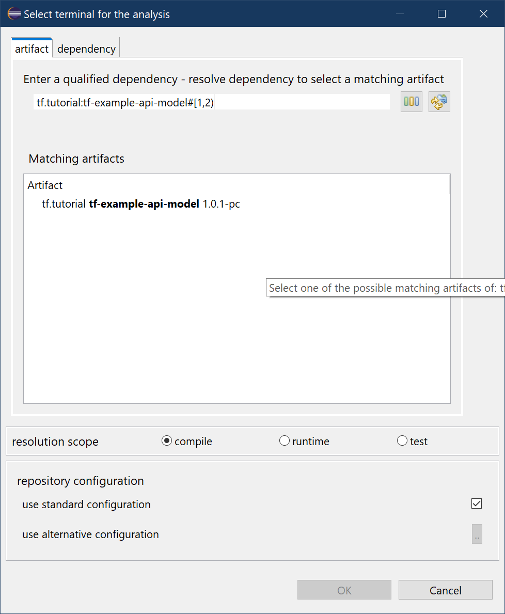.

Enter the qualified name of the artifact, consisting at least of the groupdId and the artifactId. You can enter a ranged-version expression and let the dialog search for matches in all available repositories. 

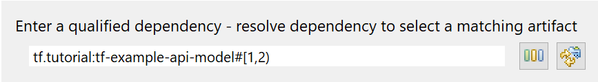.

The auto-ranger will build a valid version range depending on what you entered (or one the currently selected project in the workspace when you openend the dialog).

Pressing on  will attach a version range expression or modify the entered version into a matching range.

Next you can let the dialog search for artifacts matching the entered expression by pressing 

Pressing on 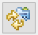 will run a quick query across all currently configured and available repositories (remote and local) for *binaries* (no projects).

The result of the query is shown in the result list and you can select your starting point from there. 

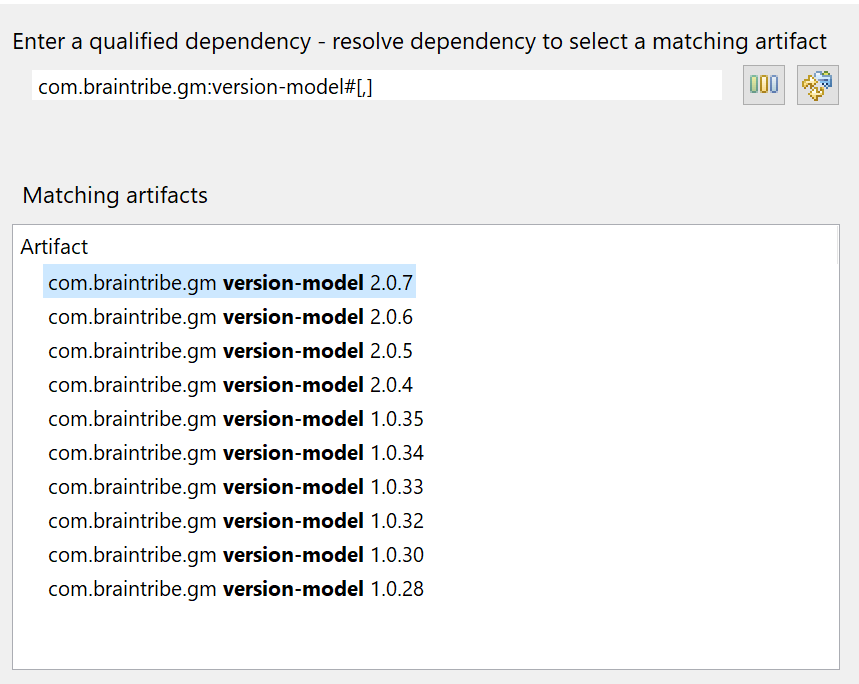.

After you select the terminal, clicking on **Ok** will run the classpath resolution using your chosen scope and eventual supplied repository-configuration and will pull up the [resolution-viewer](./analysis-viewer.md).

### virtual artifact 

In this mode, you can select as many dependencies as starting points as you wish. One could say that you actually define a *virtual unnamed artifact terminal*. 

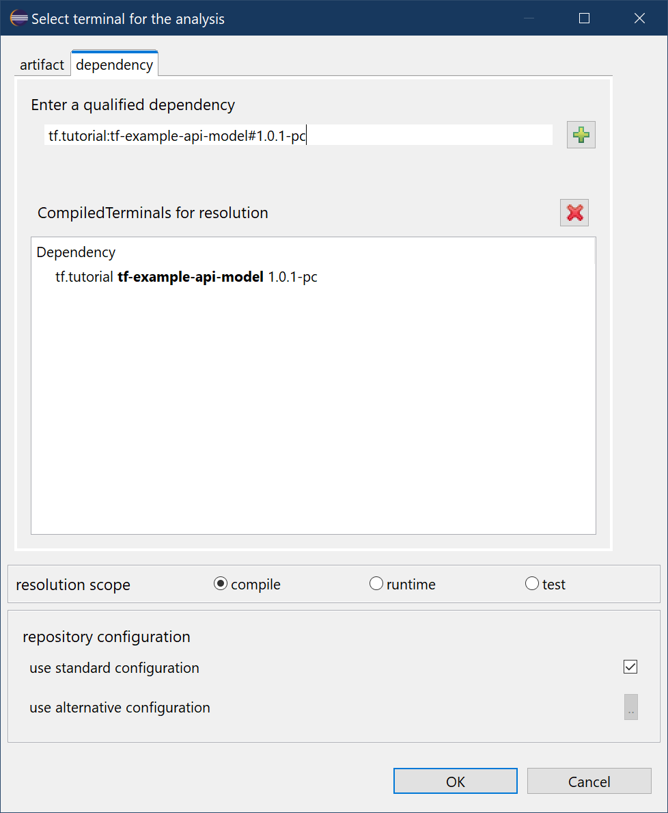.

The logic is basically the same as in the previous mode: you enter a qualified condesend artifact name and add it to the list of dependencies:

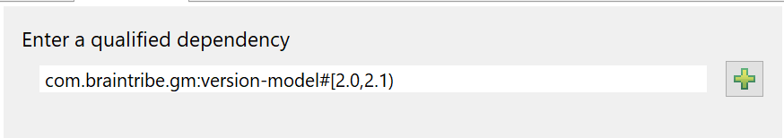.

You then press on  to add the dependency as terminal. It will appear in the list of terminals below.

You can repeat that as many time as you want, and can also remove dependencies from the list again by clicking on 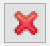. The selected terminal will be removed from the list of terminals below.

### scope
Before you press ok, you can specify what scope you want to use for the analysis. 

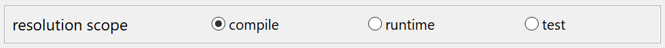.

In a few very short words, these are the choices 

- compile

    This scope represents the classpath required to **compile** the terminal. It is the standard scope for the projects in your workspace for instance. 

- runtime

    This scope represents the classpath required to **run** the terminal. It is the standard scope for the projects when Eclipse runs them (or when loaded into Tomcat for instance).

- test

    This scope represents the classpath required to **run tests** on the terminal. 

> In our codebase, the scope 'test' isn't used. In the most common places it is used the attach external dependencies to an artiact for the sole purpose to run tests **contained** in the terminal. We decided to use another pattern: Tests are **not** included in the artifact itself, but in an 'companion artiact' named accordingly. 

### configuration
The artifact whose classpath you need to analyse is not always accessible using your personal standard repository-configuration, i.e. it may reside in another repository that your configuration doesn't include.

In order to facilitate is mode, you can specify a repository-configuration to be used for the analysis.

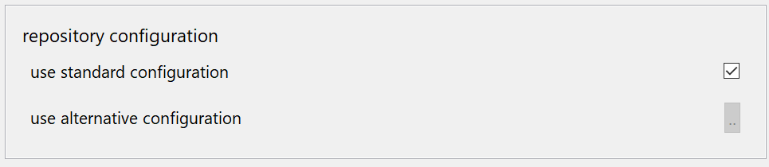

### running the analysis

After you selected your terminals, specified the scope and the repository-configuration to be used during the analysis, pressing OK will start the analysis and pull-up the viewer.

## Read on:

The [Resolution-viewer](./analysis-viewer.md) allows you to view the classpath of a project or remote artifact.

There are several configuration choices for the feature described in [Configuration](../configuration/configuration.md)

And the [Classpath container](../container/container.md) shows the current artifacts (jars or projects) that make up the classpath - albeit sporting way less insight.

