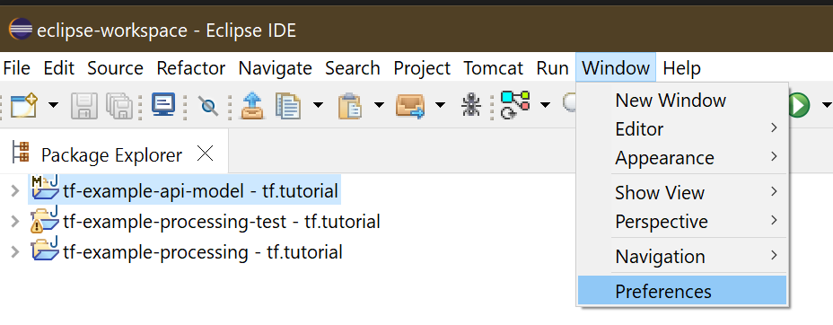
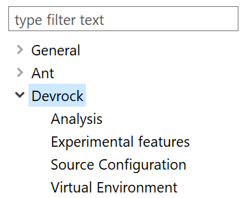
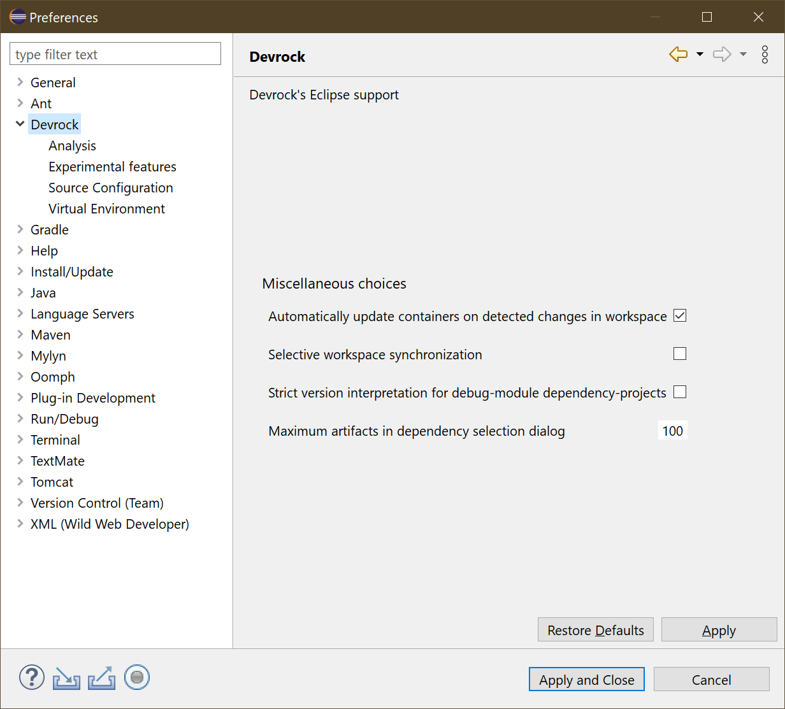
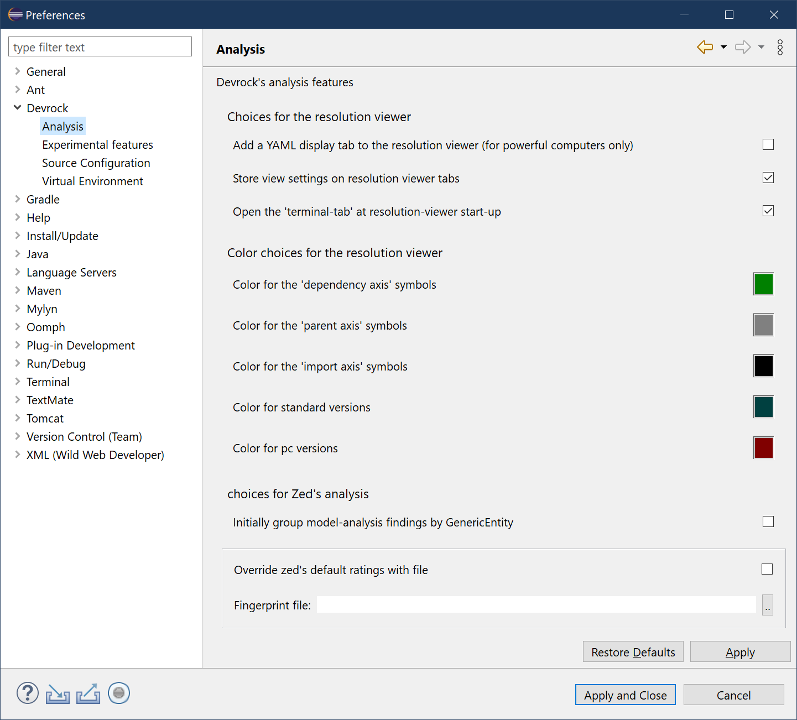
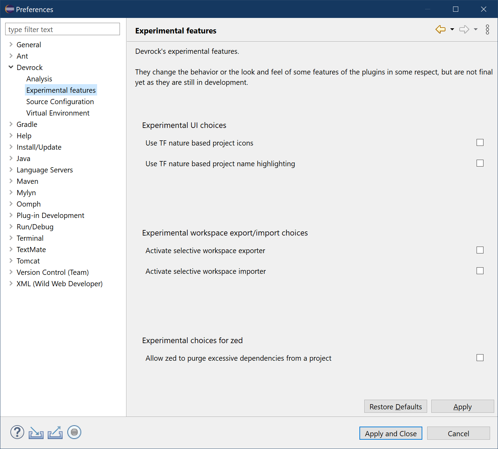
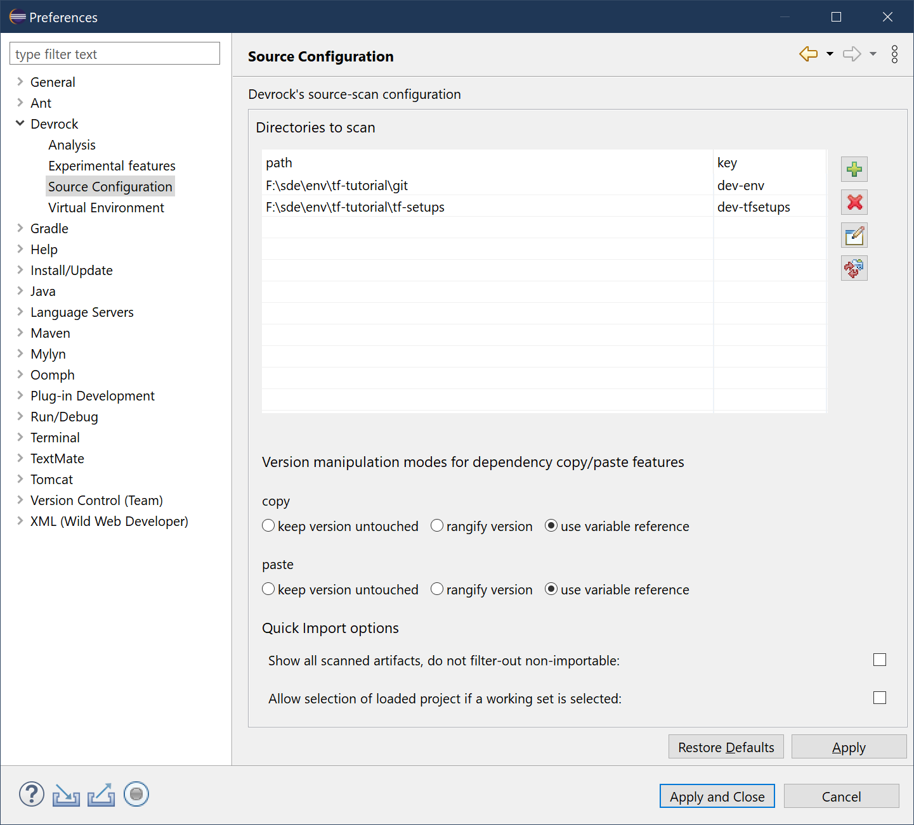
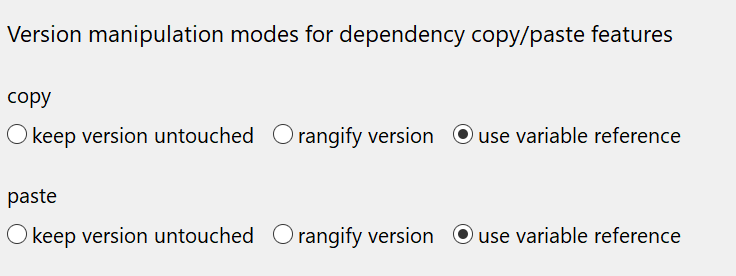
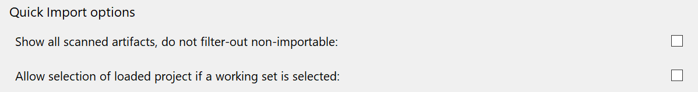
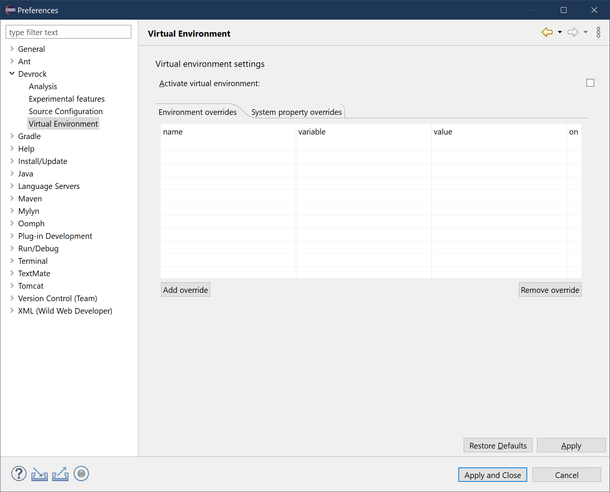

# Configuration
As mc-core's configuration comes from different sources than the plugins' configurations, it's not part of **this** documentation. See the pertinent section in the documentation of the mc-core (com.braintribe.devrock:mc-core-documentation).

## miscellaneous switches

This is a collection of various configuration options that are not directly attributable to a specific topic.

To access the various configuration possibilites, open the Eclipse preferences

The configuration comprises several pages: 

## miscellaneous choices

These are configuration choices that aren't directly linked to one of the sub-groups of configuration choices and didn't warant a preference page on their own.

- Automatically update containers on detected changes in the workspace

    If this switch is set, the [containers in the workspace](../container/container.md) will be automatically synchronized if any (pertinent) changes are detected in the workspace. If this switch is not set, you have to manually synchronize the containers using the respective commands. Default is automatic synchronization.

    If activated, changes to the workspace (closing/deleting, opening/importing) lead to a re-synchronization of all artifacts in the workspace with a container attached, while changes to a pom of a project leads to the re-synchronization of the respective project. 

    This process will trigger the 'JDT' compiler which automatically rebuilds the projects touched (and their dependencies within the workspace)

- Selective workspace synchronization

    If this switch is set, the 'workspace synchronization' command turns to be sensitive to the selection in the package explorer, so that only the [containers](../container/container.md) of the currently selected projects are synchronize. If the switch is not set, the command will automatically update the containers of all projects in the workspace.

- Strict version interpretation for debug-module dependency-projects

    The dependencies of a debug-module are never ranged, i.e. they reference concrete existing projects at the time the project was generated by jinni. In case of publishing-candidates, the will not be a direct match. Projects in the workspace are always publishing-candidates and hence, the mismatch must be addressed.

    Strict version interpration will only accept a project in the workspace if its version is *higher* than the actually request version of the debug-module. 
    Standard version interpretion simply deduces a major/minor range of the requested dependency and will take whatever project within the workspace that matches this range.

- Maximum artifacts in dependency selection dialog
    The [quick-importer dialog for dependencies](../dependencies/dependencies.md) might have a lot of entries to choose from - theoretically all artifacts collected from all configured repositories. Hence, a limit must be given - but the best way to deal with the number of possible matches is to specifiy a search-expression that is precise enough to only result in a few matches. 

## analysis features

These choices influence the various analysis features, spread across multiple plugins.

- Add a YAML display tab to the [resolution viewer](../analysis/analysis-viewer.md)

    The resolution viewer can display the resolution as a YAML formatted text in a tab. However, the YAML can become quite big for some artifacts, and loading it into a widget will take quite some time and memory. Only advantage of the YAML display is that you can use a CTRL+F search feature.

- Store view settings on [resolution viewer](../analysis/analysis-viewer.md) tabs

    The resolution-viewer has a lot of different modes, both visually and structurally. If activated, the choices are stored on per-tab-basis so they will be preset to these choices when openend. Otherwise, the default modes are set and changed after the viewer has started. 

- Open the terminal-tab at [resolution viewer](../analysis/analysis-viewer.md) startup

    When the resolution-viewer starts, either the terminal-tab (showing the projects/artifacts dependencies in a structural tree) or the solutions-tab (all dependencies of the terminal) can be shown. 

- color choices for [resolution viewer](../analysis/analysis-viewer.md) axis

    The resolution viewer uses colors to identify the different 'kinds of relationship' between artifacts: there are three 'axis' - dependencies, parents and imports. In this 'axis', relationship are bidirectional, dependency/depender, parent/child, imported/importer. For each of the three axis, a color can be chosen.

    The resolution-viewer knows different kind of versions, currently it differeniates visually between standard-versions and 'publishing-candidate'-version. For both 'semantic types' of a version the color can be specified.

- color choices for standard versions in the [resolution viewer](../analysis/analysis-viewer.md)

    Standard versions are versions that are not -SNAPSHOT or release candidates (-rc, -cr) or publishing candidates (-pc).

- color choices for pc versions in the [resolution viewer](../analysis/analysis-viewer.md)

    Pc-versions are versions that are declared in such a way that their rank lower than a version without the suffixes -SNAPSHOT, -rc, -cr, -pc.

- choices for [Zed]((../zed/zed.md)'s analysis

    Zed can analyze any artifact, extract data and validate them. Any issue found is expressed in 'finger prints', i.e. a structure that identifies the exact place in the artifact where the issue occurred, what kind of issue it is and whether the issue can be ignored, just warned of it, or treat it as an error.

    In a finger-print file, you can overload Zed's internal rating, i.e. you can tone an error down to a warning or declare an issue normally ignored as an error. 

## experimental features
These choices have been introduced to influence a few experimental features. Experimental in that respect that they are neither regarded as final nor as definitively to appear in future versions of the plugins.

### experimental UI choices

As there a few 'well known' project types (such as models, libraries, debug-modules et al), they should be made easily distinguishable. As not everybody's happy with the standard look&feel which orients itself on the standard Eclipse style, an alternative style was introduced.

- Use TF nature based project icons

    Replaces the standard icons of projects with an alternative icon.

    > Depending on your screen's resolution and your operating system's image-sizing the icons may appear too big. 

- Use TF nature based project name highlighting

    Replaces the standard color scheme of projects with an alternative scheme.

### experimental workspace export/import choices

The plugin can create a location-independent extract of an workspace. This comes in handy when you want to move your existing workspace to a different filesystem or even computer. Eclipse workspaces are bound the location they were created, i.e. the project references are stored with absolute paths.
The feature can write-out the workspace project-population to a YAML file and reload it after a move or on a different computer.

- Activate selective workspace exporter

    The standard workspace exporter will extract all working-sets and projects, if activated, a dialog will allow you to specifiy which workings-sets and/or projects should be extracted.

- Activate selective workspace importer

    The standard workspace importer will import all working-sets and/or projects of the extracted workspace. If activated, a dialog will show where you can select which working-sets and/or projects should be imported.

## source repository 

The source repository configuration allows you to specify the directories for the source look-up. Depending on how your basic configuration is set-up, it will already have some configured source repositories.

You can add a new source directory. Each such a directory is added by its path and a 'unique' key. You can edit and even delete the reference. However, the entries coming from the dev-env are not editable. 

Other than that, some switches are available here:

### version manipulation modes

You can influence the dependencies copy and paste functions, i.e. you can specify how these features should handle the version part of a dependency. 

The settings are specified in both directions. If you just copy to the clipboard and then insert the data into a text-editor you want to have 

 - keep as is
 
   The version is kept exactly as it is encountered (either in the pom file during copy to the clipboard or while inserting it into a pom file), so 'a.b.c:x#1.0.15' will remain 'a.b.c:x#1.0.15'

 - auto rangify
 
   The version is automatically turned into a 'fuzzy' version, i.e. into a 'minor auto range'. For instance the version 'a.b.c:x#1.0.15' will be used as 'a.b.c:x#[1.0, 1.1)' 

> Note : this feature is currently based on the 'major/minor' scheme. If we move to 'major'-only scheme, it will require an update of this feature. 
   

 - variable reference 
 
   The version is removed and replaced by a variable whose name is derived from the groupId of the dependency. So if you are copying/pasting 'a.b.c:x#1.0', the expression will be turned into 'a.b.c:x${V.a.b.c}'.

> Note: there is no process to ensure the variable exists, neither be checking nor creating it. You need to make sure on your own that variable is either declared locally in the respective pom file itself or in a pom in the parent-chain.

## QI behavior

Per default, the QI processor will only show you artifacts whose project can be imported into the workspace. What that means depends on the content of your workspace and - if you activated the support for working sets - what (if any) working set is currently selected.

- show all scanned artifacts (do not filter any)

   If set, the QI dialog will show all artifacts that matched the query. The artifacts that cannot be imported (because they a) exist in the workspace or b) in the current working set) are shown in a different color than the ones that can be imported. Default is off, so only artifacts are shown that can be imported. 
   
    > Obviously, this only acts when you run the QI in order to import the project. If you use it to inject dependencies into another project, you can of course select any shown artifact. 

- Allow selection of project if a working set is selected

    If set, and a working set is currently selected in the package explorer, artifacts are only filtered-out if they exist in this working set (as they can be imported - or rather - referenced in the working set no matter whether they already are part of the workspace in another working set). Default is off. 
    

## virtual environment
The virtual environment is used to override environment variables or system properties. Obviously, only features supported react to it - for instance, you can influence how and where the configuration is taken, what user and passwords are used and how it is compiled. Using the dr-runner will also allow influencing the build-steps processed by it. 

- global activation switch

    The Virtual Environment can be globally switched on or off, globally in that sense that it deactives all overrides of environment variables and system properties. 

For each environment variable or system property you can enter the name and its current value is immediately shown. You then can enter the overriding value.

- local activation switch

     Every override has its own activation switch, so you can de-/activate any entry separately. 

- nulling a variable

    In some cases, you may not want to override a variable or property, but rather 'null' it (so to say make it non-existing in the VE). In that case, just leave the 'value' empty. 

