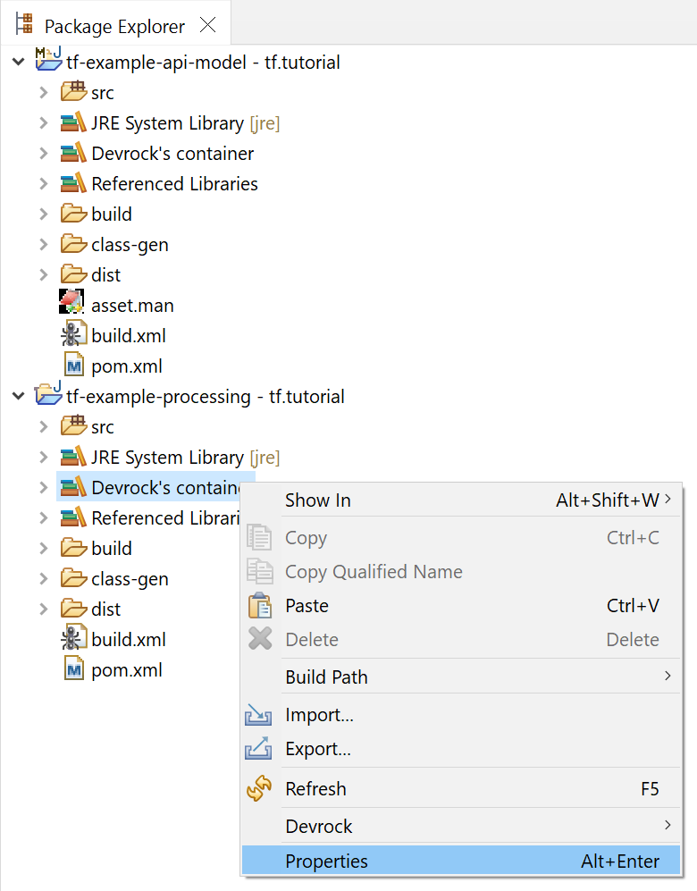
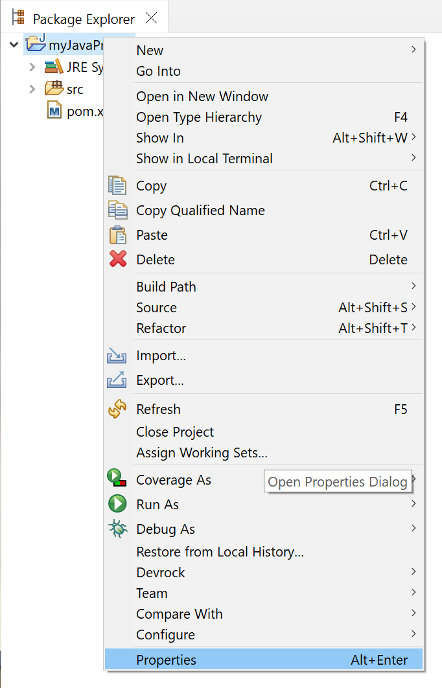

# container


A project - in most cases - doesn't stand alone. The artifacts referenced by a project (or another artifact) are called dependencies. In Eclipse, where you - in the most cases - deal with a Java-project, all the combined dependencies make out the classpath, i.e. what Java (or Eclipse) needs to compile and run the project.

The references that a project in Eclipse can have come in two flavours: a reference to a jar file of a compiled artifact or a reference to a project in the workspace. Any changes to one artifact referenced in the former style would need a recompiled of the artifact followed by an update of the container in the workspace. In the latter case, changes in the referenced project are immediately reflected in the referencing project - which is of course the preferred way.

## prerequisites

This tutorial uses the projects created in the tutorial 'create-extension'. It also requires that you run 

> dr 

in the git folder associated, i.e.

> devrock-sdk/env/tf-tutorial/git/tf.tutorial

If you have configured your setup as a 'dev-env' withhin the SDK, you do not have to configure anything, provided you followed the guidelines as presented by the SDK. 

Import the following two artifacts into your workspace if you haven't already, using the means explained in the [project tutorial](../projects/projects.md).

```
tf.tutorial:tf-example-processor
tf.tutorial:tf-example-api-model
```

Let's examine the **tf-example-api-model** artifact first. 

Its file **pom.xml** declares the artifact and its dependencies.

```xml
<?xml version="1.0" encoding="UTF-8"?>

<project xmlns="http://maven.apache.org/POM/4.0.0"
	xmlns:xsi="http://www.w3.org/2001/XMLSchema-instance"
	xsi:schemaLocation="http://maven.apache.org/POM/4.0.0 http://maven.apache.org/xsd/maven-4.0.0.xsd">
	<modelVersion>4.0.0</modelVersion>
	<parent>
		<groupId>tf.tutorial</groupId>
		<artifactId>parent</artifactId>
		<version>[1.0,1.1)</version>
	</parent>
	<artifactId>tf-example-api-model</artifactId>
	<version>1.0.1-pc</version>
	<properties>
		<archetype>model</archetype>
	</properties>
	<dependencies>
		<dependency> 
			<groupId>com.braintribe.gm</groupId>
			<artifactId>root-model</artifactId>
			<version>${V.com.braintribe.gm}</version>
			<?tag asset?>
		</dependency>
		<dependency> 
			<groupId>com.braintribe.gm</groupId>
			<artifactId>service-api-model</artifactId>
			<version>${V.com.braintribe.gm}</version>
			<?tag asset?>
		</dependency>
		<dependency> 
			<groupId>com.braintribe.gm</groupId>
			<artifactId>access-request-model</artifactId>
			<version>${V.com.braintribe.gm}</version>
			<?tag asset?>
		</dependency>
	</dependencies>
</project>
``` 

Important here are the three dependencies : 

```
com.braintribe.gm:root-model
com.braintribe.gm:service-api-model
com.braintribe.gm:access-request-model
```

These three dependencies are called **direct dependencies** as opposed to the **transitive dependencies** which you can see in the container. The sum of all dependencies make up the **classpath** of the artifact.

Select the project in the package-explorer and expand the node **Devrock's container**.

<style>
    img[alt=classpath-container-tf-example-api-model] {
        width: 40em;
    }
</style>


Entries in a container are either a **reference to a jar file** or a **reference to a project in the workspace**. 

We can see that in the - way more populated - container of **tf.tutorial:tf-example-processor**. 

Select this project, and expand the node **Devrock's container**.

Right at the bottom of the entries, you'll see the project reference to 'tf.tutorial:tf-example-api-model'.

<style>
    img[alt=classpath-container-tf-example-processor] {
        width: 40em;
    }
</style>


Obviously the big advantage of **project reference** is that any changes in the referenced project will be immediately reflected in the referencing project, whereas changes in **jar reference** will only show up in the referencing project after the project delivering the jar has been built and the classpath of the referencing project has been updated. 

## updating a container
Obviously, the container needs to know when it can use a **project reference** rather than a **jar reference**. While the latter can work with any source of the jar, the former can only work with projects in the workspace.

Hence container needs to reflect the current set of dependencies of a project at any time. It does that by watching the workspace. Any changes concerning the projects are detected and processed. For instance, if a pom of a project changes, the container of the project is automatically updated. If the content of the workspace changes, no matter whether you import, open, close or remove a project, all containers will update themselves. 

Close the 'tf.tutorial:tf-example-api-model'. Select the project, open the package-explorer's context menu and select **Close Project**.

<style>
    img[alt=classpath-container-close-tf-example-api-model] {
        width: 30em;
    }
</style>


Instantly, the container of 'tf.tutorial:tf-example-processor' will change: the **project reference** to the project 'tf-example-api-model' will be replaced by its corresponding **jar reference**. 

<style>
    img[alt=classpath-container-tf-example-processor-2] {
        width: 40em;
    }
</style>


As soon as you open the 'tf-example-api-model' again, the **project reference** will show again.

The container will automatically react to the following triggers:

- a project is imported
- an existing project is closed 
- an existing project is deleted from the workspace
- the pom of the container's artifact has been touched


You can of course manually trigger the updates as well. 

The key-combination 
```
ALT+W 
```

<style>
    img[alt=container-synchronization-toolbar-icon] {
        width: 2em;
    }
</style>

will automatically update all containers in the workspace, the same does the  of the plugin toolbar, or the respective feature in the context menu.


## viewing the properties of a container
You can also have a look at the properties of a container, either by standard Eclipse features or by the respective feature in the context menu (subsection analysis).

<style>
    img[alt=classpath-container-tf-example-processor-3] {
        width: 40em;
    }
</style>


If you want to see more about the project and its container, look at the container's properties:

<style>
    img[alt=classpath-container-properties-tf-example-processor-context] {
        width: 30em;
    }
</style>



The dialog will show the data and also allow to call-up the **analysis viewer**.

<style>
    img[alt=classpath-container-properties-tf-example-processor] {
        width: 40em;
    }
</style>


## analysing the content of a container

<style>
    img[alt=container-analysis-toolbar-icon] {
        width: 2em;
    }
</style>

You can access a more detailed view into the container via the  in the plugin toolbar or via the context menu (subsection analysis).

The viewer will not only show you if there were any issues while updating it, but will give you a full featured view of what dependencies exist in the container, how they are linked to each other and of what they do consist.

<style>
    img[alt=classpath-container-analysis-tf-example-processor] {
        width: 40em;
    }
</style>


More data is of course available using the [analysis features](../analysis/analysis.md).

## attaching a container to a project
While using Jinni's feature set for creating projects, you don't have to worry about containers. They will always be properly attached to the project.

You can however also manually attach a container

Open your project's properties using the package-explorer's context menu

<style>
    img[alt=classpath-container-attach-1] {
        width: 30em;
    }
</style>



In the opening dialog, navigate to the tab **Java build path**: 

<style>
    img[alt=classpath-container-attach-2] {
        width: 20em;
    }
</style>


Navigate to the node **libaries**.

<style>
    img[alt=classpath-container-attach-3] {
        width: 40em;
    }
</style>


Select the node **Classpath** in the displayed tree and then select **Add library**.

<style>
    img[alt=classpath-container-attach-4] {
        width: 40em;
    }
</style>


In the following dialog that shows the available libraries, select **Devrock Artifact Classpath Container** and click on **Finish**.

The container is now attached to the project and will automatically be populated by the dependencies as declared by the pom.xml.

<style>
    img[alt=classpath-container-attach-5] {
        width: 20em;
    }
</style>


## read on
There are several [commands and menus](../plugin/features.md) relating to containers.

Classpath [analysis](../analysis/analysis.md) are also linked to the container.

The container's behavior can be influenced via the [configuration](../configuration/configuration.md)