# working with dependencies

A project - in most cases - doesn't stand alone. The artifacts referenced by a project (or another artifact) are called dependencies. In Eclipse, where you - in the most cases - deal with a Java-project, all the combined dependencies make out the classpath, i.e. what Java (or Eclipse) needs to compile and run the project.

## prerequisites 

This tutorial uses the projects created in the tutorial 'create-extension'. 

If you have configured your setup as a 'dev-env' withhin the SDK, you do not have to configure anything, provided you followed the guidelines as presented by the SDK. 

Otherwise, you'll need some imagination to follow the tutorial with your own data. 

## declarations of dependencies
Dependencies are declared within the pom associated with an artifact. 

```xml
<?xml version="1.0" encoding="UTF-8"?>

<project xmlns="http://maven.apache.org/POM/4.0.0"
	xmlns:xsi="http://www.w3.org/2001/XMLSchema-instance"
	xsi:schemaLocation="http://maven.apache.org/POM/4.0.0 http://maven.apache.org/xsd/maven-4.0.0.xsd">
	<modelVersion>4.0.0</modelVersion>
	<parent>
		<groupId>tf.tutorial</groupId>
		<artifactId>parent</artifactId>
		<version>[1.0,1.1)</version>
	</parent>
	<artifactId>tf-example-processing</artifactId>
	<version>1.0.1-pc</version>
	<properties>
	</properties>
	<dependencies>
		<dependency> 
			<groupId>tf.tutorial</groupId>
			<artifactId>tf-example-api-model</artifactId>
			<version>${V.tf.tutorial}</version>
			<?tag asset?>
		</dependency>
		<dependency> 
			<groupId>com.braintribe.gm</groupId>
			<artifactId>essential-reason-model</artifactId>
			<version>${V.com.braintribe.gm}</version>
			<?tag asset?>
		</dependency>
		<dependency> 
			<groupId>com.braintribe.gm</groupId>
			<artifactId>service-api</artifactId>
			<version>${V.com.braintribe.gm}</version>
		</dependency>
	</dependencies>
</project>

```

the tags **groupId** and **artifactId** identify the artifact, and the **version** expression defines what concrete version of the artifact should be taken. 


**version** can either be a simple version, a ranged version (see the parent-declaration), or even a **variable**. In our codebase, we use variables that are defined by the codebase-group's parent - so there are 3 different modes how a **version**-tag can be declared.

> If no **groupId** is given, the groupId of the parent is used - if declared. Otherwise it would generate an error. 

## impact of dependencies
As the sum of the dependencies are important for Eclipse, they will appear in the package-explorer. Our dynamic container does that.

<style>
    img[alt=package-explorer-project-container] {
        width: 40em;
    }
</style>

 

## adding a dependency 

If you need to add a dependency, you can of course open the pom and simply add an new dependency-tag. 

```xml
    <dependency> 
		<groupId>tf.tutorial</groupId>
		<artifactId>tf-example-api-model</artifactId>
		<version>${V.tf.tutorial}</version>
		<?tag asset?>
	</dependency>
```

But there are several other, more convenient methods to do that.


### from the package-explorer

In some cases, the dependency that you want to add to a project exists as a project or as a dependency to an existing project. In that case, it's quickest to use the package-explorer as starting point

#### copy to clipboard
If you want to use the package-explorer based features you select what dependencies you would like to attach in the first step.

<style>
    img[alt=copy-to-clipboard-toolbar-icon] {
        width: 2em;
    }
</style>

Select either a project or a artifact reference in a container of a project, and then either use the icon 
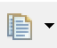  of the plugin's toolbar or the function in the context-menu to copy the depdendencies data into the clipboard. 

This icon will use the current default for the **version**-mode.

You can select that - for both copy and paste - in the preferences.

<style>
    img[alt=version-modes] {
        width: 40em;
    }
</style>

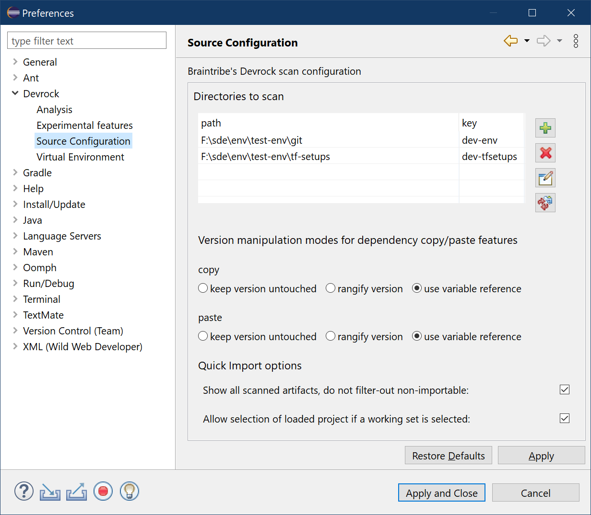

You can however always override the default by **pulling down** the toolbar icon.

<style>
    img[alt=version-modes-toolbar] {
        width: 40em;
    }
</style>


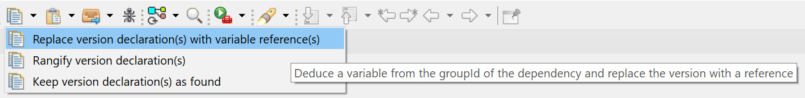

#### paste from clipoard


<style>
    img[alt=paste-from-clipboard-toolbar-icon] {
        width: 2em;
    }
</style>

In the second step, you can either open the **pom.xml** file  of the project you want to add the dependencies and use CTRL+V, or - way more comfortable - select the project in the package-explorer which you want to add the dependency to, and either use the icon 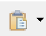 of the plugin's toolbar or the function in the context menu.


This icon will use the current default for the **version**-mode.

You can select that - for both copy and paste - in the preferences as it is shown above.

You can however always override the default by **pulling down** the toolbar icon.

<style>
    img[alt=version-modes-toolbar] {
        width: 40em;
    }
</style>


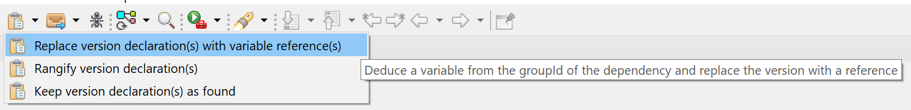

The pom of the project will be modified and instantly recompiled. If the project contains already a dependency (again the combination groupId/artifcatId is used), then the existing dependency will be updated, i.e. the version modified according the selected dependency's version and/or the current default **version**-mode.


### from the Quick Dependency Importer
If no container of a project in the package-exlorer contains the dependency reference you want - or just don't want to be bothered with looking at the content of the containers, you can use the 'quick import dependency' feature.

The quick-importer can be called by several means - up to your taste to choose your way.

Pull down the menu and select the 'quick import:

<style>
    img[alt=direct-quick-importer-menu] {
        width: 40em;
    }
</style>

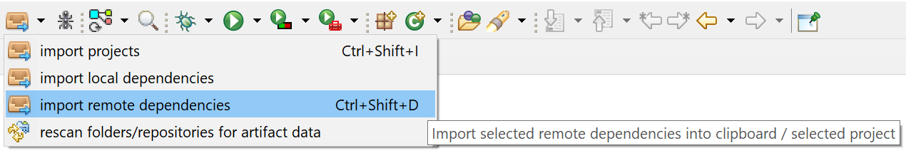

Or call up the package-explorer's context-menu and select it there :

<style>
    img[alt=quick-importer-context-menu] {
        width: 40em;
    }
</style>

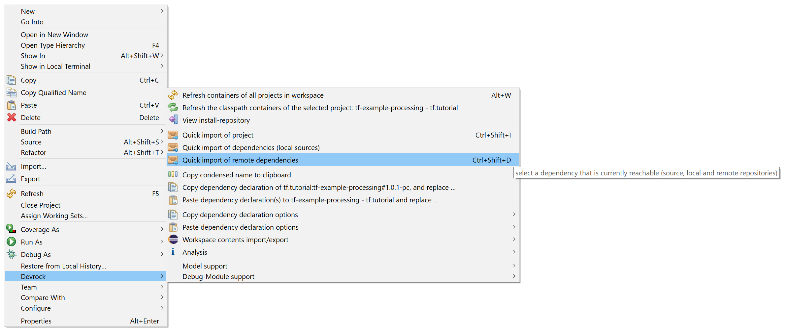

Or simply use the following shortcut, holding CTRL and SHIFT and then type D 

```
CTRL+SHIFT+D
```

All these possibilities will open the 'quick importer' dialog.

<style>
    img[alt=quick-importer-dependency-1] {
        width: 40em;
    }
</style>

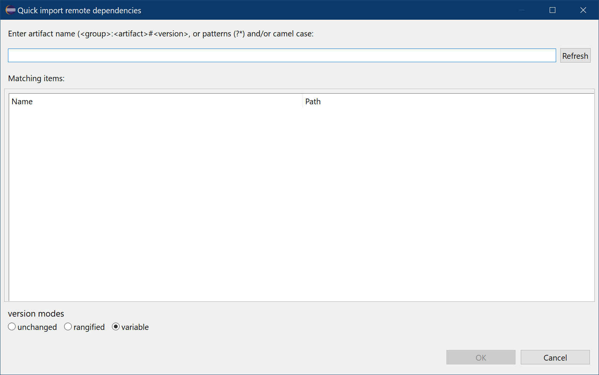

The feature will look at all possible locations of compiled artifacts (not projects, mind you), your local 'install'-repos, 'cache' and all remote repositories (provided they can reflect their content). As there might be quite a few possible matching artifacts, you can drill-down your choices by either specifying a more precise expression or use the various filtering possibilities. 


Exactly as in the 'quick importer' for projects, you type your search expression and then select what dependency you want from the result shown. 


Type in the following character into the edit field: 

```
T
```

As this starts with an uppercase character, so your expression will automatically be translated into a regular expression:

```
t.*
```

The dialog will now show all projects whose pom-files are matching the expression you entered.

<style>
    img[alt=quick-importer-dependencies-2] {
        width: 40em;
    }
</style>


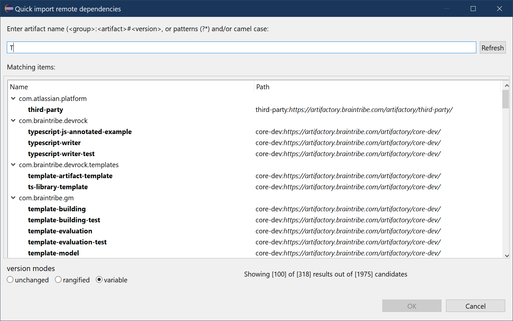


Of course, your are not restricted to search only for matching artifactIds. An artifact is identified by a combination of groupdId and artifactId (and actually also the version). 
In this dialog - the same applies to the quick-importer for projects - you can also search for groups.

The actual expression you can enter in the text field is based on the 'condensed name' of an artifact:

```
    <groupId>:<artifactId>
```

Type the following expression into the text field:

```
*.devrock:A
```


The expression now includes the groupId, and will expand to this search expression

```
*..devrock.*:A.*
```

<style>
    img[alt=quick-importer-dependency-3] {
        width: 40em;
    }
</style>

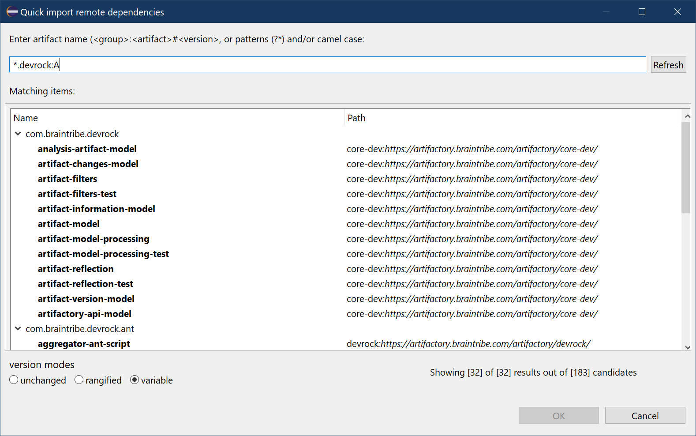

You can of course narrow it down further :

```
*.devrock.a:A
```

The expression will expand to 

```
*..devrock.a.*:A.*
```

and deliver this 

<style>
    img[alt=quick-importer-dependency-4] {
        width: 40em;
    }
</style>


Once you have selected the depedencies you want to import, you'll need to specifiy how you want hte dependency to be declared in the pom targeted. This decision also influences what you can see. 


The dialog has three modes - just as the **version**-modes explained above. They do not only define what **version**-mode is to be taken when a selected dependency is inserted, but also what is shown to be selected. 

In **variable** mode - as is standard in our codebase - only the unique groupId/artifactId combinations are shown. The insertion will use a variable derived from the groupId, and **you'll have to make sure that the variable is defined either in the pom itself or in a parent**.

So if we switch to **unchanged**, we'll see all the versions that exist for a given groupId/artifactId combination: 

<style>
    img[alt=quick-importer-dependency-5] {
        width: 40em;
    }
</style>

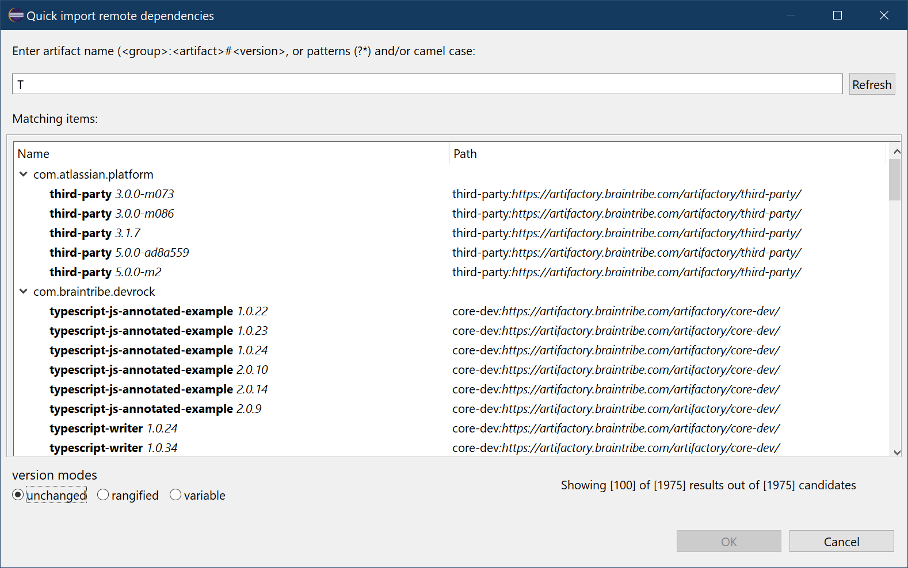

Switching to **range** will group different versions into **major/minor** ranges

<style>
    img[alt=quick-importer-dependency-6] {
        width: 40em;
    }
</style>

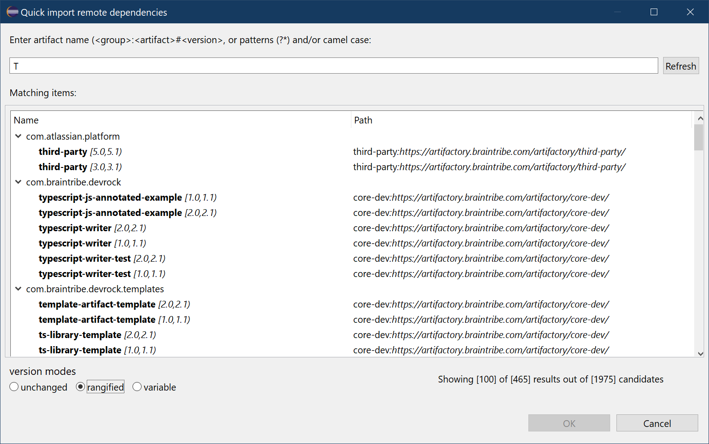


As some of these modes will drastically inflate the number of matches in the dialog, there is a limit to the number of entries. Too many entries will slow down the dialog and require you to scroll down through the results. Hence, the number of entries shown are restricted. 

<style>
    img[alt=quick-importer-dependency-7] {
        width: 40em;
    }
</style>

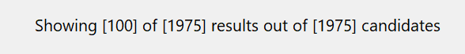

- the first number shows the currently maximal number of entries
- the second number shows what remained after the queries' filter (depends on the **version-mode**)
- the third number shows the number of 'raw matches' that were found prior to filtering by the different modes

The maximal value of entries shown can be adjusted using devrock's preferences:

<style>
    img[alt=quick-importer-dependency-8] {
        width: 40em;
    }
</style>

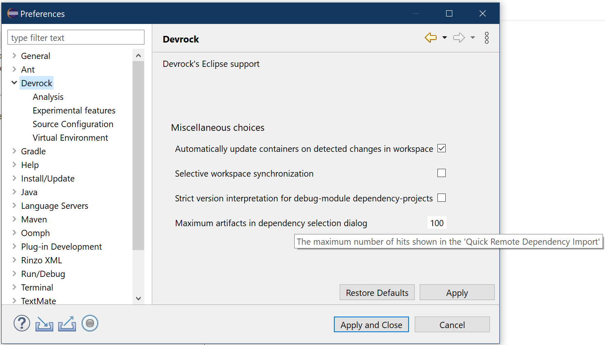


But as we sincerly advocate the use of the *variable* **version**-mode, let's switch back to this mode.

As you can see, the *variable* **version-mode** shows the least number of results, but they're still too many. We need to refine the search. 

Enter the following characters into the expression in the edit field: 

```
TE
```

As this starts with an uppercase character, so your expression will automatically be translated into a regular expression:

```
t.*-e.*
```

<style>
    img[alt=quick-importer-dependency-9] {
        width: 40em;
    }
</style>


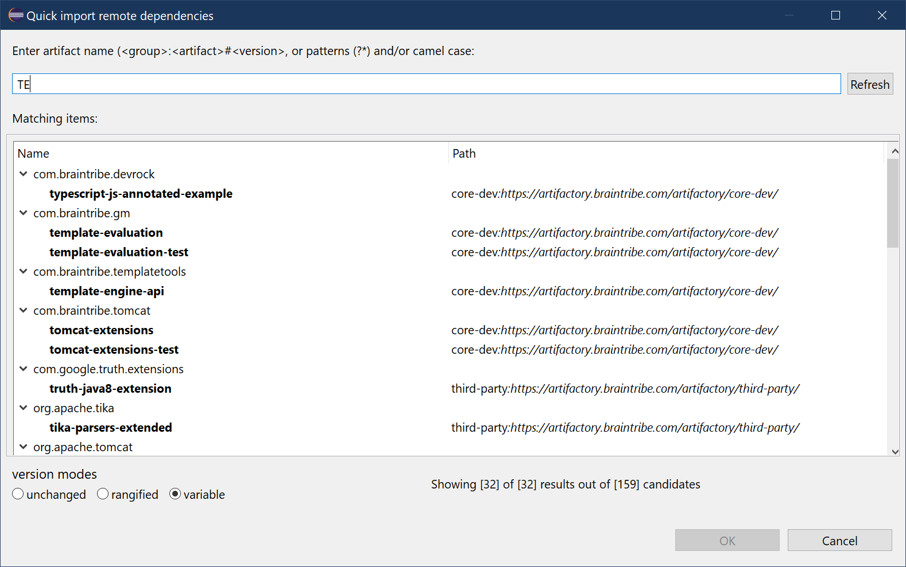


We drilled it down to 32 choices, but we can go one better: 

Add the following character into the expression in the edit field: 

```
TEx
```

As this starts with an uppercase character, so your expression will automatically be translated into a regular expression:

```
t.*-ex.*
```
<style>
    img[alt=quick-importer-dependency-10] {
        width: 40em;
    }
</style>


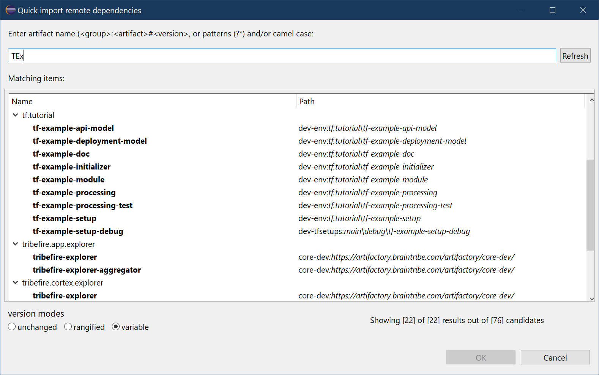

Now we can select what we want : 

```
tf.tutorial:tf-example-api-model
```

Once you press **OK**, the following happens:

- If you have a project selected in the workspace, your chosen dependency (or dependencies) are automatically added to the project.  

<style>
    img[alt=quick-importer-dependency-11] {
        width: 2em;
    }
</style>


- If you have no selection in the package-explorer, you can access the data in the clipboard with the  in the toolbar, or simply use the standard paste shortcut : CTRL+V


## read on
There are quite a few ways to influence how dependencies are handled via the [configuration](../configuration/configuration.md).

The [analysis](../analysis/analysis.md) feature can show you how the classpath is built from the dependencies 

[Zed](../zed/zed.md)'s analysis can help you make sure the dependencies of your projects are correct.