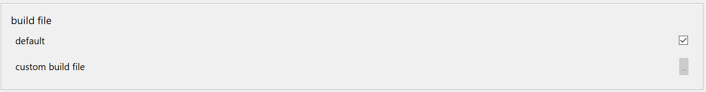

# DR Runner

DR Runner is a simple UI that triggers command-line builds while redirecting the output to Eclipse's progress-monitor and consoles.

It supports the 'range' feature that the command-line tool **dr** sports and can hence determine the build-sequence on its own. Different choices allow you to use all the features that the command-line tool exposes.

## prerequisite
You need to have the devrock-SDK installed as the feature relies on the features it brings.

## calling dr-runner

<style>
    img[alt=dr-runner] {
        width: 2em;
    }
</style>

Basically you just open the dialog by pressing on  in devrock's toolbar.


## Build terminals

If you have a selection in the package-explorer, the dialog opened will automatically be primed to the selected artifact.

<style>
    img[alt=dr-runner-dialog-1] {
        width: 40em;
    }
</style>

 

You can of course select multiple artifacts in the package-explorer and have them all added as build-terminals.


<style>
    img[alt=dr-runner-dialog-2] {
        width: 40em;
    }
</style>

 


<style>
    img[alt=dr-runner-add] {
        width: 2em;
    }
</style>

You can always add new build-terminals by clicking on 


<style>
    img[alt=dr-runner-remove] {
        width: 2em;
    }
</style>

And - inversely - you can always remove the added build-terminals by clicking on 

## build file 

In our codebase, we have only a few archetypical artifact kinds, each with an associated standard build file. So the DR runner can actually just call this associated file and rely on the standard to produce an acceptable build.

However, there are a few isolated cases, where a specific build file is used (even if we're hell-bent on avoiding that).

<style>
    img[alt=dr-runner-dialog-buildfile] {
        width: 40em;
    }
</style>

 

 So in this case, you can specify a specific build-file to be used. 
 
	> the file specified will be linked to the artifact's name and will show up as proposition when you want to build this project again at a later stage. 

## mode
The command-line tool can be influenced by several switches. When using the command-line, some of this switches are automatically set depending on the current directory. In Eclipse's case, this mechanism doesn't work alike.

Hence, you need to specify the modes in the dialog.

<style>
    img[alt=dr-runner-dialog-modes] {
        width: 40em;
    }
</style>

 

- transitive

   This means all prerequiste artifacts are built in the correct order *before* the build-terminal is built. Both what needs to be built and in what order is determined by *dr* itself. 
    
   Obivously, only artifacts with accessible sources are built - hence, the pool of source-repositories (or directories) must be specified

 - group-wide   

   This switch sets the pool to be linked to the group that the build-terminal is part of. In the examples on this page, it would be the group 'tf.tutorial', and the root of the build process would be 

  ```
     <sdk>/<env>/git/tf-tutorial
   ```
    
- codebase-wide

   This switch sets to pool to be linked with a parent directory above the group - and hence opens the pool to *all* currently checked-out sources in your dev-env.
   
```
<sdk>/<env>/git
```

- skip at position

   In some cases, you'll find a build-error. And if it was a big build - a codebase-wide build for instance - quite a number of artifacts might already be built once the building reaches an issue. You'll find the number of the build-step in the output of the build-process.

   You can now - after you fixed the issue - restart the very same build, but only really start build at the point where the last build failed.

   Simply enter the build-number and the build will only start processing the build-steps after this number.

## load after build 

You can specify whether the projects built are to be loaded into the workspace after the build. 

> Obviously this makes only sense if your selected build-terminal hasn't be specified using a package-explorer selection. In that case, the dialog won't even try to import it into the workspace.

## refresh after build

You can specify whether the projects built are to be refreshed. As the built process runs outside Eclipse, it will not see any changes unless you tell it to refresh the project. 

> Obviously, only projects existing in the workspace can be refreshed. 


## running the build

Once you pressed ok, you will see entries in various Eclipse view's

### progress view
You will see a progressbar showing the progress of the build-process.

### console

The output of the build process is automatically rerouted to a dedicated console in Eclipse

<style>
    img[alt=dr-runner-dialog-console] {
        width: 40em;
    }
</style>

 


### error log
The status of the build - successful or terminated with issues - is reflected in Eclipse's error log

<style>
    img[alt=dr-runner-dialog-log] {
        width: 40em;
    }
</style>

 


