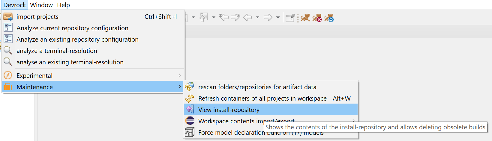
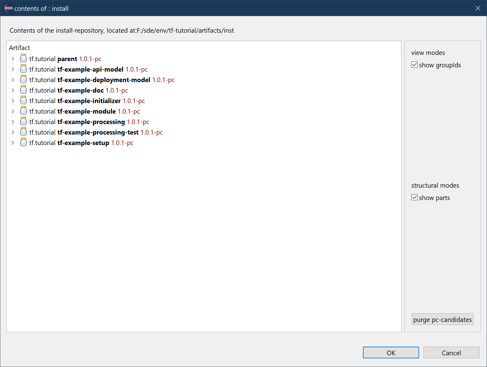
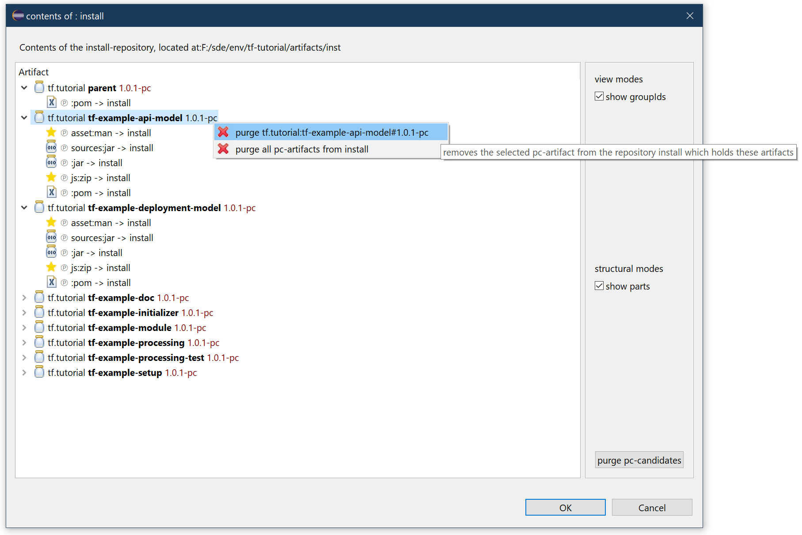
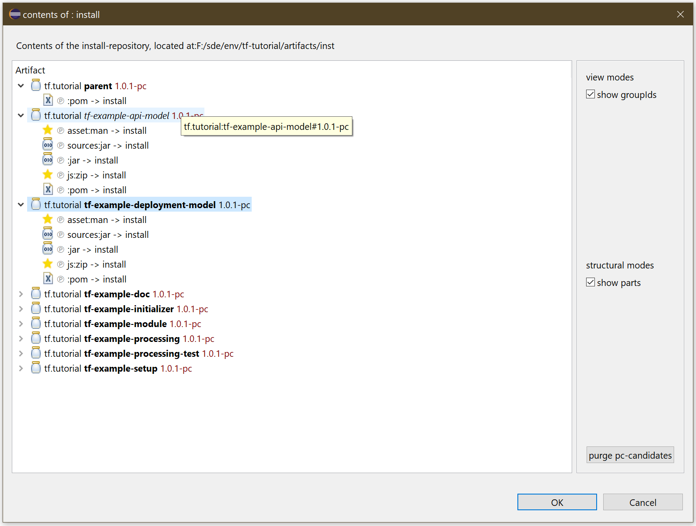
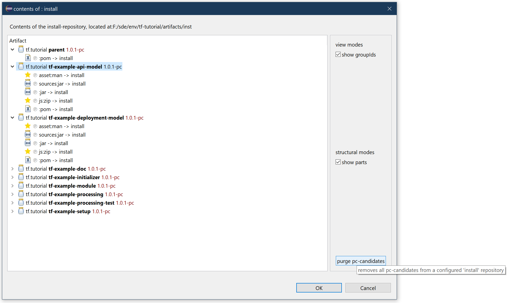

# install-repository-viewer

There are two to different types of artifacts: unfinished artifacts that are still work in progress and and published artifacts that are verified and tested. Maven has the concept of SNAPSHOT version, and we decided to use something similar, the 'publishing candidates'. 

Publishing candiate do not exist in a remote repository, as these will only contain verified artifacts. However, there are always situations where you do need a compiled artifact as you cannot always work from within Eclipse (which can work with only projects).

**Publishing candidates are compiled locally on your computer, the verified artifacts are exclusively built be the CI.**

This tutorial shows how to manage your locally built publishing candidates.

## prerequisites 

This tutorial uses the projects created in the tutorial 'create-extension'. It also requires that you run 

> dr 

in the git folder associated, i.e.

> devrock-sdk/env/tf-tutorial/git/tf.tutorial

If you have configured your setup as a 'dev-env' withhin the SDK, you do not have to configure anything, provided you followed the guidelines as presented by the SDK. 


## install repository configuration 
The preferred and recommended local setup uses two local folders for some special purposes. Contrary to Maven for instance, the setup uses a 'local repository' as **cache** for all 'remote repositories', and a specialized 'local repository' to contain locally built artifacts, the **install-repository**.

```yml
!com.braintribe.devrock.model.repository.RepositoryConfiguration {
  # the path to the cache repo
  cachePath: "${config.base}/repo",
  
  # the repo for local installation (e.g. via ant)
  installRepository: &install-repo !com.braintribe.devrock.model.repository.MavenFileSystemRepository {
    name: "install",
    rootPath: "${config.base}/inst",
    dominanceFilter: !com.braintribe.devrock.model.repository.filters.AllMatchingArtifactFilter {},
 	cachable: false,
  },
  # the remote repos
    .... 
}
```

### install-repository bias 
Sometimes, there are cases when two independent work is happening on the very same artifact. As soon as another party publishes its work, an artifact is published by the CI. Of course, this artifact is no longer a publishing-candidate and will take precedence of that artifact that you are currently working on.

That is why your locally-built publishing-candidate still needs to take precedence until you're done with working on it and are publishing your changes by means of the CI.

The **install-repository** has a *unrestrained* dominance filter attached, which means that - if it can answer to a request - no other repository is asked. The idea is that any local built artifact - a publishing candidate, i.e. something with a version like 2.0.5-pc - goes into that repository and as long as it is there, it will superseed remote versions with a higher version. 

Of course, that only works when ranges are in play. A dependency that requests a specific version will get the exact match for it - if the requested artifact doesn't exist in the install-repository it obviously is taken from the cache or a remote repository. Only if the install-repository *can* answer - for instance because it has a matching artifact that fits the requested version-range, it will be taken, and **better** (higher) matches of cache and remote are disregarded.

Consider this dependency 

```xml
<dependency> 
	<groupId>tf.tutorial</groupId>
	<artifactId>tf-example-api-model</artifactId>
	<version>${V.tf.tutorial}</version>
	<?tag asset?>
</dependency>
```

The parent declares 
```xml
<V.tf.tutorial>[1.0,1.1)</V.tf.tutorial>
```

As long as the install-repository contains an artifact with a version higher than 1.0 and lower that 1.1, it will be taken - **disregarding any other potential better matches**.

As a consequence, you will need to manage the **install-repository** once you published your work and a new release version has been issued to the artifact by the *CI*.

## install-repository viewer

You can call up the install repository viewer using the main devrock menu.

<style>
    img[alt=install-viewer-context] {
        width: 40em;
    }
</style>




The viewer will open and show you all artifacts that are stored in the install-repository. 

<style>
    img[alt=install-repository-viewer-1] {
        width: 40em;
    }
</style>



The viewer itself shows reduced view-related features as the standard [analysis-viewer](../analysis/analysis-viewer.md) has, so you can modify what you want to see and how you want to see it. 

Currently, you can toggle the following modes:

- show groupIds

    if activated, the groupdId of the artifacts is shown. Default is only to show the artifactId.

- show parts

    if activated, the parts (files associated with the artifact) as found in the 'install'-repository are shown. Well-known parts have their proper icons. 

You can now either remove the complete contents of the winstall-repository in one click, or select one or more artifacts and use the context-menu to remove them.

You can select any of these **locally built release candidates** - actually, any artifact that exists in the install-repository regardless of its version.

<style>
    img[alt=install-repository-viewer-2] {
        width: 40em;
    }
</style>



Removed artifacts are still shown in the viewer, but they are displayed differently.

<style>
    img[alt=install-repository-viewer-3] {
        width: 40em;
    }
</style>



You can also purge all locally installed artifacts via the button in the lower right.

<style>
    img[alt=install-repository-viewer-4] {
        width: 40em;
    }
</style>




Once you close the dialog, all containers will update their data, so that they automatically now use the highest version of requested artifacts. 

> Note that - at least on Windows - the artifacts can only be completed deleted if they are not referenced by Eclipse (or any other process). The delete-action actually understands that and will remember what it was able to delete and what not. When Eclipse is restarted, it will remove all data it wasn't able to delete. Still, neither the build-system nor Eclipse will see the remains of the artifacts that haven't been deleted yet (jars it is).


## Read on 

The [repository-configuration](../repository-configuration/repository-viewer.md) can give you more information about the 'install-repository'.

