# access to the plugin suite's features 

Devrock's offering for Eclipse consists of a few plugins. These plugins either expose their features by means of a toolbar or a context (right mouse button) menu in the package-explorer. 

## toolbar 

The toolbar appears amongst Eclipse's standard toolbar. You can change the location (and the visibility) using standard Eclipse means.

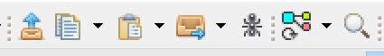

Some of the features of the toolbar have different options that you can select by clicking on the 'down arrow'. Clicking on the icon itself will select the standard option of the respective feature.

### jar import

 allows the import of the project attached to the selected jar-reference in the package-explorer 

### copy dependency to clipboard

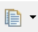 allows to copy the artifact-identification to the clipboard. The feature will apply the currently configured standard for the representation of the version. 

The toolbar entry however can be pulled down, and the requested version-manipulation mode selected. 

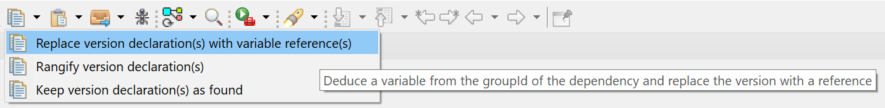

### paste from clipboard

 allows to copy the previously added content of the clipboard to the selected target, again using the currently configured mode of handling the version.

As in the case of the 'copy to clipboard' feature, the entry can be pulled down and the version-manipulation mode directly selected. 

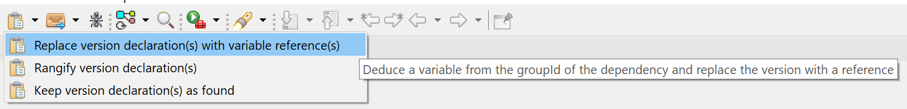

### quick import

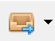 allows to [quick-import feature](../projects/projects.md) that can import projects or attach dependencies to an existing project. 

You can not only import projects in the workspace, but actually specify dependencies to be inserted in the selected projects or copied to the clipboard.

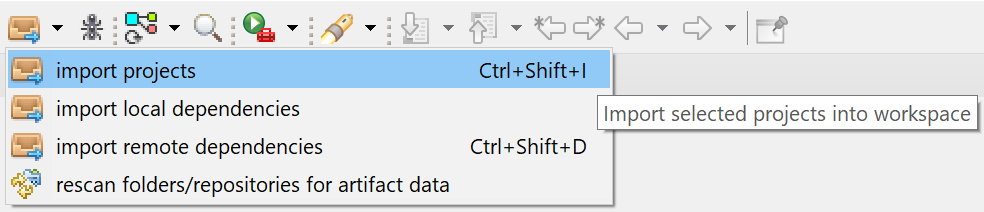

### dr runner 

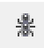 allows to start builds on the selected artifacts. 

### container features

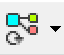 allows to synchronize the dynamic containers attached to projects.

The entry also has several options, and pulling the entry down will show them:

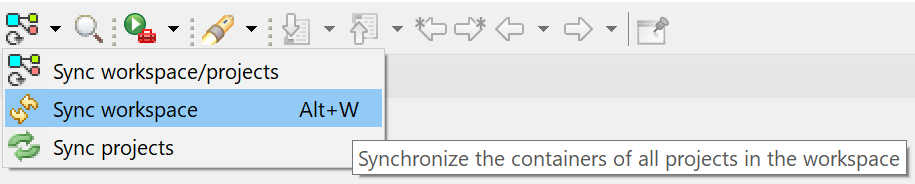

### analysis

 allows to analyze a container's content.

## devrock menu
The devrock menu - located in Eclipse's menu bar - gives access to the various features that are not related to a selection in the package-explorer.

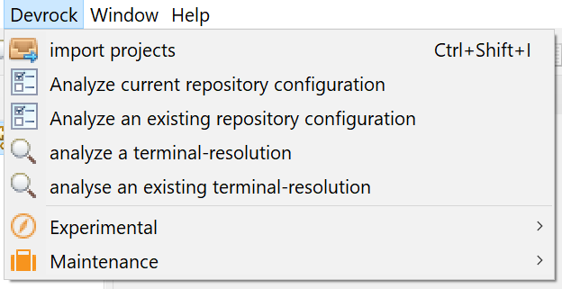

- import projects 

    Calls the [quick-import feature](../projects/projects.md), as the toolbar icon  does.

- Analyze current repository configuration

    Calls the [repository-configuration viewer](../repository-configuration/repository-viewer.md) to show the currently active configuration that the plugins work with.

- Analyze an existing repository configuration

    Allows you to select an existing repository-configuration and then uses the [repository-configuration viewer](../repository-configuration/repository-viewer.md) to show its content (and state).

- Analyze a terminal resolution
    
    Allows you select a terminal to run a resolution with for [analysis purposes](../analysis/analysis.md).

- Analyze an existing terminal resolution
    
    Allows you the select a persisted resolution and have it shown using the [analyis-resolution viewer](../analysis/analysis-viewer.md)

### submenus

Structured as less prominent features are two submenus.

The experimental submenu contains features that are - while not in state deemed to be complete - already useful in its current state. 

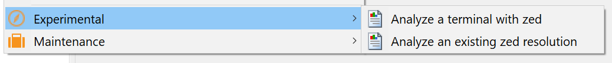

- Analyze a terminal with *zed*

    Allows you to select a terminal to run a [zed analysis](../zed/zed.md) upon.

- Analyze an existing *zed* resolution
    
    Allows you to select an existing [zed analysis](../zed/zed.md) and have it shown.

The maintenance submenu contains several features used to keep your workspace nice and tidy.

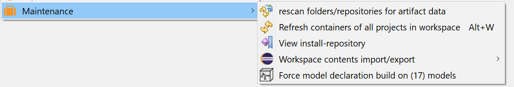

- Rescan folders/repositories for artifact data 

    Looks up the configured source directories and the declared remote repositories and builds an index of the found projects/artifacts to support the work with [projects](../projects/projects.md) and [dependencies](../dependencies/dependencies.md).

- Refresh containers of all projects in the workspace
    
    Refreshes all containers in the workspace, just as the toolbar icon  does.

- View install-repository

    Calls the [install-repository viewer](../install-repository/install-repository.md).

- Workspace contents import/export

    Allows access to import / export features of logical workspace content. Ideal to transfer workspace content between different Eclipse versions or different computers altogether - standard Eclipse workspaces are not portable as they are a) stored in binary form and b) use absolute paths to the containing projects.

- Model/Debug-module builder features

    Here the different features of others plugins show up. Currently, there are two (if legacy MJ counts, three) plugins that are contributing features to it. 

    - Model builder

        A builder that creates some required model-specific files that are needed for post-processing models at loadtime.

    - Debug module builder
        
        A builder that connects Jinni-created debug-module-projects with the content of the workspace.

The workspace submenu contains features that can export your current workspace's content and allows you to import such an export.

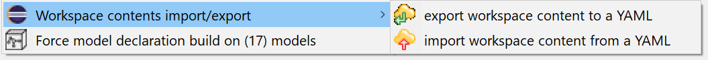

- Export workspace to a YAML

    Simply enumerates all projects and working-set of your workspace and dumps that data to a YAML file. As there is no actual location information stored and only the identification of the projects, the result is portable.

- Import a workspace from a YAML

    Loads a exported workspace content, and correlates the stored identifications with projects with the currently configured source repositories. 

## devrock context menu

If package-explorer is populated, Eclipse will show a context-menu when you issue a right-click on your mouse. 

All the features contained are automatically linked to the current selection in the workspace.

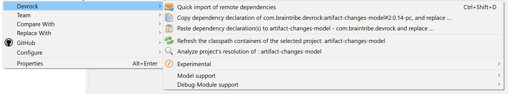

- Quick import of remote dependencies

    Calls up the [dependency quick-import](../dependencies/dependencies.md) feature.

- Copy dependency declarations of <>

    Extracts the identifications of the currently selected projects or container-entries and copies them into the clipboard, using the currently active version-manipulation mode.

- Paste dependency declarations to <>
    
    Extracts the content of the clipboard and pastes it into the selected project, again using the currently active version-manipulation mode.

- Refresh the classpath containers of the selected project : <>

    Refreshes the containers of the selected projects.

- Analyze project's resolution of : <>

    Calls up the [analysis viewer](../analysis/analysis-viewer.md) with project's container data.

- Experimental

    Opens the experimental submenu, see below

- Model support

    Opens the model-support submenu, see below

- Debug-Module support

    Opens the debug-module-support submenu, see below

### Experimental submenu

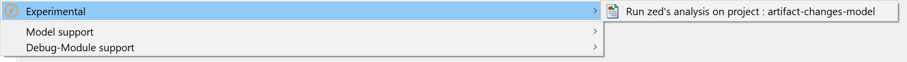

- Run zed's analysis on project : <>

    Starts an [analysis by zed](../zed/zed.md) of the currently selected *single* project.

### Model support submenu

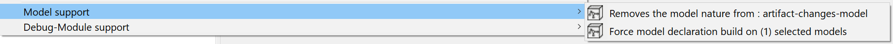

- Adds the model nature from : <>

    As the model builder is attached to a specific projects using Eclipse's 'nature scheme', a model-project is only handled by the builder if it has the respective 'nature' attached. 
    Adding the nature actually simply means that the builder is to act on this project if a build is requested.

- Removes the model nature from : <>

    As the model builder is attached to a specific projects using Eclipse's 'nature scheme', a model-project is only handled by the builder if it has the respective 'nature' attached. 
    Removing the nature simply means that the builder will henceforth ignore the project when a build is requested.

- Force model declaration build on (<>) selected models

    Basically, the builder is *always* activated when Eclipse builds a project with the respective nature attached.
    Still, in some rare cases, it's quite nice to be able to trigger that step directly without Eclipse's mechanism. 

 ### Debug-module support submenu

 

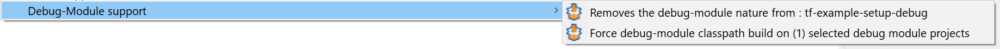

- Add the debug-module nature to : <>

    As the debug-module builder is attached to a specific projects using Eclipse's 'nature scheme', a debug-module-project is only handled by the builder if it has the respective 'nature' attached. 
    Adding the nature actually simply means that the builder is to act on this project if a build is requested.

- Remove the debug-module nature from : <>

    As the debug-module builder is attached to a specific projects using Eclipse's 'nature scheme', a model-project is only handled by the builder if it has the respective 'nature' attached. 
    Removing the nature simply means that the builder will henceforth ignore the project when a build is requested.

- Force debug-module classpath build on (<>) selected debug-module projects.

    Basically, the builder is *always* activated when Eclipse builds a project with the respective nature attached.
    Still, in some rare cases, it's quite nice to be able to trigger that step directly without Eclipse's mechanism. 

