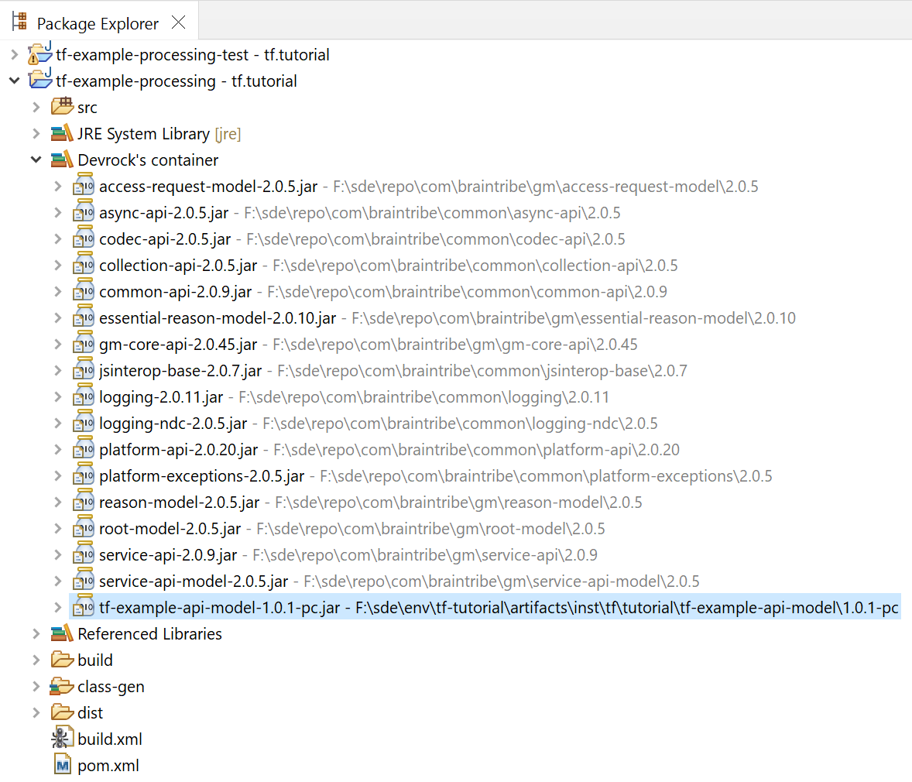

# working with projects

## creating projects
While it is of course possible to create valid projects for the platform directly with Eclipse, it is highly recommended to use the various jinni commands to achieve that. Other than specific projects such a 'Eclipse plugin', 'Eclipse feature', 'Eclipse update site' projects which aren't supported by jinni, all other kinds of projects are supported. See 'jinni help' for a list of available templates.


## prerequisites 
This tutorial uses the projects created in the tutorial 'create-extension'. 

If you have configured your setup as a 'dev-env' withhin the SDK, you do not have to configure anything, provided you followed the guidelines as presented by the SDK. 

If you haven't configured the path to your sources yet (standard would be folders called 'git' or 'tf-setups' respectively), you can use the Devrock Plugin's preferences to do so.


<style>
    img[alt=source-setup-preferences] {
        width: 40em;
    }
</style>


Open 'preferences->devrock->source configuration' and add your additional source directory, either the folder where the 'create-extension' tutorials reside or better the common parent folder of all your sources.


## using the 'quick importer'
The quick-importer can be called by several means - up to your taste to choose your way.

<style>
    img[alt=quickimporter-toolbar-icon] {
        width: 2em;
    }
</style>


Click on the  to access the project import feature.

Or pull down the menu and select the 'quick import':

<style>
    img[alt=quick-importer-toolbar-menu] {
        width: 40em;
    }
</style>


Or call up the package-explorer's context-menu and select it there :

<style>
    img[alt=quick-importer-context-menu] {
        width: 40em;
    }
</style>


Or simply use the following shortcut, holding CTRL and SHIFT and then type I 

```
CTRL+SHIFT+I
```

All these possibilites will open the 'quick importer' dialog.

<style>
    img[alt=quick-importer-dialog-1] {
        width: 40em;
    }
</style>


Type in the following character into the edit field: 

```
T
```

As this starts with an uppercase character, so your expression will automatically be translated into a regular expression:

```
t.*
```

The dialog will now show all projects whose declaration in their respective pom-file are matching the expression you entered.

<style>
    img[alt=quick-importer-dialog-2] {
        width: 40em;
    }
</style>


You can select the artifact you want to import into your workspace from the result shown. If you see too many results, just keep typing.

```
TE
```

Again, this is treated as a regular expression 

```
t.*-e.*
```

Everytime you type a character into the edit field, a query is executed and the result shown, so now you'll see 

<style>
    img[alt=quick-importer-dialog-3] {
        width: 40em;
    }
</style>


We correct the expression quickly to 

```
TEP
```
Which translates to 

```
t.*-e.*-p.*
```

And we'll see now 

<style>
    img[alt=quick-importer-dialog-4] {
        width: 40em;
    }
</style>


Selecting the project to import can be done in several ways:

- double click on an entry will automatically load the project
- left click the entries to select and then press OK will load all selected entries
- using the keyboard:

    CURSOR-DOWN to leave the edit field, then CURSOR-DOWN/CURSOR-UP to cycle through the result list and then ENTER to load the entry that has the current focus.


Select now both

```
tf-example-processing
tf-example-processing-test
```

and click on *Ok* to import the projects into the workspace.

Once you have your project in the workspace, notice the 'Devrock's container' as a direct child of your project. The container is a 'dynamic classpath container' that contains all references the artifact makes, be it to a 'jar' or to another project in the workspace. 

Select the tf-processing-test project in the workspace, and expand the node 'Devrock's container'.

<style>
    img[alt=project-container] {
        width: 40em;
    }
</style>

 


Let's import a third artifact, this time using another expression type.

This time, start with a lowercase character, which turns your expression into a different search pattern.

```
api
```

Which translates to 

```
.*api.*
```
<style>
    img[alt=quick-importer-dialog-5] {
        width: 40em;
    }
</style>


after importing, you'll see that the container of the first project now shows a reference to the project - right at the end of the list. 

<style>
    img[alt=quick-importer-dialog-6] {
        width: 40em;
    }
</style>


 


## using the contex-menu and the package-explorer
There is a second, simple way to import projects into the workspace, starting out from the container.

If you want to play through this part, remove the project 'tf-example-api-model' from the workspace.

Go to package-explorer, select the project and call up the context-menu:

<style>
    img[alt=delete-project-1] {
        width: 30em;
    }
</style>


 

Select 'delete' and then confirm the following dialog : 

<style>
    img[alt=delete-project-2] {
        width: 40em;
    }
</style>

 

> Note that you *do not* delete the contents on disk. Deletion in this context actually simply means *removal of the project from the workspace*. Only if you tick the 'Delete project contents on disk', something is actually deleted. 

As soon as you press 'OK', the containers will react to the removal and will automatically revert the project-references back to the jar-references.

So, we can import 'tf-example-api-model' again - this time using the 'jar importer' feature.

Open the container of the project 'tf-example-processing' and select the reference to 'tf-example-api-model'.

<style>
    img[alt=import-project-1] {
        width: 40em;
    }
</style>

 

<style>
    img[alt=import-jar-project-icon] {
        width: 2em;
    }
</style>

While keeping the jar-reference selected, click on the jar-import icon . 

Alternatively, you can also use the package-explorer's context-menu :

<style>
    img[alt=import-jar-project-context] {
        width: 40em;
    }
</style>


As with the quick-importer, you can select multiple jar-references to be imported as projects. 

> Obviously, you can only import jar-references that a backed-up with a project in the configured source-repositories. The command automatically filter-out references that have on corresponding projects available.


## read more

There are quite a few ways to influence how dependencies are used in a project via the [configuration](../configuration/configuration.md).

The [analysis](../analysis/analysis.md) feature can show you how the classpath is made-up from the dependencies of your project

[Zed](../zed/zed.md)'s analysis can help you make sure the dependencies of your project are correct.

The [dr-runner](../dr-runner/dr-runner.md) can build your project from within Eclipse