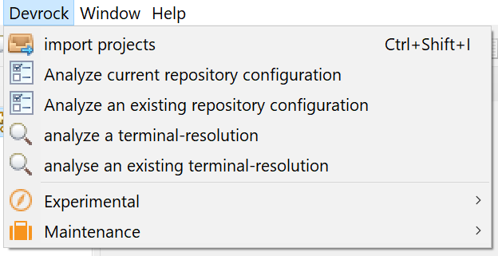
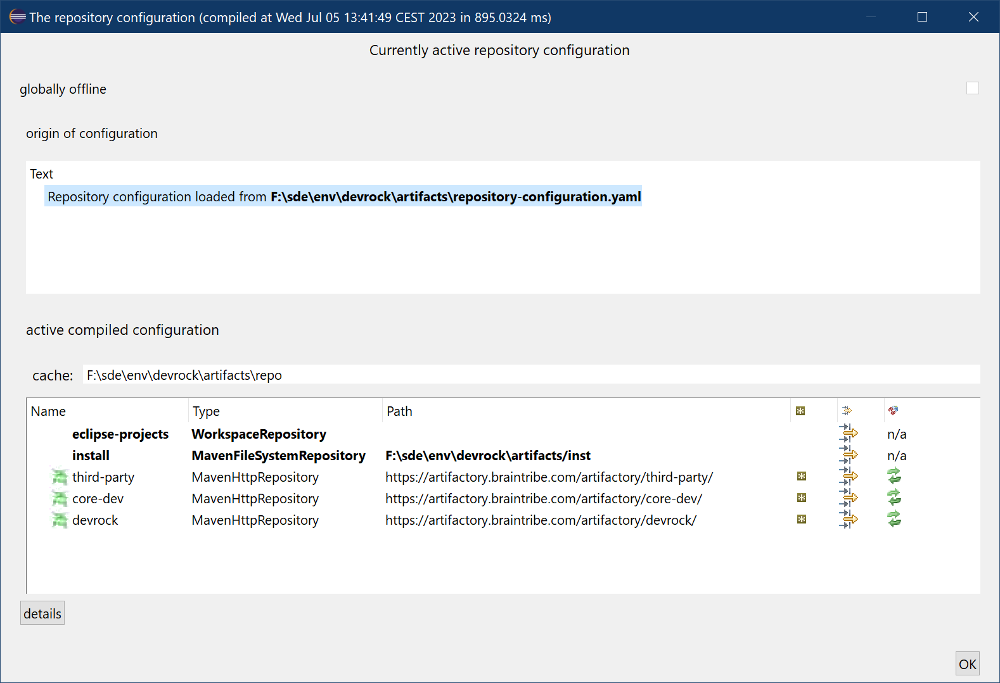
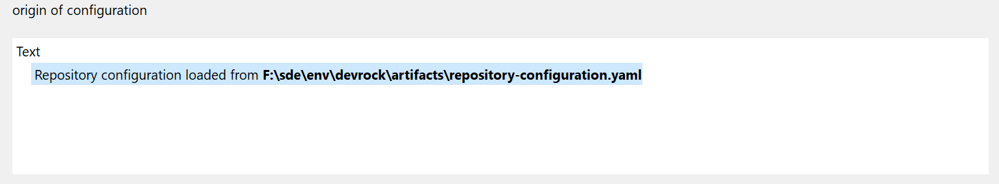
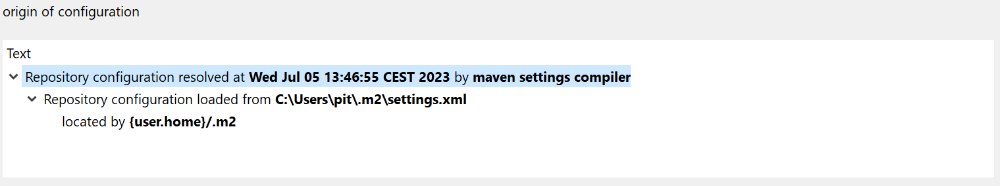
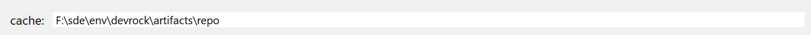
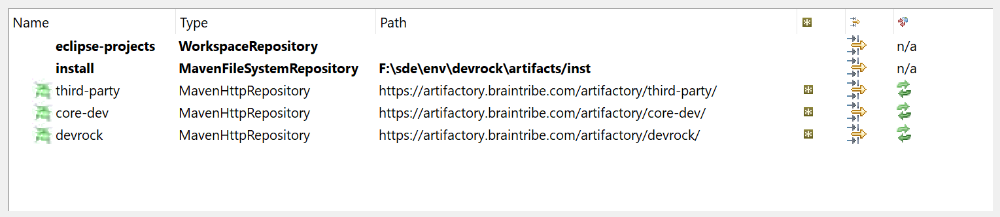
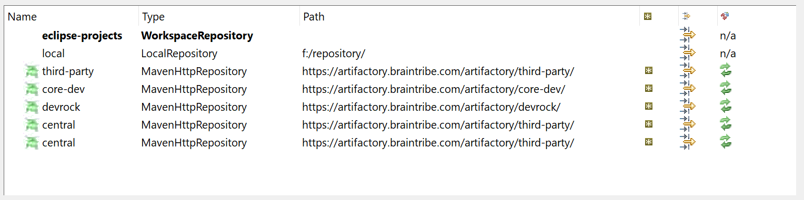

# repository viewer

While working with Eclipse in an dev-env environment, the configuration takes form of specific model, the repository-configuration. 

One of the main characteristics of such a repository-configuration is that it is dynamically enhanced, i.e. the full features and state of the configuration is not fixed in the formal declaration of the configuration, but enriched while it is compiled. 

The plugins will always recompile the configuration when needed, but use a caching-logic to minimize the effort and subsequence time-loss.

Basically, it just means that there needs to be a way to view the currently active repository configuration.

Hence the 'repository-configuration'-viewer.

## calling the viewer

The respective features are available via devrock's main menu, situated in Eclipse's standard menu-bar.

There are two ways to select the configuration to view :

- select the currently configured repository-configuration

    This access the repository-configuration that has been configured for your dev-env.

- select an existing repository-configuration

    This allows you to select any repository-configuration file and show its content.

## the viewer

### orgination

The orgination part shows where the repository was found and what agent (if any) has produced the configuration. 

In this example, it's simply found by the 'dev-env' lookup procedure. 

Alternatively, if you chose **not** to work with the *devrock-SDK* and still use a standard maven setup, it may look differently: 

The maven example shows more of the origination feature : Not only is the agent shown (the maven settings compiler) and the location of the file, but also the way it was found. 

> If two maven settings.xml are used - the user- and the installation-specific one - both are shown.

### cache
If your setup is based on the devrock-SDK, you will see an entry named **cache**. The cache - aptly named - is only used to cache the files of remote artifacts. 

>It is not to be confused with maven's 'local repository' which is a mongrel of both **cache** and **local installation repository**. See more in the discussion of the rendering of maven-style setups below.

In case of a 'devrock-SDK' based setup, the path to the cache is shown.

### repositories 

Finally the repositories that make up the libraries used to look-up dependencies are listed. If the repository-configuration has been enriched (compiled,processed) by the plugins, some additional entries are added that wouldn't see if it has been enriched for a command-line build system.

> The examples shown here are configurations processed to be used in the plugins. All are based on the same set of repositories that are used in the very most cases. As we do not use any SNAPSHOT logic, the repositories are only configured to deliver release versions.

A configuration based on the 'devrock-SDK' (the most modern and strongly proposed way) will look like this: 

The order of the repositories - the sequence in which they appear from top to bottom - follows their actual order of precedence. In this case, the repository 'eclipse-projects' will come first, the 'install', finally 'third-party', 'core-dev' and 'devrock'.

> Remember, the three repositories 'third-party', 'core-dev' and 'devrock' are specific to the setup 'yours truly' runs, where as 'eclipse-projects' is due to the fact that it's a configuration enriched to be used in Eclipse, and 'install' because it was configured to use a repository for local installs and a separate cache. 

A configuration based on the maven settings.xml - which is still supported, but considered to be less valuable that the new way - looks differently. 

Note that the 'install' repository is missing, and two 'central' repositories are added. 

'install' is missing, because in the maven setup, there is only a 'local' repository, and no split between cache and 'install'-repository has taken place. 

>Additionally, the two 'central' repository are added as these two **special repositories** are hardwired into maven, and any build-process (or even artifact) can reference them. As being hardwired, they cannot be turned off. 

>As we do not want to have any unintended access to repositories outside of the remote repositories *we* control, the 'maven settings compiler' will inject them as mirrors to the 'third-party' repository. This of course is only happening if the settings.xml doesn't handle the issue by itself (declaring 'central' as a mirror to another repository - such as the 'third-party').

## repositories in detail

A repository has several determining settings, as they are shown from left to right:

- Name

    The name is obviously the identifier of the repository (In maven, it's the ID of repository).
    Depending on the type of the repo, an associated icon is shown. For an active Artifactory, it will use  - the tooling uses some special features that Artifactory provides.

- Type

    The type of the repository - file-system or remote HTTP, internal structure, custom - is shown.

- Path

    The path is either - in case of a filesystem repository - a location in your filesystem or a URL - in case of a remote repository.

    > Note that if the repository is backed by the *Ravenhurst* servlet, the tooltip will show the addtional URL to poll for changes.

- Cached 

    Cached shows whether the content of the repository is cached, i.e. requested remote artiacts will populate the cache (or local repository in case of a maven setup).

- Backed by filter 

    This shows whether the repository is backed by a filter which helps to reduce the number of fruitless searches for artifacts that do not exist in the repository.

    > Note that filters can also introduce a dominance-filter that can override the answer of other repositories. For instance the 'install'-repository has such a filter attached: if this repository can answer, no other repository is asked - this to implement a 'bias' for locally built artifacts. 

- Update timespan

    This column shows what the update-timespan of the repository is - i.e. when is the current local index considered to be stale and needs to be pulled again.

    > Note that this is superseeded by the *Ravenhurst* servlet (exists for Archiva and Artifactory) which allows a 'push' scheme rather than Maven's standard 'pull' scheme. 

### detail information
If you select a repository entry and then click on 'details', a special dialog will open that shows the actual definition (inclusive all filters) of this repository in YAML format.

## read on

There are quite a few ways to influence how the repository-configuration is retried, see  [configuration](../configuration/configuration.md).

If your repository-configuration contains an ['install-repository'](../install-repository/install-repository.md) for local builds, it can be managed.
