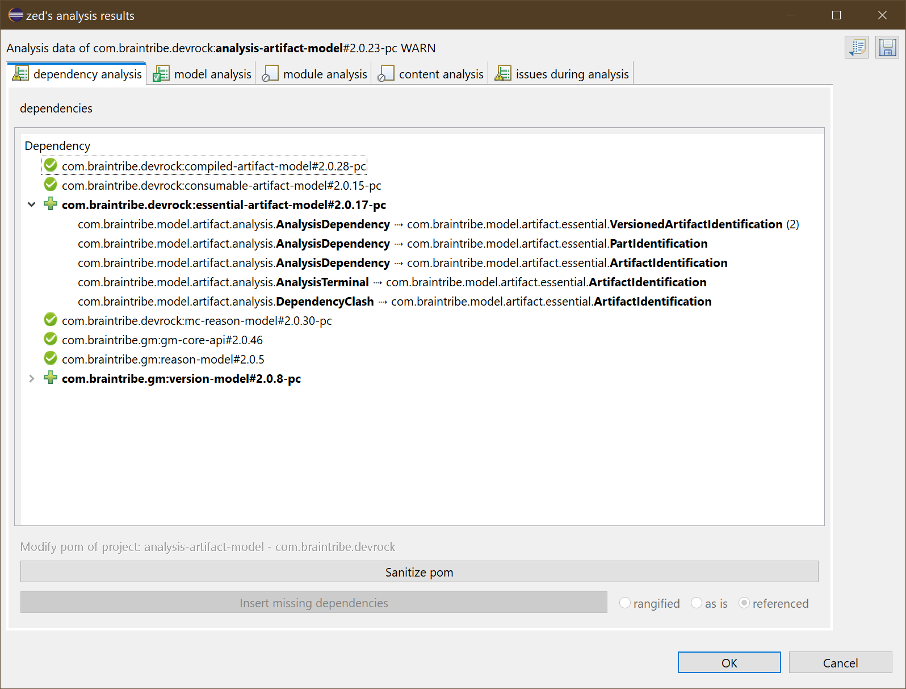
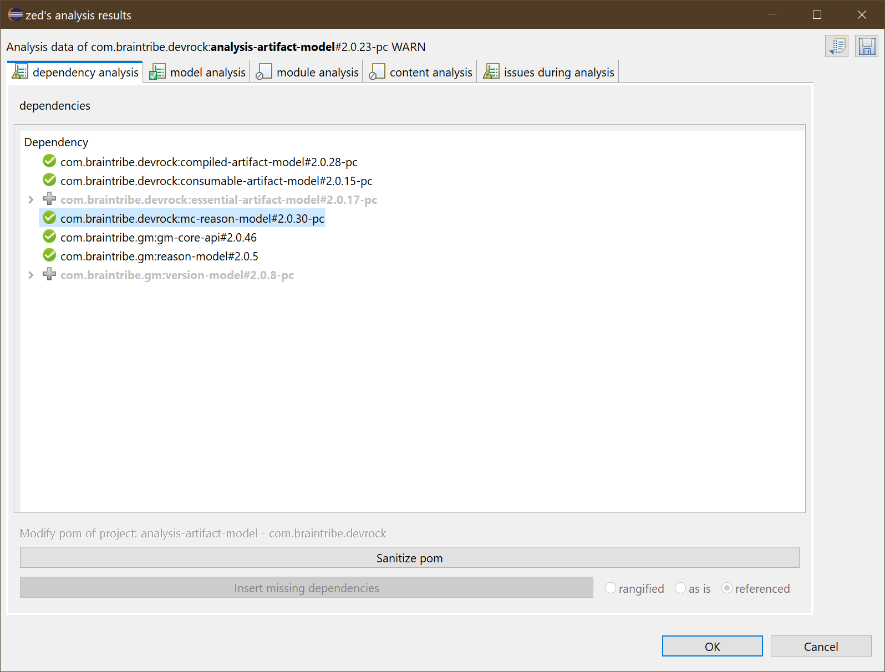

# zed viewer  
The zed-viewer itself can show several tabs. Some of them are always shown, some are only present if they do contain relevant information

<style>
    img[alt=icon] {
        width: 1.5em;
    }
</style>

To the right, above the tabs, the save button  allows you to save the currently viewed data to disk to be viewed later. 


### dependency tab
This tab is always shown. It shows the analysis done on the dependencies, declared and actually used ones. Dependencies required yet not declared can be injected into the pom - if the analysis has been run on a project (obviously it can't work on artifacts as the need to be 1. considered as stable and 2. may reside in a read-only environment and 3. their pom may not even exist).

<style>
    img[alt=dependency-tab] {
        width: 40em;
    }
</style>


The dialog shows all dependencies of the terminal: 

- if prefixed by  : this dependency has been declared and is also required. 
- if prefixed by  : this dependency has not been declared, but is required. It can be inserted into the pom (if terminal's a project)
- if prefixed by   : this dependency has been declared, it is not required, i.e. not referenced by the terminal, and could be removed
- if prefixed by   : this dependency has been correctly declared, but not actUally required. However, the reference (mostly types) is actually not located in the declared dependency, but somewhere else, and only 'forwarded' to the dependency declared (via the 'forwarDed annotation', see GenericEntity, Reason et al)

Dependencies that are required but not declared can show where the references actually appear in the terminal : 

<style>
    img[alt=dependency-tab-references] {
        width: 40em;
    }
</style>



> Please note that due to the fact zed may not be able to fully understand how external types interact with the types of the terminal - it's about generics, type-parameterization et al - it might not be able to understand all combinations and hence some references may get 'lost in analysis'. It is advisable to have a look at the issues and check the information there for relevance in this regard.

If the **terminal of the analysis is a project in your workspace**, then the missing (aka not-declared, yet required) dependencies can be inserted into the appropriate pom file and the excess can be removed from the pom. 

### actions
As stated before, two types of analysis finding can have an impact on the quality of the artifact. 

- Some dependencies are not declared in the terminal. As long as another dependency has a reference to the same dependency and it therefore appears in the classpath, Java and Eclipse are happy. However, this doesn't properly describe the terminal which may have quite some implications when it comes to branching or reverse-lookups the find relationships in the code-base. 
- Other dependencies are declared in the terminal, yet no code of the terminal actually access the dependency's content. This again has an impact on branching and reverse-lookup as it produces a superfluous relationship between the terminal and this excess dependency. 

Hence, zed will allow you to fix this issue provided the currently analyzed artifact is a project in the workspace.

#### sanitize pom
*Sanitizing* the pom means in this context simply that *any missing* dependency is automatically inserted, while *any excess* dependency is automatically removed from the pom.

While inserting, the state of the button that modify how versions are represented is respected.

> Please note that zed *may* make mistakes and while its detection of *missing* depedencies is stable, the detected of *excess* dependencies *may* be compromised. See below for more.

#### insert 

You can choose the method of insertion as in the Quick-Importer of the Devrock-Plugin: 

- insert with a range - version is replaced with a derived major/minor range 
- insert as is - the dependency will be inserted with the very same version as was determined in the analysis.
- insert with a variable standing for the version of the dependency (aka 'referenced') - will assume that you have declared somewhere a property in the form of <groupId> of dependency, prefixed with a 'V.'. 

Preconfigured will be the current default mode for the version representation which can be set in the respective preferences dialog.

```
Window -> Preferences -> Devrock -> Source Configuration
```

After the modification, the processed entries are greyed out. 

<style>
    img[alt=dependency-tab-insertion] {
        width: 40em;
    }
</style>



### module tab
The module tab list all packages required to be imported into the terminal - once Java modules are activated. 

<style>
    img[alt=module-tab] {
        width: 40em;
    }
</style>


For each package, you get to see where it needs to come from, and attached to the artifact, you see all packages that this dependency needs to expose - as the two things must be synched: only packages that are exported can be imported. 

> Please note that this tab currently is only showing the information. Other than that, it has no functionality. Eventually, however, it should be able to read the 'module-info.java' file, compare and eventually touch the file - as zed does with the dependencies and the pom file. 

### model tab
The model tab is where the model-specific analysis are shown. 

The viewer simply shows the findings, the so-called 'finger print', and attached to it, the location (aka class or interface or method or field) is attached.

<style>
    img[alt=model-tab-issue] {
        width: 40em;
    }
</style>


Each fingerprint has a **rating** and that is reflect via the icon.

-  : this has been successfully tested and is ok.
-  : this an issue, but zed is told to ignore it, so treat it as ok.
-  : again, this is an issue, and should probably have a look at it.
-  : this now is a serious issue and may produce problems when this model is used.

The dialog itself has two modes:
- it groups the findings per category
- it groups the findings per generic entity.

In the latter case, the dialog will show its content as this: 

<style>
    img[alt=model-tab-entity] {
        width: 40em;
    }
</style>


This example here shows some serious issues that can exist in a model :

<style>
    img[alt=model-tab-errors] {
        width: 40em;
    }
</style>


> Please note that the names of the enum and generic entity here are from a test artifact.. The naming is kind of confusing I must confess, but of course perfect for an automated test..

#### findings in detail

code | description | default rating 
------- | ----------- | -------------
MissingGetter | property without a matching get.. function | ERROR
MissingSetter | property without a set.. function | ERROR
TypeMismatch | setter / getter types do not match | ERROR
InvalidTypes | invalid type for a property | ERROR
NonConformMethods | unallowed methods found | ERROR
ConformMethods | allowed methods found | INFO
CollectionInCollection | collection type has collection element type | ERROR
PropertyNameLiteralMissing | property has no corresponding tag field | WARN
PropertyNameLiteralTypeMismatch | property tag has wrong type | ERROR
PropertyNameLiteralMismatch | property tag's value doesn't match property | ERROR
UnexpectedField | field found in model not related to property | INFO
ContainsNoGenericEntities | no generic entities found in a model | INFO
InvalidEntitytypeDeclaration | entity type T literal is invalid | ERROR
MissingEntitytypeDeclaration | entity type T literal is missing | ERROR
MissingDeclarationFile | no model-declaration.xml found | ERROR
MissingDeclaredDependencyDeclarations | model-declaration.xml is incomplete | ERROR
ExcessDeclaredDependencyDeclarations | model-declaration.xml declares excess types | ERROR
EnumTypeNoEnumbaseDerivation | enum does not derive from EnumBase | ERROR
EnumTypeNoTypeFunction | enum type doesn't contain required type() function | ERROR
EnumTypeNoTField | enum type T literal is missing | ERROR
MissingTypeDeclarations | model-declaration.xml does not declare all types of the model | ERROR 
ExcessTypeDeclarations | model-declaration.xml declares types that do not exist | ERROR
DeclarationFileInvalid | invalid format (xml error) | ERROR
NonCanonic | the model is not isomorph, i.e. it will lose information if transformed | INFO


>Conform / Non-Conform methods : Conform methods are methods that you can add to a model in its Java form (as Zed gets it to see) and that do not interfere with the getter/setter. For instance *default* and *static* methods are valid extensions, aka *conform* methods, as long as their names to not use the prefixes for getter/setter. Non-conform methods are all other methods that are not getter/setter.

>Non canonic : a model is canonic if it is isomorph, i.e. when it can be transposed across different valid formats, or simply said: if it survives a roundtrip via the modeler. Basically, it means that it must valid in the first place and may not contain conform methods.


### classpath tab
The classpath tab can show you whether you have any shadowing classes in the classpath, i.e. whether several resources exist with the same combination of package and name across the classpath.

If these two classes are identical, nothing is to be feared. But if they differ, then it shows big problem: only one of these classes can be loaded into the classloader, and it's not clear which class is loaded first and blocks loading of the other class. The issue might never show, but its clear as fallen snow that it'll bite exactly in the most inconvenient moment. 

The tab shows you what duplicates exist, and in what artifact they were found.

While listing the duplicate classes, zed also shows where the reference to these classes actually take place in terminal. In this example (again from a test setup), you see that zed detects type references on several different constructs. 

<style>
    img[alt=classpath-tab-example] {
        width: 40em;
    }
</style>


The picture above shows an issue where two dependencies both declare the same class, but it can of course be the terminal that declares a class that a dependency also does : 

<style>
    img[alt=classpath-tab-real] {
        width: 40em;
    }
</style>


As you can see, this real-life artifact has such a situation. Until now, it hasn't produced any issues, but still.... 

### extraction tab
The extraction tag is shown so that you can  - would you need to - cross check zed's findings with what it extracted.

It simply shows all data that zed as extracted from the artifact. 

<style>
    img[alt=extraction-tab] {
        width: 40em;
    }
</style>


> As you might have noted, zed also extracts a thing called 'body types'. As zed is intended to analyze artifact to extract their **actual dependencies** it needs to also see what types are referenced within the code of the method. Just checking the exposed parts (public methods, classes, fields) is not enough for this purpose. For other things - especially 'contract comparisons' - this level of detail is not required.

### issues tab
This tab doesn't show any analysis data, but shows the code fragements that Zed's analyzer didn't properly understand. 

It is shown as these fails may have an impact on the analysis - as Zed is tracking the usage of types (and other things) of the dependencies, it might miss one due to such a analyzing failure. 

Hopefully, the number of issues will decrease in time, but in this state, some are to be expected. 

In most cases however, the issues stem from the use of template parameters that are outside any context that zed could find. It would probably save to assume these types to be of *java.lang.Object*, but as zed is trying to find any relation between code in the terminal and code in the dependencies, it might be an issue (it could possibly lead to zed overlooking an existing relation).

So for the matter of completeness, all issues are shown here. 

<style>
    img[alt=tab-issues] {
        width: 40em;
    }
</style>


