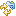

# comparing artifacts with zed 

Zed can compare two artifacts and find differences in exposed code parts, the API. Exposed in this respect simply means that they are accessible by other artifacts. We call that relationship a 'contract'. 

> The introduction of Java modules addresses the problem that in the Java world (without the use of modules) anything that is declared as public in a jar can be used by any other jar, hence introducing an untold number of relations between the two jars. Currently, zed doesn't work with Java modules (yet) and that means that its focus is on anything public, be it class, interface, method, fields, and annotations.

Basically, it's intended to be used while updating an artifact and comparing it to the last version of itself.

[Semantic versioning](https://semver.org/) requests the following rules : 

- revision : no changes whatsoever in the contract, no differences in the exposed sections of the artifact
- minor	   : contract is not allowed to be broken, but additional things maybe exposed - new functions, new fields
- major	   : everything is allowed to change, no contract needs to be respected.

While in the first two cases zed can help to enforce these rules - it could be used in a publishing/releasing step in a CD/CI - in the last case its main focus to be to generate release-notes (at least somethings may still be around, yet slightly changed)

As least some of the ideas of semantic versioning should be taken seriously as they state: 

>It is your responsibility as a professional developer to properly document software that is intended for use by others. Managing software complexity is a hugely important part of keeping a project efficient, and that’s hard to do if nobody knows how to use your software, or what methods are safe to call. In the long run, Semantic Versioning, and the insistence on a well defined public API can keep everyone and everything running smoothly.

In Eclipse, the zed-integration has now such a comparison feature. 

## calling the feature
The feature can be access via the experminental section of the 'devrock' pulldown menu.

## selecting the artifacts

In the next steps, the two artifacts to compare need to be specified, and then zed needs to run an extraction on the artifacts in order to compare them. 

The *base artifact* determines what the base for the comparison is (the source so to say) and the *other artifact" determines what the base is to be compared to (the target so to say).

There are three possible sources of such an artifact: 
        
   - a project in the workspace (actually one or more - see below), select 
   - a remote artifact accessible via the current or specified repository-configuration, select 
   - a previously generated and persisted extraction of an artifact, select  

Once both artifacts have been succesfully specified and extracted, the ok button will be accessible

### selecting a project 
If you have one currently selected project in workspace, you can assign this either the base or as the target. 

Klicking on   will immediately analyse the selected project. 

If your selection contains more than one project, you can choose which one to use of each role. In that case, clicking on   will open a little selection dialog : 

Simply select the project of your choosing. 

### selecting a remote artifact

Selecting a remote artifact for comparison uses the same principle as selecting any remote artifact in other features of the plugin.

If a selection exists in the workspace, the dialog will be parameterized with the selected project. 

You can of course modify the expression to your liking, also changing the version-expression. 

Once you are satisified, let it search for matches using the . 

> Note that the lookup will use your currently active repository-configuration. But you may specify an alternative repository configuration. 

The results will be displayed, and you can select the one of the found artifacts.

### selecting a persisted extraction

Selecting a previous built and persisted extraction is simply to select such a file. 

> Note that zed's analysis-viewer allows you to store the extraction data of the artifact viewed, so you produce such a file using this feature.

### semantic versioning 
[Sematic versioning](https://semver.org/) stipulates a few rules of how a contract may change depending on the version difference between two different versions. 

The comparison feature will analyze the versions of both artifacts and decide, based on the versions they show, what level to use. 

You can of course override this choice before you actually run the comparison.

> The semantic versioning level is only used for display purposes for now, i.e. it will determine which issues should be shown as *error*, *warning* or *no importance*. 

## viewing the result

> Note that the following screenshots are based on an example that was specially made to show found issues. Hopefully, in real life, you'll see less issues exposed.. 

The viewer will open and three main parts :

- an area where the issues are shown - on top 
- the extraction data of the base artifact - to the left
- the extraction data of the target artifact - to the right

### fingerprint area

The area lists all issues that were found during the comparison. 

You can influence how the issues are presented : 

Either the issues are listed as top elements

or the places (aka top elements of the place where the issue was found, such as classes, interfaces, enums or annotations) are shown on top-level

Currently, zed detects the following discrepancies: 

- access modifier changes (public, private, package private)
- abstract modifier changes
- static modifier changes 
- field type changes
- missing/surplus fields
- annotation changes 
- missing/surplus methods 
- changes in exceptions of methods

> Note that the name of a method is not unique. Hence, zed will not detect changes in methods when their 'desc' has changed as only this token represents a unique identifier. This might be remedied somewhat in further versions of zed, but for now, changes in a method that alters the 'desc' will lead to a 'missing method'/'surplus method' combination.

In some cases (if applicable), the issues will show both the content of the 'base' and the content of the 'other' artifact.

Selecting an entry in the fingerprint tab will automatically open and select the respective nodes in the extraction tabs.

As the selection in the comparison area is part of the 'base' artifact, its position in the extraction data of this artifact is opened and highlighted. 

The selection of the 'missing methods' issue in the original is shown by highlighting the missing methods in the base artifact and showing the methods available in the other artifact.

In case of 'surplus' issues, i.e. things added to the artifact, the location is shown as in this example : 

If it's a single, directly attributable issue - as here with a 'static' modifier missing, the location of the issue is shown in both extractions. 

