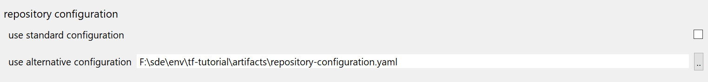

# zed

Zed (short for Zarathud) is an analysis tool that works on Java binaries. 

Extensive documentation can be found in its proper documentation, and this part here focus on the integration into Eclipse only.

Zed has several uses - analyzing dependencies, classes in the classpath, modeled generic-enties - and some are included in Eclipse to help maintain a clean codebase (even if it acts on binaries...)

At the time being, two feature-sets have active impact and have their UI in Eclipse :

- dependency analysis

    Extracts the **actual** dependencies of a terminal and compares them with the **declared** dependencies of the terminal.

- classpath analysis

    Extracts all required classes contained in the **actual** classpath and scans for **duplicates** in the classpaths 

- model analysis 

    Detects GenericEntity declarations and checks them for completeness, conformity and clean declaration.

- module analysis

    Detects all requirements for Java module declarations, definitive for the imports, but also incremental data for the dependencies involved.

    > Note this is only a display of the information - other than that, there's no support for Java modules yet. Eventually, zed should help setting up the information required by the Java modules. 

# running a zed analysis

There are several ways to analyze an artifact. As zed can read binary files, its not restricted to artifacts with available sources. 

## analysis of a project

Running the analysis on a project is straight forward: you simply select an open and accessible project. The analysis will run on Eclipse's output folder (rather than the JAR) and will also use the output folders of any project in the workspace matching a dependency of the terminal project, while using the jar for all artifacts not backed by projects in the workspace.

If you want to run an analysis on a project, select it in the package-explorer and then open devrock's context menu :

## analysis of an external artifact

Running the analysis of an external artifact is more complicated as it requires the selection (and subsequent resolution) of the terminal. 

### selecting the terminal

You can only select an existing artifact, i.e. differing from AC's dependency analysis, you cannot start with one (or more) dependencies, but you need to select a single, existing artifact. However, where that artifact and its dependencies reside is up to you. 

If you had a project selected in the workspace, it will automatically appear as possible terminal. 

> Please not that in this case, the analysis is *not* run on the project in the workspace, but on the artifact in the repositories. If no such artifact exists (for instance a PC version that has never been locally built (installed) yet, the command will fail.

You can enter a qualified dependency in the pertinent editor field. Group Id and artifact Id suffice, you can then use the 'normalize' button  to the right to create a range for the dependency using the following logic:

	<groupId>:<artifactId> -> a fully open range is created : [,]
	<groupId>:<artifactId>#1 -> a range based on the major is created : [1,2)
	<groupId>:<artifactId>#1.0 -> a range based major/minor is created : [1.0,1.1)
	

In the next step, you can resolve the dependency using the 'scan/update' button , i.e. let mc find out what versions exist in the specified range. 

> Please note that you do not have to use the auto-rangify feature, but you need to resolve the dependency as the analysis can only run on a specified artifact and not on a depedency.

### selecting the repository-configuration
As a matter of convenience, you can use the currently active repository-configuration (the one that the Devrock offering in Eclipse currently uses). In some cases however, the artifact you want to analyze may not be completely accessible with you current configuration. 

In that case, you can select a different repository-configuration to be used during the analysis (as in AC's dependency analysis). The file is expected to be in the YAML format (Maven style setting.xml are not supported here). The configuration will be used during the analysis and will not influence any other Devrock features. 

The dialog also remembers whether you chose to use an external configuration and which one it is. 

## viewing of a previously stored analysis

As the analysis viewer has a feature to write all relevant data to disk, you can select such a persisted data set and view it again. 

Pressing **OK** will run zed on the selected artifact and open the [zed viewer](./zed-viewer.md) with the extracted data and analysis data.

