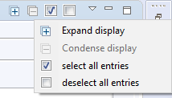

# Devrock's Greyface 


Greyface is an attempt to import artifacts in a controlled manner from remote maven-compatible repositories. It can trawl remote repositories for the desired artifacts and upload them (plus eventual dependencies) to a target remote repository.

As an excuse for an introduction why Greyface exists in the first place, let me cite myself : 

---
One issue is that Maven repositories typically do not store all artifacts, but are linked to proxy repositories. So if a repository doesn't find a specified artifact, it in turn asks the repositories it is linked to. Some (the Maven people) say that is a boon, some others (the Ivy people) say that this is a disadvantage.  Dirk and I agree with the Ivy guys (treat yourself to their concise notes about running a closed enterprise repository on their project's website, here at [ivy's best practices](http://ant.apache.org/ivy/history/latest-milestone/bestpractices.html), and we believe that our remote repository should contain everything we need and should not import what others think is needed.

The other issue is that Maven repositories are based on the assumption that you invariantly know what you're needing, and that you are never interested in what is actually available. This is exactly contrary to our approach. Even if Maven supports version ranges (i.e. an open or closed interval of versions), the repositories are not made to deal with it.

We want to use version ranges to deal with hot-fixes - we don't want to adapt our dependencies just because a simple hot-fix of an artifact has come available, but we still want to have the hot-fix identifiable by a distinct version. So we're interested in what is available in the repository.

In the remote repository, we can access that through the meta-data file, but this file is not updated reliably enough. On a proxied repository, this is not possible at all (unless nothing whatsoever exists in the remote repository - then we get the data from the first proxy that has some information).

So what we are planning to do is to cut-off our repository from the proxies and instead have a controlled import process that is run when we need an external artifact. The artifact - and its dependencies - is then imported into our repository and is forthwith available for our builds.

This process is currently in the works (none of the repositories we know of implement that out of the box), but will take some time to be properly done.

Now that time has come and Greyface is here. It has been tested with the following products: Archiva, Artifactory as upload targets, and Sonatype, Archiva, Artifactory, whatever Maven-Central runs as download sources. So if you know of any other Maven-compatible mess, let me know. 

Greyface's UI is integrated into Eclipse (that may not remain that way, as a servlet based version was envisaged as well, but for now, Eclipse will do. Furthermore, you’re mostly in Eclipse when you realise that a blery artifact's missing).

It uses plain http protocol to query the repositories, to download and upload the files. In our case, the repository is not anonymously accessible, and Greyface allows for other repositories to require that as well. 

---

### newest port 
>Please note that the documentation is meant for the current Greyface (standalone) which has been ported to the newer Eclipse in such a way that it can co-exist with other plugins (mostly 
[DevrockPlugin](asset://com.braintribe.devrock.eclipse:devrock-documentation/devrock.md)).

>In order to achieve the coexistence, Greyface has lost the access to the virtual environment (which is now part of the [DevrockPlugin](asset://com.braintribe.devrock.eclipse:devrock-documentation/devrock.md)), in such a way that it can only access the standard environment that runs Eclipse. 

><b>Also, this port of the original Greyface can only work with a settings.xml, and doesn't support mc-ng's 'repository-configuration'</b>


## Configuring Greyface
But let's start with the beginning:

You configure Greyface (nearly) as you did before. Version #3.0 has it formerly single page split into three tabs. 

In the main tab, you specify the temporary directory and the source repositories. 


### Temporary directory 
The temporary directory's default is derived from your Java environment, i.e. from the system property $\{java.io.tmpdir\}, but can be overridden by you setting here. You can either specify an environment variable or a system property (prefixed by $ and enclosed in parenthesis), or you can select or specify a specific directory. 
Greyface uses the temporary directory to store the files it downloads (to be uploaded again). Even if it uses Java's deleteOnExit feature while creating the files, there may be cases where zombies remain. 

The pattern of the files are : 

```
<orginal file name>.gf.<autogenerated suffix>.tmp
```
such as 
```
avalon-framework-4.1.3.pom.gf.7761561919645861709.tmp
```
You can safely delete any of these files, once all scans/uploads are completed.


>Note that everytime Greyface is started, it will launch a 'house keeping job'. This job cleans the temporary files created by Greyface's last run.


### Remote repositories
You can add or remove remote repositories to your liking. The information is stored within the work-space's setting, as provided by Eclipse. Default repositories - values that are injected if you haven't any workspace specific settings are

- central maven : https://repo1.maven.org/maven2
- sonatype google : https://oss.sonatype.org/content/groups/google
- google code : https://oss.sonatype.org/content/groups/googlecode

Besides a catchy name and the url, you can add a user-name and password combination if your remote repository requires it. 

You do not specify the target repository anymore, as this will be read from Maven's settings.xml. A more into detail description follows in the section about the target repositories, see below. 


The preferences you edit are workspace specific, they'll get stored in the following directory, 

```
<workspace location>/.metadata/.plugins/com.braintribe.devrock.Greyface
```
in a file named

```
com.braintribe.devrock.Greyface.prefs
```

### Default parameters
You can also set default parameters for the scan and upload processes. What you set here will influence the initial state of the parameters in the parameter tab. 

See below for a discussion of the actual values, i.e. what the mean in the actual scan or upload process. 

Scan parameter default values


Upload parameter default values


### Debugging
This is more a reminder for yours truly, as it just describes how to simulate the upload process rather than actually executing it. Still, if something's wrong with Greyface - besides the actual upload process of course - you can switch it into a simulation mode and play with it. Or even load the project from svn, but keep in mind that you'll need a absolutely plain vanilla Eclipse in order to be able to debug it. At the time of writing, I can only debug GF (or AC) with a striped down Eclipse version (at least Neon for GF#3.0). Don't forget to beef up the settings, currently I use (on both running Eclipse and the spawned one).

```
-Xms256m -Xmx1024m
```

You might try to increase that setting if you really need to use a more beefy Eclipse, but I don't advise that. Keeping a specific Eclipse installation for plugin development makes more sense. 
Apart from debugging it as an eclipse plugin, some of the debug switches can make sense in other situation. That is why I write about that there.

If the environment variable *GF_DEBUG* is set, the preferences change and these sub pages for scan and upload show

Keep in mind that you need to close and reopen the preferences dialog so that GF will regenerate its preferences pages.

### Debug scan settings


- activate asynchronous scan
The additional parameter 'active asynchronous scan' does exactly what it say: set to true, it will use a multithreaded scan algorithm, that scans several artifacts and repositories in parallel. Setting it to false will use a synchronous scan.

### Debug upload settings


- Copy files instead of uploading 
If set to true, Greyface will only simulate the upload and just copy the files to the target (set below)

- Destination file system
If the above key is set to true, then the Greyface will use key's value as the target directory of the upload (instead of the URL of the target repository) and copy the files into that structure, all while keeping the internal logic. 

- Simulate upload errors
If fakeUpload is active, Greyface can simulate errors. This is done via a random number generator call. Basically, around 5% of the upload will fail. 

This mechanism works no matter whether you actually debug Greyface or not. So you can use Greyface to fill a local repository starting from your terminal. This means that if you have a project that is not using a remote repository, but a master file system, you can use Greyface to import into that file system. 

## Starting Greyface
You can call up Greyface as before, with the icon from its toolbar, from AC's dependency view,  or by simply activating the view. 

You can place Greyface's window anywhere, somewhere in Eclipse's workspace, but even completely detached on your desktop. I would recommend to dock the view to the right, as it has a more vertical alignment (and has been designed with that layout in mind).


Once you have it activated, you see that it split into three main parts
- Parameter: the tab where you configure and launch the scan
- Scan result: the tab where you see the result of the scan and select what you want to upload, and where you launch the upload. 
- Upload result: the tab where you see the result of the upload 


### Common UI features
Greyface's view has a menu that supplies common features to some of the tabs. Not all tabs implement all of the features, so depending on the selected tab, some of menu entries may be unavailable. 




#### Expansion / Condensation

Globally expands a condensed display or condenses an expanded display


<table>
	<tr>
		<th>tab</th>
		<th>supported</th>
	</tr>
	<tr>
		<td>Parameter tab </td>
		<td>no</td>
	</tr>
	<tr>
		<td>Structured selection tab</td>
		<td>yes</td>
	</tr>
	<tr>
		<td>Flat selection tab</td>
		<td>yes</td>
	</tr>
	<tr>
		<td>Upload tab</td>
		<td>yes</td>
	</tr>
</table>


#### Selection / Deselection
Selects all items in the tab or deselects all items in the tab


<table>
	<tr>
		<th>tab</th>
		<th>supported</th>
	</tr>
	<tr>
		<td>Parameter tab </td>
		<td>no</td>
	</tr>
	<tr>
		<td>Structured selection tab</td>
		<td>yes</td>
	</tr>
	<tr>
		<td>Flat selection tab</td>
		<td>yes</td>
	</tr>
	<tr>
		<td>Upload tab</td>
		<td>no</td>
	</tr>
</table>


## Parameter 
The parameter tab has basically four sections.
- where you specify the dependency, i.e. the starting point of the scan. You have different possibilities to declare it, see below
- where you list the sources, i.e. the remote repositories you want to scan. The list of the remote repository comes from the preferences, but can rearrange and deactivate the entries.
- where you select the target, i.e. the repository you want to upload to
- where you set the different options for the scan


### Artifact expression
The artifact expression is kind of a smart text area. There are several ways to declare the dependency (or rather dependencies) to be used as starting points
- a condensed name or a newline-delimited list of condensed names

```
<group id>:<artifact id>#<version> 
```
- a maven notation  or newline-delimited list of maven notations 

```
<group id>:<artifact id>:<packaging>:<version>
```

- a full pom
an XML snippet that contains groupId, artifactId, version 
a dependencies section from a pom (cut from a pom, with a container element)
an XML snippet that lists dependencies (cut out from a pom, without a container element)


Examples

- condensed name or maven notation

```
org.springframework:spring-context#3.0.5.RELEASE
```

- condensed names or maven notations

```
org.springframework:spring-context#3.0.5.RELEASE
org.apache:activemq:jar:3.1.4
```


- XML snippet with groupId, artifactId, version without container

```xml
<modelVersion>4.0.0</modelVersion>
<groupId>org.springframework</groupId>
<artifactId>spring-context</artifactId>
<packaging>jar</packaging>
<version>3.0.5.RELEASE</version>
```

- XML snippet with dependencies with container

```xml
<dependencies>
	<dependency>
		<groupId>backport-util-concurrent</groupId>
		<artifactId>backport-util-concurrent</artifactId>
		<version>3.0</version>
		<optional>true</optional>
	</dependency>
	<dependency>
		<groupId>javax.annotation</groupId>
		<artifactId>jsr250-api</artifactId>
		<version>1.0</version>
		<optional>true</optional>
	</dependency>
</dependencies>
```

- XML snippet with dependencies without container

```xml
<dependency>
	<groupId>javax.ejb</groupId>
	<artifactId>ejb-api</artifactId>
	<version>3.0</version>
	<optional>true</optional>
</dependency>
<dependency>
	<groupId>javax.inject</groupId>
	<artifactId>javax.inject</artifactId>
	<version>1</version>
	<optional>true</optional>
</dependency>
```

If you supply a pom, only the project's declaration are read, any dependencies are ignored (as the project's going to be a starting point and its dependencies will be analyzed anyhow)

If you have not a valid XML snippet - as in the two examples without a container element - Greyface will try to encase the snippet in a created dummy container element and try to load it again. Obviously, if the XML is still not valid, the Greyface will fail and no information is extracted. 

If anything can be extracted, Greyface shows the extraction right above the 'start scan' button.


>Note that you are specifying a version range, even if in case of the project's data a version is declared. So you can use all methods the MC allows for version range specifications. See more about version's in the 'principles' documentation


#### Version ranges
A version range is basically an interval. It has a lower boundary and - obviously - an upper boundary. It can be open or closed. And the boundaries may collapse to a single version. The notation is basically Maven standard (they couldn't do much wrong here), but has a smart addition in form of a dacherl ( the Ivy guys also thought about that, but understandably use a plus sign for the same purpose).

So these are all valid ranges: 
<table>
	<tr>
		<th>expression</th>
		<th>matching versions</th>
	</tr>
	<tr>
		<td>(1.0,2.0)</td>
		<td>1.0 < version < 2.0</td>
	</tr>
	<tr>
		<td>(1.0,2.0]</td>
		<td>1.0 < version <= 2.0</td>
	</tr>
	<tr>
		<td>[1.0,2.0)</td>
		<td>1.0 <= version < 2.0</td>
	</tr>
	<tr>
		<td>[1.0,2.0]</td>
		<td>1.0 <= version <= 2.0</td>
	</tr>
	<tr>
		<td>2.3</td>
		<td>2.3</td>
	</tr>
	<tr>
		<td>2.1.^</td>
		<td>2.1.0 <= version <2.2</td>
	</tr>					
	<tr>
		<td>2.^</td>
		<td> 2.0 <= version < 3.0</td>
	</tr>					
</table>


### Sources selection
Next you would specify the sources the scan should use. 

Remote repositories


You can activate/deactivate the sources by double-clicking on the image or the name of the source. 


>Differing from the old version, this Greyface will interpret the list of sources as a fall-back chain. The top source will always be asked first, and only if nothing is found in that source, the next in line is used. 

So if deactivating is therefore not of that importance anymore, ordering is.


You can use a simple drag'n'drop to move a source within the sequence.

### Single file system directory

A special case is the use of a local directory. If you use that option, a synthetic source is generated and insert on top of the list of sources. 


Once you activate it, you can scan for a file. 

The file is only used to denote the directory, and if possible, a starting point is extracted from it. While you can select any file from the directory, it is recommended to either select a pom (with the best results), a jar (standard or sources) or a javadoc. 

If you select a pom in the file selection dialog that pops open when you press the scan button to the right,
all data is taken from it. 


The selected pom has all the information required, so the expression is read from it. 


And, Greyface confirms that it's ready to scan.


If you select another file, such as jar or javadoc etc, only partial data can be deduced from your selection. 


As the jar doesn't specifiy the groupId, Greyface cannot deduce it, hence 


And logically, Greyface refuses to start the scan.


So you will need to augment the artifact expression so that Greyface is satisfied. As soon as this is the case, Greyface will show that in the line above the scan button.

### Local Maven compatible file system repository
This is a variant of the local file system repository, but you do not specify a single directory via a file, but actually a file system that is organized like a Maven compatible repository, just like Maven creates on your local file system (if you use it).


If you activate it, Greyface will try to find out where your local Maven repository lies. It will
- first check if it is specified in your settings.xml (see in the section target selection right below to find out to properly set up-a maven settings.xml)
- if there's none specified, it accesses M2_REPO
- you can always override it by specifying a directory of your choice.

Let me reiterate this, in case you haven't noticed the consequences: This synthetic source is injected above all others, i.e. it will scanned before any other source. So any parts (the files) of a solution that exist in this source, i.e. the directory, are used. 

### Target selection
The last step is to specify the target repository. Greyface extracts that from your Maven's settings file. Where it resides, depends on your setup, your options are explained here : 


https://maven.apache.org/settings.html


The relevant information is : 

There are two locations where a settings.xml file may live:
- The Maven install: $M2_HOME/conf/settings.xml
- A user's install: ${user.home}/.m2/settings.xml
The former settings.xml are also called global settings, the latter settings.xml are referred to as user settings. If both files exists, their contents gets merged, with the user-specific settings.xml being dominant.


Greyface uses MC's support for Maven settings, and relies on it extract the repositories declared in the file. 
If finds the repository in the following way:
- it scans for both settings.xml and merges them.
- it scans then for active profiles in the merged result
- it searches for the mirror and server settings that match the url of the repository declaration in the active profiles.

If it finds more than one repository, it will list them, but you can have only one target repository. A double click activates a target and deactivates the others. 


The first one found (which is in this case anyhow the only one) will be activated. 

If you have no profile in your settings.xml or none of the profiles are activated, then GF will inject a default target, our very own remote repository. Eventually, this will be dropped, as we all will need to have a properly configured settings.xml, as this one here : 

```xml
<?xml version="1.0"?>
<settings>
	<localRepository>${env.HOMEDRIVE}/${env.HOMEPATH}/.m2/repository</localRepository>
	<servers>
		<server>
			<id>central.mirror</id>
			<username>user</username>
			<password>password</password>
			<filePermissions>664</filePermissions>
			<directoryPermissions>775</directoryPermissions>
		</server>
	</servers>
	<mirrors>
		<mirror>
			<id>central.mirror</id>
			<url>http://archiva.braintribe.com/repository/standalone/</url>
			<mirrorOf>*</mirrorOf>
		</mirror>
	</mirrors>
	<profiles>
		<profile>
			<id>braintribe</id>
			<repositories>
				<repository>
					<id>braintribe</id>
					<layout>default</layout>
					<url>http://archiva.braintribe.com/repository/standalone/</url>
					<snapshots>
						<enabled>false</enabled>
					</snapshots>
					<releases>
						<enabled>true</enabled>
						<updatePolicy>never</updatePolicy>
					</releases>
				</repository>
			</repositories>
		</profile>
	</profiles>
	<activeProfiles>
		<activeProfile>braintribe</activeProfile>
	</activeProfiles>
</settings>
```

Both the upcoming AC and this GF release are able to work with this kind of settings.xml and actually prefer to do so.

Again, I would like to remove any auto-injection in GF as this means that there is the user and the password stored within GF. That should not be the case. 

### Settings
You can specify different options for the scan run, as seen below. Some of them are only for the scan, others influence the selection and upload process.


#### Scan settings 
- skip artifacts marked as optional : 
quite obviously actually, this option will ignore any dependency marked as optional and neither scan nor select it for upload.
 
- skip artifacts with scope test :
as Greyface is used to import existing third-party artifacts, it doesn't make much sense to import artifacts that are only used to test the artifacts - we expect them to work at this point.


- use "compile" magic-scope on terminal artifact :
the compile magic scope consist of the combination of "compile" and "provided". It's the standard magic-scope required to build the artifact in question. Most of the times, this is not in your interest. 


- validate pom during scan :
Whenever an artifact is found, its pom is immediately validated against Maven's XSD for poms. Unfortunately, not everybody making poms has an inkling of how an XML must look like in order to be validated by an XSD. If such an artifact is encountered, it fails the validation. 


- do not scan artifacts that exist in target repository :
during the scan, Greyface will check if an artifact (or solution rather) already exists in the target. If this switch is set, it will abort the scan on this artifact, i.e. skip it. 

#### Upload settings
You'll find information about these options below, in the text about selection. 

## Running the scan
### Interlocked scan 
If your scan button isn't enabled, check the following
- a valid artifact expression is entered, and confirmed by Greyface
- at least one source is active (or none, yet the local filesystem import's on)


### Start the scan
Now if everything's set, the scan button is enabled and you can start your scan.

When the scan is started, you'll notice three things
- as soon as anything is found, the selection tab shows it
- the start scan button is disabled, yet the abort scan button is enabled
- in the progress view or in status line of Eclipse, the process is shown.

### Aborting the scan
You can abort the scan any time you feel like it (while it's not instantaneous, it reacts fairly quickly). 

You can either press the "abort scan" button


press the red rectangle right the to process's listing in the progress view 


double click on the process icon in the status line of Eclipse, and then abort the process in the process view as explained above.


## Scan result selection
As soon as the scanner finds a solution, it will appear in both child-tabs of the selection tab.

While the scan is running, the scan result tab shows it with a respective icon.


At this point, you can already select artifacts, even start the upload on these, but some parts and/or solutions may still be missing.

 
Once the scan is completed, the icon changes, and you see the full set of results.


The selection tab itself is divided into two tabs that display the scan result in optimized ways.


### Child tabs
The child-tabs are such
- flat tab : all solutions are shown in an alphabetically sorted flat list, with their parts as child items arranged below.


- structural tab : a hierarchically ordered view of your entry points, i.e. the starting point of your scan appears top-level, and the solutions of its dependencies as child items arranged below, and recursively so on. 


Now, let's look at what you can gather from the display. Both tabs use the same style to mark the different states of the result, even if they do not show strictly the same information. 

### Tree display

Depending on whether you can select an artifact or a part for uploading, the tree items have different images attached. If the selection image appears, you can select the item. If no selection image is shown, yet you think that you should be able to select it, check the display for hints why Greyface doesn't let you, and don't forget to look at the selection settings on the parameter tab. You can change these options any time you like. 


- Entry points : Entry points, i.e. the dependency you entered as starting points in a scan, are marked in bold. See both spring-context artifacts in the example above. If they exist in the target repository, there are marked bold italic, see spring-context-3.0.5.RELEASE


- Existing artifacts : If an artifact already exists in the target artifact, it is marked in italic - see spring-context-3.0.5.RELEASE in the example above.


- Unresolved artifacts : Unresolved artifacts, i.e. artifacts that could not be found in any sources, are marked with an error symbol, see the javax.inject-1 artifact above.


- End point : End points, i.e. artifacts where the scan stopped are marked with a special image, see spring-context-3.0.5.RELEASE, aopalliance-1.0, el-api-1.0, commons-logging-1.1.1. 


### Parts
Parts are only shown in the flat tab. 


If they are of a well-known type, i.e. pom, jar, javadoc etc, they will have an associated icon attached. Again, if they exist in the target repository, the name is displayed with an italic font.

### Licenses

Greyface can determine what license is used for the scanned artifacts. Of course, it only reads the poms associated and looks for the license tag that is supposed to be in every pom, either directly or indirectly. 


As the scan result is dynamically produced during the scan, a license information may not be found when the artifact has been successfully scanned. For instance, the license information can be declared somewhere in the parent-artifact chain, and as the scan is a parallel process, the parent may come later than the child. So what happens is that the content of the license tab is also updated dynamically. 


>Please take the license information seriously. All our third-party artifacts hosted in our repositories are good to use - and it should stay that way.


### Tooltips
Any time displayed has a tooltip. Depending on what type the tree item represents, the tooltip shows different information. 
- In case of a solution, you'll see the full name and the repository it comes from. 
- In case of a part, you'll see the file name that represents the part. POM files always have a local representation, as they were downloaded during the walk. 

### Selection
The selection process is dependent on your settings, as show in the parameter tab.

#### Default settings 


The default settings will not allow you to overwrite a solution that exists already in the target repository. Accordingly, no part can be selected, that is only solutions can be selected. 

#### Overwrite


If you activate overwrite mode, you can select a solution and Greyface will delete any existing parts on the target repository before uploading the new versions.

#### Repairing


Switching to repair allows you to select single parts, no matter if the part exists in the target repository. Only the selected parts will be uploaded, any other files will remain. Keep in mind that the hashes will also be created and uploaded. 
If an upload process fails, Greyface will automatically fall back into this mode (if not activated already), as a failure means the some parts of the selected solutions have been uploaded, and some not. 

#### Selecting an item
You can instantly see whether you can select an item or not. If you can select it, a check-box appears, showing whether it is selected or it isn't. If you cannot see a checkbox, the item is either not selectable (exists in target, yet overwrite isn't active) or is selected by inference (a solution's parent, unless repair mode is active).


There are several ways to select an item

- double click on a selectable item : the item is selected (and unfortunately, the item expanded/collapsed as a side effect)

- high-light one or multiple items, and press select : all highlighted items are selected. 

- high-light one or multiple items, and press select related :
all highlighted items and their logical children are selected (starting with the selected item, its dependencies are recursively selected)

- use the global select / deselect action you find on the view's top right.menu 

You can change the selection (upload) parameters any time you like. The selection view will react instantly and show the selection possibilities you have with the changed settings. 

### Manipulations
In the scan result tab, there's a little section where you can activate some manipulations that should be performed on the artifacts during the upload process. 

Currently, there's only one manipulation you can select.


#### Purge repositories 
In some cases, a pom contains repository settings. This leads to Maven checking that declared repository when it parses the pom file. There are multiple reasons for us not to allow this:
we want to control what artifact is downloaded as it is a part of our distribution and we are therefore liable for the contents. 

It has happened several times now that such a repository has not been responsive, and that has blocked several builds - especially DevQA builds. 

If you activate this batch manipulation, every pom is scanned during the upload process. If it finds a repository declaration (project/repositories/repository), it will automatically turn it into a comment section. The rest of the pom remains unchanged. 


## Upload
If any solutions (or parts if repair-mode is active) then you can start the upload process.

### Interlocked upload
If the upload button remains disabled, make sure that you have selected any solutions or parts. You can only start the upload, if anything is selected. 

### Starting the upload
Simply press the upload button 
When the upload is started, you'll notice three things
- as soon as anything is uploaded (either with success or failed), the upload tab shows it
- the "start upload" button is disabled, yet the "abort upload" button is enabled
- in the progress view or in status line of Eclipse, the upload process is shown.


### Aborting the upload
You can abort the scan any time you feel like it (while it's not instantaneous, it reacts fairly quickly). 


press the red rectangle right the to process's listing in the progress view 


double click on the process icon in the status line of Eclipse, and then abort the process in the process view as explained above.


### Upload result
There are two tabs in the upload tab. 
- result of current upload : This tab only shows the result of the upload you last initiated. So each time you start an upload, it will be refreshed. 


- overall upload results: This tab shows the accumulated results of the uploads you initiated since the last scan. That means it will be refreshed when you initiate a new scan, but will collect all uploads of any uploads you initiated since the last scan.
When you start your first upload, it obviously shows the same content as the tab mentioned above.

#### Tree display
During the upload process, you have an instance feedback of the solutions and their parts being uploaded. You also see the status of the upload on the solution level


- green arrows: the solution's parts are currently uploaded. 
- a green check mark: the solution has been successfully upload, i.e. all parts (and their hashes) have been successfully uploaded
- an exclamation mark: during the upload of the solution, an error has occurred, i.e. one of the relevant files of the parts was not uploaded.


If any of the uploads failed on part level, the exclamation sign marks the solution with the problem, expanding the view will show the part whose upload failed.


### Retrying an upload
As shown above, uploads may fail due to any possible reason. The connection may fail, the repository experience a hiccup or the route from your computer to the repository may get a bad gateway symptom (even if I know the code and the description - which is 'The server was acting as a gateway or proxy and received an invalid response from the upstream server.' - I haven't figured it out yet what it really means).
In that case, you wait until the upload process is done, go back to the selection tab.

Greyface will have switched to repair mode and mark the missing parts as selected. So when you start the upload sequence again, it will now only upload the parts that went awry in the previous run. 


