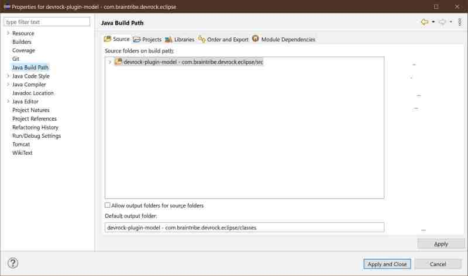

# Model builder

The model builder plugin is used to update the declaration file that any model automatically gets when it's built. 

The file is a XML representation of data about the contents of the model.

- the types declared, i.e. derivations from GenericEntity or from other models,
- the dependencies, i.e. the models whose types are used in the model


## actual builder

The plugin itself is just an Eclipse integration of the following artifact, which is also called by the devrock-ant-tasks :

```
	com.braintribe.devrock:model-declaration-builder-ng
```

## output folder
The plugin will use the output folder configured for the project, which in most cases differs from the standard output folder the devrock-ant-tasks use. 



So in case of the example above which declares 'classes' as the output folder, the XML file will be as follows:

```
./classes/model-declaration.xml
```

In Eclipse, there's no standard place of the project's output, whereas devrock-ant-tasks uses 'build' as default output folder. 


## nature 
 In the model builder's view, a model is just a project (a Java project that is so JDT handles it) that has the 'model nature' attached
 
```
com.braintribe.eclipse.model.nature.ModelNature
```

Both the natures and the linked builders are declared in the .project file of the project.


```xml
<?xml version="1.0" encoding="UTF-8" standalone="no"?>

<projectDescription>
	<name>devrock-plugin-model - com.braintribe.devrock.eclipse</name>
	<buildSpec>
		<buildCommand>
			<name>org.eclipse.jdt.core.javabuilder</name>
			<arguments/>
		</buildCommand>
		<buildCommand>
			<name>com.braintribe.eclipse.model.nature.ModelBuilder</name>
			<arguments/>
		</buildCommand>
    </buildSpec>
    <natures>
		<nature>org.eclipse.jdt.core.javanature</nature>
		<nature>com.braintribe.eclipse.model.nature.ModelNature</nature>
    </natures>
</projectDescription>

```

As in standard Eclipse, you do not have to actually type these lines manually. If you use a model based on our templates, you don't have to anything as the project is already correctly configured.

If you don't want to start with a template-based model project, you can just use Eclipse's 'new project wizard', create the project and afterwards, attach the nature.

Again, you don't have to type the nature's identification as there are commands to add and remove the nature.

### attaching the model nature 
The command to attach a model nature can be found in devrock's context menu. It is only visible if the currently selected project doesn't have the model nature attached yet. 

### removing the model nature 
 The command to detach the model nature can also be found in devrock's context menu. It is only visible if the currently selected project has the model nature attached. 

## calling the builder
As mentioned above, the builder should be triggered by JDT. In detail: JDT discovers whether anything has changed on the project. Depending on what changes it will start its build process and then (even if a Java build was unnecessary) subsequently call the attached builder. The model-builder will *always* rewrite the file, so no matter whether it's a *partial* build, the builder-plugin will regard it as a full build.

However - well at least it seems to be so in some weird cases - the builder doesn't seem to be called. Hence, two commands have been implemented:

### build selected models of the workspace
This command will look at the current selection in the package-explorer, extract all model artifacts (i.e. projects showing the model-nature), and then build the declaration file for them.

### build all models of the workspace 
Same as above, but rather looking at the current selection, it will identify all model projects contained in the workspace, and the build declaration file for these projects.


## Configuration 
The plugin has no configuration as it uses the [Devrock Plugin](asset://com.braintribe.devrock.eclipse:devrock-documentation/devrock.md) to access malaclypse in order to determine the dependencies of the model (which has its proper configuration). 

