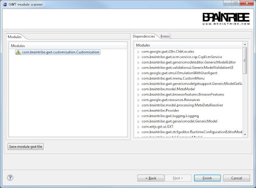
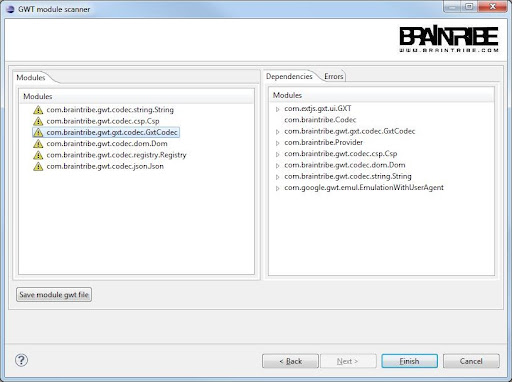
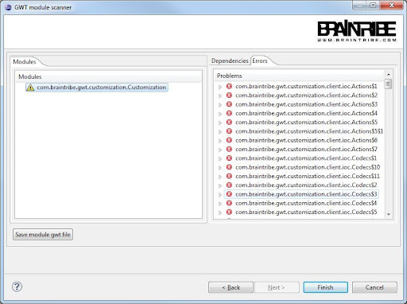
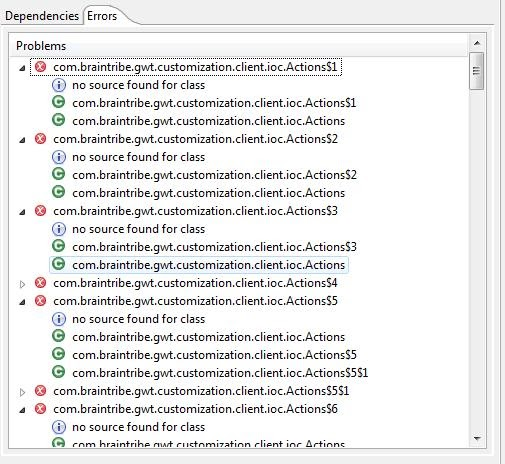

# Mungo Jerry

Formerly part of AC since its 2.5 version, the GWT part has now been adapted to the new GmCoreAPI#1.2 and MC#3.0. It also has been removed from AC and exists now as a proper Eclipse plugin so it can have its own release cycle.

Basically, Mungojerry is an analysis tool for GWT projects, GWT being Google’s Web Toolkit,a cross-compiler from Java to Javascript. We are using GWT to build both GME and Grindlebone. 

Other parts of the GWT feature support remains in AC#3.0, for instance the modification of the runtime classpath of GWT terminal artifacts and auto-injection of GWT libraries into model artifacts.

Starting the analysis

You select the artifact that you want to analyse in the package explorer and then either use the toolbar to start the analysis 

or use the context menu to do.

Basically, the page has no other purpose than to give the visual feedback via a progress monitor. Press next and scanning process starts. 

The following page is divided into two parts. 

On the left side, you see the master panel, where you see the modules that are defined in your project - at least one should be shown.

The example below has only on module. 

This example shows the master panel of a project with several modules. 

The master panel on the left and the detail panel on the right are linked by selecting the module in the master panel. 

The selection triggers the further processing (which make take some time again) and eventually shows the detailed data in the two detail panels.

The dependencies detail panel shows the dependencies of the selected module and their dependencies in turn. 

If a project in the master panel shows the warning sign left to its name, then there are entries in the error panel. 

Basically, it shows a list of all errors in the modules GWT. 

Selecting an error, i.e. expanding it, shows further information about it. 

Following is shown for each error:

- The error reason (offending class)
- The error message
- All classes that reference the offending class

Saving a gwt.xml file
	If you press this button, the gwt.xml file is written to disk. A backup file is created, just in case. 
