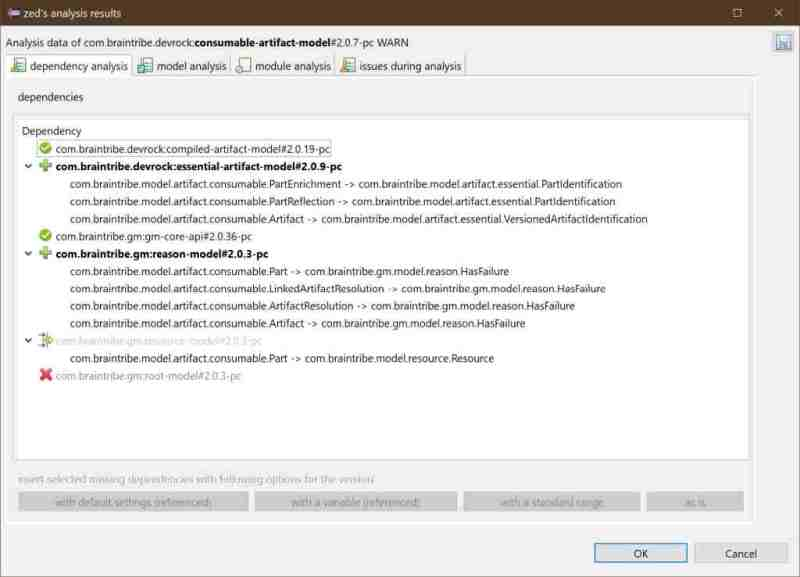

# running an analysis in Eclipse

In the 'devrock plugin', three commands exist. One command runs the analysis on a selected project, the second command runs it on an external artifact, and the last one allows you to view a previously stored analysis.

> Please note that analysis will take some time. A progress-monitor is activated so that you can see that zed's alive, but as it's only weakly coupled with Eclipse, you cannot cancel the run. 

All three commands can be found in the pertinent context menu 

```
<context-menu>->devrock->analysis
```


> Please note that if no project is selected, or the selection is not accessible (in some cases, the package-explorer will still show a selection, but it's still not accessible), or the selection is accessible, but the project itself isn't - in all these cases, the command to analyze a selected project will *not* appear in the context menu.


## analysis of a project

Running the analysis on a project is straight forward: you simply select an open and accessible project. The analysis will run on Eclipse's output folder (rather than the JAR) and will also use the output folders of any project in the workspace matching a dependency of the terminal project, while using the jar for all artifacts not backed by projects in the workspace.

## analysis of an external artifact

Running the analysis of an external artifact is more complicated as it requires the selection (and subsequent resolution) of the terminal. 

### selecting the terminal

You can only select an existing artifact, i.e. differing from AC's dependency analysis, you cannot start with one (or more) dependencies, but you need to select a single, existing artifact. However, where that artifact and its dependencies reside is up to you. 


If you had a project selected in the workspace, it will automatically appear as possible terminal. 

> Please not that in this case, the analysis is *not* run on the project in the workspace, but on the artifact in the repositories. If no such artifact exists (for instance a PC version that has never been locally built (installed) yet, the command will fail.


You can enter a qualified dependency in the pertinent editor field. Group Id and artifact Id suffice, you can then use the 'normalize' button  to the right to create a range for the dependency using the following logic:

	<groupId>:<artifactId> -> a fully open range is created : [,]
	<groupId>:<artifactId>#1 -> a range based on the major is created : [1,2)
	<groupId>:<artifactId>#1.0 -> a range based major/minor is created : [1.0,1.1)
	

In the next step, you can resolve the dependency using the 'scan/update' button , i.e. let mc find out what versions exist in the specified range. 

> Please note that you do not have to use the auto-rangify feature, but you need to resolve the dependency as the analysis can only run on a specified artifact and not on a depedency.


### selecting the repository-configuration
As a matter of convenience, you can use the currently active repository-configuration (the one that the Devrock offering in Eclipse currently uses). In some cases however, the artifact you want to analyze may not be completely accessible with you current configuration. 

In that case, you can select a different repository-configuration to be used during the analysis (as in AC's dependency analysis). The file is expected to be in the YAML format (Maven style setting.xml are not supported here). The configuration will be used during the analysis and will not influence any other Devrock features. 

The dialog also remembers whether you chose to use an external configuration and which one it is. 

## viewing of a previously stored analysis

As the analysis viewer has a feature to write all relevant data to disk, you can select such a persisted data set and view it again. 

## the viewer  
The viewer itself can show several tabs. Some of them are always shown, some are only present if they would contain relevant information

To the right, above the tabs, the save button  allows you to save the currently viewed data to disk to be viewed later. 


### dependency tab
This tab is always shown. It shows the analysis done on the dependencies, declared and actually used ones. Dependencies required yet not declared can be injected into the pom - if the analysis has been run on a project (obviously it can't work on artifacts as the need to be 1. considered as stable and 2. may reside in a read-only environment and 3. their pom may not even exist).


The dialog shows all dependencies of the terminal: 

- if prefixed by  : this dependency has been declared and is also required. 
- if prefixed by  : this dependency has not been declared, but is required. It can be inserted into the pom (if terminal's a project)
- if prefixed by   : this dependency has been declared, it is not required, i.e. not referenced by the terminal, and could be removed
- if prefixed by   : this dependency has been correctly declared, but not actUally required. However, the reference (mostly types) is actually not located in the declared dependency, but somewhere else, and only 'forwarded' to the dependency declared (via the 'forwarDed annotation', see GenericEntity, Reason et al)

> Please not that if the 'forwarded to' dependency has been declared in the pom (as it should be even if its content doesn't contribute to the classpath), the name will be greyed out.

>If however the name is bold, it means that the 'forwared-to' dependency is missing (you'll also notice the in the case, the dependency has no version, or rather a '0.0.0' version).

Dependencies that are required but not declared can show where the references actually appear in the terminal : 



> Please note that due to the fact the zed may not be able to fully understand how external types interact with the types of the terminal - it's about generics, type-parameterization et al - it might not be able to understand all combinations and hence some references may get 'lost in analysis'. It is advisable to have a look at the issues and check the information there for relevance in this regard.

If the terminal of the analysis is a project in your workspace, then the missing (aka not-declared, yet required) dependencies can be inserted into the appropriate pom file. You can either use the buttons below the tree, or use the context menu :


You can choose the method of insertion as in the Quick-Importer of the Devrock-Plugin: 

- insert with the currently set default method 
- insert with a variable standing for the version of the dependency (aka 'referenced') - will assume that you have declared somewhere a property in the form of <groupId> of dependency, prefixed with a 'V.'. 
- insert with a range - version is replaced with a derived major/minor range 
- insert as is - the dependency will be inserted with the very same version as was determined in the analysis.

> You can automatically insert missing 'forwared-to' dependency, but the insertion feature will ignore your choices as in case of such a missing dependency, only the option of using a variable reference is applicable. If you want to change that, you need to modify your pom after the insertion or do it manually, as Zed can't know the version.

The default can be set using preferences that the Devrock Plugin brings :


### module tab
The module tab list all packages required to be imported into the terminal - once Java modules are activated. 


For each package, you get to see where it needs to come from, and attached to the artifact, you see all packages that this dependency needs to expose - as the two things must be synched: only packages that are exported can be imported. 

> Please note that this tab currently is only showing the information. Other than that, it has no functionality. Eventually, however, it should be able to read the 'module-info.java' file, compare and eventually touch the file - as zed does with the dependencies and the pom file. 

### model tab
The model tab is where the model-specific analysis are shown. See the pertinent [documentation](../forensics/forensics.md) about what it tracked.

The viewer simply shows the findings, the so-called 'finger print', and attached to it, the location (aka class or interface or method or field) is attached.


Each finger prints has a [rating](../forensics/ratings.md) and that is reflect via the icon.

-  : this has been successfully tested and is ok.
-  : this an issue, but zed is told to ignore it, so treat it as ok.
-  : again, this is an issue, and should probably have a look at it.
-  : this now is a serious issue and may produce problems when this model is used.


This example here shows some serious issues that can exist in a model :


> Please note that the names of the enum and generic entity here are from a test artifact.. It's kind of confusing I must confess, but of course perfect for an automated test..

For your convenience, the tab sports a context-menu that allows you to open the associated source file.


It will open the file in the Java Editor. As the viewer is in a modal-mode, you can't directly edit the file, but at least it helps you find the place to fix the issue.

>Please note that this feature - just as the dependency-views' insertion feature - is only available if you have been analyzing a project, because only then the link to the sources exist. 


### classpath tab
The classpath tab can show you whether you have any shadowing classes in the classpath, i.e. whether several resources exist with the same combination of package and name across the classpath.

The tab shows you what duplicates exist, and in what artifact they were found.


While listing the duplicate classes, zed also shows where the reference to these classes actually take place in terminal. In this example (again from a test setup), you see that zed detects type references on several different constructs. 

The picture above shows an issue where two dependencies both declare the same class, but it can of course be the terminal that declares a class that a dependency also does : 


### issues tab
This tab doesn't show any analysis data, but shows the code fragements that Zed's analyzer didn't properly understand. It is shown, as these fails may have an impact on the analysis - as Zed is tracking the usage of types (and other things) of the dependencies, it might miss one due to such a analyzing failure. Hopefully, the number of issues will decrease in time, but in this state, some are to be expected. 


