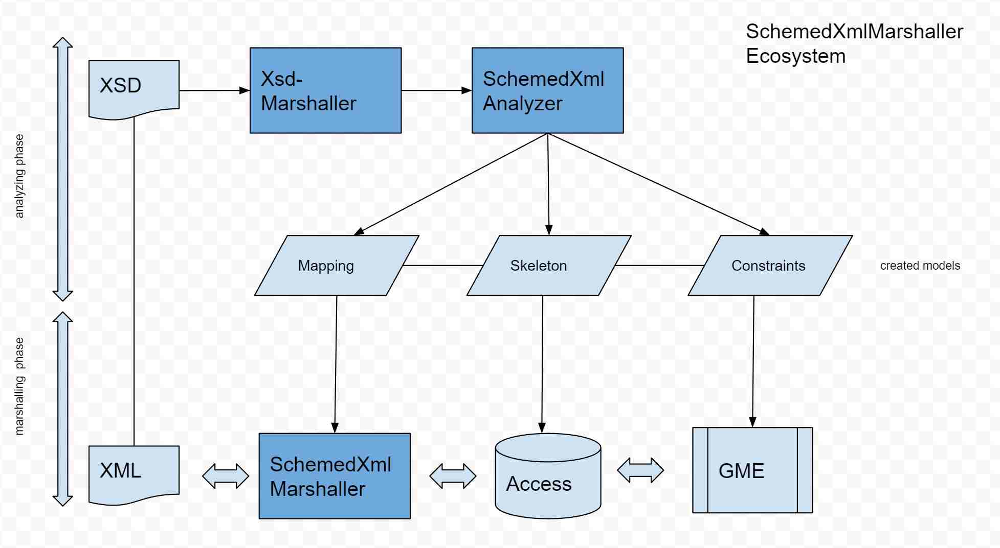

# Introduction

As some of you might know, in TF#1.x existed a thing called XSD to MetaModel converter plus a codec that could translate respective XMLs into an assembly and vice versa.

In TF#2.0, models changed completely, so the old technology had to be revamped. I ran it as a pet project, i.e. something that is done when I was bored during lull times. Unfortunately, this happened a bit less often as I imagined (and would have liked), as I was pretty involved in the new codebase and build system, and their impact on the platform assets.

But now, here it is. It is still in an early state, as there are many things that need to be implemented, but it can process quite a few exemplary XSD and their respective XMLs. Still, as there are so many things you can do with XSD - even things that are impossible to translate to the Java world - there will always be the possibility that a construct appears that the current state cannot process. With some tweaking however, most issues can be fixed in the extension, but sometimes, the input has to be slightly modified - without changing the overall (phenotypic) result. 

# Basics

Basically, the schemed-xml complex has two distinctive parts. 

- analyzing an XSD, create the model from it and generate mapping rules
- marshalling XML files using the mapping rules


## Analyzing an XSD
There are several related parts that make-up the schemed-xml feature. 



### marshalling the XSD
In the first step, the XSD is transformed into an assembly of the schemed-xml-xsd-model, that is the XSD text file is converted into a generic entities using the *schemed-xml-xsd-marshaller*. 

The aim is to have to information contained in the XSD in memory as structured data. While this marshaller can stand alone - it can read and write XSDs - it is mostly used here to decouple the analysis tasks from the formatted text as used in the XSD.

### extracting models from the XSD
In the second step, the schemed-xml-analyzer traverses the model and translates what it finds into several models.

- skeleton model: this is a model that contains only the entity types and their properties. By means of this model, you can set-up an access for instance.

- constraint model: this model depends on the skeleton and introduces (standard) metadata that can be interpreted by GME for instance. For instance, all restrictions on simple types (min values for integer, length values and patterns for strings) are mapped to respective metadata. 

- mapping model: This model also depends on the skeleton model and introduces the pertinent mapping information, again by means of metadata. This model is then used in the marshaling actions.


There are several ways to parameterize and call the analyzer. No matter from where you call it - programmatically within your code, as a build command, a jinni command or even as platform asset, you’d treat it more or less the same way.

### marshaling an XML using the extracted models 
Both read and write (or un-marshaling and marshaling) require that the model is available to the marshaller (on the classpath) and that the mapping model is passed. 


# Accessing the feature

Currently, using Java is your only means to access the schemed-xml feature. A platform asset is in the works, but for now, you have to use some code. The example below however is functional.

Still, even if the asset isn’t there yet, the analyzer is designed to run on a server. Therefore, it itself doesn’t access a file system, but relies on our Resource. This makes the configuration with access to a local file system somewhat cumbersome. That is why I made a little fluent API for it. 

##Calling the analyzer

In order to call the analyzer, you need the following artifacts

``` xml 
	<dependency>
            <groupId>com.braintribe.gm.schemedxml</groupId>
            <artifactId>schemed-xml-xsd-analyzer</artifactId>
            <version>${V.com.braintribe.gm.schemedxml}</version>
	</dependency>
	<dependency>
            <groupId>com.braintribe.gm.schemedxml</groupId>
            <artifactId>schemed-xml-xsd-request-builder</artifactId>
            <version>${V.com.braintribe.gm.schemedxml}</version>
	</dependency>
``` 


You can then use a fluent API to build the request. You find additional information in the javadoc of the mentioned classes and some examples in the JUnits of 

``` xml
	<dependency>
            <groupId>com.braintribe.gm.schemedxml</groupId>
            <artifactId>schemed-xml-xsd-request-builder-lab</artifactId>
            <version>${V.com.braintribe.gm.schemedxml}</version>
	</dependency>
``` 

#Basic

The simplest case looks like this
``` java
	SchemedXmlXsdAnalyzerRequest request = AnalyzerRequestBuilder.request()
				.xsd()
					.file( new File( "main.xsd"))
				.close()
				.modelName("my-group:my-artifact#1.0")
				.packageName("com.braintribe.xsd")
			.build();
```

## Multiple XSD
If you have several XSD, a main XSD that references other XSD, and their URI are not URL (if they are URL, the analyzer automatically downloads them during processing), you have to specify that. 

Again, the easiest case is that you have a ZIP file

``` java
SchemedXmlXsdAnalyzerRequest request = AnalyzerRequestBuilder.request()
		.xsd()
		.archive( 
new File( "BMS_Package_Invoice_r3p3p0_i1_01Mar2017.zip"), 
"Schemas/gs1/ecom/Invoice.xsd"
)
		.close()
		.modelName("my-group:my-artifact#1.0")
		.packageName("com.braintribe.xsd")
	.build();
```

>One word about the Zip file.. in some cases, people pack several things into such a file, i.e. the XML files, documentation and an extract of a filesystem with the different XSD, that are referencing it each other with relative file-paths. While the analyzer can work with such a Zip (see example above), it’s not the optimal situation: keep the zip as small as possible. In the case of the example above, the schemata were in a sub folder ‘Schemas’ and to create a partial copy of the overall package containing only the relevant XSD would make sense. Anyhow, relative path in location declaration in xs:import and xs:include statements are supported.


If you do not have a ZIP file, but multiple files, you use this form: you specify the file and the URI which the other XSD are referencing this XSD.

``` java
SchemedXmlXsdAnalyzerRequest request = AnalyzerRequestBuilder.request()
					.xsd()
						.file( new File( "main.xsd"))
					.close()
					.modelName("my-group:my-artifact#1.0")
					.packageName("com.braintribe.xsd")
					.references()
						.file( new File( "import1.xsd"), "uri1")
						.file( new File( "import2.xsd"), "ur2")
					.close()
					
			.build();
```


## Overriding generated names
You can override the internal naming, i.e. influence the name of a generated type and/or property. If property is null, then it is assumed that you want to rename to the type, otherwise it’s deduced that you want to rename the property. 

``` java
SchemedXmlXsdAnalyzerRequest request = AnalyzerRequestBuilder.request()
				.xsd()
					.file( new File( "main.xsd"))
				.close()
				.modelName("my-group:my-artifact#1.0")
				.packageName("com.braintribe.xsd")
				
				.nameOverrides()
					.overridingName("myFirstName")
			
					.schemaAddress()
						.type("first-xsd-type")
						.property("first-xsd-property")
					.close()
			
				.close()
				
				.nameOverrides()
					.overridingName("mySecondName")
			
					.schemaAddress()
						.type("second-xsd-type")
						.property("second-xsd-property")
					.close()		
				.close()				
			.build();
```

## Overriding generated collection types
You can override what collection type should be used for a specific property
``` java
SchemedXmlXsdAnalyzerRequest request = AnalyzerRequestBuilder.request()
				.xsd()
					.file( new File( "main.xsd"))
				.close()
				.modelName("my-group:my-artifact#1.0")
				.packageName("com.braintribe.xsd")
				
				.collectionOverrides()
					.asSet()			
					.schemaAddress()
						.type("xsd-type")
						.property("collection-property")
					.close()
	
				.close()											
			.build();
```


## Specifying bidirectional properties
You can specify that you want to have automatically inject bidirectional properties, i.e. a child would get a property that points to the parent. While this is - per se - nigh impossible (yes, I know about IDREF), the feature can do that - the marshaller will automatically wire the entities while reading and make sure that they are not processed while writing.

``` java
SchemedXmlXsdAnalyzerRequest request = AnalyzerRequestBuilder.request()
				.xsd()
					.file( new File( "main.xsd"))
				.close()
				.modelName("my-group:my-artifact#1.0")
				.packageName("com.braintribe.xsd")
				.bidirectional()
					.schemaAddress()
						.type( "first-xsd-type")
						.property( "first-xsd-collection")
					.close()
					.property( "first-backlink-property")
				.close()
				.bidirectional()
				.schemaAddress()
					.type( "second-xsd-type")
					.property( "second-xsd-collection")
				.close()
				.property( "second-backlink-property")
			.close()
		.build();
```


>Guess that needs some explaining: you specify the property you want to apply the bidirectional logic to. That means that the type (needs to be a GmEntityType - ComplexType or a SimpleType converted to a GmEntityType) of the property has a special property injected which points back to the owning instance. So whatever type is behind first-xsd-type:first-xsd-collection gets a property ‘first-backlink-property’ which is of type ‘first-xsd-type’,

## Automatic type generation (WIP)
Not all XSD contain named types as you can directly specify the type of an element without naming it. Of course, this means that the type cannot be shared, just imagine it as a kind of anonymous Java type. 

In our model world, we cannot have unnamed types, and the analyzer is making sure that types are named, and that they are reused (i.e. an element with such an anonymous type is referenced twice).

Basically, if the analyzer needs to create a type, it will try to deduce the name from the qualified path of the element (or choice or whatever), and to visualize that, it will prefix “_vt_” to the type’s name. 
You can either specify what prefix to use or not to use a prefix at all.


## Namespace and packages (WIP)
Currently, the target namespace of an XSD is reflected in the package name of the generated type. This may lead to some rather cryptic names. It would be nice, if one could use better names, by specifying a map of namespace to name.


## Type substitution
You can specify that instead of using a type as determined by the feature, you want it substituted by another type from a different model. Making this work for the marshaller needs some ideas.

``` java
SchemedXmlXsdAnalyzerRequest request = AnalyzerRequestBuilder.request()
	.xsd()
		.file( new File( "main.xsd"))
	.close()
	.modelName("my-group:my-artifact#1.0")
	.packageName("com.braintribe.xsd")
	.substitutionModel()
		.modelName("my-substitution:model#1.0")
		.substitution()
			.replacementSignature("my.injected.package.one.SubstitutionOne")	
			.schemaAddress()
				.type( "first-xsd-type")									
			.close()
		.close()
		.substitution()
			.replacementSignature("my.injected.package.one.SubstitutionTwo")				
			.schemaAddress()
				.type( "second-xsd-type")
			.property( "second-xsd-collection")
			.close()
		.close()
	.close()				
.build();
``` 


>Keep in mind that if you do substitute types, they are no longer supported by the marshaller (the mapping information for such types is missing). I would like to support that better, but currently, - if it is possible at all - you’d have to supply your own mapping information. 

In order for TF to wire the substituted types correctly, the global ids of the types must be correct. You can specify them explicitly (as replacementGlobalId), but if you do not, the standard global id generation is used. So as long as you do not do some fancy stuff with global id of types, you can ignore this issue.


During the analyzing process, all substituted types are - obviously - shallow, so is their model itself. It is added to the dependencies of the model generated.

## Using partial XSDs or splitting models (WIP)
In some cases we are confronted while a whole ecosystem of XSD definitions. In theses cases, we’d need to build the models accordingly - like the XSD are referencing each other, the models should. So this is about the process of building mapping models upon previously analyzed models - and then use the relevant mapping models during marshalling.


# Running the analyzing process
And finally,  running the analyzer with the generated request : 

``` java
package com.braintribe.marshaller.schemedXml.xsd.analyzer.example;

import java.io.File;

import com.braintribe.marshaller.schemedXml.builder.AnalyzerRequestBuilder;
import com.braintribe.marshaller.schemedXml.commons.ModelPersistenceExpert;
import com.braintribe.marshaller.schemedXml.xsd.analyzer.SchemedXmlXsdAnalyzer;
import com.braintribe.marshaller.schemedXml.xsd.analyzer.api.model.SchemedXmlXsdAnalyzerRequest;
import com.braintribe.marshaller.schemedXml.xsd.analyzer.api.model.SchemedXmlXsdAnalyzerResponse;


/**
 * a functional example of how to call the {@link SchemedXmlXsdAnalyzer} locally (file system)
 * 
 * @author pit
 *
 */
public class Example {
		
	/**
	 * @param args
	 */
	public static void main( String [] args) {
		
		// parameterize the request
		// the directory where the input files reside		
		String inputDirectory = args[0]; 
		// the name of the package the generated types should be in
		String packageName = args[1]; 
		// the fully qualified name of the model, i.e. <groupId>:<artifactId>#<version>
		String modelName = args[2];
		// either the file name of the main XSD or the name of the entry in the zip file, if resourceName's set
		String xsdName = args[3]; /
		String resourceName = null; // the name of the zip file if multiple XSDs are required
			
		// building the request
		SchemedXmlXsdAnalyzerRequest analyzerRequest;
		File input = new File( inputDirectory);
		if (args.length > 4) {
			resourceName = args[4];
			analyzerRequest = AnalyzerRequestBuilder.request()
				.xsd()	
					.archive( new File( input, resourceName), xsdName)
					.close()												
				.packageName(packageName)
				.modelName(modelName)								
			.build();						 			
		}
		else {
			analyzerRequest = AnalyzerRequestBuilder.request()
					.xsd()
						.file( new File( input, xsdName))
					.close()
					.packageName(packageName)
					.modelName(modelName)
				.build();			
		}
		// running the analyzer
		SchemedXmlXsdAnalyzer analyzer = new SchemedXmlXsdAnalyzer();
		SchemedXmlXsdAnalyzerResponse analyzerResponse = analyzer.process(analyzerRequest);		
			
		// generating some output
		File output = new File( input, "output");
		// the skeleton as artifact, i.e. jar, pom, sources.jar
		ModelPersistenceExpert.dumpModelJar( analyzerResponse.getSkeletonModel(), output);
		// dump the mapping model
		ModelPersistenceExpert.dumpMappingModel( analyzerResponse.getMappingModel(), output);		 
	}

}
```


# Getting the result

The returned instance of the type 

``` java
com.braintribe.marshaller.schemedXml.xsd.analyzer.api.model.SchemedXmlXsdAnalyzerResponse
```

contains the three produced models 

<table>
	<tr>
		<th>property</th>
		<th>description</th>
	</tr>
	<tr>
		<td>skeletonModel</td>
		<td>a GmMetaModel containing the generated types</td>
	</tr>
	<tr>
		<td>constraintModel</td>
		<td>a GmMetaModel containing constraints expressed by the standard metadata types, depends on the skeletonModel
mappingModel</td>
	</tr>
	<tr>
		<td>mappingModel</td>
		<td>a GmMetaModel containing mapping information of metadata of the specific types (SXX-mapping-model), depends on the skeletonModel (and on SXX-mapping-model of course)</td>
	</tr>
	<tr>
		</td>virtual model</td>
		</td>an empty GmMetaModel binding all models together via its dependencies.</td>
	</tr>
	<tr>
		<td>shallowTypes</td>
		<td>WIP</td>
	</tr>
</table>


# Jinni integration (WIP)

jinni exposes 'analyze-xsd'. 

```
qualified-type: com.braintribe.marshaller.schemedXml.xsd.analyzer.api.model.jinni.AnalyzeXsd
aliases: analyze-xsd
syntax: jinni analyze-xsd [--property <value>]...

mandatory properties:

--schema -s ARG          : the resource that contains the XSD that should be
                           parsed
                           ARG type: com.braintribe.model.resource.Resource
                                                      
optional properties:

--bidirectionalLinks --bi ARG ... : bidirectional links
                           list ARG type:
                           com.braintribe.marshaller.schemedXml.xsd.analyzer.api.model.BidirectionalLink

--collectionOverrides --oc ARG ... : auto-determination overrides for multiple
                           entries (maxOccurs > 1)
                           list ARG type:
                           com.braintribe.marshaller.schemedXml.xsd.analyzer.api.model.CollectionOverride

--exchangePackageOutput -e [ARG] : set if you want to have an exchange package
                           produced in addition
                           ARG type: boolean (true, false)
                           default: false

--jarOutput -j [ARG]     : set if you want to the skeleton produced as a full
                           artifact
                           ARG type: boolean (true, false)
                           default: false

--mappingOverrides --om ARG ... : auto-determination overrides for names
                           list ARG type:
                           com.braintribe.marshaller.schemedXml.xsd.analyzer.api.model.MappingOverride

--outputDir -o ARG       : the output directory where the different output
                           should be put into
                           ARG type: string

--referencedSchemata -r ARG : all referenced schema - if any
                           ARG type:
                           com.braintribe.marshaller.schemedXml.xsd.analyzer.api.model.ReferencedSchemata

--shallowSubstitutingModels --ot ARG ... : type substitutions
                           list ARG type:
                           com.braintribe.marshaller.schemedXml.xsd.analyzer.api.model.ShallowSubstitutingModel

--skeletonModelName -n ARG : name of the skeleton model, others are derived
                           ARG type: string

--topPackageName -p ARG  : name of the top package (imported are attached)
                           ARG type: string

```

## Calling the marshaller
The marshaller will most probably not make it into an asset as it’s questionable whether this a good use of the feature. More likely, it will do its work within another processor. 

Depending on how you want to call the marshaller (directly or via the request/response scheme) you need at the most those two artifacts.
``` xml
<dependency>
            <groupId>com.braintribe.gm.schemedxml</groupId>
            <artifactId>schemed-xml-marshaller</artifactId>
            <version>${V.com.braintribe.gm.schemedxml}</version>
</dependency>
<dependency>
            <groupId>com.braintribe.gm.schemedxml</groupId>
            <artifactId>schemed-xml-xsd-lab-commons</artifactId>
            <version>${V.com.braintribe.gm.schemedxml}</version>
</dependency>
```

If you call the marshaller directly, you do not need the lab-commons reference.

## Calling via the request
As a preparation for an eventual usage as an asset, there is a request / response way to call the marshaller. 
package com.braintribe.marshaller.schemedXml.xml.marshaller.example;

``` java
import java.io.File;

import com.braintribe.codec.marshaller.stax.StaxMarshaller;
import com.braintribe.marshaller.schemedXml.commons.SchemedXmlXsdMarshallerRequestBuilder;
import com.braintribe.marshaller.schemedXml.xml.marshaller.SchemedXmlMarshallingRequestProcessor;
import com.braintribe.marshaller.schemedXml.xml.marshaller.api.model.SchemedXmlMarshallerMarshallRequest;
import com.braintribe.marshaller.schemedXml.xml.marshaller.api.model.SchemedXmlMarshallerMarshallResponse;
import com.braintribe.marshaller.schemedXml.xml.marshaller.api.model.SchemedXmlMarshallerUnmarshallRequest;
import com.braintribe.marshaller.schemedXml.xml.marshaller.api.model.SchemedXmlMarshallerUnmarshallResponse;
import com.braintribe.marshaller.schemedXml.xsd.test.resource.ResourceProvidingSession;
import com.braintribe.model.generic.GenericEntity;

/**
 * a NON FUNCTIONAL example of how to use the marshaller (it actually needs the JAR of types of the mapping model in the classpath!)
 * 
 * @author pit
 *
 */
public class RequestExample {
	private SchemedXmlXsdMarshallerRequestBuilder requestBuilder;
	private SchemedXmlMarshallingRequestProcessor marshallingProcessor = new SchemedXmlMarshallingRequestProcessor();
	private StaxMarshaller staxMarshaller = new StaxMarshaller();

	
	public RequestExample() {
		ResourceProvidingSession session = new ResourceProvidingSession();
		requestBuilder = new SchemedXmlXsdMarshallerRequestBuilder();
		requestBuilder.setSession(session);		
		requestBuilder.setModelMarshaller( staxMarshaller);
	}
	
	/**
	 * using the request processor, i.e. how the service works
	 * @param args
	 */
	public void runRequestExample( String [] args) {
		String inputDirectory = args[0];
		String xmlName = args[1];
		String modelName = args[2];
		
		File input = new File( inputDirectory);
		
		// unmarshall, aka decode
		SchemedXmlMarshallerUnmarshallRequest unmarshallRequest = requestBuilder.buildRequest(input, xmlName, modelName);		
		SchemedXmlMarshallerUnmarshallResponse unmarshallResponse = marshallingProcessor.process(unmarshallRequest);
		
		// get result
		GenericEntity assembly = unmarshallResponse.getAssembly();
		System.out.println( assembly.getGlobalId());
		
		// marshall, aka encode
		SchemedXmlMarshallerMarshallRequest marshallRequest = requestBuilder.buildRequest(input, assembly, modelName);
		SchemedXmlMarshallerMarshallResponse marshallResponse = marshallingProcessor.process(marshallRequest);
		
		// get result
		String xmlContent = marshallResponse.getExpression();		
		System.out.println( xmlContent);
	}
	

	public static void main( String [] args) {
		RequestExample example = new RequestExample();
		example.runRequestExample(args);	
	}	
}
```

## Directly calling the marshaller
Or you can directly call the marshaller as in this example, as you would most probably do in a service processor. 

``` java
package com.braintribe.marshaller.schemedXml.xml.marshaller.example;

import java.io.ByteArrayOutputStream;
import java.io.File;
import java.io.FileInputStream;

import com.braintribe.codec.marshaller.api.MarshallException;
import com.braintribe.codec.marshaller.stax.StaxMarshaller;
import com.braintribe.marshaller.schemedXml.xml.marshaller.SchemedXmlMarshaller;
import com.braintribe.model.generic.GenericEntity;
import com.braintribe.model.meta.GmMetaModel;

public class DirectExample {
	private StaxMarshaller staxMarshaller = new StaxMarshaller();

	/**
	 * using the marshaller directly 
	 * @param args
	 */
	public void runDirectExample( String [] args) {
		// 
		String inputDirectory = args[0];
		String xmlName = args[1];
		String modelName = args[2];
		
		File input = new File( inputDirectory);

		// prepare mapping model
		GmMetaModel mappingModel;
		File modelFile = new File( input, modelName);
		try ( FileInputStream in = new FileInputStream( modelFile)) {
			mappingModel = (GmMetaModel) staxMarshaller.unmarshall(in);
		} catch (Exception e) {
			System.err.println("cannot read mapping model from [" + modelFile + "]");
			return;
		}
		// get marshaller
		SchemedXmlMarshaller marshaller = new SchemedXmlMarshaller();
		marshaller.setMappingMetaModel(mappingModel);

		// unmarshall, aka decode
		GenericEntity assembly;
		File xmlFile = new File( input, xmlName);
		try ( FileInputStream in = new FileInputStream( xmlFile)) {
			assembly = (GenericEntity) marshaller.unmarshall(in);
		} catch (Exception e) {
			System.err.println("cannot read xml file [" + xmlFile + "]");
			return;
		}		
		System.out.println( assembly.getGlobalId());
				
		// marshall, aka encode
		ByteArrayOutputStream out = new ByteArrayOutputStream();		
		try {
			marshaller.marshall(out, assembly);
		} catch (MarshallException e) {
			System.err.println("cannot write xml file");
			return;
		}		
		System.out.println( out.toString());		
	}
}
```

In both cases, the model with the GmEntityType (and related) as generated by the analyzer must be in the classpath if you want the marshaller to work.


# Marshaller configuration 
## Unmarshalling options
Currently the only possible configuration with the marshaller is to use the DeSerializationOptions and set the session for instance. Still, I’d recommend to clone the resulting assembly into a session rather than letting it create the assembly directly in the session.

## Marshaling options
There are currently no marshaling options.


# known issues
No matter how much effort you put into things, there’s always room for improvement - but sometimes that room is not available to you. So here are some issues that are solved - kind of - in the current implementation. 

There are a few things that currently don’t work and are known (there are lots of things that do not work and are currently not known..).


## xs:any 
xs:any as a type of a property is fully supported. But the data contained in this element will be translated into a generic container entity for XML elements, the com.braintribe.xml.AnyType. This type supports an unrestricted number of attributes, text-content and children - but these children will automatically be instances of the AnyType again - unless of course, they are identified with a xsi:type attribute (actually schema namespace attribute) and their type can be resolved. 

## xs:anyType
Currently, the usage of the type in derivations is not supported (as I haven’t properly understood why and how to use derivation of this type)

## type names and global id
The current implementation of the analyzer generates global id for the things it generates in the pattern that the JavaTypeAnalysis does. Suffice to say here that the type signature of the generated type is used within the global id. Therefore, specifying the target package name is fundamental. 

## xs:union 
The way unions are supported may look rather weird, but currently, it’s the only way I came up that made sense.. 
xs:union are (TMK) used to *combine* restrictions (if you combined types really, you’d use polymorphism), and as restrictions (in our world) are nothing but metadata, what happens is as follows:
the union’s parts are identified and their metadata extracted a type based on the current simple type (as in the context) is generated, and all metadata of the parts are applied to it. 

## xs:list
This is currently not implemented at all and will trigger an exception

## multiple sequences within sequences
While this works in some combinations, it doesn't in others

## list and union simple type derivatives
As mentioned above, xs:list isn't supported, and derivations of this type, and of xs:union are not properly supported.

# Reverse direction
## Assemblies
While it basically possible to add the mapping metadata that the analyzer creates to any GmEntityType (and it’s property), so that you can then read/write the respective assemblies without an XSD at all, this is absolutely untested and currently, there’s no actual list of metadata that are required to make it work.. for now, the minimal set of metadata required is exactly that what the analyzer creates while reading the XSD. Still, this task is feasible 

## Models
Again, the notion of turning any existing model into an XSD (and automatically create mapping metadata), is tempting. Unfortunately, this is most probably only possible for models that are ‘containment’ based, i.e. do not have any cyclic references. The ‘Zarathud’ project has a model checker that analyzes the model in that respect.


