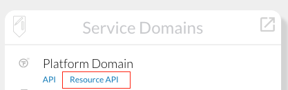
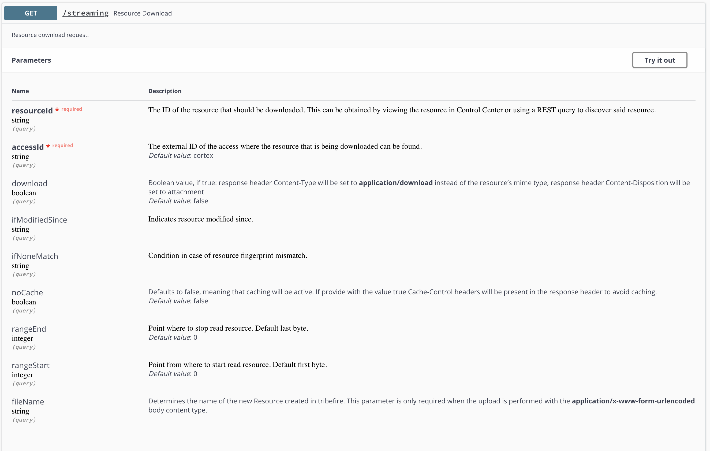
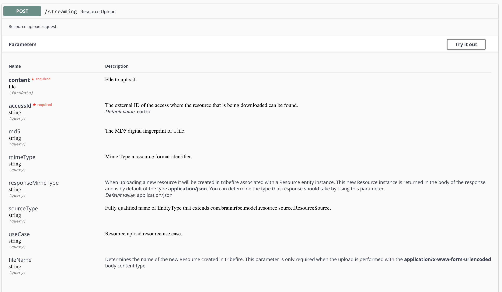

# Streaming

The `/streaming` endpoint of the Resource API, accessible from the landing page (`Service Domains/Platform Domain/Resource API`), allows you to upload and retrieve resources to/from tribefire via the `POST` and `GET` methods respectively.

Endpoint location:

## `GET`

This method allows you to download resources from tribefire. You can use it with the following parameters (note the `download` parameter changing the download type):

## `POST`

This method allows you to upload resources to tribefire. You can use it with the following parameters:

