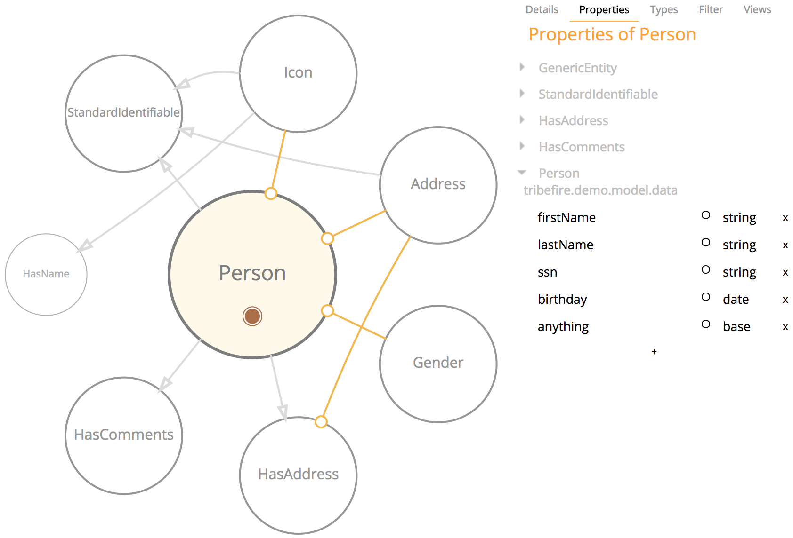

# Legacy REST Reflection

The reflections calls return reflected information regarding the definition of a particular model component, rather than details of specific instances. You can use the reflection calls to discover information regarding the following model components: model, entity and properties.

[](asset://tribefire.cortex.documentation:includes-doc/rest_old_tip.md?INCLUDE)

## Available Calls

Name    | Syntax | Methods | Parameters   
------- | -----------
[Model Reflection](rest_reflection.md#model-reflection) | `...rest/reflect-model` | `GET, POST, OPTIONS` | `sessionId`, `accessId`
[Type Reflection](rest_reflection.md#type-reflection) | `...rest/reflect-types` | `GET, POST, OPTIONS` | `sessionId`, `accessId`, `abstraction`, `signature`
[Property Reflection](rest_reflection.md#property-reflection) | `.../rest/reflect-properties` | `GET, POST, OPTIONS` | `sessionId`, `accessId`, `type`, `name`
[ID Property Reflection](rest_reflection.md#id-property-reflection) | `.../rest/reflect-id-property` | `GET, POST, OPTIONS` | `sessionId`, `accessId`, `type`

### Entity used in Examples

We are using the `Person` entity to demonstrate the reflection functionality. The `Person` entity has the following properties:


### Model Reflection

The model reflection call returns information regarding the definition of the model. This gives information regarding the particular make of the model, for example its name and type. If you set the `depth` property to `reachable`, it reflects the whole model, including all subtypes and complex properties.

#### URL Syntax

```
https://TRIBEFIRE_SERVER:PORT_NUMBER/tribefire-services/rest/reflect-model?PARAMETERS
```

#### Parameters

Name    | Description | Required
------- | -----------
`sessionId`  | 	The valid session that grants the call access to tribefire. | Yes
`accessId`  | The access through which the model to be reflected can be accessed. | Yes

#### Projections

Name    | Description
------- | -----------
`envelope`  | Returns the reflected information for the model.
`payload`  | Returns the reflected information for the model. This is the default projection.

#### Example

The model reflection REST call returns information regarding a particular model.

By default only the model's top level information is reflected, because the parameter `depth` defaults to `shallow`. However, you can gather more information through the use of `depth=reachable`, which provide information for the top level's complex properties, see below.

##### Simple Model Reflection

Using only the required parameters displays limited, that is, only single types, reflected information.
Call:

```
http://localhost:8080/tribefire-services/rest/reflect-model?sessionId=yourSessionId&accessId=access.demo
```

Response:

```json
{
  "_type": "com.braintribe.model.meta.GmMetaModel",
  "_id": "0",
  "globalId": "model:tribefire.extension.demo:tribefire-configured-demo-model",
  "id": "model:tribefire.extension.demo:tribefire-configured-demo-model",
  "name": "tribefire.extension.demo:tribefire-configured-demo-model",
  "partition": "cortex"
}
```

> You can use the `depth` parameter to extend the reflected information give for this REST call.

### Type Reflection

The type reflection call reflects information regarding a specific type, as defined by the type signature given in the call. This can be any type that is available in tribefire (entity types or enum types for example). If you don't define any parameters further than the required ones – `sessionId` and `accessId` – all types for the access are reflected.

#### URL Syntax

```
https://TRIBEFIRE_SERVER:PORT_NUMBER/tribefire-services/rest/reflect-types?PARAMETERS
```

#### Parameters

Name    | Description | Required
------- | -----------
`sessionId`  | 	The valid session that grants the call access to tribefire. | Yes
`accessId`  | The access through which the model to be reflected can be accessed. | Yes
`abstraction`  | By default all types will be reflected. However, you can use this optional property to define what types should be reflected. This accepts one of four values: `simpleTypes` - Returns all simple type objects, `entityTypes` - Returns all entity type objects, `enumTypes` - Returns all enum type objects, `object` - Returns all type objects | No
`signature` | The type signature of a specific type that should be reflected. This property can also be used to display groups of types by entering partial type signature, for example, `com.braintribe.sales`. This returns all types which contain this partial type signature. | No

#### Projections

Name    | Description
------- | -----------
`envelope`  | Returns the reflected information for the model.
`payload`  | Returns the reflected information for the model. This is the default projection.

#### Example

The type reflection REST call is used to reflect information regarding types in tribefire. A type can refer to two distinct elements:
* entity types
* enum types

However, regardless of which type you wish to reflect, the functionality and behavior of this REST call is the same – you use the type signature of the particular type you would wish to reflect as the value for the parameter type.

##### All Types Reflected

To reflect all types belonging to a specific model, you need only use the two required parameters, `accessId` and `sessionId`.
Call:

```
http://localhost:8080/tribefire-services/rest/reflect-types?sessionId=yourSessionId&accessId=access.demo
```

This returns all types belonging to the `access.demo`, whose access has the `id` `access.demo`.

##### Special Type Reflection

In addition to reflecting all types belonging to a particular model, you can also use the optional `signature` parameter to define a particular type that should be reflected. The value for `signature` should be the type signature of the particular entity that you wish to be reflected.

Call:
```
http://localhost:8080/tribefire-services/rest/reflect-types?sessionId=yourSessionId&accessId=access.demo&signature=tribefire.demo.model.data.Person
```

This reflects information regarding the entity type `Person`. Response:

```json
{
    "_type": "set",
    "value": [
        {
            "_type": "com.braintribe.model.meta.GmEntityType",
            "_id": "0",
            "globalId": "type:tribefire.demo.model.data.Person",
            "id": "type:tribefire.demo.model.data.Person",
            "isAbstract": false,
            "partition": "cortex",
            "typeSignature": "tribefire.demo.model.data.Person"
        }
    ]
}
```

For enum types the functionality is the same. You use the `signature` type to define the type signature for a particular enum type.
Call:

```
http://localhost:8080/tribefire-services/rest/reflect-types?sessionId=yourSessionId&accessId=access.demo&signature=tribefire.demo.model.data.Gender
```

This will display the reflected information for the enum type `Gender`:

```json
{
 "_type": "set",
 "value": [
 {
 "_type": "com.braintribe.model.meta.GmEnumType",
 "_id": "0",
 "constants": [
 {
 "_type": "com.braintribe.model.meta.GmEnumConstant",
 "_id": "1",
 "globalId": "enum:tribefire.demo.model.data.Gender/male",
 "id": "enum:tribefire.demo.model.data.Gender/male",
 "name": "male",
 "partition": "cortex"
 },
 {
 "_type": "com.braintribe.model.meta.GmEnumConstant",
 "_id": "2",
 "globalId": "enum:tribefire.demo.model.data.Gender/female",
 "id": "enum:tribefire.demo.model.data.Gender/female",
 "name": "female",
 "partition": "cortex"
 }
 ],
 "declaringModel": {
 "_type": "com.braintribe.model.meta.GmMetaModel",
 "_id": "3",
 "globalId": "model:tribefire.extension.demo:tribefire-demo-model",
 "id": "model:tribefire.extension.demo:tribefire-demo-model",
 "name": "tribefire.extension.demo:tribefire-demo-model",
 "partition": "cortex",
 "version": "2.0.1"
 },
 "globalId": "type:tribefire.demo.model.data.Gender",
 "id": "type:tribefire.demo.model.data.Gender",
 "partition": "cortex",
 "typeSignature": "tribefire.demo.model.data.Gender"
 }
 ]
}
```

##### Wildcards

You can also use the `signature` parameter reflect specific groups of types, by entering only a partial type signature.
Call:

```
http://localhost:8080/tribefire-services/rest/reflect-types?sessionId=yourSessionId&accessId=access.demo&signature=tribefire.demo.model.data
```

This reflects information for all types that contain the partial type signature `com.braintribe.model.sales`

### Property Reflection

The property reflection call allows you to reflect information regarding the properties belonging to a specific type. This call returns information regarding the details of the property declaration, rather than instances of these properties.

#### URL Syntax

```
https://TRIBEFIRE_SERVER:PORT_NUMBER/tribefire-services/rest/reflect-properties?PARAMETERS
```

#### Parameters

Name    | Description | Required
------- | -----------
`sessionId`  | 	The valid session that grants the call access to tribefire. | Yes
`accessId`  | The access through which the property to be reflected can be accessed. | Yes
`type`  | The type signature of the entity whose properties should be reflected. | Yes
`name` | The name of a specific property that should be reflected. | No


#### Projections

Name    | Description
------- | -----------
`payload`  | Returns the specified type's reflected information. This is the default projection.

#### Example

The property reflection REST call allows you to reflect information regarding properties belonging to an entity type.

The parameter `type` is used to determine the particular type whose properties should be reflected. Using only the three required parameters returns reflected information for all properties belonging to that type. There is, however, an additional optional parameter name that can be used to reflect information only on a specific property, by matching its value to the name of a specific property in the defined type.

##### Simple Property Reflection

Using the three required parameters returns all reflected property information for the type specified.
Call:

```
http://localhost:8080/tribefire-services/rest/reflect-properties?sessionId=yourSessionId&accessId=access.demo&type=tribefire.demo.model.data.Person
```

The above example returns reflected information for all properties belonging to the entity type `Person`.

##### Targeted Property Reflection

You can also use the optional parameter `name` to reflect information for one specific property. The value of `name` should match the name of a property belonging to the defined type.
Call:

```
http://localhost:8080/tribefire-services/rest/reflect-properties?sessionId=cd271d73-ed24-4dd8-83ff-420d4c29d618&accessId=access.demo&type=com.braintribe.model.sales.Person&name=lastName
```

This returns reflected information only for the property `lastName`, which belongs to the entity `Person`.
Response:

```json
{
 "_type": "set",
 "value": [
 {
 "_type": "com.braintribe.model.meta.GmProperty",
 "_id": "0",
 "globalId": "property:tribefire.demo.model.data.Person/lastName",
 "id": "property:tribefire.demo.model.data.Person/lastName",
 "name": "lastName",
 "nullable": true,
 "partition": "cortex"
 }
 ]
}
```

### ID Property Reflection

The ID property reflection call reflects the information regarding the `id` property of a particular entity. This call returns information regarding the `id` (as defined by the is `Id` checkbox in Control Center) on a particular entity type given.

#### URL Syntax

```
https://TRIBEFIRE_SERVER:PORT_NUMBER/tribefire-services/rest/reflect-id-property?PARAMETERS
```

#### Parameters

Name    | Description | Required
------- | -----------
`sessionId`  | 	The valid session that grants the call access to tribefire. | Yes
`accessId`  | The access through which the properties that should be reflected can be accessed. | Yes
`type`  | The type signature of the entity whose id property should be reflected. | Yes

#### Projections

Name    | Description
------- | -----------
`payload`  | Returns the specified type's reflected information. This is the default projection.

#### Example

The ID property reflection REST call is used to reflect information regarding the unique `id` property or a particular entity. This is the property whose own property `isId` is marked `true`.
Call:

```
http://localhost:8080/tribefire-services/rest/reflect-id-property?yourSessionId&accessId=access.demo&type=tribefire.demo.model.data.Person
```

The above example reflects information regarding the `id` property of `Person`.
Response:

```json
{
 "_type": "com.braintribe.model.meta.GmProperty",
 "_id": "0",
 "globalId": "property:com.braintribe.model.generic.GenericEntity/id",
 "id": "property:com.braintribe.model.generic.GenericEntity/id",
 "name": "id",
 "nullable": true,
 "partition": "cortex"
}
```
