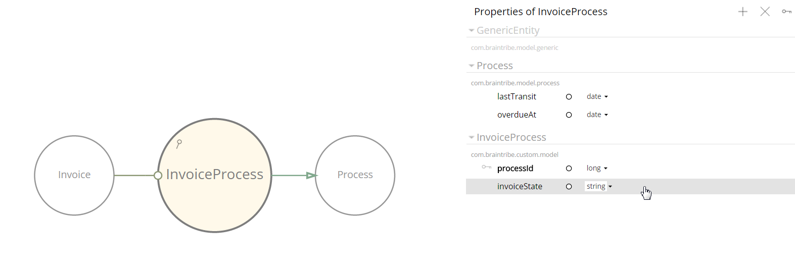

# Dataflow Engine
>The dataflow engine is used to drive processes through their designated definitions.

## General
Dataflow engine functions by manipulating the state of a trigger property from one node to the next.

It can only make valid state changes according to valid transitions – defined as two nodes connected by an edge. As the process is driven through the process definition, business logic can be applied through the use of transition processors that can affect and change information connected to an entity. Furthermore, a condition processor can be developed and used in combination with conditional edges to determine the direction of a process along multiple edges.

<iframe width="560" height="315" src="https://www.youtube.com/embed/YXtMOISI-vM" frameborder="0" allow="autoplay; encrypted-media" allowfullscreen></iframe>

## ProcessModel and Process Entity
`ProcessModel` is a model provided out-of-the-box which contains the `Process` entity. This entity forms the template for any process that you wish to develop, since it contains the properties required by the dataflow engine for both the execution of the process definition, as well as properties that record the traces which describe all steps executed in the process.

This model forms the base of your business model that contains the relevant business entities required for your process. You normally do this by creating a new model from scratch using the Process model as a dependency.

Once you have configured the model, you also need to create your process entity. The process entity can be created using Modeler, and must derive from the `Process` entity contained in the `ProcessModel`.

The process entity that you create can be considered one half of the process itself, with the other being the process definition. The state engine drives the process entity through the process flow defined in the process definition.

The `Process` entity contains two important properties that are fundamental to the process: they are `activity` and a trigger property. The activity property has three values: `Processing`, `Waiting`, and `Ended`. These are the three different statuses a process can be in when being manipulated by the state engine.

* `Processing` means that it is currently being driven through the process definition
* `Waiting` means that it is waiting for the completion of some interaction, and will be placed in an overdue node when the grace period of the node elapses
* `Ended` means that the process is complete.

The trigger property is user-defined, and should be added to your process entity. This property is assigned to the corresponding process definition as the trigger property, which is used by the state engine to watch the process. When an instance of this process entity is created, the initial state is added to this trigger property, and thus triggering the state engine, which will take the appropriate action.

To create your own process, you must create an entity that derives from the `Process` entity.

The Process-derived entity should also be defined with a property that records the current state of a process, as it is driven through the process definition by the state engine. The example below shows the `InvoiceProcess` with a defined trigger property, called `invoiceState`. This property is used to record the progress of the `InvoiceProcess` through the process definition. Its value will automatically be changed to the current state by the state engine.

The property defined above (the trigger property) is then assigned to the process definition's `trigger` property. This property is what links the process entity and the process definition together.

If your processes get more complex and multiple process definitions are in place, it will be necessary to create a custom base type deriving from the `Process` entity and having multiple derivations which define further specific logic. Those specific derivations are assigned to a respective process definition. The base type should define the trigger property and be assigned as such to the process definition at `trigger`. Property `triggerType` must be set to the respective derivation so the engine knows which concrete type to process.

## Recording the Process
The state engine records the progress of the process by the recording of traces.

This is based on the entity type `ProcessTrace` and contains a series of properties that detail the current state that the process is in. The `Process` entity contains two properties related to tracing: `Trace` and `Traces`. As the process is driven through the process flow, a `ProcessTrace` is generated at each step. The current trace is assigned to the `Trace` property, while the previous traces are placed in the `Traces` property, which contains the collection of all the traces that have been generated through the process.

Double Clicking on the `Traces` property displays the complete list.

You can restart a process by using the **Restart** option on the `Trace` entity. This restarts the process at the trace described and continues until the process is ended once more.

>If the state transition described is not valid, the process is still restarted but an exception is thrown in the console.