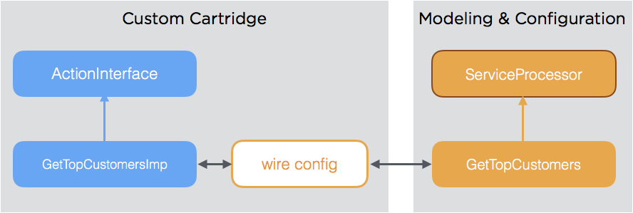
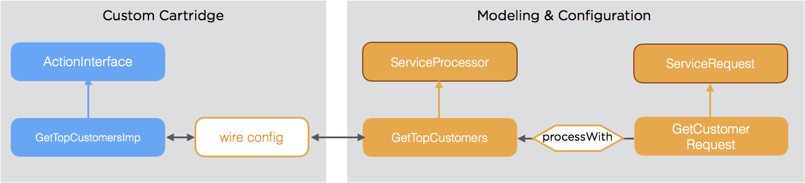
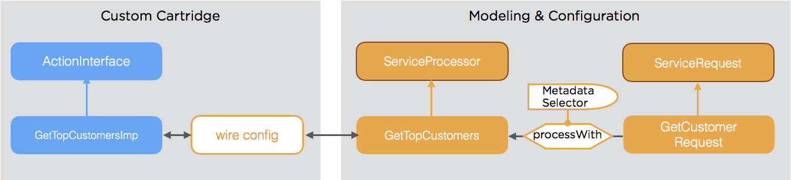
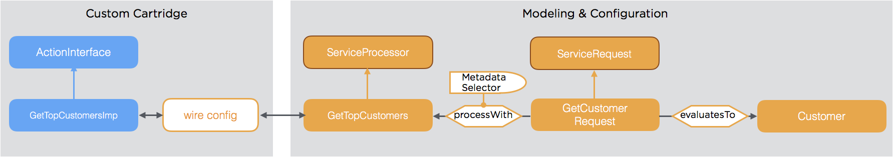
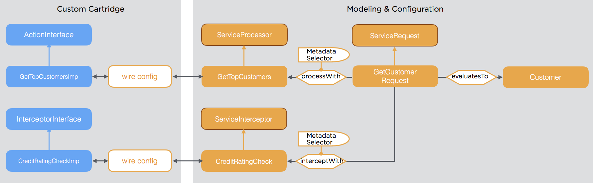

# Denotation-driven Service Architecture (DDSA)

Modeling services allows for applying the same processing as with any other entity type and interlinking them with each other which results in a network of services. The definitions of the service itself, possible requests, and expected responses are modeled and then mapped to the actual implementation. The outcomes of this principle are:

* Automatic configuration of services
* Strong AOP support via configurable interception
* Type safety
* Ability to combine/re-combine services
* Ability to apply all generic model features

## Denotation Types

Instead of thinking mainly in classical function definitions with parameter lists, we think of polymorphic entity types that identify and parameterize a normalized generic single-input/single-output function. We call those types denotation types.

The advantage is that any parameter is named and type-safe. The variety of functions within a class/interface scope is replaced by the variety of specific subtypes of a polymorphic base type. Identification is therefore much easier than in classical systems where full function/method signatures are needed to bind functionality.

### Denotation Types and Actual Service Implementations

Denotation types are linked to expert types via Wire configuration.

This principle is a logical consequence of the normalization principle, as the denotation types are modeled the same way as any other object in tribefire and the service implementations are the experts. The Wire configuration assures the association of denotation types and experts. For more information about Wire, see [wire](asset://tribefire.cortex.documentation:concepts-doc/features/wire/wire.md).

## Service Request Models

Service Requests are modeled entity types, too. The mapping to the actual service implementations is done using the following metadata:

* `ProcessWith`
* `PreProcessWith`
* `PostProcessWith`
* `AroundProcessWith`

As metadata support selective activation using selectors (e.g. role based, date based, etc.), metadata can be linked dynamically and easily with the service functionality.

### Service Request Response

The response of the service represents the type of the return result. This could either be a technical entity type or a type of a custom data model.

As the mapping of the result type is again done using metadata, this can be determined dynamically.

## Cross-cutting Concerns

Working with a normalized generic function offers a natural way to intercept any call in order to add cross-cutting concerns without any costly reflection usage. Also this is accomplished by configuring the respective metadata.

> For more information, see [Metadata](asset://tribefire.cortex.documentation:concepts-doc/metadata/general_metadata_properties.md)
