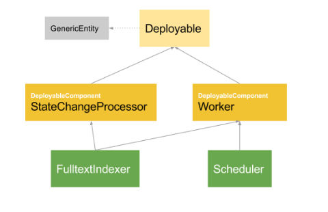

# Deployment

## General
Deployables represent configurable operational experts of the Cortex platform itself or its extensions from modules. Examples of deployables include: `ServiceProcessor`, `IncrementalAccess`, `Worker` and `StateChangeProcessor`.

You can extend existing functionality of the tribefire platform by modeling deployables, and implementing or designing new experts. You can activate each deployable by deploying it, which instantiates, initializes, binds and exposes the according expert implementation.

Deploying a deployable means to turn on a deployable, and means that the model (denotation type) and expert are bound via the wire configurations and added to the deployment registry. This allows them to be used when the relevant request is received by tribefire.

The administration of your deployables is done through the tribefire Control Center. You can select any deployable via the appropriate section of the client, for example clicking **Custom Accesses** for a new access, to create one, configure it and then finally deploy it.

## Types of Deployables
We distinguish the following basic types of deployables:
* ones that declare to be a `DeployableComponent`
* ones that inherit `DeployableComponents`

### Deployables Declaring a DeployableComponent
A deployable type that is tagged with the `DeployableComponent` metadata declares a base type that must be associated with an expert interface definition for this deployable. This deployable type must be implemented by concrete expert implementations. You can use Control Center to assign the `DeployableComponent` metadata or use the `@DeployableComponent` annotation in the code. In the diagram, `StateChangeProcessor` and `Worker` are of this kind.

### Deployables Inheriting DeployableComponents
You can derive from one or many deployables that are tagged as `DeployableComponent` to create a deployable suitable for carrying out some functionality. For each of those inherited `DeployableComponents`, the associated expert must implement the respective expert interface. Multiple inheritance is therefore explicitly supported. In the diagram, `FulltextIndexer` and `Scheduler` are of this kind.
