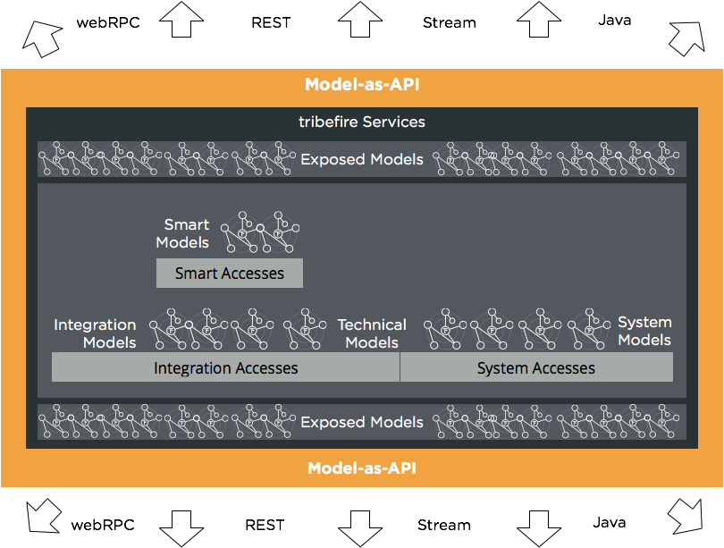

# Model-as-API
The model-as-API functionality automatically exposes each model as its own API via Java, REST, Stream, and webRPC.

## General
In tribefire, everything is modeled. This includes concrete business application as well as tribefire itself. tribefire makes no difference of what kind of model it exposes, whether you deal with an application model, a data model, a technical model, or system models.
According to the set permissions, all capabilities are exposed and can be used from the outside. The available methods are normal CRUD methods, streaming of binary sources, action calls and the invocation of custom services.

 
The model-as-API feature is supported by tribefire's way of deployment. When a model gets deployed together with its associated expert (Access, processor, etc), the Java ClassLoader performs instant type weaving, which creates Java classes automatically. Those classes can then be accessed via the supported APIs.

> For more information about models, see [Models](asset://tribefire.cortex.documentation:concepts-doc/features/models/models.md).
