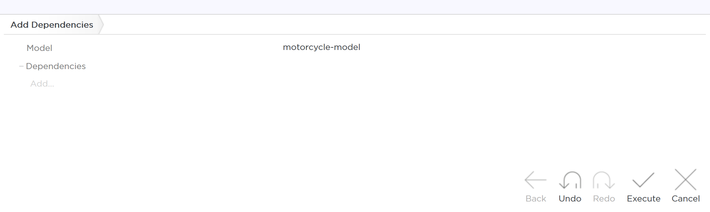

# Model-related Operations

There is a number of actions you may take on an existing model. Here, we present the actions that are available in Control Center.

## Add Dependencies

The **Add Dependencies** action adds additional models your model can use. By adding a model as a dependency, all its entities become available in the model where you add the dependency. Clicking the **Add Dependencies** action in Control Center opens a window where you can manage the dependencies of a model.

## Validate

The **Validate** action triggers a validation call which checks your model for potential violations. 

> For more information, see [Model Violations](model_violations.md).

## Deploy to Repository

The **Deploy to Repository** action publishes the model as an artifact to a Maven-compatible repository. Deploying the model to a repository allows you to later resolve it with Jinni. Deploying such models does not make them platform-asset compatible as their dependencies are not qualified/tagged and not ranged.

When deploying to repository the selected model is transformed into Java interfaces and packaged in a `.jar` file.

> Metadata attached to the model is not applied on methods of the interface.

The destination where the modeled is being deployed to is specified in `CortexConfiguration`. Once deployed, the model can be added as a dependency to code against.

> For more information on configuring `CortexConfiguration` and deploying models to repository in Control Center, see [Exporting Custom Models to Tribefire Repository](asset://tribefire.cortex.documentation:tutorials-doc/control-center/exporting_custom_models.md).

## Notify Change

The **Notify Change** action propagates the information about a change a model or its metadata to other instances.

## Add to CortexModel

The **Add to CortexModel** action adds the model as a dependency to `tribefire-cortex-model` so that it can be used from within the cortex access to configure the cortex itself.