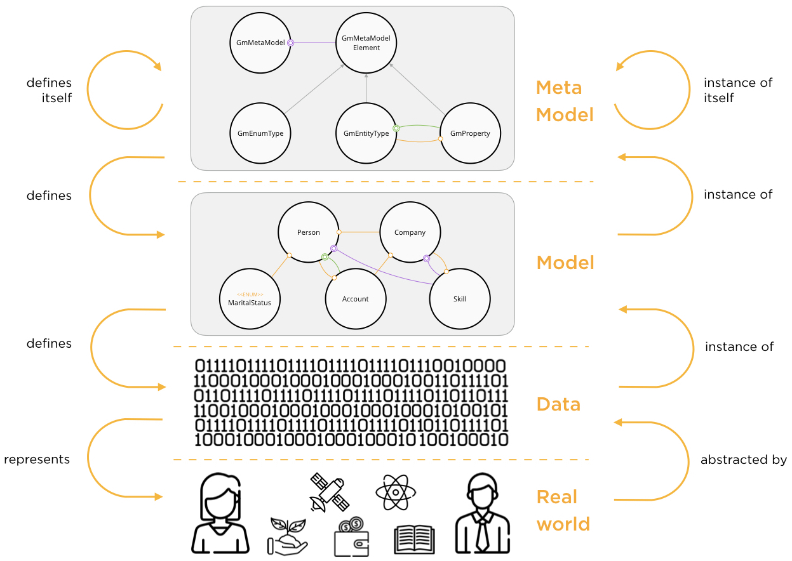
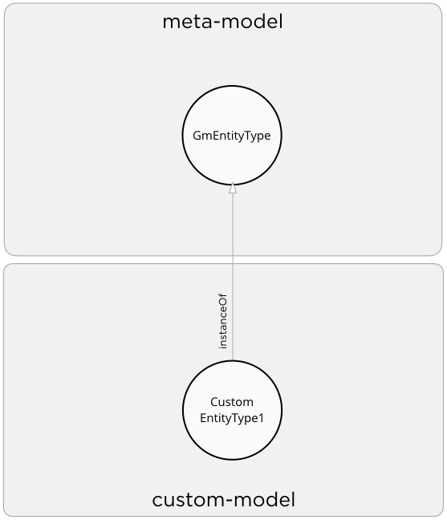
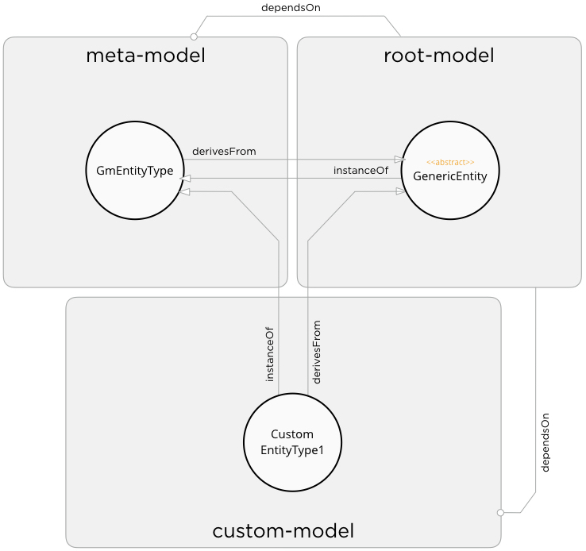
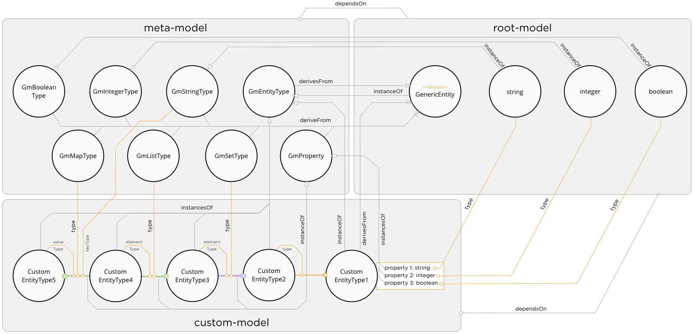
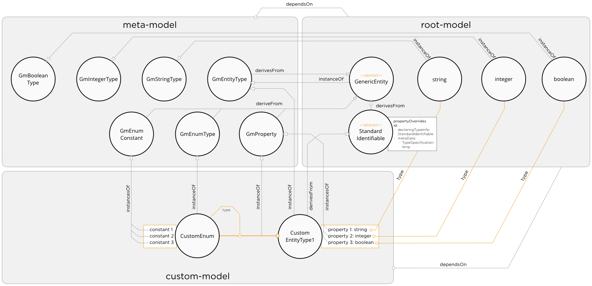

# Models in Detail

## Model Abstraction Layers

From a high-level perspective, a model is a representation of an excerpt of the real world. In tribefire, this is realized in several abstraction layers. The real world is abstracted by data representing it. This data is as diverse as the reality is, so it's hard to deal with it in a coherent way. To overcome this problem, homogeneous models are introduced that define the data in a normalized way. The data can then be considered as instances of the models and their elements.

To assure the models' homogeneity they are defined by a model, too - the meta-model, which is built with the same principles as every other model in tribefire. This way, just like the data, also models are instances of a model. The logical consequence from this approach would now be that also the meta-model is defined by a model. But instead of introducing a meta-meta-model (which would have to be defined by another model again), this is solved such that the meta-model is able to describe itself. So the meta-model is also an instance of itself, thus avoiding to introduce another modeling domain.

>For more information, see [Meta Model](asset://tribefire.cortex.documentation:concepts-doc/features/platform-models/metamodel.md).

## Custom Model Instantiation

When a model is created, all its elements are instances of the definitions provided by the meta-model, which are modeled there as entity types. 

The illustration below shows this scenario in a simplified example, where a custom entity type in a custom model is created as an instance of `GmEntityType` from the `meta-model`.

 

## Root Model

Another model that is always involved whenever a model is created is the root-model. 

`Root-model` provides the type `GenericEntity`, which acts as a marker telling tribefire that an element is to be treated as an entity type. Every entity type must have the `GenericEntity` on top of its hierarchy, so it must be included in every model. This inclusion is done via model dependency, which allows to use types declared in other models.

Using model dependencies, the included types are not copied to the local model but referenced from it. Also the type `GmEntityType` from the meta-model is an entity type so, as logical consequences, also `GmEntityType` has `GenericEntity` as its supertype and the `meta-model` has the `root-model` as a dependency. This leads to the interesting fact that `GmEntityType` derives from `GenericEntity` although `GenericEntity` is an instance of `GmEntityType`. 

This Münchhausen phenomenon is resolved during the ITW process.

>For a detailed documentation of the root-model, see [Root Model](asset://tribefire.cortex.documentation:concepts-doc/features/platform-models/rootmodel.md).

## Enriching and Skeleton Models

## Model - The Full Picture

Let's explore a more advanced scenario now, where the custom model contains two entity types, `CustomEntityType1` and `CustomEntityType2`. `CustomEntityType1` has three simple properties with the types:

* `string`
* `integer`
* `Boolean`. 

It also has a complex property which depicts a single relation.

The two custom entity types are declared as instances of `GmEntityType` and are subtypes of `GenericEntity`.

The four properties of `CustomEntityType1` are instances of `GmProperty`, which itself derives from `GenericEntity` again.

The complex property, depicting the single relation, references `CustomEntityType1` as its type. To define the three simple properties the three types `string`, `integer` and `boolean` from the `root-model` are directly referenced. Those three types are instances of `GmStringType`, `GmIntegerType` and `GmBooleanType` from the `meta-model`, respectively.

  The diagram below extends this further, by introducing three additional entity types with relations depicting different collections. The purple relation starting from `CustomEntityType2` represents a `set`, therefore its declared type is `GmSetType`, while its `elementType` (declaring what types the set can contain) is `CustomEntityType3`. 

`CustomEntityType3` is now the starting point for the green relation, which represents a `list` and is declared by having `GmListType` defined as its `type` and `CustomEntityType4` as its `elementType`. From `CustomEntityType4` to `CustomEntityType5` we can see a `map` relation (represented by the green color and the map symbol at its end). Maps are defined by declaring their type with `GmMapType`, a `keyType` - in this example defined via `GmStringType` - and an `elementType`, which is `CustomEntityType5`.

  The last example we inspect is shown on the illustration below. It introduces an `enum`-type with three constants. The enum type is declared as an instance of `GmEnumType`, whereas the constants are instantiations of `GmEnumConstant`.

Further, this example shows a convenient way to restrict the `id` property of `CustomEntityType1` to `long`. This is achieved by deriving the entity type from `StandardIdentifiable`, which is a subtype of `GenericEntity` and has a property override with a metadata config for `id` that specifies its type to `long`.

