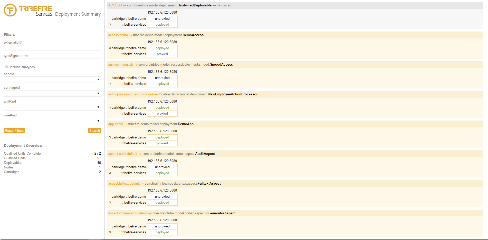
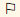

# Deployment Summary

Deployment Summary provides information about available deployables.

## General

Deployment Summary provides an overview of the deployment status of deployables within a tribefire environment. Deployment Summary is accessible via a servlet listed on the tribefire services landing page as well as using an action in Control Center. Select one or multiple deployables and on the Action Bar, navigate to **More -> Deployment Status**, and select the **Get deployment status** action.

> By default, Deployment Summary displays all available deployables.

## Quantitative Overview

Deployment Summary also presents a quantitative overview of deployables using the following units:

Unit | Description
-----| -----------
Qualified Units Complete | The number of complete qualified unit instances.   A qualified unit instance is defined as complete when all the responses from all `InstanceIds` (`com.braintribe.model.service.api.InstanceId`) are complete. In other words, the Multicast Request returns a success message each.
Qualified Units | The number of qualified units.   A `QualifiedUnit` represents a reflected `DeployedUnit` (`com.braintribe.model.deploymentreflection.DeployedUnit`) on a specific `InstanceId` (`com.braintribe.model.service.api.InstanceId`).
Deployables | The number of Deployables from all cartridges and nodes.
Nodes | The number of nodes in the distributed system.
Cartridges | The number of cartridges in the distributed system.

## Filtering Results

The deployment summary page can display big amounts of data. You can filter the deployables by the following criteria:

Filter | Description
-----| -----------
`externalId` | Filters by the externalId attribute. You can use specific and like searches to find your access, for example:   - to search for concrete `some.access`, type `some.access`   - to search for all deployables that end with access, type `*access`   - to search for all deployables containing access, type `*access*`   You can also search for multiple IDs by dividing them with a comma, for example, search for `some.access,*cortex*,*workbench`
`typeSignature` | Filters by the type signature. You can use the simple name or the fully qualified name, for example, `HardwiredAccess` produces the same result as `com.braintribe.model.accessdeployment.HardwiredAccess`
include subtypes | Specifies whether to return subtypes of the specified type signature.
`nodeId` | Filters by available nodes in the distributed tribefire environment. You can select one of the available options from the drop-down list.
cartridgeId | Filters by available cartridges in the distributed tribefire environment. You can select one of the available options from the drop-down list.
`unitKind` | Filters by cartridge location. You can select one of the available options from the drop-down list:   - Local: A `DeployedUnit` is defined as local, if its implementation is located in the current cartridge.   - Proxy: A DeployedUnit is defined as a proxy, if its implementation is located in another cartridge.
`wireKind` | Filters by the location of the deployable definition. You can select one of the available options from the drop-down list:   - Dynamic: A dynamic Deployable is defined within an extension point (cartridge) and not wired into TFS.    - Hardwired: A hardwired Deployable is defined in TFS configuration files directly, therefore automatically deployed (in contrast to Deployables deployable via Control Center)

> The different filtering options you apply are appended to the URL which allows for convenient reuse of the same filters.

## Deployable View

The following information is displayed about each deployable:

* unit and wire kind information
* fully qualified name
* IP and cartridge the deployable originates from 
* deployment status

The flag icon  specifies the cartridge the deployable originates from. A deployable can only be either deployed or undeployed in its cartridge of origin. All other cartridges per node can either have the deployable in a proxied or unproxied state. This depends on whether proxying is enabled.

Status | Description
-----| -----------
deployed | The deployable is successfully deployed.
proxied | The deployable is known by the cartridge - proxying for this component kind is enabled.
undeployed | The deployable is undeployed.
unproxied | The deployable is not known by the cartridge - proxying for this component kind is disabled.

> For information on how to enable proxying, see [Developing Cartridges](asset://tribefire.cortex.documentation:tutorials-doc/cartridge/developing_cartridges.md#wiring-denotation-type-to-the-expert-type).

### Deployment Status Detailed View

You can open the detailed view by clicking on the status of a deployable.

The detail view provides information on the wiring of the deployable’s components. The `beanSpace::beanName` information for the supplied implementation and the component binder is displayed. When you press the info icon the fully qualified `beanSpace` and an identity hint is displayed. The identity hint identifies the respective descriptor (`hashCode`). The `DeployedComponent` class provides more information on descriptors.
