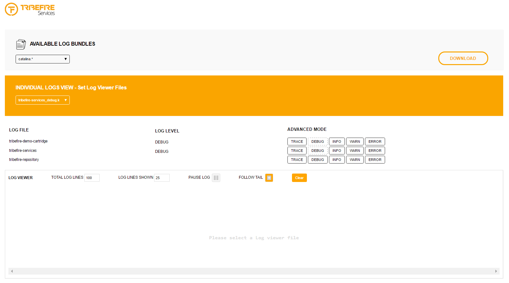

# Logs

The tribefire Logs service provides a UI which displays and allows you to administer various log files.

## General

The tribefire Logs service reads the log files, displays them in a console, and provides them as a downloadable resource. Also, depending on the information you need, the service allows you to set the log levels at runtime.

tribefire Logs allow you to:

* download log bundles
* display individual log files in real time using the Log Viewer
* change the log level

## Log Bundles

In the Available Log Bundles section, you can select a log bundle and download it as a `.zip` file. You select a log bundle by choosing one of the entries from a drop-down menu. The logs are grouped by log level and their respective cartridge. You can also download Tomcat log bundles.

## Log Viewer

The Log Viewer section allows you to display log files in real time. You can choose which log file to display by selecting an entry from a drop down menu. The section also provides information about the log level of each log file. If you want to change the log level for a particular log file, you simply need to click on the desired log level button.

> The currently active log level is displayed in the Log Level section and is indicated by a dotted line in the Advanced Mode section. This feature only works with Tomcat.