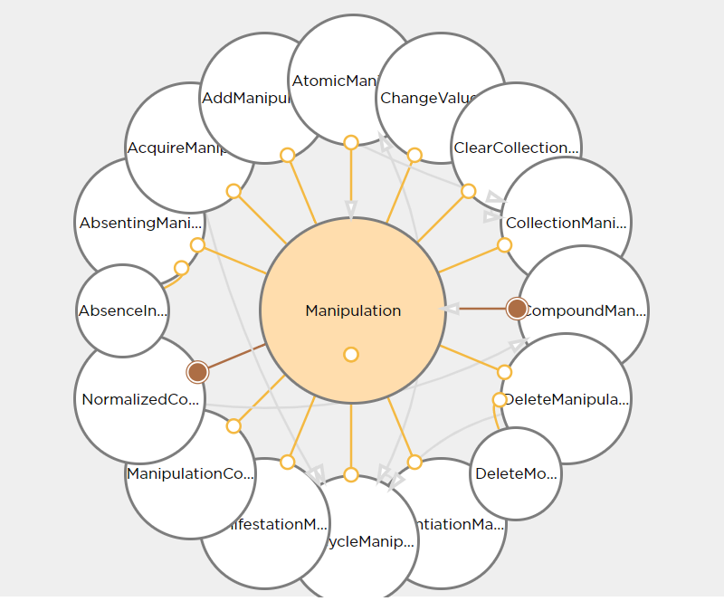

# Manipulation Model
The manipulation model is one of the most central models in the GM environment. It is basically able to reflect any modification of a GE entity, using a number of types described below.

The Manipulation Model describes operations related to instances of any model, such as:

* instantiation
* deletion
* property changes

This model is supported by an expert system which can actually reproduce these operations on the addressed entities at different locations (e.g. Server, Client, Peer). Furthermore, a specific DSL allows to have a short notation of these manipulations.

With the help of so called property-access interceptors, which are a fundamental part of the runtime model reflection, manipulation instances from the `ManipulationModel` are automatically generated and recorded whenever instances of a model are acted upon.

The conjunction of the manipulation recording and expert system allows for the following essential features:

* Undo/Redo
* Trasactions
* Collaborative Incremental Persistence (Event Sourcing)
* Auditing
* Aspect Orientation
    * Security
    * State processing
* General support of the Model View Controller paradigm in user interfaces 

## Types in Manipulation Model

### Manipulation
Manipulation is the basic entity in the model. It has a single property - `inverseManipulation` (`Manipulation` type, naturally), i.e. the manipulation that would undo the current manipulation.

This type serves as a super-type for `AtomicManipulation` and `CompoundManipulation`. Indirectly, all manipulations depend on it:

#### AtomicManipulation
An atomic manipulation represents a single manipulation standing by itself. It's a super-type for `LifecycleManipulation` and `PropertyManipulation`.

##### LifecycleManipulation
This manipulation is a super-type for manipulations describing the entity life cycle.

###### InstantiationManipulation
This manipulation denotes the instantiation of an entity.

###### AcquireManipulation
This manipulation is essentially an instantiation with a condition. It is an instruction to look up an existing instance by a given `id`, and if it's not found, create a new one. 

###### DeleteManipulation
This manipulation denotes the deletion of an entity instance.

###### ManifestationManipulation
*Manifestation* is not really a manipulation, in that it doesn't represent any change, but instead it is used to notify *listeners* that there is a new instance.

Tribefire uses manipulation listeners a lot. What that means is that certain components register themselves to be notified when a particular change happens. A good example could be the modeler UI, specifically the property panel on the right hand side, which shows property values of the currently selected entity. If the property is changed, for example via some action (`ChangeValueManipulation` is executed, for example), the property panel is updated automatically thanks to this mechanism.

Manifestation is used when it's relevant in context of entity listeners, for example when the entity is returned in the query results, even though the entity itself is not new (it was not created at the current moment). One could say it tells the listeners that this entity, which already existed, has now "entered the room" (i.e. became relevant - manifested itself - in some listener context).

##### PropertyManipulation
A `PropertyManipulation` is a manipulation that acts on a property. Obviously, it has an `owner`, i.e. the entity which is the container for the property. Every property has an owner, therefore, a property manipulation must also declare its owner. An owner can refer to an entity’s property.

#### CompoundManipulation
A compound manipulation contains several other manipulations. It's also a super-type for `NormalizedCompoundManipulation`.

CompoundManipulation has a single property - `compoundManipulationList` (`List<Manipulation>` type), which is the list of manipulations contained in the compound manipulation.

## What's Next?
For information on manipulating instances of the manipulation model, see [Generic Model Manipulation Language](../gmml.md).