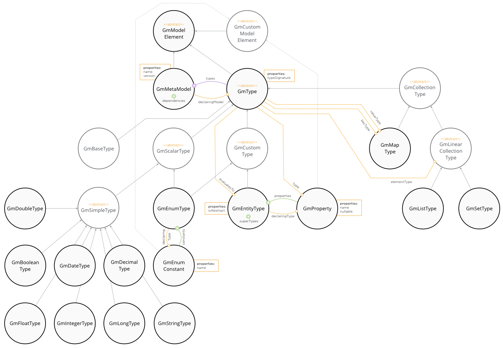
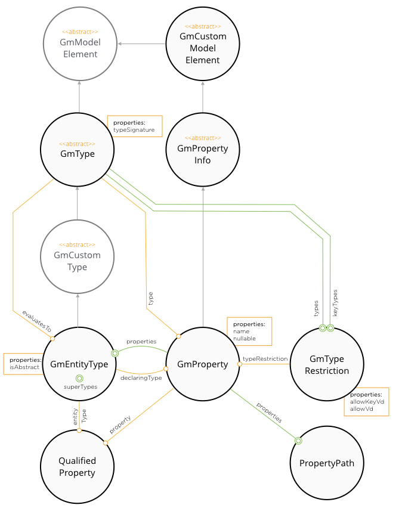
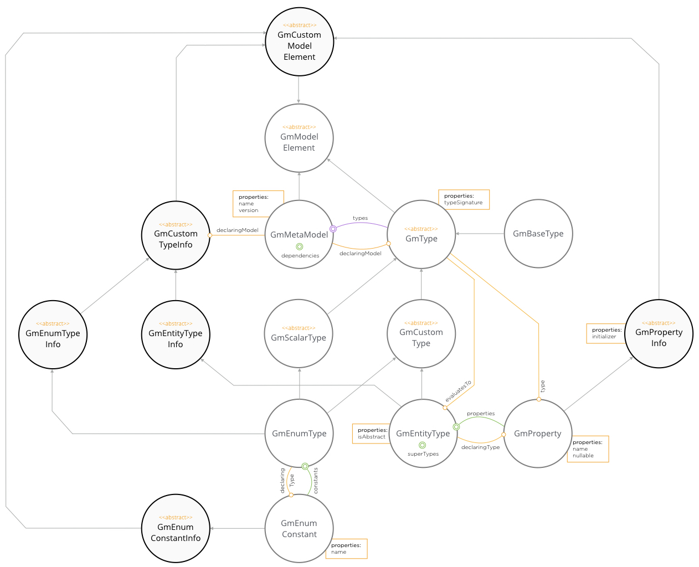

# Meta Model

`meta-model` is a model that describes models.

## The name

If the name was analogous to other models it would be called `model-model`, just like a model for animals would be called `animal-model`.

## General

The main entity type is `GmMetaModel` which denotes a model.

> Note this name is slightly misleading, the correct name would be `GmModel`, but because of the type's importance it would be hard to change it.

A model instance reflects the types the model declares and what other models it depends on.

In this article, we will explore its structure and inspect its elements.

> For general information about models, see [Models](asset://tribefire.cortex.documentation:concepts-doc/features/models/models.md).

## Basic Structure

Below you can find an overview of the meta-model's basic structure, depicting its most relevant elements.

### Important Elements

Type | Abstract | Purpose | Properties 
---- | ---- | ---- | ---- | ---- 
`GmMetaModel` extends: `GmModelElement` | false | Depicts models and the meta-model itself | name: `string`  version: `string`  types: `set<GmType>`
`GmModelElement` extends: `StandardIdentifiable` | true | Super type for meta-model elements |
`GmType` extends: `GmModelElement` | true | Super type for all types | typeSignature: `string`  declaringModel: `GmMetaModel`
`GmEntityType` extends: `GmCustomType` | false | Custom GM-types | superTypes: `set<GmEntityType>`  properties: `set<GmProperty>`  evaluatesTo: `GmType`  isAbstract: `boolean`
`GmProperty` extends: `GmPropertyInfo` | false | Custom GM-model element to depict details of an entity type | name: `string`  isAbstract: `boolean`  type: `GmType` declaringType: `GmEntityType`
`GmMapType` extends: `GmCollectionType` | false | GM-collection type allowing to hold elements depicted by key-type and value-type | keyType: `GmType`  valueType: `GmType`
`GmLinearCollectionType` extends: `GmCollectionType` | true | Super type for linear collection types | elementType: `GmType` |
`GmListType` extends: `GmLinearCollectionType` | false | Linear GM-collection type allowing to hold a number of ordered elements depicted by elementType |
`GmSetType` extends: `GmLinearCollectionType` | false | Linear GM-collection type allowing to hold a number of un-ordered elements depicted by elementType |
`GmBaseType` extends: `GmType` | false | `GmType` of properties with the type `object` |
`GmSimpleType` extends: `GmScalarType` | true | Super type for simple scalar types |
`GmBooleanType` extends: `GmSimpleType` | false | `GmType` of properties with the type `boolean` |
`GmDateType` extends: `GmSimpleType` | false | `GmType` of properties with the type `date` |
`GmDecimalType` extends: `GmSimpleType` | false | `GmType` of properties with the type `decimal` |
`GmFloatType` extends: `GmSimpleType` | false | `GmType` of properties with the type `float` |
`GmIntegerType` extends: `GmSimpleType` | false | `GmType` of properties with the type `integer` |
`GmLongType` extends: `GmSimpleType` | false | `GmType` of properties with the type `long` |
`GmStringType` extends: `GmSimpleType` | false | `GmType` of properties with the type `string` |
`GmDoubleType` extends: `GmSimpleType` | false | `GmType` of properties with the type `double` |

## GmProperty

Allows to instantiate properties, which depict the details of an entity type.

### Important Elements

Type | Abstract | Purpose | Properties
-------- | -------- | -------- | -------- | -------- 
`GmProperty` extends: `GmPropertyInfo` | false | Custom GM-model element to depict details of an entity type | name: `string`  nullable: `boolean`  type: `GmType` declaringType: `GmEntityType`  typeRestriction: `GmTypeRestriction`
`GmTypeRestriction` extends: `GmModelElement` | false | Allows to restrict which type a property can have | types: `list<GmType>` Definition of allowed types  keyTypes: `list<GmType>` Used for restriction on map-keys  allowVd: `boolean` Allow the use of value descriptors, e.g. `now()` for date-values  keyAllowVd: `boolean` Similar to `allowVd`, but for map-keys
`QualifiedProperty` extends: `StandardIdentifiable` | false | Used to reference a property along with a given entity | property: `GmProperty`  entityType: `GmEntityType`
`PropertyPath` extends: `StandardIdentifiable` | false | Standard representation of property path, e.g. `Company.ceo.companyCar.brand` | properties: `list<GmProperty>`

## Info Types

Info-Types allow to enrich model elements to make them more specific to their nature.

### Important Elements

Type | Abstract | Purpose | Properties
-------- | -------- | -------- | -------- | -------- 
`GmCustomModelElement` extends: `GmModelElement` | true | Super-type for all info-types |
`GmCustomTypeInfo` extends: `GmCustomModelElement` `HasMetadata` | true | Provides the properties `metadata` and `declaringModel` to its sub-types. | declaringModel: `GmMetaModel`
`GmEntityTypeInfo` extends: `GmCustomTypeInfo` | true | Enriching of entity types. | See [Overrides](#overrides) and [Metadata](#metadata)
`GmEnumTypeInfo` extends: `GmCustomTypeInfo` | true | Enriching of enum types. | See [Overrides](#overrides) and [Metadata](#metadata)
`GmEnumConstantInfo` extends: `GmCustomModelElement`, `HasMetadata` | true | Enriching of enum constants. | See [Overrides](#overrides) and [Metadata](#metadata)
`GmPropertyInfo` extends: `GmCustomModelElement`, `HasMetadata` | true | Enriching of properties. | initializer: `object` See [Overrides](#overrides) and [Metadata](#metadata)

## Overrides

Overrides allow to apply metadata without changing the original entity. Without an override a metadata configuration on a type from model dependency will apply on that model globally. With an override this can be avoided - the configuration will only apply to your local model. 

In addition, metadata allows you to change the `declaringTypeInfo`, i.e. although a property might be inherited, its origin can be mimicked such, that the sub-type seems to be the declaring type. Further, overrides allow to specify initial values on inherited properties without changing them at the origin.

> See the [Metadata](#metadata) section for a use-case.

### Important Elements

Type | Abstract | Purpose | Properties
-------- | -------- | -------- | -------- | -------- 
`GmCustomTypeOverride` extends: `GmCustomTypeInfo` | false | Abstract super-type for GmEntityOverride and GmEnumTypeOverride. Referenced from `GmMetaModel` via `typeOverrides` |
`GmEntityTypeOverride` extends: `GmCustomTypeInfo` | false | Specific override for entity types | propertyOverrides: `list<GmPropertyOverride>`  entityType: `GmEntityType`
`GmEnumTypeOverride` extends: `GmCustomTypeInfo` | false | Specific override for enum types | constantOverrides: `list<GmEnumConstantOverride>`  enumType: `GmEnumType`
`GmEnumConstantOverride` extends: `GmEnumConstantInfo` | false | Overrides enum constants | declaringTypeOverride: `GmEnumOverride`  enumConstant: `GmEnumConstant`
`GmPropertyOverride` extends: `GmCustomModelElement` | false | Overrides properties | declaringTypeInfo: `GmEntityTypeInfo`  property: `GmProperty`

## Metadata

Metadata are used to configure models specifically to use cases. To enable this, the meta-model has a dependency to the basic meta-data-model.

> For more information, see [Metadata](../../metadata/metadata.md).

### Important Elements

Type | Abstract | Purpose | Properties | Overrides
-------- | -------- | -------- | -------- | --------  | -------- 
`HasMetadata` extends: `GenericEntity` | true | Abstract type from meta-data-model. Has property `metadata` to be inherited by custom types, properties and enum constants | metadata: `Metadata`
`Metadata` extends: `StandardIdentifiable` | true | Abstract type from meta-data-model. Provides the actual metadata configuration. | conflictPriority: `double`  important: `boolean`  inherited: `boolean`  selector: `MetaDataSelector`
`GmEntityTypeInfo` extends: `GmCustomTypeInfo` | true | Enriching of entity types. Makes use of [overriding](#overrides). | propertyMetadata: `set<Metadata>` | propertyOverride:`TypeRestriction`  types:`PropertyMetaData` `UniversalMetaData`
`GmEnumTypeInfo` extends: `GmCustomTypeInfo` | true | Enriching of entity types. Makes use of [overriding](#overrides). | enumConstantMetadata: `set<Metadata>` | propertyOverride:`TypeRestriction`  types: `EnumConstantMetaData` `UniversalMetaData`  propertyOverride: `metadata`  declaringTypeInfo: `GmEntityTypeInfo`
`GmPropertyInfo` extends: `GmCustomModelElement`, `HasMetadata` | true | Enriching of properties. Makes use of [overriding](#overrides). | initializer: `object`  | propertyOverride:`metadata`  declaringTypeInfo: `GmPropertyInfo`
`GmEnumConstantInfo` extends: `GmCustomModelElement`, `HasMetadata` | true | Enriching of enum constants. Makes use of [overriding](#overrides). | initializer: `object`  | propertyOverride:`metadata`  declaringTypeInfo:  `GmEnumConstantInfo`