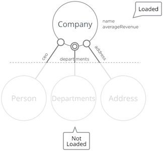
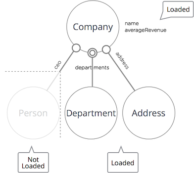
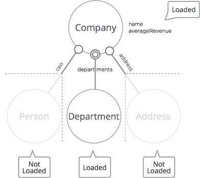

# Traversing Criteria
Traversing criteria allow you to decide how much information is returned for a query.

## General
Traversing criteria is our implementation of the lazy/eager loading concept, which allows you to return absent information for specific elements that can be loaded at a later point. The main benefit of lazy loading is it lowers the cost of your search, as you can target the data returned, rather that returning a large amounts of data, lowering transmission costs.

The default behavior is as follows:
* simple types and enums are loaded immediately
* accessing complex types triggers further query

Configuration for customized behavior is done via traversing criteria. The traversing criterion is defined by patterns which can be created by the static class `TC`.



## Lazy Loading and Eager Loading
With traversing criteria, you can specify what information to load when retrieving a network of entities.

## Traversing Criteria Examples

### Lazy Loading of One Complex Property


```java
TraversingCriterion traversingCriterion =
    TC.create()
        .pattern()
            .entity(Company.T).property("ceo")
        .close()
    .done()
query.setTraversingCriterion(traversingCriterion);
```

### Lazy Loading of Two Complex Properties


```java
TraversingCriterion traversingCriterion =
    TC.create()
        .pattern()
            .entity(Company.T).property("ceo")
        .close()
        .pattern()
            .entity(Company.T).property("address")
        .close()
    .done();
query.setTraversingCriterion(traversingCriterion);
```

You can achieve the same result using a disjunction:
```java
TraversingCriterion traversingCriterion =
    TC.create()
        .pattern()
            .entity(Company.T)
            .disjunction
                .property("ceo")
                .property("address")
            .close()
        .close()
    .done();
query.setTraversingCriterion(traversingCriterion);
```

## What's Next?

For more information about how to use traversing criteria, see [Traversing Criteria in Detail](traversing_criteria_in_detail.md).
