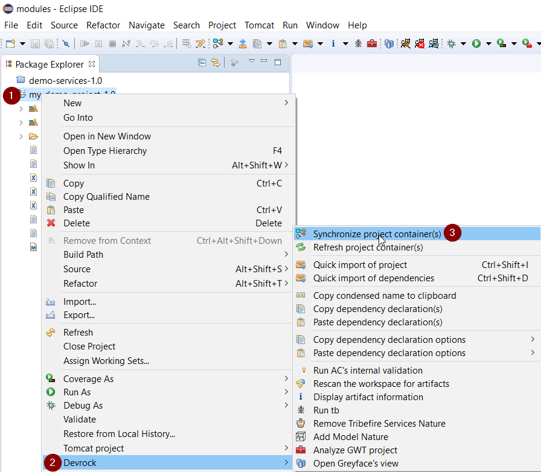

# Debugging Tribefire Projects
This page explains how to set up and run your Tomcat-based Tribefire application from Eclipse.

## Prerequisites

* [Jinni](asset://tribefire.cortex.documentation:development-environment-doc/quick_installation_devops.md) is installed
* [Eclipse](https://www.eclipse.org/downloads/) is installed
* Latest [DevRock suite](asset://tribefire.cortex.documentation:development-environment-doc/devrock/devrock.md) for Eclipse is installed
* [ant](https://ant.apache.org/bindownload.cgi) with latest [bt-ant-tasks library](https://artifactory.server/artifactory/webapp/#/artifacts/browse/tree/General/devrock/com/braintribe/devrock/ant/bt-ant-tasks) is installed.
* Tomcat plugin for Eclipse (version 8.x or later)

> Important: on Windows, all checked-out artifacts, ant, Eclipse, and jinni should be kept in a single folder. This folder should be added to the exception list in **Windows Virus & threat protection settings**. Otherwise, Windows will scan all downloaded files one-by-one, causing performance problems.

## Setting up a Debug Tomcat Project

1. In a directory of your choice, run the standard `jinni setup-local-tomcat-platform` command with **--debugProject** flag followed by `groupId:projectName`. Example for Tribefire Demo Setup (previously Demo Cartridge) would look as follows:

    ```
    > jinni setup-local-tomcat-platform --installationPath tribefire --setupDependency tribefire.extension.demo:demo-se
    tup#2.0 --deletePackageBaseDir true --debugProject tribefire.extension.demo:my-demo-project
    ```

    >Replace the values of `--installationPath`, `--setupDependency`, and `--debugProject` accordingly.

2. Open Eclipse. Select **File -> Import**. Import view opens.
3. Select **General -> Existing Projects into Workspace**, then **Next**.
4. Click **Select Root Directory** and provide the installation directory of your project, which should appear in **Projects** view below. Select it and click **Finish**. Your project is imported into your Eclipse workspace.

5. Synchronize your project dependencies with the global repository:

    

    > This option is not available without the DevRock suite.

    This action creates the **.#webclasspath_ac** file (turn off the **.resources** filter and refresh your project to see it in Eclipse). You won't be able to start the server without this file.

6. Go to **Window -> Preferences -> Tomcat** and make sure that Tomcat home is set correctly. It should point to `project_installation_directory/tribefire/runtime/host`.

7. Start Tomcat. When Tomcat is started, you should now be able to access Tribefire from the address set in the `TRIBEFIRE_LOCAL_BASE_URL` runtime property (**localhost:8080** is the default value). Happy debugging!


