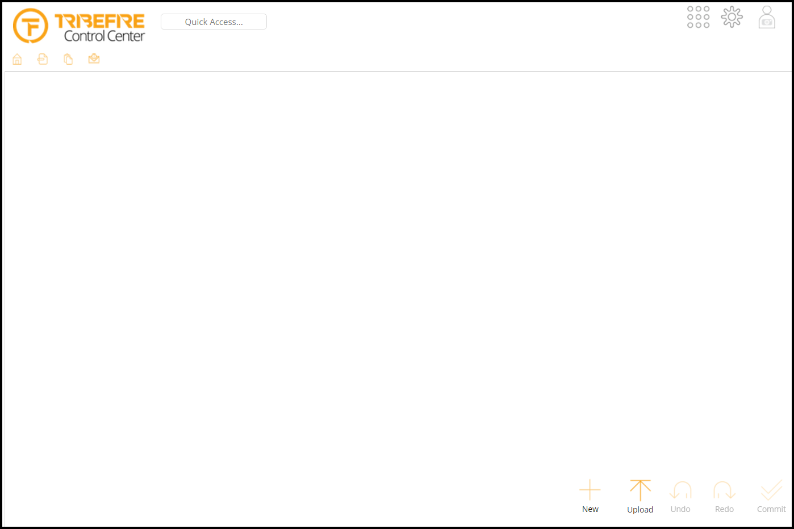

# Explorer

Explorer is used as a generic client for an `IncrementalAccess`. It allows you to view and modify data (`CRUD`) and evaluate service requests.

## General

For normal setups you can access the `Explorer`, which is a web application, using the address of the machine hosting tribefire followed by `tribefire-explorer`. Locally it is: `http://localhost:8080/tribefire-explorer`.

Default login credentials are `cortex` for both username and password.

## Workbench configuration
To configure the layout for a given access a companion `workbench access` must be configured.

If no `workbench access` is configured, the client looks empty, only offering so called `Quick Access` which allows searching for data and request types based on their names.

 

## NOTE

What follows is an outdated documentation. It uses the term `Control Center` for a slightly differently configured `Explorer` which we used to view system accesses like `cortex`, an access which stores `Tribefire` configuration.

# Legacy Control Center Documentation

> For information on how to use Control Center, see [Using Control Center](asset://tribefire.cortex.documentation:tutorials-doc/control-center/using_control_center.md)

The client is used to view the different system accesses – system configurations including the main **Cortex** access, along with accesses for user-sessions and statistics, audit trails, and the standard authentication accesses.

It functions by displaying the different system accesses which are then used to administer tribefire. There are several different accesses which can be viewed by Control Center, but the basic display of the client never changes. The default access, that is, the open is first displayed on opening, is  **Cortex**, the main access for tribefire administration.

 
The left-hand side of the client displays the links to the different components that are being configured, while in the main area of the screen it shows the different items for each section in context.

Control Center is fully customizable through the use of workbenches, and can be configured to behave in any way you require.

### Packaging

Control Center is delivered as part of the standard installation of tribefire and deployed as a `.war` to the J2EE container, alongside the core system, tribefire Services. Once deployed, no further configuration is required and you can access Control Center at `http://localhost:8080/tribefire-control-center/`

## Cortex Access in Control Center

The primary access and the default access shown after logging into the Control Center, the Cortex access is the GUI representation of the Cortex database, which contains the system configuration. Via the client, all system and cartridge related items – access, processors, models, actions, and so on – can be created, configured, and deployed.

The Cortex access has its own links, displayed on the left-hand side of the client, for ease of use. Each link relates to a configurable component in the Cortex access.

### Other Accesses in Control Center

Alongside the Cortex access, there are also a set of other system accesses – databases relating to a different area of concern in the tribefire system. They can be accessed by using the **Switch to** function.

Included are accesses that allow:

* control of default user authentication and authorization user registry, where administrators can assign roles and groups for each user,
* displaying information of user sessions, statistics, and an audit trail, showing all manipulations of the Cortex database

## Workbench

Workbench in the context of tribefire is a concept that allows you to design and modify the way the different accesses are displayed in Control Center and Explorer. It enables uses to create their own custom queries and actions to be displayed in the client. The implementation of the actions can be developed in a cartridge and then configured using the workbench.

Workbench is made up of two elements, the workbench model and the workbench access. The access is assigned to the main access it is associated with, i.e. the access the workbench is used to design. Switching to this workbench access, in either Control Center or Explorer (depending if you are customizing a system or a custom access), allows the customization of these elements.

You can easily add an access to a workbench by using the **Create Workbench Access** action on the appropriate access.

### Workbench Model and Workbench Access

As with every concept in tribefire, the workbench is modeled. This model describes the elements required when customizing the design of an access, such as Folder, Query, Action entities and so on. There is one standard workbench model, which is delivered as part of the core tribefire platform and is considered one of its base models. This model can be used every time a new workbench access is required.

As part of the design pattern of tribefire, every model requires a corresponding access for actual use in the platform. The model provides the structure for the data and the access is the implementation that stores or accesses that data. This is the same for workbench, the model describes the structures required for a workbench and the access stores that actual instances of these structure.

When a new access requires a workbench, a new instance of the workbench access is created. It is a base SMOOD access associated with the workbench model. This is done automatically through the **Create Workbench Access** action.

### Workbench Configuration

On 'Switching to' to the workbench access, the client provides a GUI for the configuration of workbench, including links for the main components of any workbench configuration, such as actions, queries and folders. This can be used to design the main access.

