# UI Elements

>There are several components that make up the construction of Control Center/Explorer.

## General

Control Center and Explorer are constructed of the following components:
* GIMA
* Selection
* Thumbnail
* Assembly
* Property
* Quick Access
* Automatic Queries
* Global Actions
* Metadata Editor
* Select Result Panel
* Service Request Panel

## GIMA
The GIMA component, which stands for Guided Instantiation and Manipulation Assistant, is the UI which is displayed when you create a new entity instance, or also when you edit that instance. It allows you to define or change the properties of the entity.

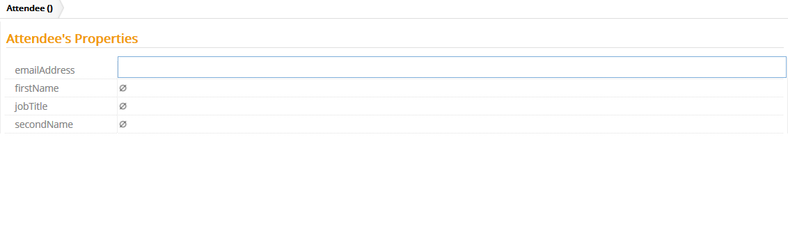

## Selection
The selection component, also known as the Selection Constellation, is the UI you use to add new or existing elements to properties. It allows you to select a existing instance or create a new one based on an entity type. The selection constellation also allows you different views that can be used.

You can choose between the different views by clicking on one of the buttons displayed at the top of the Selection Constellation UI.

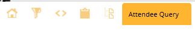

* Clicking  displays the home screen in Selection Constellation.
* Clicking  displays the Quick Access component in Selection Constellation, allowing you to choose between an existing instance of an entity or creation of a new one based on an entity type.
* Clicking  displays the changes screen in the Selection Constellation. This shows all changes that have been made to tribefire which have yet to be persisted.
* Clicking  displays the Clipboard screen in the Selection Constellation.
* Clicking  displays the Workbench in the Selection Constellation.
* Clicking 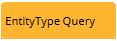 displays a query based on the type required. That is, it displays all entities of a particular type required for selection.

## Thumbnail
The thumbnail UI is the section which displays icons as opposed to details after selecting thumbnail view.

## Assembly Panel
The assembly panel refers to the main section of the tribefire. This is where the results of any query executed are displayed.

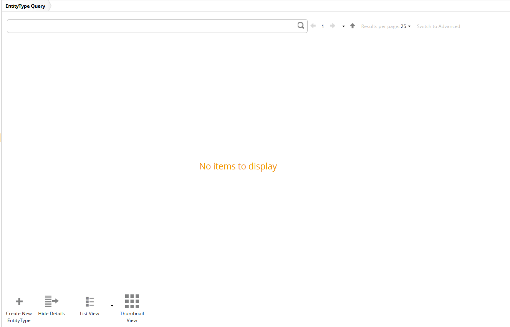

## Property Panel
The property panel refers to the panel displayed at the right-hand side of Control Center/Explorer which shows details of the currently selected entity.

You can display or hide this panel by clicking the Hide/Show Details button found at the bottom of tribefire. The property panel displays different information depending on the entity type. You can also define groups and assign properties to them to order how the properties are displayed in the property panel.

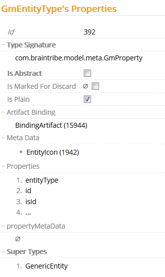

## Quick Access
The QuickAccess component refers to the panel which is displayed at the left-hand side of the screen. It displays the individual instances of entity and the entity types of the model.

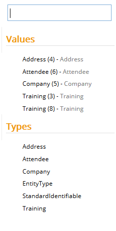

## Automatic Queries
The Automatic Queries is a Workbench component. It is used to control how the Workbench component should function if it has not yet been configured. That is, if no workbench has been deployed, or a deployed Workbench has no folders defined. If this is the case, Tribefire automatically creates folders, which are then displayed in the left-hand panel, and their associated queries.

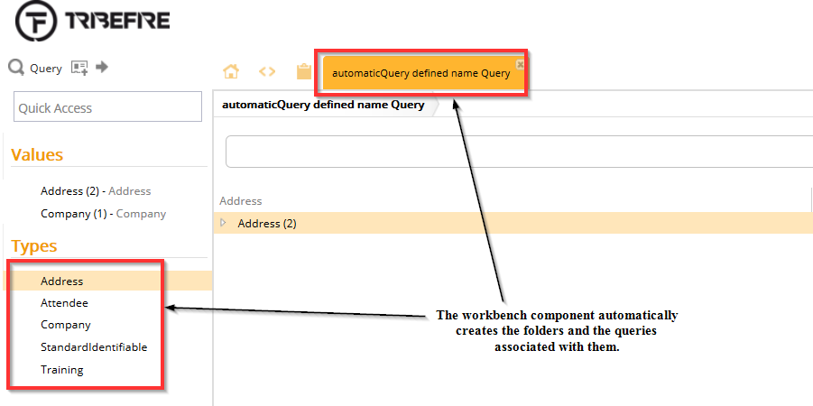

## Global Actions
The global actions panel (also known as Action Bar) allows you to create and upload resources, redo and undo, commit your changes, create a workbench access, and many more.

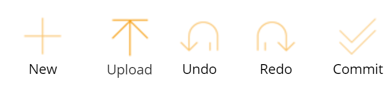

## Metadata Editor
The metadata editor allows you to perform actions on metadata. You can open the editor by double-clicking an entity type.

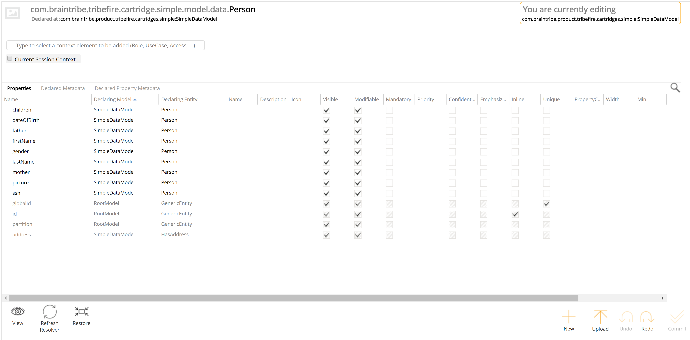

## Select Result Panel
The select result panel is displayed when you perform select queries in Explorer.

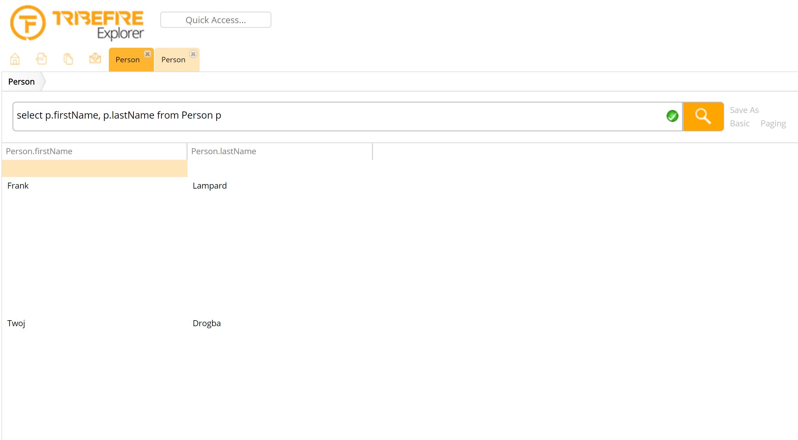

## Service Request Panel
The service request panel is a panel displayed when you double-click a Service Request in the Quick Access search box.

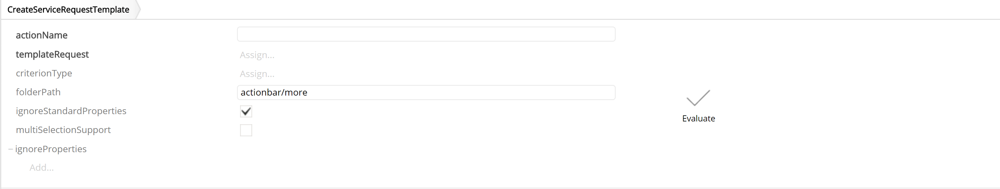

## View Action Bar
The view action bar is displayed on the right side of the GME window and allows you to perform the following actions:

* View - allows you to switch between the list and grid view, however, depending on what is opened, it is possible to switch also to Modeler or Metadata Editor (this happens when `GmMetaModel` is opened for example). In some cases it is also possible to switch to Process Designer or to WebReader.
* Maximize - allows you to maximize the assembly panel
* Hide Details - allows you to hide the property panel

> For information on how to customize the View Action Bar see [Configuring Workbench](asset://tribefire.cortex.documentation:tutorials-doc/workbench/configuring_workbench.md#view-action-bar-configuration).