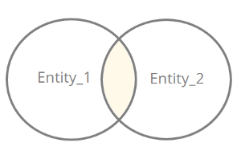
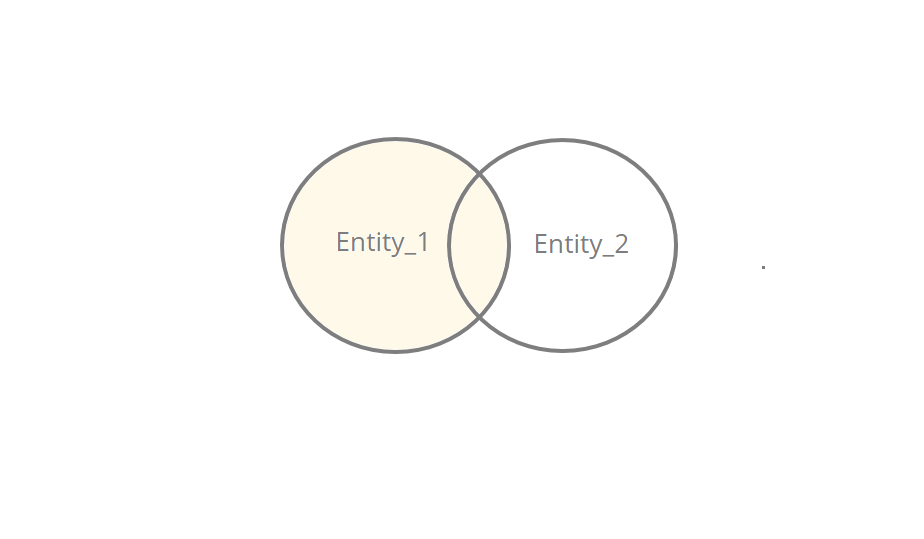
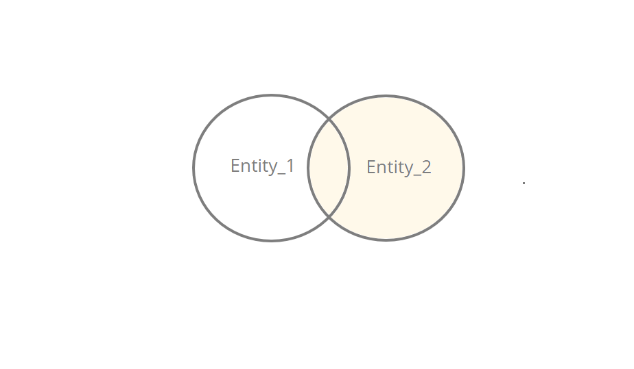
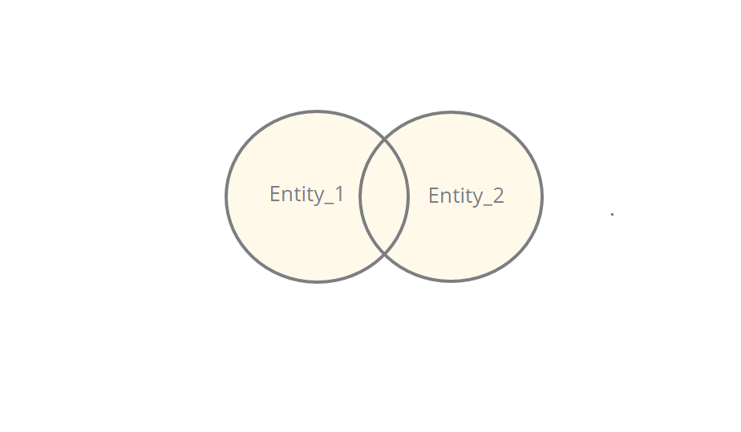
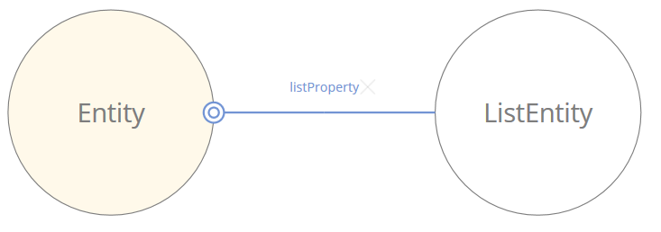
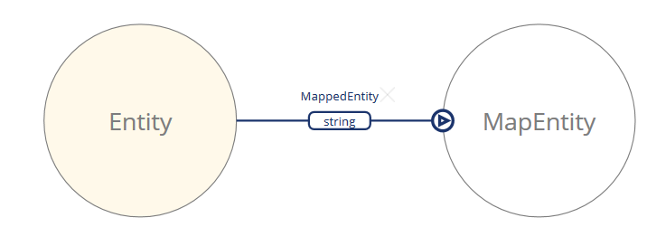

## GMQL Joins
Joins are created only where the property of the first entity to be joined is a complex or collection type. For example, the `User` entity contains a property called `roles`. This property is a collection containing multiple `Role` entities. We are able to create a join between `User` and `Role`. The results depend on the type of join being carried out.

There are four different types of joins:
* inner join – returns only those entities which have a value defined on the joined property.
* left join – returns all entities from the left-hand (that is, main) entity, and those matched in the second entity
* right join – returns all entities from the right-hand (that is, second) entity, and only those matched in the first entity
* full join – returns all entities from both entities

In addition to the four traditional joins there are also two join functions related to connections:
* listIndex(alias)
* mapKey(alias)

## Inner Join
An inner join matches results from both entities so long as the value of the join property is not null. If the value is null, no match is made an the results from both entities are not returned.

>Only select queries are capable of carrying out joins on entities.

<center>



</center>

An example of an inner join can be executed on the `User` entity, which belongs to the User Model. It contains a property called `Picture`, which represents another type, `Icon`. Creating an inner join on this property:
```
select u.firstName, u.lastName, p.name from com.braintribe.model.user.User u join u.picture p
```
will return all `User` and corresponding `Icon` results matched on the property `Picture`. This means that only `Users` which have a picture assigned will be returned, along with their corresponding `Icon` entities.

The above example, selects three properties, two from `User` and one from `Icon`, and are identified through the use of Aliases – `u` for the `User` entity and `p` for `Icon` entity – which identify the source where these properties can be found. Any entities that have a null value in the `picture` property will not be returned by this join type.

### Syntax
> Inner join requires only the join keyword.
```
select ENTITY_PROPERTIES|* from TYPE_SIGNATURE ALIAS join JOIN_PROPERTY JOIN_ALIAS
```
The following query returns all `Person` instances which have a `company` assigned to them. It will also produce the properties for that particular `company`:
```
select * from com.braintribe.model.Person p join p.company c
```

## Left Join
A left join returns all entities from the left-hand entity of the join, that is, the main entity being joined, and only instances from the right-hand entity where the value of the joined property is not null. Otherwise, the right-hand side will return a set of null results.

>Only select queries are capable of carrying out left joins on entities.



The query below joins the `User` entity with the `Role` entity on the User's `roles` property. This returns all `User` entities and their corresponding `Roles`. If the `roles` property of the `User` is null, a series of null properties on the Role-side of the join will be returned instead.
```
select u.name, r.name from com.braintribe.model.user.User u left join u.roles r
```

### Syntax
```
select ENTITY_PROPERTIES|* from TYPE_SIGNATURE ALIAS left join JOIN_PROPERTY JOIN_ALIAS
```
This returns all `Person` instances which have a `company` assigned to them. It will also produce the properties for that particular `company` if `company` is not null; otherwise null results for company are returned:
```
select * from com.braintribe.model.Person p left join p.company c
```

## Right Join
A right join returns all instances of entities from the right-hand side of the join, that is, the second entity being joined, and only those instances of the left-hand entity where the joined property is not null. Otherwise, null values are returned for the left-hand side of the join.

>Only select queries are capable of carrying out right joins on entities.



The query below creates a right join between the `User` and the `Role` entities, joining on the roles property. All `Role` instances will be returned and only those `User` entities where the value of roles is not null. If roles is null, only a null value is returned.
```
select u.name, r.name from com.braintribe.model.user.User u right join u.roles r
```

### Syntax
```
select ENTITY_PROPERTIES|* from TYPE_SIGNATURE ALIAS right join JOIN_PROPERTY JOIN_ALIAS
```
This will return all instances of the `Company` entity, as well as any instances of `Person` where the property value of company is not null. Otherwise, the corresponding left-hand side will contain null values:
```
select * from com.braintribe.model.Person p right join p.company c
```

## Full Join
A full join returns all entity instances for both entities in the join, regardless of whether the joining property is null or not. If the value of the joined property is not matched, this means that there will be instances from the left-hand side that contain nulls on the right-hand side of the join and vice versa.

>Only select queries can carry out join functions.



The below query joins the User and `Role` entities. It returns all instances of `User` and `Roles`, joined on the roles property of `User`. This means that if a `User` has no roles defined, it will be returned but with nulls on the right-hand side of the join, while if there exists `Role` instances that have not been assigned to a `User`, they are returned but with nulls on the left-hand side of the join.
```
select u.firstName, r.name from com.braintribe.model.user.User u full join u.roles r
```

### Syntax
```
select ENTITY_PROPERTIES|* from TYPE_SIGNATURE ALIAS full join JOIN_PROPERTY JOIN_ALIAS
```
This will return instances for all instances of both `Person` and `Company`. There are joined on the property `company` of `Person` and all instances of both will be returned:
```
select * from com.braintribe.model.Person p full join p.company c
```

## List Index
The list index function produces the index of a specific element within a list property, and is used in conjunction with a join. It is possible to display the index as part of the select statement, that is, display the indexes as part of the results, or as part of a value comparison.



### Syntax
To display the index of a list element:
```
select ENTITY_PROPERTIES|*|listIndex(JOIN_ALIAS) from TYPE_SIGNATURE ALIAS join JOIN_PROPERTY JOIN_ALIAS
```
To use `listIndex` as part of a value comparison:
```
select ENTITY_PROPERTIES|* from TYPE_SIGNATURE ALIAS join JOIN_PROPERTY JOIN_ALIAS where listIndex(JOIN_ALIAS) OPERATOR OPERAND
```
The following query produces the index for each element of the property `companyList`.
```
select cl.name,listIndex(cl) from com.braintribe.custom.model.Company co join co.companyList cl
```
The following example is used to create a value comparison for the `listIndex` function. It will return only those elements in the `companyList` which have the index of `1`; in effect, returning only the second position items in each `companyList`.
```
select cs.name from com.braintribe.custom.model.Company o join o.companyList cs where listIndex(cs) = 1
```

## Map Key
The Map Key function produces the key values of a map and is used in conjunction with a join on a map type property. It is used to display the key value as part of results returned or as part of a value comparison.




### Syntax
To display the map key as part of returned results:
```
select ENTITY_PROPERTY|*|MapKey(JOIN_ALIAS) from TYPE_SIGNATURE ALIAS join JOIN_PROPERTY JOIN_ALIAS
```
To use the `mapKey` function as part of a value comparison:
```
select ENTITY_PROPERTY|* from TYPE_SIGNATURE ALIAS join JOIN_PROPERTY JOIN_ALIAS where mapKey(JOIN_ALIAS) OPERATOR OPERAND
```
Using `mapKey` as part of a selection:
```
select cs.name,mapKey(cs) from Owner.class.getName() o join o.companyMap cs
```
Using `mapKey` as part of a value comparison:
```
select cs.name from Owner.class.getName() o join o.companyMap cs where mapKey(cs) != 1
```
This will return all instances of `Company` that are joined on the `Owner` entity, and where the value of the key of the map is not 1.
