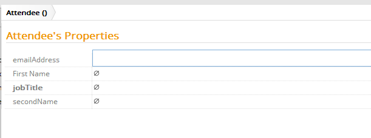

# Mandatory

These metadata allow you to configure whether a property is mandatory or not.

Metadata Property Name  | Type Signature  
------- | -----------
`Mandatory` | `com.braintribe.model.meta.data.constraint.Mandatory`
`Optional` | `com.braintribe.model.meta.data.constraint.Optional`

## General

If the Mandatory metadata is configured, then this property must have a value before it can be committed. If the Optional (or no) metadata is assigned, then a property does not require any value and can be committed with a `null` value.

> You can use the Mandatory metadata with the Unmodifiable metadata to create a property whose value can be set only once - on its creation. For more information, see [Modifiable](asset://tribefire.cortex.documentation:concepts-doc/metadata/constraint/modifiable.md).

## Example

In this example, the Mandatory metadata was assigned to the `jobTitle` property. When creating a new instance, any mandatory properties are displayed in bold.

If you try to commit an entity instance without first entering data into all mandatory fields, you receive a validation error.
