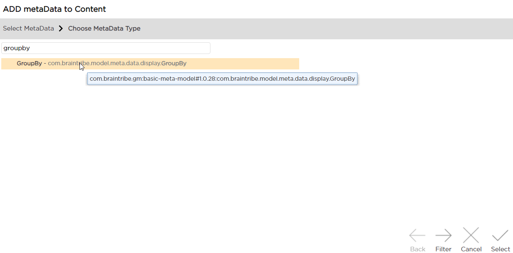
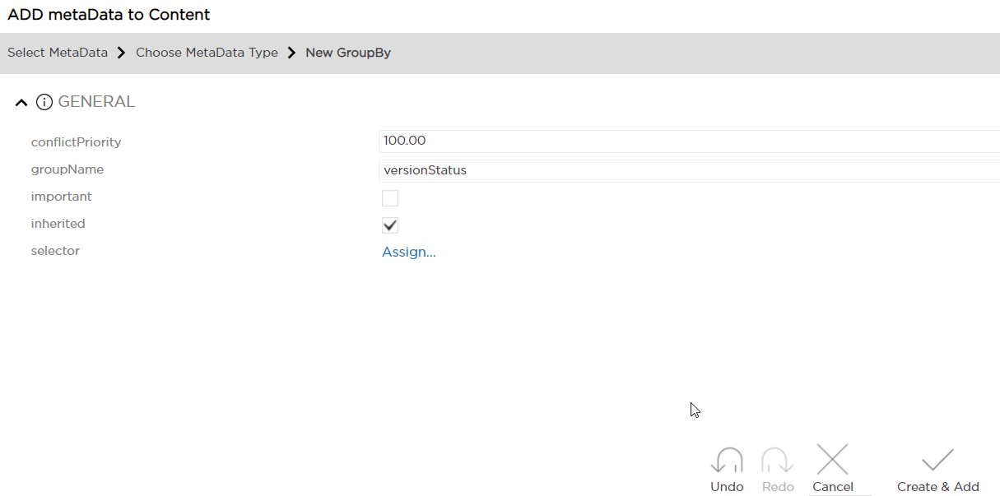
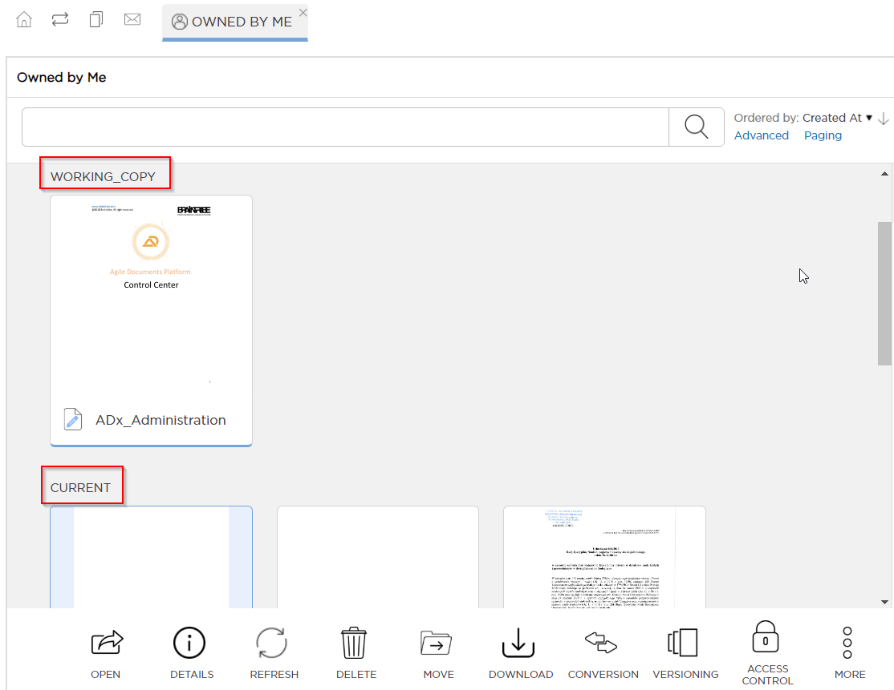
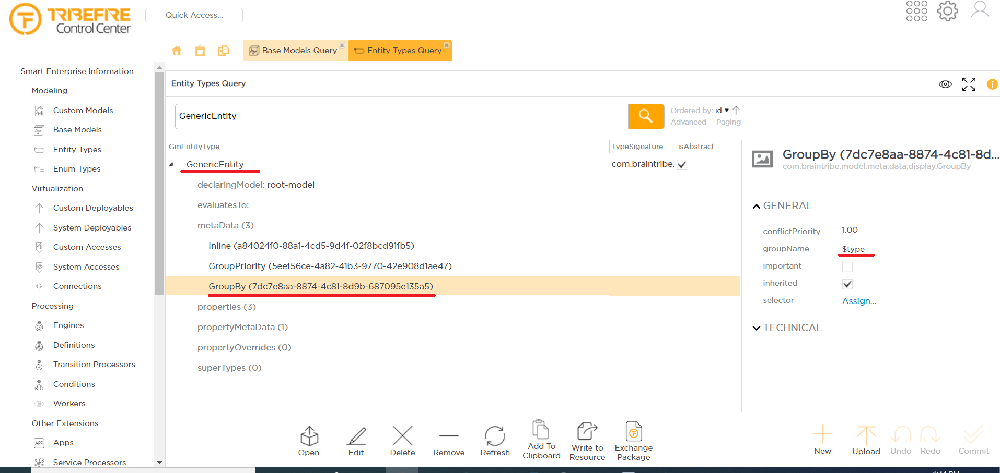
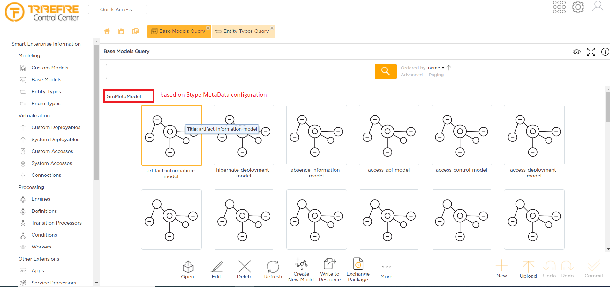

# GroupBy
This metadata allows you to group entities and enums, either by property or by type. GroupBy is supported only in Thumbnail View and not in the assembly panel (list view).

Metadata Property Name  | Type Signature  
------- | -----------
`GroupBy` | `com.braintribe.model.meta.data.display.GroupBy`

## Example - Grouping by Property
Assume we have a **Content** entity type which has a number of properties, including **versionStatus** (for example `Current` and `Working Copy`). We want the instances of this entity type to be grouped by **versionStatus**.

1. Create new **groupBy** metadata on the entity type:

    

2. Assign the value in **groupName**:

    

    We have assigned the `versionStatus` property, but it's also possible to assign `$type` instead of a property. When you assign `$type` to an entity, all instances of a given sub-type of this entity will be grouped together. 
    
    In our case, however, instances of **Content** are grouped by their **versionStatus** value:

    

## Example - Grouping by Type

1. Configure new **groupBy** metadata on the entity type (GenericEntity in this case):

    

    As a result, all instances of a given sub-type of GenericEntity are grouped together:

    