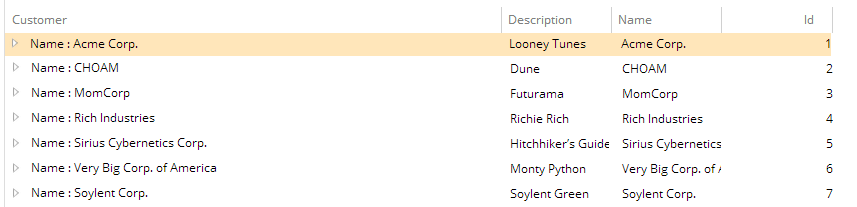

# SelectiveInformation

This metadata allows you to configure what is displayed in the first column of each entity type instance in tribefire Explorer.

Metadata Property Name  | Type Signature  
------- | -----------
`SelectiveInformation` | `com.braintribe.model.meta.data.display.SelectiveInformation`

## General

Without any configuration, the name of the entity type is displayed along with the instance's `ID` in brackets. You can configure this metadata property by entering a string sequence in the `Template` field. This string sequence then forms the basis for what is displayed at each instance of the entity.

You can configure the Selective Information metadata by following the correct syntax. If you wish to display a property you enter the following: `${PROPERTY_NAME}`

This displays the value of that defined property for each instance.

You can enter any valid string, as well as mix and match:

```bash
A STRING VALUE = ${PROPERTY_NAME}
A STRING VALUE = ${PROPERTY_NAME}, ANOTHER STRING ${ANOTHER_PROPERTY}
```

You can also display simple properties of objects with the `${object.simpleProperty}` syntax:

```java
@SelectiveInformation(“${project.projectName}“)
```

In the example above, the entity type has a `project` property defined in the body.

The value of the property can be `null`; however, the property itself must exist. It you reference a property that is not part of the entity type, or misspell the property name, a runtime error occurs.

## Example

In this example, the `Name: ${name}` string is used in the `Template` field. Instead of the `Instance` name and `ID` brackets, the following is displayed in Data View:


