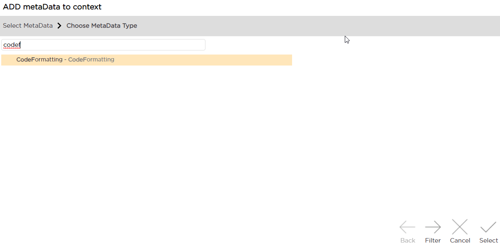
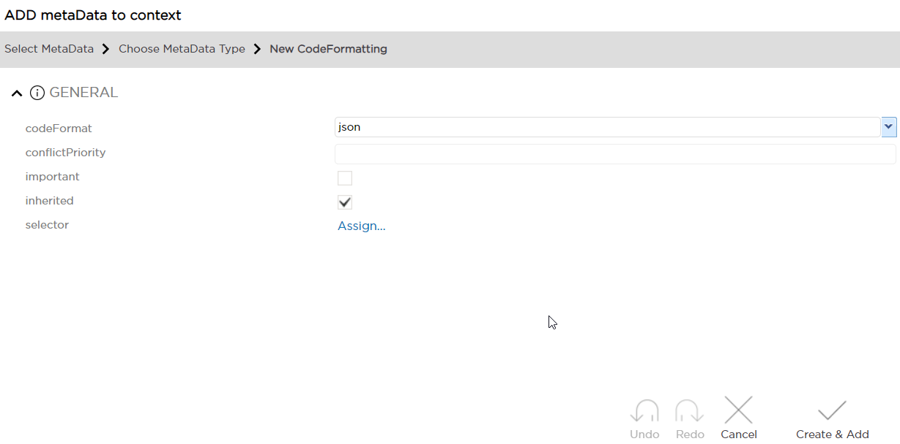

# Code Formatting
This metadata can be assigned to a String property to make sure that text formatting and highlighting is in accord with a specific programming language, for example in a field that's expected to store JSON requests. Formatting is applied in property dialog window. 

Metadata Property Name  | Type Signature  
------- | -----------
`CodeFormatting` | `com.braintribe.model.meta.data.display.formatting.CodeFormatting`

## Creating New Metadata

1. Create new **CodeFormatting** metadata on the property (String only!):

    

2. Assign the language in **codeFormat**:

    

    Currently, the following languages are supported:

    * java 
    * javascript
    * groovy
    * html
    * json
    * sql
    * svg
    * xml

    Property should now be displayed with the proper formatting when opened in a dialog window.