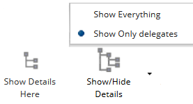
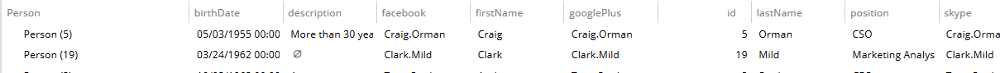
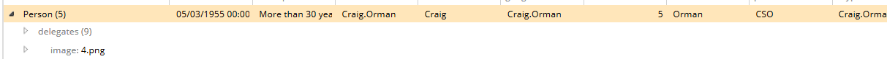
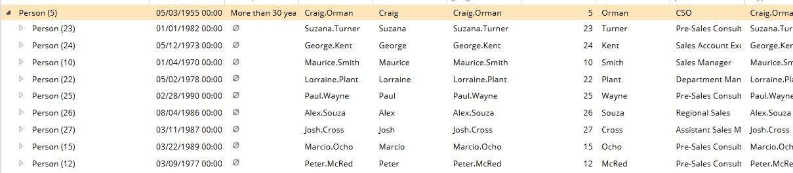

# Condensed

This metadata allows you to configure how a property within an entity behaves when collapsed.

Metadata Property Name  | Type Signature  
------- | -----------
`Condensed` | `com.braintribe.model.meta.data.prompt.Condensed`

## General
This metadata refers only to aggregation properties, as these are the only properties that can have further properties. Configuring this metadata allows you to only display the top level of the property. There are three modes of functionality available:

Function | Description
------| ---------
`Optional` |In Explorer, this allows you to choose between modes, done through buttons displayed on the Action Bar.
`Auto` | The condensation is done automatically.
`Forced` | Forces the metadata to condense the entity to show only the top layer.

You can configure this metadata by choosing one method of functionality from a drop-down list and defining on which property this metadata should act.
> You must refresh your browser after saving changes before they take effect.

## Example

This metadata contains two options that must be configured for correct functionality. You must choose the mode of operation from the drop-down list and also select which property this metadata should function on.

### Optional

When this metadata functions in `optional` mode, two buttons appear on the Action Bar in Control Center or Explorer, allowing you to choose between different modes of functionality.

In the example below, `optional` mode has been selected and functions on a property called `delegates`, which belongs to an entity called `Person`.

* Details Hidden
  
* Details Shown
  

### Forced

After selecting this mode and the property that it should function on, Explorer only displays the top layer of this hierarchy.

In the example below, the mode forced was selected and functions on the property `delegates`, which belongs to an entity `Person`. Only the top layer of the hierarchy is displayed in Explorer:

